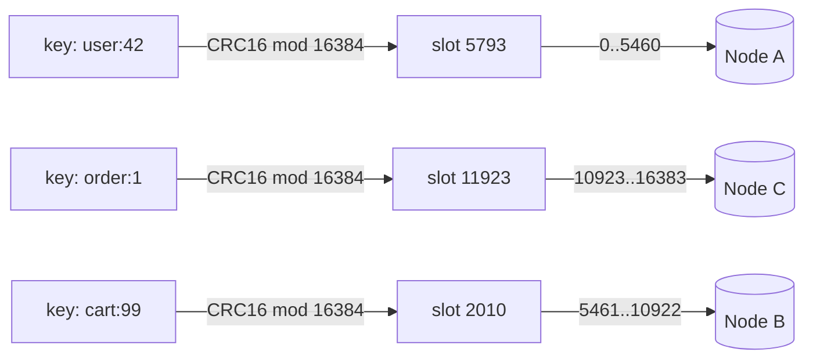
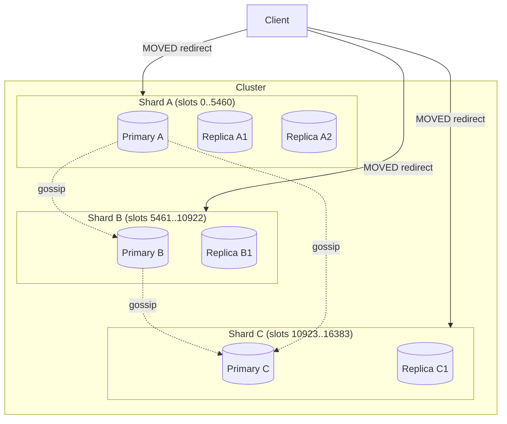
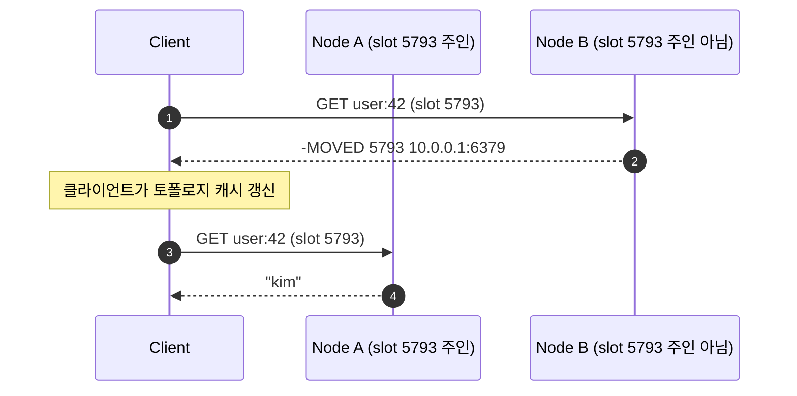
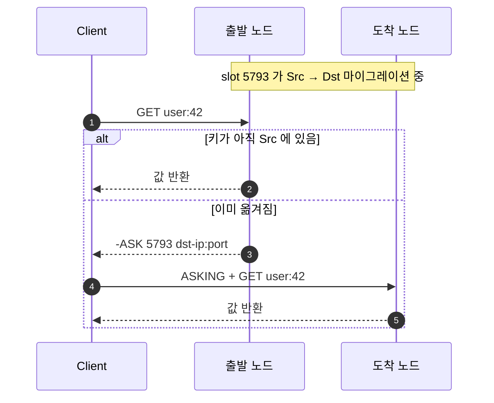
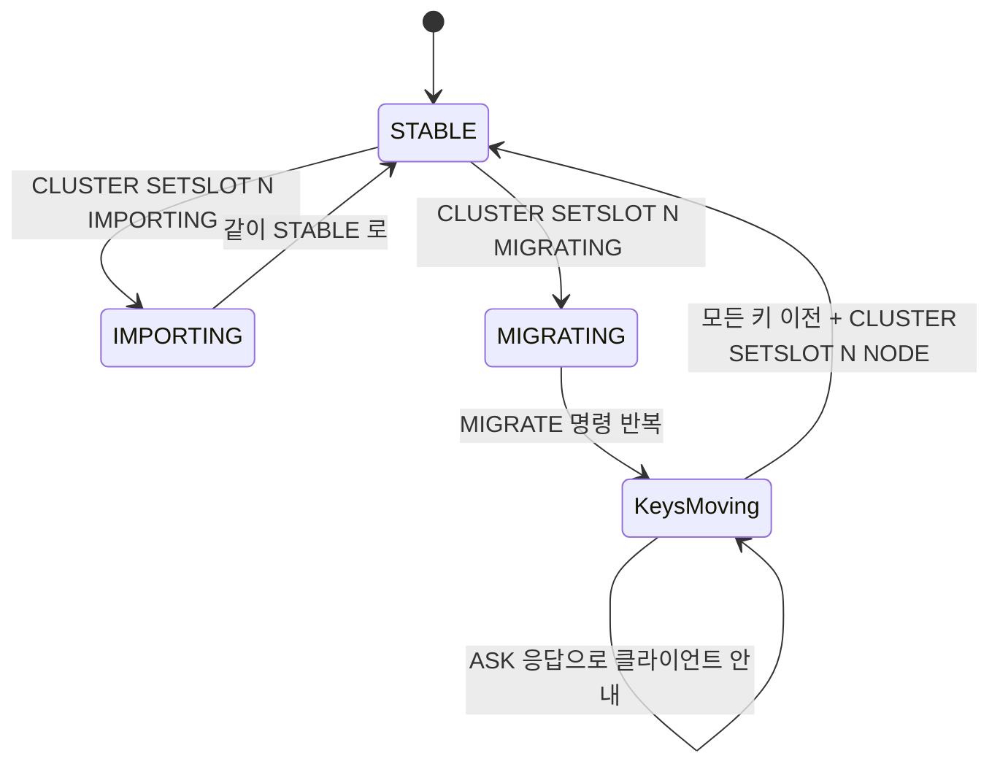
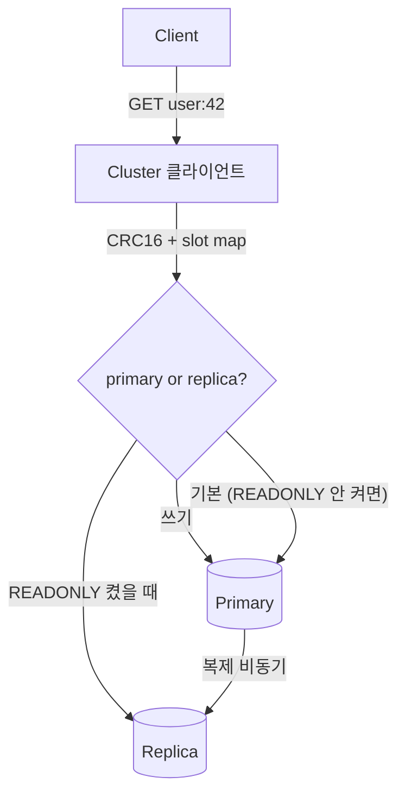
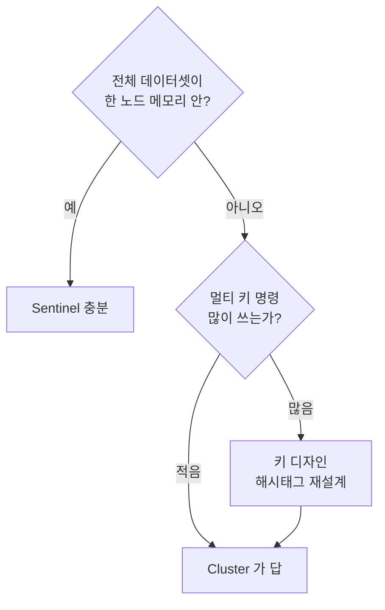

## 정의

**Redis Cluster** 는 *수평 확장* 을 위한 *내장된 sharding* + *자동 failover*. **16384 개의 hash slot** 으로 *키 공간* 을 잘라 *여러 노드* 에 분배. 각 슬롯은 *replica* 를 가질 수 있어 *고가용성* 도 함께.

> [!NOTE]
> *Sentinel* 은 *분할 없음 + 전체 데이터셋이 한 노드*. *Cluster* 는 *분할 + 자동 failover*. *데이터셋 > 한 노드 메모리* 면 Cluster 가 답.

## 키 → 슬롯 매핑

```
slot = CRC16(key) mod 16384
```

키마다 *결정적* 으로 0 ~ 16383 사이 슬롯 번호. 노드는 *연속된 슬롯 범위* 들을 담당.



### Hash Tag: 같은 슬롯에 묶고 싶을 때

기본은 *키 전체* 가 hash 입력. *중괄호로 일부만 감싸면* 그 부분만 hash 됨.

```
{user:42}:cart        → CRC16("user:42") % 16384
{user:42}:profile     → CRC16("user:42") % 16384   ← 같은 슬롯
{user:42}:history     → CRC16("user:42") % 16384   ← 같은 슬롯
```

> [!TIP]
> *멀티 키 명령 (`MGET`, `MSET`, `SUNION`, transaction MULTI/EXEC, Lua KEYS)* 은 *모든 키가 같은 슬롯* 에 있어야 동작. *항상 같이 묶어 다닐* 키들에 hash tag 를 미리 박아두는 게 *유일한 처방*.

## 토폴로지



- 모든 *primary* 끼리 *gossip* (Cluster Bus port = `client_port + 10000`).
- 클라이언트는 *cluster-aware*. *처음 한 번* 토폴로지 조회 후 *MOVED 받으면* 캐시 갱신.

## MOVED / ASK 리디렉션

*클라이언트가 잘못된 노드* 에 명령을 보내면:



마이그레이션 중인 슬롯은 다르다. `ASK` 패턴:



차이:

| Redirect | 의미 | 클라이언트 동작 |
|---|---|---|
| `MOVED` | *영구적* 으로 슬롯의 주인이 바뀜 | 토폴로지 캐시 *갱신* |
| `ASK` | *마이그레이션 일시적* 으로 *이번 요청만* 도착 노드 | `ASKING` prefix 후 *한 번* 만 보냄. 캐시 안 바꿈 |

## 슬롯 마이그레이션 (Resharding)

전통적 흐름 (Redis 7 이전 + 현재 Redis 호환):



흐름의 *비원자성* 이 가장 큰 함정. *중간* 에 *재시작 / 네트워크 사고* 가 발생하면 *손으로 복구* 가 필요.

### Valkey 9.0: Atomic Slot Migration

Valkey 9.0 (2025-10) 의 가장 큰 셀링 포인트. *슬롯 단위로 원자적 마이그레이션*. 클라이언트는 *MOVED 한 번* 만 받고 끝. *MIGRATING/IMPORTING/ASK* 의 *복잡한 중간 상태* 가 단축된다 ([blog](https://valkey.io/blog/atomic-slot-migration/)).

| 항목 | 전통 (Redis Cluster) | Atomic (Valkey 9.0+) |
|---|---|---|
| 슬롯 한 개 마이그레이션 | 다단계 (MIGRATING / IMPORTING / per-key MIGRATE / ASK 응답 / SETSLOT) | *원자적 단일 단계* |
| 클라이언트 redirect | ASK 다수 + MOVED 1개 | MOVED 1개 |
| 중간 실패 복구 | *수동 SETSLOT 복구* 필요 | *자동 롤백* |

## 처리량 / 노드 수 스케일링

`scale out` 이 *얼마나 잘 통하는지* 의 직관 (Valkey 9.0 의 1B RPS 벤치마크):

<ChartJs
  client:visible
  type="bar"
  title="Cluster 노드 수 vs 총 처리량 (벤치마크 환경, 가상 정규화)"
  caption="Valkey 9.0 blog 의 1B RPS 데모를 참고한 직관용 막대. 실제는 워크로드 / 인스턴스 의존."
  height="280px"
  data={{
    labels: ['1 node', '3', '6', '12', '24', '48', '96'],
    datasets: [
      {
        label: '총 RPS (백만)',
        data: [1, 3, 6, 12, 23, 45, 88],
        backgroundColor: '#3b82f6',
      },
      {
        label: '이상적 선형 (참고선)',
        data: [1, 3, 6, 12, 24, 48, 96],
        backgroundColor: 'rgba(34, 197, 94, 0.35)',
      },
    ],
  }}
  options={{
    scales: { y: { title: { display: true, text: 'RPS (백만)' } } },
  }}
/>

> [!NOTE]
> *멀티 키 명령* / *transaction* 이 많을수록 *선형성* 이 깨진다. *cross-shard* 요청은 *클라이언트가 N 번 분할* 해서 보내야 하기 때문.

## 쓰기 / 읽기 라우팅



`READONLY` 명령으로 *해당 연결에서만* replica 읽기 허용. *replica 가 stale* 한 경우가 있어 *eventual consistent* OK 한 쿼리에만.

## 셋업: redis-cli 의 cluster 도구

<CodeWithOutput
  language="bash"
  label="$ bash"
  outputLanguage="text"
  outputLabel="redis-cli"
  title="6 노드 클러스터 생성 + 슬롯 분배"
  code={`# 3 primary + 3 replica
redis-cli --cluster create \\
  10.0.0.1:6379 10.0.0.2:6379 10.0.0.3:6379 \\
  10.0.0.4:6379 10.0.0.5:6379 10.0.0.6:6379 \\
  --cluster-replicas 1`}
  output={`>>> Performing hash slots allocation on 6 nodes...
Master[0] -> Slots 0 - 5460
Master[1] -> Slots 5461 - 10922
Master[2] -> Slots 10923 - 16383
Adding replica 10.0.0.5:6379 to 10.0.0.1:6379
Adding replica 10.0.0.6:6379 to 10.0.0.2:6379
Adding replica 10.0.0.4:6379 to 10.0.0.3:6379
Can I set the above configuration? (type 'yes' to accept): yes
>>> Nodes configuration updated
>>> Assign a different config epoch to each node
>>> Sending CLUSTER MEET messages to join the cluster
>>> Performing Cluster Check (using node 10.0.0.1:6379)
[OK] All 16384 slots covered.`}
/>

상태 점검:

<CodeWithOutput
  language="bash"
  label="redis-cli"
  outputLanguage="text"
  outputLabel="CLUSTER INFO"
  title="cluster 헬스 한 줄"
  code={`redis-cli -h 10.0.0.1 CLUSTER INFO`}
  output={`cluster_enabled:1
cluster_state:ok
cluster_slots_assigned:16384
cluster_slots_ok:16384
cluster_slots_pfail:0
cluster_slots_fail:0
cluster_known_nodes:6
cluster_size:3
cluster_current_epoch:6
cluster_my_epoch:1
cluster_stats_messages_sent:1024
cluster_stats_messages_received:1024`}
/>

> [!IMPORTANT]
> *`cluster_state:ok`* 이 *유일하게 신뢰할 수 있는 상태 비트*. 다른 노드는 *gossip 으로 곧 알게 된다* 라는 *희망 메시지* 는 무시하고 *모든 노드에서 ok 가 떠야* 한다.

## 데이터 분포의 함정

> [!WARNING]
> **Hot slot**: 키 분포가 *균등하지 않으면* 특정 슬롯이 *전체 처리량의 대부분* 을 가져간다. *해시태그 남발* 의 가장 흔한 부작용. (`{tenant:1}` 으로 *전체 테넌트 1 의 데이터를 한 슬롯* 으로 묶으면, 테넌트 1 이 *가장 큰 고객* 일 때 노드 1개가 다 받는다.)

증상:

- `CLUSTER COUNTKEYSINSLOT <slot>` 으로 슬롯별 키 수 확인 → 편중 발견.
- `redis-cli -h <node> --hotkeys` (Redis 4+) 로 특정 노드의 *hot key* 추출.
- 운영 시: *hot slot* 만 *수동으로 같은 노드 안의 다른 슬롯으로 옮기는 게 의미 없다*. *키 디자인 재검토* 가 진짜 답.

## Cluster vs Sentinel: 결정 트리



## 관련 위키

- [[Redis]] (라이센스 / 신 기능)
- [[Redis Replication]] (Sentinel / replica 메커니즘)
- [[Redis Persistence]] (각 노드의 RDB / AOF)
- [[Distributed Lock]] (cluster 모드에서의 Redlock 주의점)

## 참고

