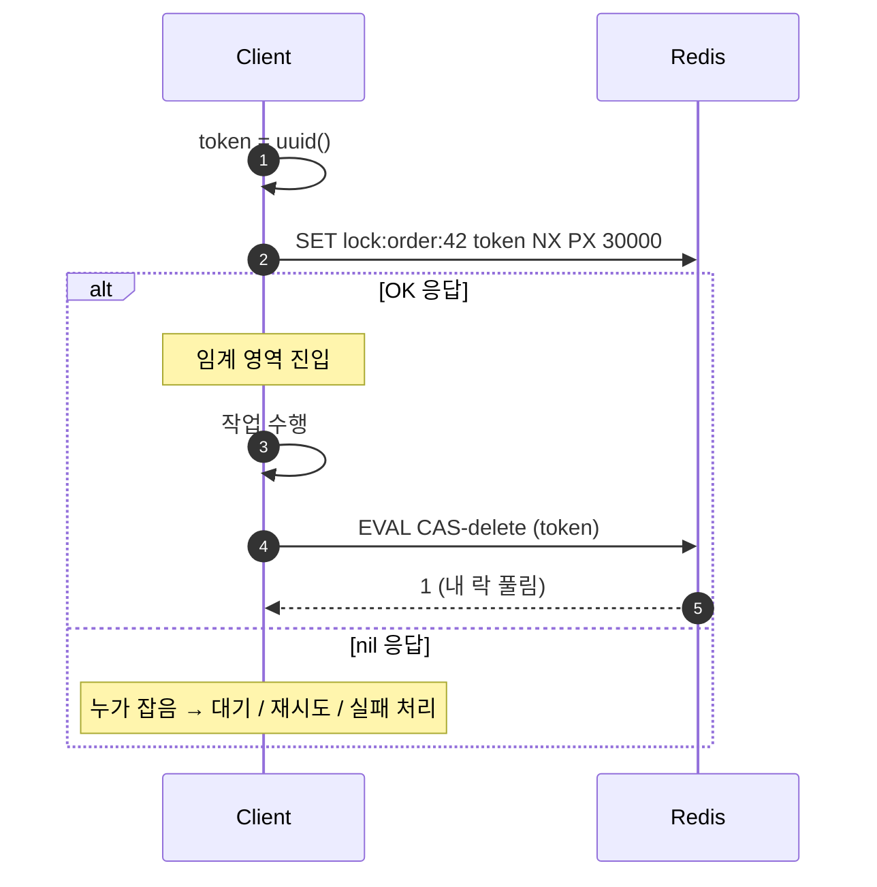
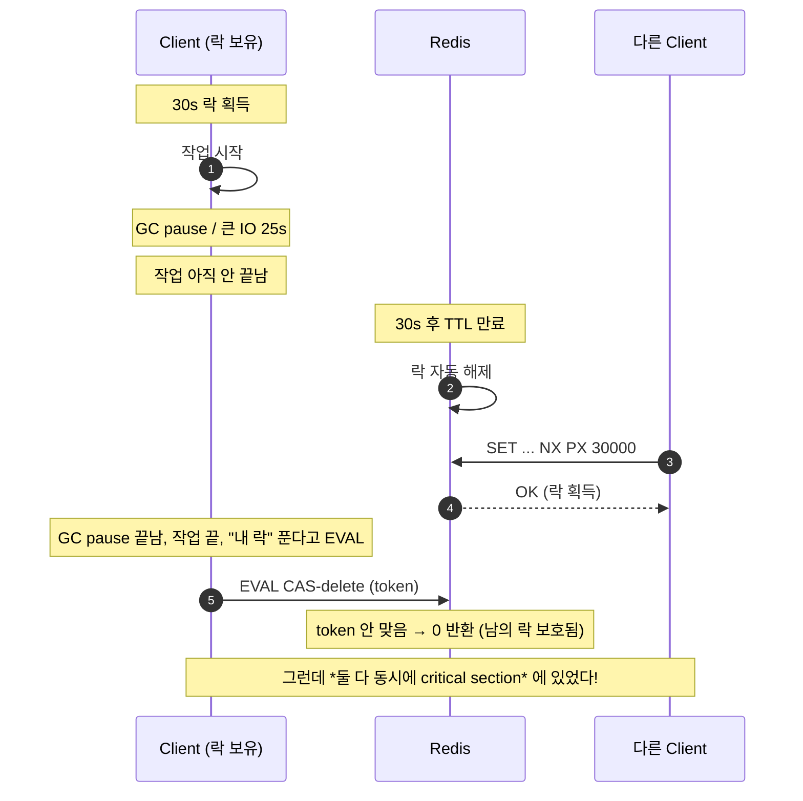
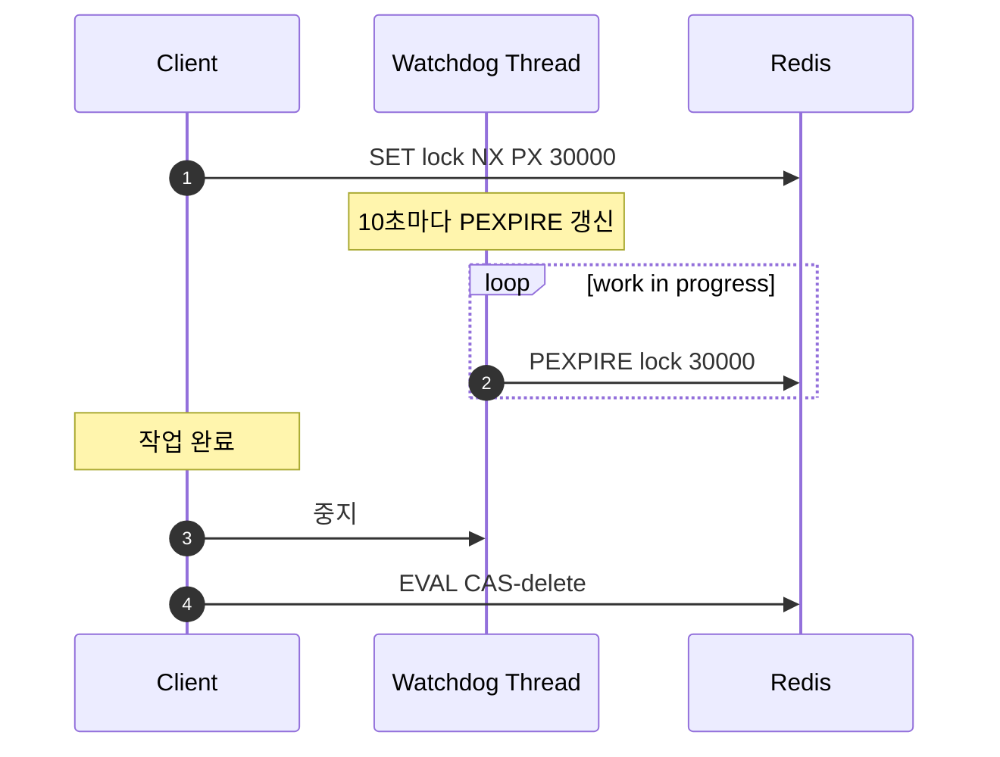
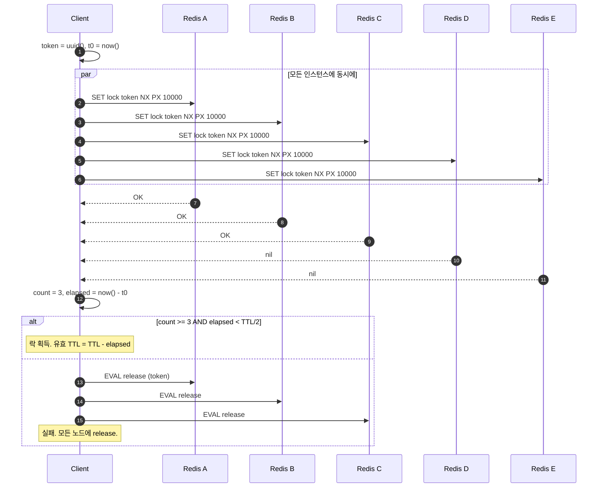
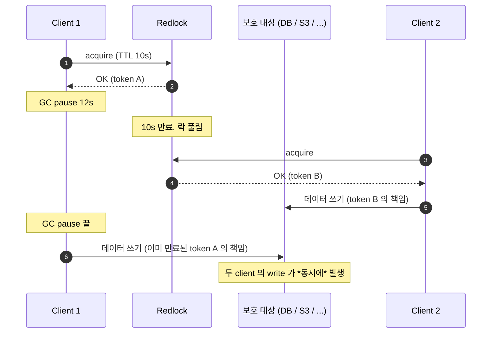
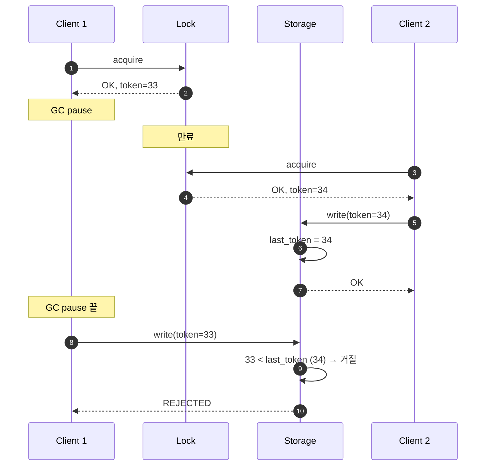

## 정의

**분산 락 (Distributed Lock)** 은 *여러 프로세스 / 머신* 에서 *한 시점에 하나만* 임계 영역에 진입하도록 보장하는 동기화 도구. Redis 는 *간단한 SETNX + EX* 부터 *Redlock (5-node 합의)* 까지 *spectrum* 을 제공한다.

> [!IMPORTANT]
> *분산 락은 일반적인 mutex 의 직접 대체가 아니다*. *GC pause, 네트워크 분할, 시계 어긋남* 같은 분산 환경의 *현실* 이 *어떤 락도 100% 안전하지 않게* 한다. *idempotent + fencing token* 의 *두 겹 안전망* 이 거의 항상 *추가로 필요*.

## 단일 인스턴스: SET NX EX + Lua

### 잘못된 패턴 (절대 금지)

```bash
SETNX lock:order:42 "owner-1"      # 락 잡음
EXPIRE lock:order:42 30             # ❌ 두 명령 사이에 죽으면 *영구 락*
```

`SETNX` 와 `EXPIRE` 가 *원자적이지 않다*. 사이에 *프로세스 다운* 시 *TTL 없는 락* 이 남음.

### 정석: 한 명령으로

```bash
SET lock:order:42 "uuid-abc" NX PX 30000
# OK   → 락 획득
# nil  → 누가 이미 잡고 있음
```

| 옵션 | 의미 |
|---|---|
| `NX` | *존재하지 않을 때만* set |
| `PX 30000` | 30000 ms 후 만료 |
| value = *고유 ID* | release 시 *내가 잡은 락만* 풀기 위함 |

### Release: GET + DEL 의 함정

```bash
GET lock:order:42        # "uuid-abc"
DEL lock:order:42        # ❌ 사이에 *TTL 만료 + 다른 owner* 가 잡으면 *남의 락을 푼다*
```

### 정석: Lua 로 *compare-and-delete*

```lua
-- KEYS[1] = lock 키, ARGV[1] = 내 토큰
if redis.call('GET', KEYS[1]) == ARGV[1] then
    return redis.call('DEL', KEYS[1])
else
    return 0
end
```

```bash
EVAL "if redis.call('GET', KEYS[1]) == ARGV[1] then return redis.call('DEL', KEYS[1]) else return 0 end" 1 lock:order:42 uuid-abc
```

### 전체 흐름



## TTL 의 함정과 watchdog



> 핵심: *TTL < 실제 작업 시간* 이면 *두 클라이언트가 동시에 critical section* 진입 가능. *Redlock* 도 이 문제를 *완전히 해결하지 못한다*.

### Watchdog (자동 갱신)

작업이 *돌고 있는 동안* 락 TTL 을 *주기적으로 갱신*. Java 의 *Redisson* 이 *내장* 으로 제공.



> [!CAUTION]
> Watchdog 도 *프로세스가 응답 안 하면 작동 안 함*. *GC pause / OS 스왑 / VM 정지* 같은 *프로세스가 멈춘 시간* 은 watchdog 도 멈춰 있다.

## Redlock: 5-node 합의 알고리즘

antirez 가 제안한 *다수 노드* 알고리즘. *N 개의 독립 Redis 인스턴스* (보통 5개) 에 *과반수 (3개 이상) 가 락을 동의* 하면 *획득 성공*.



### 알고리즘 요약

1. `token = unique-id`, `t0 = now()`.
2. *모든 N 개 인스턴스* 에 *동시에* `SET lock token NX PX <TTL>`.
3. `OK` 응답 수 = `count`. `elapsed = now() - t0`.
4. *모두 만족* 해야 락 획득:
   - `count >= (N/2)+1` (다수)
   - `elapsed < TTL` (의미 있는 시간 안에)
5. *유효 락 TTL* = `TTL - elapsed`.
6. 실패하면 *모든 노드에 release* (받았던 곳이 일부라도).

### 5-node 노드 수의 정당성

<ChartJs
  client:visible
  type="bar"
  title="Redlock 노드 수 별 동시 다운 견딤 (가용성)"
  caption="N = 5 이면 2개 다운까지 견딤. N = 3 이면 1개. 비용은 노드 수에 비례."
  height="240px"
  data={{
    labels: ['N=1 (단일)', 'N=3', 'N=5', 'N=7'],
    datasets: [
      {
        label: '동시 다운 허용 수',
        data: [0, 1, 2, 3],
        backgroundColor: ['#ef4444', '#f59e0b', '#22c55e', '#3b82f6'],
        borderWidth: 0,
      },
    ],
  }}
  options={{
    scales: { y: { title: { display: true, text: '동시 다운 허용' }, beginAtZero: true } },
    plugins: { legend: { display: false } },
  }}
/>

## Kleppmann의 비판과 fencing token

[Martin Kleppmann 의 글](https://martin.kleppmann.com/2016/02/08/how-to-do-distributed-locking.html) 은 *Redlock 이 *strong mutual exclusion* 을 보장하지 못한다* 고 지적. 핵심 시나리오:



→ *clock drift*, *GC pause*, *네트워크 지연* 이 *분산 락의 본질적 한계*. 이 모든 것은 *전체 시스템에서 발생할 수 밖에 없다*.

### Fencing token: 가장 강력한 보강

*락을 잡을 때 monotonic increasing token 을 함께 받는다*. *보호 대상* 이 *작은 토큰의 요청을 거절* 한다.



> [!IMPORTANT]
> *Redis 자체* 는 *fencing token monotonicity 를 보장하지 않는다*. *별도 monotonic 카운터* (`INCR`) 또는 *Zookeeper / etcd 같은 합의 시스템* 이 필요. Kleppmann 의 입장: *fencing 이 가능하면 분산 락 자체가 필요 없는 경우가 많다*.

### antirez 의 반박 요약

- *Redlock 은 *모든 mutual exclusion 사고를 막는다* 라고 주장한 적 없다*. *실용적 안전 마진* + *idempotent 작업* 위에 *충분한 도구*.
- *clock drift* 는 *현대 OS / NTP* 에서 *수 ms 수준* 이고, *Redlock TTL > 클럭 drift 의 최악 케이스* 면 *문제 없다*.

→ 결론: ***Redlock 만으로 결제 / 잔액 / 인벤토리 의 *불변량* 보호는 위험*. 그런 워크로드는 *DB transaction / row lock 으로 묶거나*, *fencing token + idempotent operation* 두 겹 안전망 필요.

## 안전 가이드 (실전 체크리스트)

| 항목 | 기준 |
|---|---|
| TTL > *최악 작업 시간 + 안전 마진 (예: 5x)* | 짧으면 *동시 진입* 위험 |
| token = *고유 UUID* | release 시 *남의 락 풀기* 방지 |
| release 는 *Lua CAS* | 절대 `GET → DEL` 분리하지 말 것 |
| 락은 *idempotent 작업* 보호용으로 사용 | 인벤토리 같은 *불변량* 은 DB transaction 으로 |
| 실패 시 *retry 정책 정의* | 무한 retry → starvation |
| *fencing token* 필요시 *별도 카운터* | 또는 *etcd / Zookeeper* |
| *분산 락 = 만능* 이라고 생각하지 말 것 | *항상 race condition 가정* |

## 라이브러리

| 언어 | 라이브러리 | 특징 |
|---|---|---|
| Java | [Redisson](https://github.com/redisson/redisson) | *watchdog 자동*, fairness lock, semaphore, multi-lock 모두 |
| Python | [redis-py](https://redis.io/docs/latest/develop/clients/redis-py/queries-and-commands/distributed-locking/) | `Lock` 클래스 (단일 인스턴스), `redlock-py` (Redlock) |
| Ruby | [redlock-rb](https://github.com/leandromoreira/redlock-rb) | Redlock 알고리즘 직접 |
| Node | [redlock](https://github.com/mike-marcacci/node-redlock) | abort signal, extension 자동 갱신 |
| Go | [redsync](https://github.com/go-redsync/redsync) | Redlock 표준 구현 |

### Redisson 예시

```java
RLock lock = redisson.getLock("order:42");

if (lock.tryLock(10, 30, TimeUnit.SECONDS)) {   // wait 10s, lease 30s
    try {
        // 임계 영역
    } finally {
        lock.unlock();
    }
}
```

watchdog 으로 *작업 진행 중 자동 갱신*. *프로세스 다운 시 락 회수*.

## 김신건의 현장 메모

- hera-webapp 의 *이메일 일괄 발송 batch* 는 *분산 락 + idempotent insert* 두 겹. 같은 batch_id 가 *DB unique constraint* 에 막혀서 *분산 락 이 풀려도 중복 발송이 없다*.
- *Redisson watchdog* 은 *Spring + Redis 환경* 에서 *최고의 ROI*. 단일 인스턴스 + 자동 갱신 + Spring 친화.
- *Sidekiq unique jobs* (분산 락 기반) 은 *short window 에서만* 안전. *결제 / 잔액* 같은 *불변량 보호* 는 *DB row lock* 만 안전.
- *Lock 으로 throughput 을 짠다* 는 발상이 *가장 위험*. *분산 락을 매번 잡는 워크플로* 는 *재설계* 가 답.

## 관련 위키

- [[Redis]] (라이센스 / 신 기능)
- [[Redis Cluster]] (cluster 모드에서의 Redlock 주의)
- [[Redis Pub Sub vs Streams]] (큐 + 분산 락 패턴)
- [[Zero Downtime Deployment]] (배포 중 락 풀림 보호)

## 참고

- 공식: [Distributed Locks with Redis](https://redis.io/docs/latest/develop/use/patterns/distributed-locks/)
- Kleppmann: [How to do distributed locking](https://martin.kleppmann.com/2016/02/08/how-to-do-distributed-locking.html)
- antirez 반박: [Is Redlock safe?](http://antirez.com/news/101)
