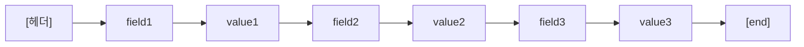
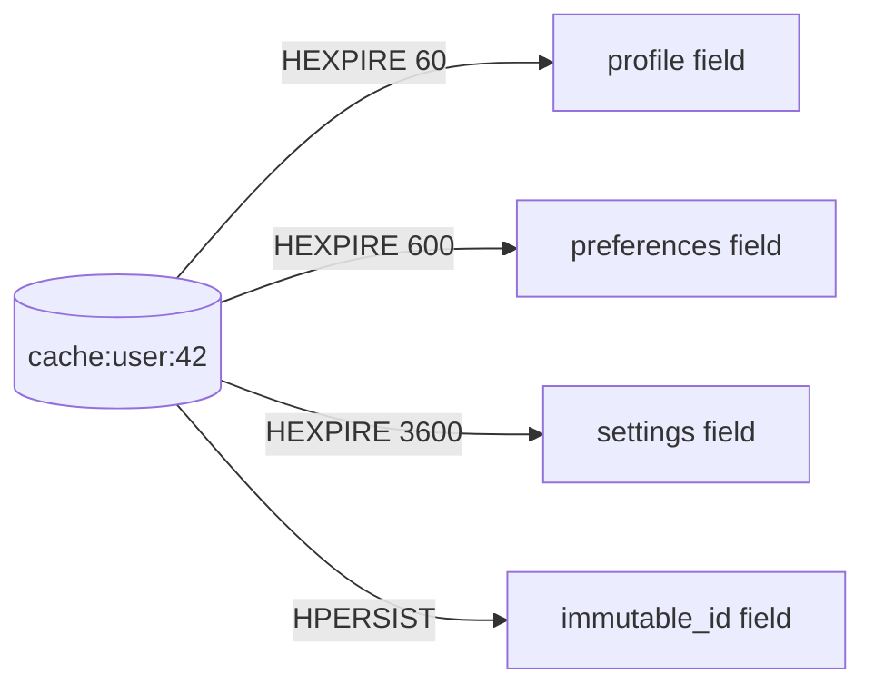
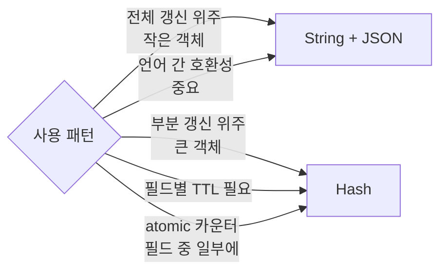

## 정의

**Redis Hash** 는 *키 안의 작은 dict*. 하나의 키 (`user:42`) 가 *여러 field → value* 쌍을 가진다. *부분 갱신 / 부분 조회* 가 *atomic + 효율적*.

= "*Redis 의 객체*". 객체 저장이 *String + JSON* 보다 효율적일 때의 표준 선택.

> [!IMPORTANT]
> 2024-04 부터 *Redis 7.4* 가, 2025-10 부터 *Valkey 9.0* 이 **Hash Field 단위 TTL** 을 지원 (`HEXPIRE`). 더 이상 *키 전체 TTL* 만의 시대가 아니다. 세션 / 토큰 / 캐시 entry 패턴이 *크게 단순해진다*.

## 내부 인코딩

| 인코딩 | 조건 (기본) |
|---|---|
| `listpack` | 필드 수 ≤ `hash-max-listpack-entries` (128) **AND** 각 값 크기 ≤ `hash-max-listpack-value` (64) |
| `hashtable` | 그 외 |

```conf
hash-max-listpack-entries 128
hash-max-listpack-value 64
```

작은 hash 는 *연속 메모리 배열*. *cache locality 가 압도적*. *큰 hash* 는 *dict + chaining* 의 *진짜 hashtable* 로 자동 전환.

### Listpack: flat 배열



*총 길이가 작을 때* 의 *최적*. 메모리 ~ String 한 줄 수준.

### Hashtable: chaining

```anim:hashing
{}
```

```anim:hash-collision
{}
```

*큰 hash* 에서는 *bucket 배열* + *동일 hash 에 충돌하는 노드의 연결 리스트*. 위 두 애니메이션이 그 내부 동작을 시각화한다.

> [!NOTE]
> Redis 의 dict 는 *progressive rehashing* (두 개의 hashtable 을 *점진적으로* 옮긴다). 큰 hash 의 *resize 가 짧게 끊어 분산* 되어 *single-thread 차단* 을 피한다. 자세한 건 [[Redis]] 의 *내부* 절.

## 핵심 명령

```bash
HSET user:42 name "koa" email "koa@x.com" tier "pro"
HGET user:42 name                  # "koa"
HMGET user:42 name email           # 여러 필드
HGETALL user:42                    # 전체 (작을 때만!)
HKEYS user:42                      # field 이름들
HVALS user:42                      # 값들

HDEL user:42 email                  # 필드 삭제
HEXISTS user:42 name                # 존재 여부

HLEN user:42                        # 필드 수
HINCRBY user:42 visits 1            # atomic 정수 증가
HINCRBYFLOAT user:42 balance 0.5    # float 증가

HRANDFIELD user:42 3 WITHVALUES     # 랜덤 (Redis 6.2+)
HSCAN user:42 0 MATCH 'name*' COUNT 100   # 페이지 스캔
```

### Redis 8 의 새 명령

| 명령 | 의미 |
|---|---|
| `HGETEX key field [EX seconds]` | 가져오면서 *키 전체 TTL 갱신* (String 의 `GETEX` 와 동일) |
| `HSETEX key seconds field value` | 한 번에 *set + 키 TTL* |
| `HGETDEL key FIELDS N f1 f2 ...` | 가져오면서 *해당 필드 즉시 삭제* |

> [!TIP]
> Redis 7.4+ 의 *필드 단위 TTL* 과 함께 *세션 store* / *one-time token* 같은 패턴의 *atomic* 동작이 매우 간결.

## Hash Field TTL (Redis 7.4 / Valkey 9.0)

기존: *키 전체 TTL* 만. 한 hash 안에 *서로 다른 만료 시점이 섞이면* 여러 키로 *분리* 해야 했다.

7.4 부터:

```bash
HEXPIRE key seconds FIELDS N f1 [f2 ...]
HPEXPIRE key milliseconds FIELDS N f1 [f2 ...]
HEXPIREAT key unixtime FIELDS N f1 [f2 ...]
HPEXPIREAT key unixtime-ms FIELDS N f1 [f2 ...]
HEXPIRETIME key FIELDS N f1 [f2 ...]    # 만료 시각
HPEXPIRETIME key FIELDS N f1 [f2 ...]   # ms 단위
HTTL key FIELDS N f1 [f2 ...]            # 남은 초
HPTTL key FIELDS N f1 [f2 ...]           # 남은 ms
HPERSIST key FIELDS N f1 [f2 ...]        # TTL 제거 (영구)
```

### 활용: 세션 store

기존:

```bash
SET session:abc123:user_id 42 EX 1800
SET session:abc123:csrf_token xyz EX 1800
SET session:abc123:ip 10.0.0.1 EX 1800
# 같은 세션의 3개 키, 모두 EX 1800
```

7.4+:

```bash
HSET session:abc123 user_id 42 csrf_token xyz ip 10.0.0.1
HEXPIRE session:abc123 1800 FIELDS 3 user_id csrf_token ip
# 또는 키 단위 TTL 만 잡고 필드 단위는 *더 짧게*:
EXPIRE session:abc123 3600                    # 세션 자체 1시간
HEXPIRE session:abc123 300 FIELDS 1 csrf_token  # CSRF 토큰만 5분
```

> *키 단위 TTL* 과 *필드 단위 TTL* 은 *공존*. *둘 다 적용되면 더 짧은 쪽이 이긴다*.

### 활용: JWT blacklist

```bash
# token 마다 다른 만료 시점
HSET jwt:blacklist sig_aaa "revoked" sig_bbb "revoked" sig_ccc "revoked"
HEXPIRE jwt:blacklist 3600 FIELDS 1 sig_aaa   # aaa 는 1시간 후 자동 삭제
HEXPIRE jwt:blacklist 600  FIELDS 1 sig_bbb   # bbb 는 10분
```

→ 한 hash 가 *수만 개의 작은 entry 와 각자 다른 TTL* 을 *원자적으로 관리*.

### 활용: 캐시 entry per-field



> *서로 다른 갱신 주기* 의 데이터를 *한 객체로 묶으면서* *각자 TTL* 줄 수 있다. *세분화된 캐시 무효화* 의 *깔끔한* 표현.

## 객체 저장: Hash vs String+JSON



비교 매트릭스:

| 항목 | String + JSON | Hash |
|---|---|---|
| 단일 필드 갱신 | *전체 직렬화 다시* | `HSET field value` (O(1)) |
| 단일 필드 조회 | *전체 파싱* | `HGET field` (O(1)) |
| 전체 조회 | `GET` 1번 | `HGETALL` (작으면 OK, 크면 위험) |
| atomic 카운터 | *Lua 필요* | `HINCRBY field` (O(1) atomic) |
| 직렬화 비용 | 매번 | *없음* |
| 필드별 TTL | *불가능* | *7.4+ 가능* |
| 메모리 (작은 객체) | 비슷 / 약간 손해 | listpack 으로 *작은 hash 는 매우 효율* |

## 성능 표

| 명령 | 복잡도 |
|---|---|
| `HSET`, `HGET`, `HEXISTS`, `HDEL`, `HINCRBY` | O(1) |
| `HMGET (k)`, `HSET (k fields)` | O(k) |
| `HKEYS`, `HVALS`, `HGETALL`, `HLEN` | O(N) |
| `HSCAN` | *amortized* O(N) (cursor 분할) |
| `HEXPIRE FIELDS k` | O(k) |
| `HRANDFIELD` | O(1) (count=1) / O(N) (큰 count + unique) |

> [!CAUTION]
> `HGETALL` / `HKEYS` / `HVALS` 는 *큰 hash* 에서 *single thread 차단*. 큰 hash 의 *부분 순회* 는 *`HSCAN`* 으로.

## 메모리 효율 비교

같은 데이터 (1만 개 사용자 객체, 각 5 필드) 의 저장 방식별 메모리:

<ChartJs
  client:visible
  type="bar"
  title="1만 객체 × 5 필드, 저장 방식별 메모리 (직관)"
  caption="listpack 의 작은 객체 효율이 가장 좋음. 필드 수가 늘면 hashtable 로 자동 전환."
  height="240px"
  data={{
    labels: ['10K String (JSON)', '10K Hash (listpack)', '10K Hash (hashtable)', '50000 String (key:field)'],
    datasets: [
      {
        label: '메모리 (MB)',
        data: [12, 7, 18, 28],
        backgroundColor: ['#f59e0b', '#22c55e', '#3b82f6', '#ef4444'],
      },
    ],
  }}
  options={{
    scales: { y: { title: { display: true, text: 'MB' }, beginAtZero: true } },
    plugins: { legend: { display: false } },
  }}
/>

> [!IMPORTANT]
> *왼쪽 두 번째 (Hash listpack)* 가 *가장 효율*. 자동으로 *hashtable 로 넘어가는 임계점* 을 알고 운영. 큰 객체 (필드 100+) 면 listpack 의 이점은 사라진다.

## 흔한 함정

> [!WARNING]
> 1. **`HGETALL` 의 큰 hash** = 모든 명령 차단. 운영 사고 단골 1위.
> 2. **`HMSET` 는 deprecated** (Redis 4+). `HSET` 가 *여러 인자* 받음. 새 코드는 `HSET` 로.
> 3. **필드 단위 TTL 의 만료 알림** = `notify-keyspace-events Hg` 또는 `Hh` 필요. 기본은 *조용히* 사라짐.
> 4. **listpack 임계 조정** = `hash-max-listpack-entries` 를 *너무 크게* 잡으면 *listpack 의 O(N) 검색* 이 *느려진다*. 기본 128 이 *조용한 sweet spot*.

## 김신건의 현장 메모

- *세션 store* 를 Hash + Field TTL 로 옮긴 뒤 *Redis 키 수* 가 *대폭 감소*. 세션 마다 *4-5 키 → 1 키*. KEYS / SCAN 도 *훨씬 가벼움*.
- *작은 객체 1만개* 시나리오에서 *listpack 임계 안에 들도록* 필드 수를 의도적으로 제한했더니 *메모리 거의 2배 효율*.
- *Redis 8 의 `HSETEX` + `HGETDEL`* 은 *Rails session_id one-time token* 같은 흐름에 *완벽한 atomic 한 줄*.
- `HGETALL` 사고 회피 패턴: *클라이언트 라이브러리에 `HGETALL` 호출 시 size 임계 초과면 자동으로 HSCAN 으로 전환* 하도록 *공통 helper*.

## 관련 위키

- [[Redis]] (자료구조 카탈로그)
- [[Redis Strings]] (객체 저장 대안)
- [[Redis Cache Patterns]] (캐시로서의 hash)
- [[Redis Sorted Sets]] (정렬이 필요할 때)

## 참고

- 공식: [Hashes](https://redis.io/docs/latest/develop/data-types/hashes/)
- Hash Field Expiration: [redis/redis #13172](https://github.com/redis/redis/pull/13172), [Valkey blog](https://valkey.io/blog/hash-fields-expiration/)
