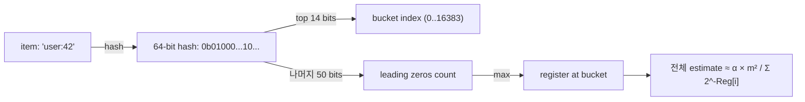
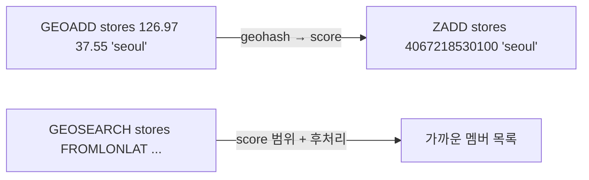
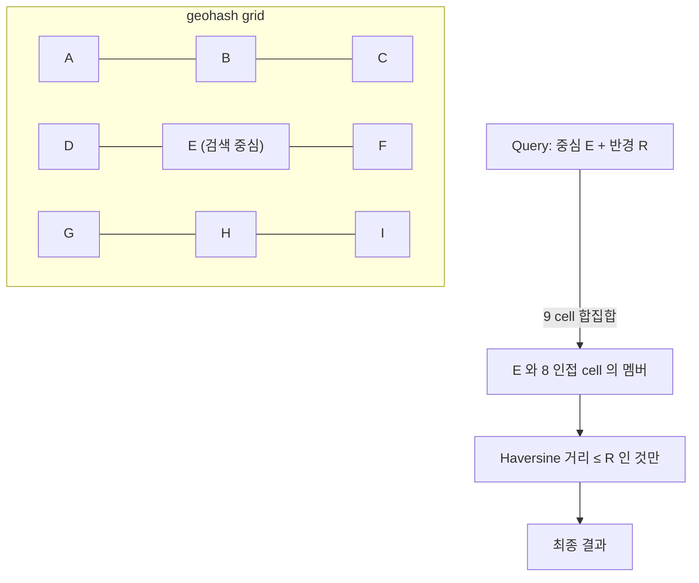

## 정의

이 페이지는 *작지만 강력한 두 자료구조* 를 묶는다.

- **HyperLogLog (HLL)**: *대규모 unique count* 를 *0.81% 오차로 12 KB 안에* 추정.
- **Geo**: *위경도 + 멤버* 의 *공간 인덱스*. 내부는 *Sorted Set + geohash 인코딩*.

> [!IMPORTANT]
> 둘 다 *Sorted Set / Set / Hash 같은 일반 자료구조 위* 에 *얹은* 것이지만, *고유한 명령 + 알고리즘* 으로 *별도 자료구조* 처럼 다뤄진다.

---

## HyperLogLog: 0.81% 오차로 unique 추정

### 왜 필요한가?

*일별 UV (unique visitor)* 같은 *대규모 cardinality*. Set 으로 정확히 세려면 *모든 ID 가 메모리에*. 1억 명이면 GB 단위.

HLL 은 *고정 12 KB* 로 1억 unique 도 *0.81% 오차* 안에 추정한다.

### 알고리즘 직관

각 입력의 *hash 의 첫 N 비트* 로 *bucket 결정*, *나머지 비트의 *leading zeros 의 max** 를 bucket 에 저장. *전체 unique 수가 많을수록 leading zeros 가 클 확률 증가*. 모든 bucket 의 *조화 평균* 으로 cardinality 역산.



| 파라미터 | Redis 값 |
|---|---|
| Buckets (m) | 16384 (2^14) |
| 메모리 | 12 KB (sparse 인코딩이면 더 작음) |
| 표준 오차 | 0.81% |

### 명령

```bash
PFADD pageviews:home user:42 user:99 user:200
PFADD pageviews:home user:42 user:777        # 이미 있는 user:42 는 무시 (확률적으로)

PFCOUNT pageviews:home                        # 추정 unique 수
PFCOUNT pageviews:home pageviews:about        # 합집합의 unique (별도 키 동시 계산)

# 누적: 일 별 → 주 별 → 월 별
PFMERGE pageviews:weekly pageviews:2026-06-25 pageviews:2026-06-24 ...
PFCOUNT pageviews:weekly                       # 7일 unique 합집합
```

### Set vs HLL 메모리 비교

<ChartJs
  client:visible
  type="line"
  title="Set vs HLL 메모리 (사용자 ID 1 ~ 1억)"
  caption="HLL 은 12 KB 고정. Set 은 *멤버 수에 선형*."
  height="280px"
  data={{
    labels: ['1K', '10K', '100K', '1M', '10M', '100M'],
    datasets: [
      {
        label: 'Set (정수 ID, intset/hashtable)',
        data: [0.04, 0.5, 6, 70, 700, 7000],
        borderColor: '#ef4444',
        backgroundColor: 'transparent',
        borderWidth: 2.5,
      },
      {
        label: 'HyperLogLog',
        data: [0.012, 0.012, 0.012, 0.012, 0.012, 0.012],
        borderColor: '#22c55e',
        backgroundColor: 'transparent',
        borderWidth: 2.5,
      },
    ],
  }}
  options={{
    scales: {
      y: { type: 'logarithmic', title: { display: true, text: '메모리 (MB, log)' } },
      x: { title: { display: true, text: 'Cardinality (unique 수)' } },
    },
  }}
/>

> 1억 unique 에 *12 KB* 라는 게 *직관에 반함*. 처음 본 사람이 항상 "*진짜?*" 라고 묻는다.

### 정확도 vs 오차

```python
# 1만 개 unique 시뮬레이션 (10번 반복)
import redis
r = redis.Redis()
r.delete("test:hll")
for i in range(10000):
    r.pfadd("test:hll", f"user:{i}")
print(r.pfcount("test:hll"))
# → 보통 9920 ~ 10080 범위 (0.8% 오차)
```

> [!TIP]
> *정확한 cardinality* 가 필요한 경우 (예: 결제 unique 사용자) 면 *Set + 별도 보관*. *대시보드 / 분석* 이면 *HLL 가 압도적*.

### 활용 패턴

1. **일/주/월 UV**: 하루마다 새 HLL, *PFMERGE* 로 누적
2. **광고 reach**: *광고에 노출된 unique 사용자* 추정
3. **검색 query 의 unique users**: 검색어별 HLL
4. **API endpoint 의 unique 호출자**: rate limiting 의 *cardinality 통계*

> [!NOTE]
> *HLL 의 sparse → dense 자동 전환*. 처음 채워질 때는 *sparse 인코딩* (수십 B 만 사용), 차오를수록 *dense 12 KB* 가 된다.

### Set 과의 조합

```bash
# 정확 cardinality 가 필요할 때는 Set, 추정으로 충분할 때는 HLL
SADD users:premium user:42 user:99           # 정확
PFADD users:active user:42 user:99 user:200  # 추정
```

---

## Geo: 공간 인덱스

### 내부 구조

*Sorted Set + 52-bit geohash*. 즉 *Geo 자료형* 은 *별도 자료구조가 아니라* *Sorted Set 의 score 가 geohash 인 것*.



| 내부 | 의미 |
|---|---|
| Score | 52-bit geohash (인터리브 비트로 *공간 locality 유지*) |
| Member | 사용자 정의 ID |
| 거리 계산 | *Haversine 공식* (구면 거리) |

### Geohash 의 grid 분할

지도를 *재귀적 격자* 로 나누어 *각 격자에 base32 문자* 부여:

```
1차: 지구를 8개 영역
2차: 각 영역을 다시 8개
...
12자 까지 가면 ≈ 3.7 cm 정밀
```

같은 prefix 의 geohash 는 *공간적으로 가깝다*. ZSet 의 *score 범위 검색* 이 *대략적 인접 검색* 이 된다.

> [!CAUTION]
> Geohash 의 *경계 함정*. 두 점이 *공간적으로 가까워도 다른 cell* 에 떨어질 수 있다 (예: 위/아래 cell 의 경계). Redis 는 *주변 cell 도 함께 검색* 해서 자동 보정.

### 명령

```bash
GEOADD stores 126.97 37.55 "seoul-gangnam"
GEOADD stores 126.92 37.56 "seoul-myeongdong"
GEOADD stores 139.69 35.69 "tokyo"

# 좌표 + 멤버 동시 (Redis 6.2+)
GEOADD stores NX 121.47 31.23 "shanghai"

# 위치
GEOPOS stores seoul-gangnam tokyo
# → [[126.97, 37.55], [139.69, 35.69]]

# 거리 (단위 옵션: m/km/mi/ft)
GEODIST stores seoul-gangnam tokyo km
# → 1158.42

# Geohash 인코딩 문자열
GEOHASH stores seoul-gangnam
# → wydn... (base32)
```

### 검색

```bash
# 좌표 기준 반경 검색 (Redis 6.2+ 표준)
GEOSEARCH stores
  FROMLONLAT 126.97 37.55
  BYRADIUS 10 km
  ASC
  COUNT 10
  WITHCOORD WITHDIST

# 멤버 기준 검색
GEOSEARCH stores FROMMEMBER seoul-gangnam BYRADIUS 5 km ASC

# Bounding box (사각)
GEOSEARCH stores
  FROMLONLAT 126.97 37.55
  BYBOX 20 20 km
  ASC

# 결과를 다른 키로 (BYSCORE / BYHASH)
GEOSEARCHSTORE result_key stores FROMLONLAT 126.97 37.55 BYRADIUS 10 km
```

> [!NOTE]
> 옛 명령 `GEORADIUS` / `GEORADIUSBYMEMBER` 은 *deprecated*. 새 코드는 *`GEOSEARCH` + 옵션 (FROMLONLAT/FROMMEMBER, BYRADIUS/BYBOX)* 으로.

### 검색 시각화 (격자 인접)



> Redis 가 *9 개 cell (자기 + 8 주변)* 의 멤버를 *후보군* 으로 모은 뒤, *Haversine 거리* 로 *정확히 filter*. 거리 정확성과 검색 효율의 균형.

### 활용 패턴

1. **근처 매장 / 식당 검색**: `GEOSEARCH FROMLONLAT BYRADIUS`
2. **배달 라이더 매칭**: 주문 위치 → 가까운 라이더 N명
3. **친구 근처 알림**: `GEOSEARCH FROMMEMBER BYRADIUS`
4. **지오펜싱**: bounding box 안에 들어왔는지 주기적 체크
5. **POI 클러스터링**: geohash prefix 별 grouping

### 성능 표

| 명령 | 복잡도 |
|---|---|
| `GEOADD` | O(log N) |
| `GEOPOS`, `GEOHASH` | O(log N) |
| `GEODIST` | O(log N) |
| `GEOSEARCH BYRADIUS` | O(N + log M) (cell 안 멤버 수 N) |
| `GEOSEARCH BYBOX` | 동일 |
| `GEOSEARCHSTORE` | O(N) + ZADD 비용 |

> [!CAUTION]
> *전 지구를 한 키* 로 만들면 *반경 검색의 후보군* 이 *크다*. *국가별 / 지역별 분할* 이 *후보 수 감소 + 검색 속도* 의 표준 패턴.

## 메모리 비교 (1만 매장 + 위치)

<ChartJs
  client:visible
  type="bar"
  title="1만 매장 좌표 저장, 자료구조별 메모리"
  caption="Geo 는 *Sorted Set* 이라 비슷한 메모리. 검색 성능이 결정적 차이."
  height="220px"
  data={{
    labels: ['Geo (ZSet)', 'Hash (lat/lng 별도)', 'List + JSON'],
    datasets: [
      {
        label: '메모리 (MB)',
        data: [1.1, 1.4, 1.0],
        backgroundColor: ['#22c55e', '#f59e0b', '#3b82f6'],
      },
    ],
  }}
  options={{
    scales: { y: { title: { display: true, text: 'MB' }, beginAtZero: true } },
    plugins: { legend: { display: false } },
  }}
/>

> 메모리는 비슷하지만 *Hash 나 List* 는 *공간 인덱스 검색* 이 *클라이언트 코드 + O(N)*. Geo 는 *서버에서 log time*.

## 두 자료구조 결합 시나리오

### 광고 reach + 지역 분포

```bash
# 광고 ad:1234 가 노출된 *unique 사용자* (HLL)
PFADD ad:1234:reach user:42 user:99 user:200
PFCOUNT ad:1234:reach

# 각 사용자의 *현재 위치* (Geo)
GEOADD users:loc 126.97 37.55 user:42
GEOADD users:loc 139.69 35.69 user:99

# *서울 반경 30km 의 *unique 노출 사용자* 추정
GEOSEARCHSTORE seoul_users users:loc FROMLONLAT 126.97 37.55 BYRADIUS 30 km
# → seoul_users 의 멤버를 ad:1234:reach 와 *비교* 하려면 별도 Set 도 필요
```

> [!NOTE]
> *HLL 은 부분집합 cardinality 추정이 어려움*. *HLL 만으로 "서울에서 광고 노출된 unique 수"* 를 정확히 계산 불가. *정확한 교집합 cardinality* 가 필요하면 *Set + Geo*.

## 흔한 함정

> [!WARNING]
> 1. **HLL 의 작은 cardinality 에서 큰 오차** = 100 명 unique 일 때 ±20% 까지 흔들림. *PFCOUNT 가 작은 수 일 때는 신뢰성 낮음*.
> 2. **PFMERGE 의 *지속적 누적*** = 12 KB 가 고정이지만 *합집합 후* 정확도 떨어지지 않음. 그러나 *Set 처럼 멤버를 다시 빼내지 못함*.
> 3. **Geo 의 위경도 순서** = `GEOADD lng lat member` 순서. *lat / lng 헷갈리는 사고* 빈번.
> 4. **Geohash 셀 경계** = 직접 *binary geohash prefix 매칭* 으로 검색하면 *경계에서 가까운 점 누락*. 항상 *GEOSEARCH 사용* (자동 보정).
> 5. **고밀도 영역의 GEOSEARCH** = 도심지처럼 *한 cell 에 수십만 개* 면 *후보군 자체가 큼*. *국가/도시별 분할* 필요.

## 김신건의 현장 메모

- *광고 reach* 같은 *비즈니스 대시보드* 는 *HLL 의 0.81% 오차* 가 *완전히 무시 가능*. 정확한 cardinality 가 *비즈니스 가치를 더 가져다 주지 않음*.
- *Geo 의 BYBOX* 가 *BYRADIUS* 보다 *대시보드 UI 친화*. 지도 viewport 그대로 BYBOX.
- *HLL + Set* 의 hybrid: *일반 사용자* 는 HLL, *프리미엄 / 결제 사용자* 는 Set 으로 정확히. *비용 / 정확도* 의 분할.
- *Geo 의 *세로 의미 (고도)* 가 없다*. 단일 평면 (위경도 만). 3D 가 필요하면 *별도 인덱싱 (R-tree 같은)*.

## 관련 위키

- [[Redis]] (자료구조 카탈로그)
- [[Redis Sets]] (정확한 cardinality 대안)
- [[Redis Sorted Sets]] (Geo 의 내부 자료구조)
- [[Redis Probabilistic]] (Bloom / CMS 등 다른 확률 자료구조)

## 참고

- 공식: [HyperLogLog](https://redis.io/docs/latest/develop/data-types/hyperloglogs/), [Geo](https://redis.io/docs/latest/develop/data-types/geospatial/)
- HLL 원논문: [Flajolet et al.](http://algo.inria.fr/flajolet/Publications/FlFuGaMe07.pdf)
- Geohash: [Wikipedia](https://en.wikipedia.org/wiki/Geohash)
