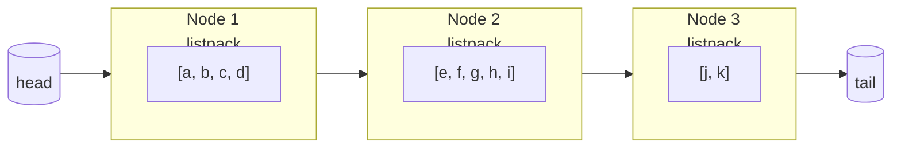
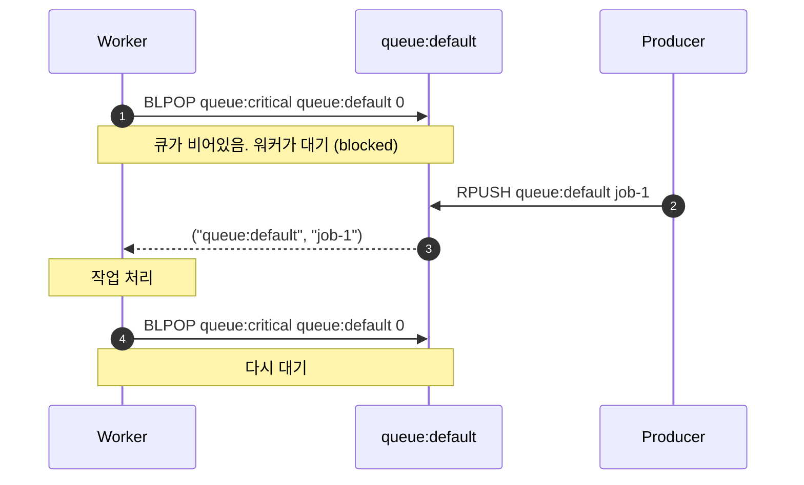
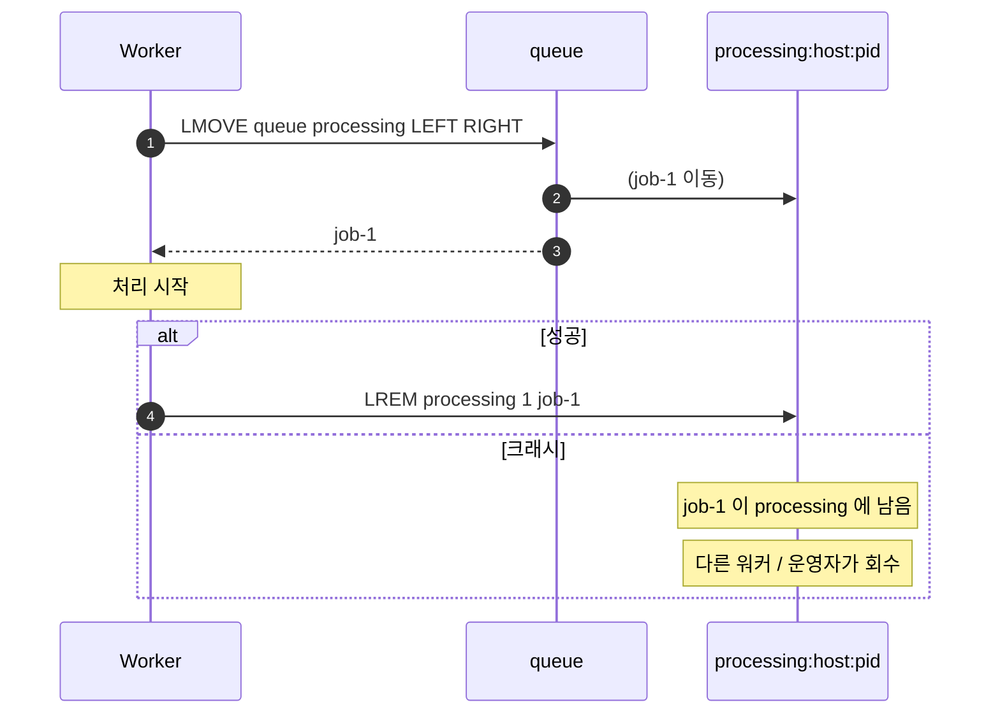
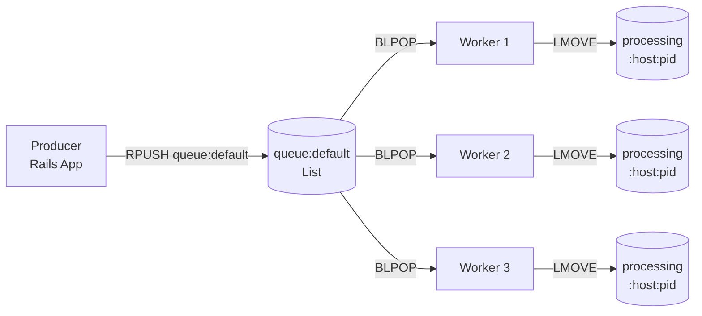

## 정의

**Redis List** 는 *양끝 push / pop 이 O(1)* 인 *순서 보존 시퀀스*. *큐 (FIFO)*, *스택 (LIFO)*, *최근 N개 목록*, *Sidekiq 같은 큐 시스템* 의 토대.

겉으로는 *연결 리스트* 같지만 *내부적으로는 quicklist + listpack* 의 *공간 효율 + cache locality* 친화 구조.

## 내부 구조 직관

순수 *연결 리스트* 의 동작:

```anim:linked-list
{}
```

> 위 애니메이션은 *연결 리스트* 의 *insert / delete / traverse* 직관. Redis List 의 *논리적 동작* 은 정확히 이렇다.

큐로 쓰는 경우:

```anim:queue
{}
```

스택으로 쓰는 경우:

```anim:stack
{}
```

> [!NOTE]
> Redis List 는 *push / pop* 의 *양끝 방향* 만 정해주면 *큐 (push 한쪽, pop 반대쪽)* 도 되고 *스택 (push 와 pop 이 같은 쪽)* 도 된다. 일반적인 *큐* 구현은 `RPUSH ... + BLPOP` 또는 `LPUSH ... + BRPOP`.

## Quicklist + Listpack: 실제 내부

Redis 3.2 이전: *순수 linked list* 또는 *작은 리스트는 ziplist*.

Redis 3.2 ~ 7: **quicklist** = *linked list of ziplists*. 노드마다 *작은 packed 배열*.

Redis 7+: ziplist → **listpack** 으로 교체. 더 단순한 *encoding overflow* 검출.



| 인코딩 | 조건 |
|---|---|
| `listpack` (Redis 7+) | 전체 리스트가 *작거나* (`list-max-listpack-size`), *각 노드의 listpack* |
| `quicklist` | 큰 리스트 (linked list of listpacks) |
| `linkedlist` (deprecated) | 옛 인코딩 |
| `ziplist` (deprecated) | 옛 작은 인코딩 |

설정:

```conf
# 노드당 max 항목 수 (음수면 바이트 단위 한계)
list-max-listpack-size -2     # -2 = 8KB per node (기본)
list-compress-depth 0          # 0 = 압축 안함, 1+ = 양끝부터 N 개 노드 빼고 LZF 압축
```

> [!TIP]
> *큰 리스트가 메모리 압박* 이면 `list-compress-depth 1` 또는 `2` 로 *중간 노드들 LZF 압축*. 양끝 (자주 접근) 은 그대로.

## 핵심 명령

### 기본

```bash
LPUSH queue:default job1 job2 job3       # 왼쪽 (head) 추가
RPUSH queue:default job4                  # 오른쪽 (tail) 추가
LLEN queue:default                        # 길이

LRANGE queue:default 0 -1                 # 전체
LRANGE queue:default 0 9                  # 처음 10개

LINDEX queue:default 0                    # 첫 번째
LSET queue:default 0 newjob               # 인덱스로 수정
LINSERT queue:default BEFORE job2 new     # 특정 값 *앞* 에 삽입
LREM queue:default 1 job2                 # 첫 번째 만나는 job2 제거
LTRIM queue:default 0 9                   # 처음 10개만 남기고 자름
```

### Pop

```bash
LPOP queue:default                        # 왼쪽 1개
RPOP queue:default                        # 오른쪽 1개
LPOP queue:default 5                      # 왼쪽 5개 (Redis 6.2+)
```

### Blocking Pop (Workers 의 핵심)

워커가 *큐가 빌 때까지 대기*. *Sidekiq / Resque / Celery* 의 *fetch loop* 토대.

```bash
BLPOP queue:critical queue:default 5      # 두 큐 중 하나 + 최대 5초 대기
# → 큐가 비면 5초 후 nil, 메시지 오면 즉시 반환
```



> [!IMPORTANT]
> `BLPOP` 는 *redis-cli 가 timeout 0 으로 영원히 대기* 가능. *워커 프로세스* 는 *idle 상태에서 CPU 0%*. *polling 보다 압도적*.

### 신뢰성 fetch: LMOVE

`BRPOPLPUSH` (deprecated) → `BLMOVE` / `LMOVE` 로. *fetch + 별도 처리 목록* 의 *원자성* 보장.

```bash
LMOVE queue:default processing:host:pid LEFT RIGHT
# = LPOP queue:default + RPUSH processing:host:pid (한 명령으로 atomic)
```



→ Sidekiq 의 *reliable fetch*. 자세한 건 [[Redis Pub Sub vs Streams]] 의 *Sidekiq 절*.

## 활용 패턴

### 1. 최근 N개 알림 (LTRIM)

```bash
LPUSH notifications:user:42 'json...'
LTRIM notifications:user:42 0 99       # 최근 100개만
LRANGE notifications:user:42 0 19      # 처음 20개 가져오기
```

> *고정 크기 윈도우* 는 *LTRIM* 으로 *append 직후 자르기*. `O(N)` 이지만 *N 이 작아 무시 가능*.

### 2. 큐 (Sidekiq 패턴)



| Sidekiq 큐 종류 | List 키 |
|---|---|
| 기본 큐 | `queue:default` |
| 우선순위 큐 | `queue:critical`, `queue:low` |
| 진행 중 | `processing:host:pid` |
| 예약 | `schedule` (Sorted Set, List 아님) |
| 재시도 | `retry` (Sorted Set) |
| 죽은 잡 | `dead` (Sorted Set) |

### 3. Circular Buffer (LPOP + RPUSH)

```python
def push_recent(r, key, item, max_size=100):
    pipe = r.pipeline()
    pipe.rpush(key, item)
    pipe.ltrim(key, -max_size, -1)    # 끝에서부터 max_size 만 남김
    pipe.execute()
```

## 성능 특성

| 명령 | 복잡도 |
|---|---|
| `LPUSH` / `RPUSH` / `LPOP` / `RPOP` | O(1) |
| `LLEN` | O(1) |
| `LRANGE` (k 개) | O(k) |
| `LINDEX` | O(N) *worst* (quicklist node 검색) |
| `LSET` | O(N) *worst* |
| `LINSERT` | O(N) *(피벗 검색)* |
| `LREM` | O(N) |
| `LTRIM` | O(N) |

> [!CAUTION]
> *중간 접근 (`LINDEX`, `LINSERT`, `LSET`)* 은 *O(N)*. *List 의 가치* 는 *양끝* 에서 나온다. *임의 접근* 이 많으면 *Sorted Set* 이나 *Hash + Sorted Set 인덱스* 가 답.

## 메모리 비교 (인코딩별)

<ChartJs
  client:visible
  type="bar"
  title="100K item 리스트, 인코딩별 메모리 (직관 단위)"
  caption="listpack 의 압축은 *작은 정수 / 짧은 문자열* 일 때 큰 효과."
  height="240px"
  data={{
    labels: ['linkedlist (옛)', 'ziplist (옛)', 'quicklist (listpack)', 'quicklist + LZF 압축'],
    datasets: [
      {
        label: '추정 메모리 (MB)',
        data: [42, 18, 12, 5.5],
        backgroundColor: ['#ef4444', '#f59e0b', '#3b82f6', '#22c55e'],
        borderWidth: 0,
      },
    ],
  }}
  options={{
    scales: { y: { title: { display: true, text: 'MB' }, beginAtZero: true } },
    plugins: { legend: { display: false } },
  }}
/>

## 큐 시스템 비교 (Java/Ruby/Node 의 List 위 큐)

각 언어의 *blocking queue* 동작을 비교:

```anim:java-blocking-queue-pc
{}
```

> producer / consumer 가 *큐 한 점* 에서 만나는 일반 패턴. Redis List + `BLPOP/BRPOP` 도 같은 직관.

## 흔한 함정

> [!WARNING]
> 1. **`LRANGE 0 -1` 대용량** = O(N), single thread 차단. *큰 리스트는 페이지 단위*.
> 2. **`LINSERT BEFORE pivot` 의 pivot 검색** = O(N). 자주 쓰면 *Sorted Set 으로 인덱싱*.
> 3. **블록 명령은 connection 점유** = Sentinel failover 시 *재연결 후 BLPOP 다시 시작* 해야 함. 클라이언트 라이브러리가 *자동* 으로 처리하는지 확인.
> 4. **List 가 *영구 큐* 라는 인상** = Redis 가 *재시작 + AOF 없으면* 그대로 손실. *Persistence* 가 *큐의 신뢰성을 결정*. [[Redis Persistence]] 참고.

## 김신건의 현장 메모

- hera-webapp 의 *Sidekiq* 운영에서 *큐 별 우선순위* + *워커 풀 별 분리* 가 *핵심*. `queue:critical` 에만 *전담 워커 5개*, `queue:default` 에 *공유 워커 10개* 처럼.
- *최근 알림 N개* 같은 *읽기 중심 리스트* 는 *LTRIM* 으로 *고정 크기 유지*. 그 외 *오래된 알림* 은 *별도 archive*.
- *`LMOVE`* 가 도입되기 전 (Redis 6.2 이전) 의 *`BRPOPLPUSH`* 가 여전히 많이 보인다. *Sidekiq 호환* 을 위해 *옛 명령도 살아있음*. 새 코드는 `LMOVE` 로.
- *block 명령은 connection 풀 한 자리* 를 차지. *워커 수 * 큐 수* 가 *Redis connection 한도* 와 만난다. `max-clients` 와 *워커 fleet 크기* 의 *곱셈* 으로 미리 검산.

## 관련 위키

- [[Redis]] (자료구조 카탈로그)
- [[Redis Strings]] (가장 기본)
- [[Redis Sorted Sets]] (인덱싱이 필요할 때의 대안)
- [[Redis Pub Sub vs Streams]] (List 큐 vs Streams 큐 결정)
- [[Sidekiq]] (Ruby 큐 운영자)

## 참고

- 공식: [Lists](https://redis.io/docs/latest/develop/data-types/lists/)
- listpack RFC: [redis/redis listpack.md](https://github.com/redis/redis/blob/unstable/src/listpack.md)
