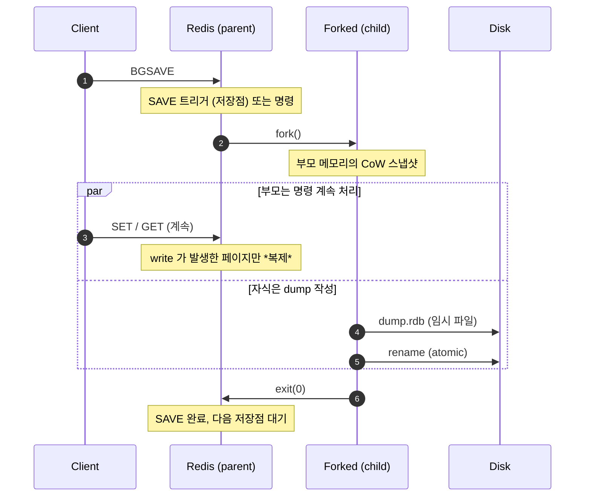
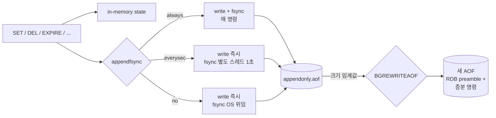
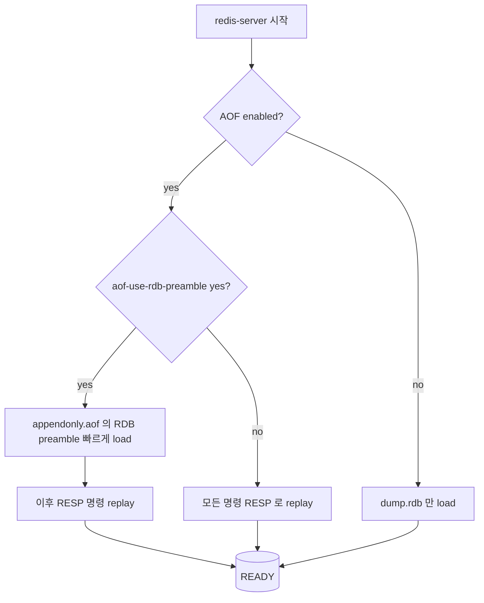

## 정의

**Redis Persistence** 는 *in-memory* 데이터를 *디스크* 로 지속화하는 메커니즘. 세 가지 옵션:

1. **RDB** (Redis Database file): 주기적 *snapshot*. 작고 빠른 부팅, *분 단위 손실* 가능.
2. **AOF** (Append-Only File): 모든 write 명령을 로그처럼 *append*. 손실 거의 없음, *큰 파일 + 부팅 느림*.
3. **Hybrid** (RDB + AOF, 권장): AOF rewrite 가 *내부에 RDB preamble* 을 포함. *둘의 장점을 모두*.

선택은 *세 축의 트레이드오프* 위에 놓인다: **데이터 손실 허용 시간**, **부팅 시간**, **fsync 비용 (I/O / latency)**.

## 트레이드오프 매트릭스

| 옵션 | 마지막 손실 | 파일 크기 | 부팅 속도 | I/O 부하 | 운영 복잡도 |
|---|---|---|---|---|---|
| `save ""` (영속화 끔) | *재시작 = 전부 손실* | 0 | 즉시 | 0 | 0 |
| RDB 만 | 수 분 | 작음 | 빠름 | 낮음 (fork 시 spike) |  낮음 |
| AOF `everysec` (기본) | 최대 1초 | 큼 | 느림 | 중간 | 중간 |
| AOF `always` | 0 | 큼 | 느림 | *높음* | 중간 |
| Hybrid (RDB + AOF) | 최대 1초 | 중간 | 중간 | 중간 | 중간 |

```mermaid
quadrantChart
    title Persistence 옵션의 위치
    x-axis 디스크/I-O 비용 낮음 --> 높음
    y-axis 데이터 손실 큼 --> 작음
    quadrant-1 안전하지만 비쌈
    quadrant-2 안전 + 저렴 (이상)
    quadrant-3 위험 + 저렴
    quadrant-4 위험 + 비쌈
    "save 비활성": [0.05, 0.05]
    "RDB only": [0.2, 0.35]
    "AOF everysec": [0.55, 0.85]
    "AOF always": [0.95, 0.98]
    "Hybrid": [0.55, 0.90]
```

## fsync 정책별 처리량 / 손실 시각화

`appendfsync` 정책이 *latency 와 데이터 손실의 가장 큰 결정 변수*. 동일 워크로드에서의 *상대적 처리량* (베이스라인 = `always`):

<ChartJs
  client:visible
  type="bar"
  title="appendfsync 정책별 상대 처리량 (always = 1.00 정규화)"
  caption="동일 워크로드 (SET only). 정확한 값은 환경 의존. 트레이드오프 직관용."
  height="280px"
  data={{
    labels: ['always', 'everysec', 'no'],
    datasets: [
      {
        label: '쓰기 처리량 (배수)',
        data: [1.0, 5.8, 7.2],
        backgroundColor: ['#ef4444', '#3b82f6', '#22c55e'],
        borderWidth: 0,
      },
    ],
  }}
  options={{
    scales: {
      y: { title: { display: true, text: '처리량 (배수, 클수록 좋음)' }, beginAtZero: true },
    },
    plugins: { legend: { display: false } },
  }}
/>

손실 가능 시간:

<ChartJs
  client:visible
  type="bar"
  title="appendfsync 정책별 최악의 데이터 손실 (초)"
  caption="`no` 는 OS 버퍼 flush 주기 의존 (Linux 기본 ~30s)."
  height="240px"
  data={{
    labels: ['always', 'everysec', 'no'],
    datasets: [
      {
        label: '최악의 손실 (초)',
        data: [0, 1, 30],
        backgroundColor: ['#22c55e', '#f59e0b', '#ef4444'],
        borderWidth: 0,
      },
    ],
  }}
  options={{
    scales: {
      y: { title: { display: true, text: '초' }, beginAtZero: true },
    },
    plugins: { legend: { display: false } },
  }}
/>

> [!TIP]
> *프로덕션 표준* 은 거의 항상 `everysec`. *결제 / 주문* 같이 *어떤 손실도 안 됨* 인 경우에만 `always` 와 함께 *DB primary 로 안 쓰는 게* 최선.

## RDB: BGSAVE 와 fork(2)

RDB 의 핵심은 *프로세스 fork 후 자식이 메모리 dump*. fork(2) 의 *Copy-on-Write* 가 핵심.



저장점 (`redis.conf`):

```conf
# "M 초 안에 K 개 이상의 키 변경" 이면 자동 BGSAVE
save 3600 1
save 300 100
save 60 10000

# 자동 비활성:
# save ""
```

> [!CAUTION]
> *fork* 는 *부모 메모리만큼의 가상 메모리 commit* 이 필요해 보일 수 있다. Linux 의 `vm.overcommit_memory=1` 필요. 안 그러면 *fork 실패 = BGSAVE 실패*. Redis 가 부팅 시 경고를 띄운다.

## AOF: append 그리고 rewrite

모든 write 를 *RESP 프로토콜 그대로* 파일에 append. 시간이 지나면 *redundant 명령* 이 누적 → 주기적 *rewrite* 로 압축.



Hybrid (`aof-use-rdb-preamble yes`, 기본):

- **AOF rewrite 시작** → fork → child 가 *현재 메모리를 RDB 형태로 dump* → 그 뒤에 *이후 들어온 명령* 을 RESP 로 append.
- *부팅 시*: RDB 부분 빠르게 load → 나머지 RESP 명령 replay. *AOF 의 안정성 + RDB 의 빠른 부팅*.

```bash
# 현재 AOF 상태 확인
redis-cli INFO persistence
```

<CodeWithOutput
  language="bash"
  label="redis-cli"
  outputLanguage="text"
  outputLabel="INFO persistence"
  title="Persistence 상태 한 번에 보기"
  code={`redis-cli INFO persistence`}
  output={`# Persistence
loading:0
rdb_changes_since_last_save:1893
rdb_bgsave_in_progress:0
rdb_last_save_time:1719311422
rdb_last_bgsave_status:ok
rdb_last_bgsave_time_sec:0
rdb_current_bgsave_time_sec:-1
aof_enabled:1
aof_rewrite_in_progress:0
aof_last_rewrite_time_sec:2
aof_current_rewrite_time_sec:-1
aof_last_bgrewrite_status:ok
aof_last_write_status:ok
aof_last_cow_size:1376256
aof_base_size:42938472
aof_pending_rewrite:0
aof_buffer_length:0
aof_pending_bio_fsync:0
aof_delayed_fsync:3
loading_eta_seconds:0`}
/>

> [!NOTE]
> `aof_delayed_fsync` 는 *fsync 가 지연된 횟수*. 0 이 아니면 *디스크 I/O 가 따라오지 못함*. EBS, 느린 NFS 등에서 특히 자주 본다.

## 부팅: 무엇이 먼저 읽히는가?



> [!IMPORTANT]
> *AOF 가 활성* 이면 RDB 는 *부팅에 사용되지 않는다*. 둘 다 켜놓아도 *최종 진실은 AOF*. RDB 는 *백업 / 복제* 의 빠른 경로로 남는다.

## 운영 결정 가이드 (의사결정 트리)

```mermaid
flowchart TD
    Q1{데이터가 캐시 전용?<br/>(다시 데울 수 있음)}
    Q1 -->|예| OFF[영속화 비활성<br/>save '' + aof off]
    Q1 -->|아니오| Q2{최대 허용 손실?}
    Q2 -->|수 분 OK| RDB[RDB only]
    Q2 -->|1초 이하| Q3{쓰기 처리량 critical?}
    Q3 -->|아니오| HYB[Hybrid<br/>aof everysec +<br/>rdb-preamble]
    Q3 -->|예| TUNE[Hybrid + 빠른 디스크<br/>NVMe / io_uring]
    Q2 -->|0초| WARN[AOF always<br/>+ 다른 primary DB 권장]
```

| 시나리오 | 권장 |
|---|---|
| 순수 캐시 (auth token, page cache) | `save ""` + `appendonly no` |
| 세션 store (1시간 미만 손실 OK) | RDB 만, `save 60 10000` |
| 큐 / 분산락 (1초 손실 OK) | Hybrid, `appendfsync everysec` |
| 운영 critical KV (트랜잭션) | *Redis 단독 비추천*. PostgreSQL 등을 primary 로 |

## 디스크와 메모리: 함정

> [!WARNING]
> *RDB BGSAVE 의 fork 가 비싸지는 환경* (큰 데이터셋, 잦은 write):
> 1. *Transparent Huge Pages (THP)* 켜져 있으면 CoW *latency spike*. `transparent_hugepage=never` 권장.
> 2. *vm.overcommit_memory=1* 안 되어 있으면 *fork 실패*.
> 3. 메모리의 *fork 시점 free 가 적으면* CoW 가 빠르게 *물리 메모리 2배 차지*.
> 4. EBS GP3 처럼 *throughput 한계가 명확한* 디스크에서는 BGSAVE 와 AOF rewrite *동시* 실행 시 *지연 spike*.

### THP 끄기

```bash
echo never > /sys/kernel/mm/transparent_hugepage/enabled
echo never > /sys/kernel/mm/transparent_hugepage/defrag
```

## 김신건의 현장 메모

- *Sidekiq + Redis* 운영에서 가장 자주 본 알람은 *AOF rewrite 중 latency spike*. 새벽 *트래픽 적은 시간* 에 rewrite 가 일어나도록 `auto-aof-rewrite-percentage 100` + `auto-aof-rewrite-min-size 1gb` 조정.
- *replica 에서만 BGSAVE* 하는 패턴: primary 는 `save ""` + AOF, replica 는 RDB. *snapshot 부담* 을 분리.
- *재해 복구 연습* 을 *분기 1회* 정도는 한다. `dump.rdb` 만 들고 *깨끗한 인스턴스* 에서 부팅이 *몇 분* 인지 측정 → 부팅 시간이 *RTO* 에 맞는지 확인.
- AOF only 환경에서 *오랫동안 rewrite 실패* 가 누적되면 *appendonly.aof* 가 *수십 GB* 까지 가는 사고를 본 적이 있다. *디스크 모니터링* 이 *redis 메트릭* 만큼 중요.

## 관련 위키

- [[Redis]] (라이센스 / 신 기능 / 데이터 구조)
- [[Redis Replication]] (replica 에서의 RDB 활용)
- [[Redis Cluster]] (slot 마이그레이션과 persistence)
- [[Zero Downtime Deployment]] (BGSAVE 중 무중단)

## 참고

