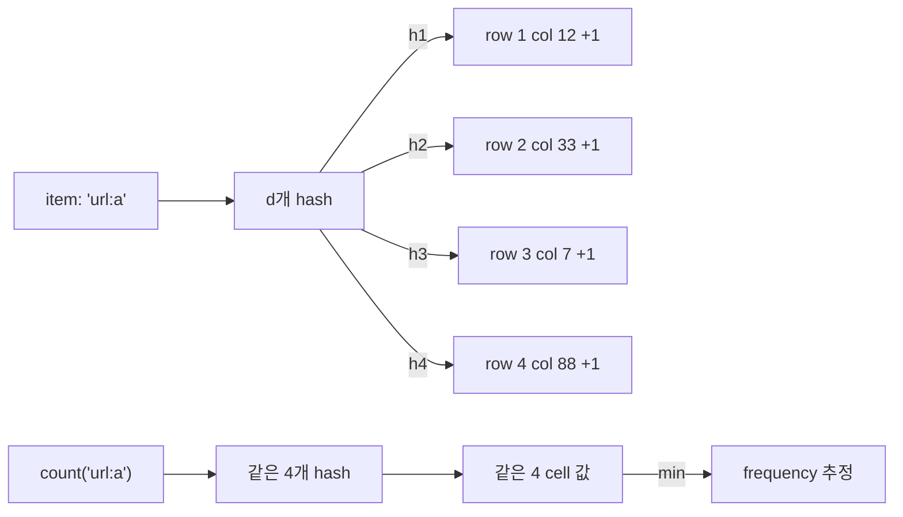
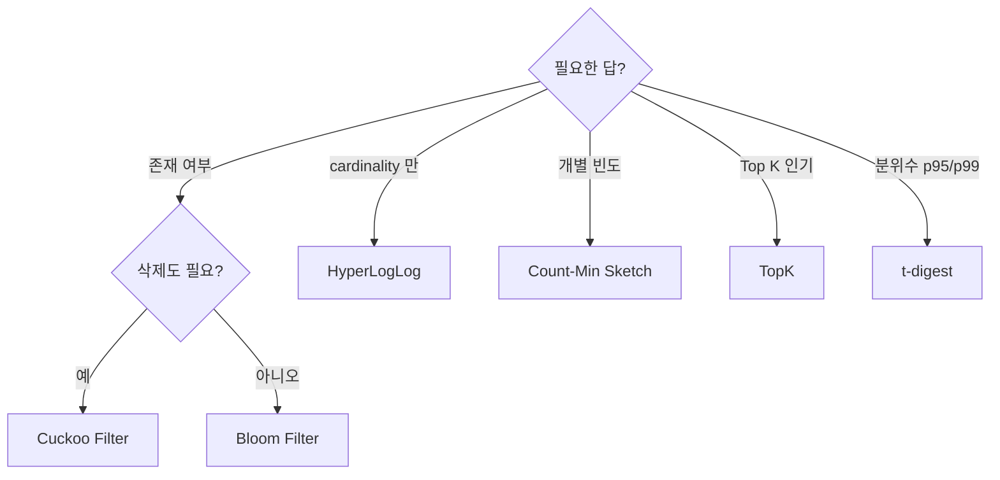

## 정의

**확률 자료구조 (Probabilistic Data Structures)** 는 *작은 메모리* 로 *대규모 데이터의 통계적 답* 을 *제어된 오차* 로 내는 자료구조군. Redis 는 *Bloom 모듈 (Redis 8 부터 코어)* 로 *Bloom Filter / Cuckoo Filter / Count-Min Sketch / TopK / t-digest* 를 제공한다.

| 자료구조 | 답하는 질문 | 대표 사용처 |
|---|---|---|
| **Bloom Filter** | "이 멤버를 본 적 있나?" (yes/no, *false positive 가능*) | 캐시 미스 차단, 중복 URL 필터 |
| **Cuckoo Filter** | 위와 같지만 *삭제 가능* | 동적 멤버십 |
| **Count-Min Sketch** | "이 멤버의 빈도?" (overcount 가능) | 트래픽 통계, 광고 노출 |
| **TopK** | "가장 자주 나오는 K 개" | 핫 키, 인기 검색어 |
| **t-digest** | "p99, p95, 분위수" | latency 분포 |

> [!IMPORTANT]
> 이들의 공통점: ***고정 또는 거의 고정 메모리* 로 *멤버 수가 무한히 늘어도* 안정적인 답*. Set / Hash 같은 *정확한 자료구조* 가 *불가능한 크기* 에서 빛난다.

## Bloom Filter

### 동작 원리

```mermaid
flowchart LR
    Item["item: 'user:42'"] --> H["k개 hash 함수"]
    H -->|h1| B1["bit 7"]
    H -->|h2| B2["bit 31"]
    H -->|h3| B3["bit 64"]
    B1 & B2 & B3 -->|모두 set| BloomBits[("Bloom 비트 배열")]
    Query["query: 'user:99'"] --> H2["같은 k개 hash"]
    H2 -->|h1| Q1["bit 12"]
    H2 -->|h2| Q2["bit 64"]
    H2 -->|h3| Q3["bit 100"]
    Q1 & Q2 & Q3 -->|모두 1?| Check{있다고 답<br/>(false positive 가능)}
```

- **추가 (BF.ADD)**: *k 개 hash 의 비트* 를 1 로
- **존재 확인 (BF.EXISTS)**: *k 개 hash 의 비트 모두 1* 이면 *있다* (단, *false positive* 있음)
- **삭제**: *불가능* (다른 멤버의 비트와 겹치면 누구 비트인지 모름)

### 명령

```bash
# 자동 reserve (기본 capacity 100, error 0.01)
BF.ADD urls https://example.com
BF.EXISTS urls https://example.com         # 1
BF.EXISTS urls https://other.com           # 0 또는 1 (false positive)

# 명시 reserve (capacity 1M, error 0.001)
BF.RESERVE urls 0.001 1000000
BF.ADD urls https://example.com
BF.MADD urls url1 url2 url3                # 배치
BF.MEXISTS urls url1 url2 url3

# 정보
BF.INFO urls
```

### 메모리 vs 오차율

<ChartJs
  client:visible
  type="line"
  title="Bloom Filter 메모리 (1M 멤버, 오차율별)"
  caption="false positive 가 작을수록 *비트 수 = 함수 수* 가 더 필요. 0.01 → 0.001 이면 대략 *1.5x* 메모리."
  height="280px"
  data={{
    labels: ['0.5', '0.1', '0.01', '0.001', '0.0001'],
    datasets: [
      {
        label: '메모리 (MB)',
        data: [0.18, 0.6, 1.2, 1.8, 2.4],
        borderColor: '#3b82f6',
        backgroundColor: 'rgba(59, 130, 246, 0.1)',
        borderWidth: 2.5,
        tension: 0.2,
        fill: true,
      },
    ],
  }}
  options={{
    scales: {
      x: { title: { display: true, text: '오차율 (false positive rate)' } },
      y: { title: { display: true, text: 'MB' }, beginAtZero: true },
    },
  }}
/>

> [!NOTE]
> 1M 멤버에 *오차율 0.001 (0.1%) ≈ 1.8 MB*. Set 으로 1M URL (각 50B) 저장하면 *50 MB+*. *25배 효율*.

### 활용 패턴

**1. 캐시 stampede 방지**

```python
# DB 에 없는 키를 자주 미스 → DB 부담
# Bloom 으로 *DB 에 있는 키 집합* 추적
if r.bfExists("known_users", user_id):
    # DB 조회 (있을 *확률* 높음)
    return db.query(user_id)
return None    # Bloom 이 false 면 *100% 없음* 보장
```

> [!TIP]
> *Bloom 의 false negative 는 절대 없다*. *false positive 만 있다*. 따라서 *"없다고 한 건 100% 없다"* 는 강한 보장. 이것이 *negative cache* 와 다른 점.

**2. 중복 URL / 중복 ID 차단**

```bash
BF.RESERVE seen_urls 0.0001 100000000
# 크롤러: 새 URL 인지 확인
BF.ADD seen_urls $url           # 추가 + 추가 전 false 였는지 반환
```

**3. 보안: 알려진 악성 IP / 토큰 차단**

```bash
BF.RESERVE bad_ips 0.001 10000000
# 차단 목록 1000만개에서 *직접 메모리 1.8 MB*
```

## Cuckoo Filter (Bloom 의 후계자)

*Bloom 의 단점* (삭제 불가) 을 해결. *추가 / 삭제 / 존재 확인* 모두 가능. *false positive* 는 더 낮은 경향.

```bash
CF.RESERVE seen 100000
CF.ADD seen item1
CF.EXISTS seen item1            # 1
CF.DEL seen item1               # 삭제 가능!
CF.EXISTS seen item1            # 0
```

### Bloom vs Cuckoo 비교

| 항목 | Bloom | Cuckoo |
|---|---|---|
| 추가 / 조회 | O(k) | O(1) (대부분) |
| 삭제 | *불가* | *가능* |
| 채우기 임계 | 75% 부근부터 false positive 증가 | 90%+ 채워도 잘 동작 |
| 메모리 (같은 오차율) | 보통 *Cuckoo 가 약간 효율* | |
| 멤버 수 추정 | 어려움 | *부정확하지만 가능* |

> [!IMPORTANT]
> 동적 멤버십 (추가 + 삭제 모두) 이면 *Cuckoo*. *추가만* 이면 *Bloom* (더 단순, 더 안정).

## Count-Min Sketch (CMS): 빈도 추정

*"이 키의 빈도가 몇 번?"* 에 대한 *overcount 가능한* 추정. *d × w 의 2D 카운터 배열* 에 *d 개 hash 함수* 로 *모든 hash 행 의 min* 을 답으로.

### 동작



*overcount 가능* (다른 멤버와 충돌하면 위로 셈), *undercount 없음*. min 이 *진짜 빈도 ≤ 답*.

### 명령

```bash
# 폭과 깊이로 초기화
CMS.INITBYDIM trafic 2000 5
# 또는 오차/확률로
CMS.INITBYPROB traffic 0.001 0.01

CMS.INCRBY traffic url:a 1 url:b 5
CMS.QUERY traffic url:a url:b              # [1, 5]
CMS.MERGE total 3 traffic1 traffic2 traffic3 WEIGHTS 1 1 1
```

### 활용

1. **트래픽 빈도 통계**: API endpoint 호출 빈도
2. **광고 노출 카운터**: ad → 노출 횟수
3. **DDoS 탐지**: IP → 요청 빈도
4. **인기 상품 추정**: product → 조회 빈도

> [!NOTE]
> *정확한 빈도* 가 필요하면 *Hash + HINCRBY*. *수십억 키의 빈도 통계* 같이 *Hash 가 메모리 부담* 일 때 CMS.

## TopK: 인기 K 개 추정

streaming 데이터에서 *Top K* 를 *작은 메모리* 로. *Heavy Keepers* 알고리즘 기반.

### 명령

```bash
TOPK.RESERVE hot_urls 10 1000 5 0.9        # k=10, width=1000, depth=5, decay=0.9
TOPK.ADD hot_urls url1 url2 url3
TOPK.INCRBY hot_urls url1 5

TOPK.LIST hot_urls                          # 현재 top-K
TOPK.LIST hot_urls WITHCOUNT                # 빈도 포함
TOPK.QUERY hot_urls url1 url2               # top-K 안에 있는지
TOPK.COUNT hot_urls url1                    # 추정 빈도
```

### 활용

1. **인기 검색어 실시간**: 검색 query 스트림 → TopK 100
2. **핫 키 탐지**: cache key 접근 빈도 → 가장 자주 쓰이는 100개
3. **트렌딩 해시태그**: 최근 N분 윈도우의 TopK
4. **DDoS attacker top-K**: 의심 IP 우선순위

> [!TIP]
> 정확한 *Top-K* 가 필요하면 *Sorted Set 의 ZRANGE*. *수십억 unique 가 들어오는 streaming* 에서 *고정 메모리 안* 에 끝내려면 TopK.

## 자료구조별 메모리 비교

같은 *1억 unique 멤버* 추적할 때:

<ChartJs
  client:visible
  type="bar"
  title="1억 unique 멤버 추적, 자료구조별 메모리 (직관)"
  caption="확률 자료구조는 *수 MB* 안에 끝. 정확한 자료구조는 *수 GB* 단위."
  height="280px"
  data={{
    labels: ['Set (정확)', 'Hash + count (정확)', 'HyperLogLog', 'Bloom (FP 0.001)', 'Cuckoo (FP 0.001)', 'CMS (10K cell)', 'TopK 1000'],
    datasets: [
      {
        label: '메모리 (MB)',
        data: [3000, 6000, 0.012, 180, 160, 0.4, 0.05],
        backgroundColor: ['#ef4444', '#f59e0b', '#22c55e', '#3b82f6', '#a78bfa', '#06b6d4', '#10b981'],
        borderWidth: 0,
      },
    ],
  }}
  options={{
    scales: {
      y: { type: 'logarithmic', title: { display: true, text: 'MB (log scale)' } },
    },
    plugins: { legend: { display: false } },
  }}
/>

## 결정 매트릭스



## 흔한 함정

> [!WARNING]
> 1. **Bloom 의 false negative 가 *없다는 보장* 을 *false positive 가 없다고 오해*** = *없다* 라고 한 건 100% 없음. *있다* 라고 한 건 *확률적*.
> 2. **CMS 의 overcount 를 *실제 빈도* 로 사용** = 항상 *추정 ≥ 진짜*. *비교 / 상위 K* 같은 *순위* 용도로만 신뢰.
> 3. **고정 capacity Bloom 의 over-fill** = capacity 를 *넘기면* false positive rate 가 *급격 악화*. *주기적 reset + 새 키* 또는 *scaling Bloom* 사용.
> 4. **확률 자료구조의 합집합** = HLL `PFMERGE` 와 CMS `CMS.MERGE` 가능. Bloom 은 *비트 OR* 로 가능 (낯설지만 동작).

## 김신건의 현장 메모

- *역량 리포트* 의 *학생 활동 통계* 같은 *방대한 streaming 통계* 에서 *Hash + HINCRBY 가 너무 무거우면* *CMS* + *정확한 TopK 만 Sorted Set* 의 *하이브리드* 가 *메모리 / 정확도 균형*.
- *Bloom 으로 cache miss 차단* 은 *Hot Path 의 가장 가벼운 가속*. *없는 키를 매번 DB 조회* 하는 비용이 *Bloom 메모리보다 압도적으로 큼*.
- *TopK 의 decay 파라미터 (0.9)* 가 *최근 트래픽 가중치*. 너무 작으면 (0.5) 옛 데이터 무시, 너무 크면 (0.99) 변화 느림. *대시보드 갱신 주기에 맞춰 튜닝*.
- *Redis 8 의 코어 통합* 으로 *별도 모듈 설치 없이* 사용. *프로덕션 도입 진입 장벽* 이 *대폭 낮아짐*.

## 관련 위키

- [[Redis]] (자료구조 카탈로그)
- [[Redis Sets]] (정확한 멤버십 대안)
- [[Redis HyperLogLog Geo]] (HLL 의 cardinality 추정)
- [[Redis Sorted Sets]] (정확한 TopK)
- [[Redis Cache Patterns]] (Bloom 을 캐시 앞에)

## 참고

- 공식: [Probabilistic Data Types](https://redis.io/docs/latest/develop/data-types/probabilistic/)
- Bloom 원논문: [Burton Bloom, 1970](https://dl.acm.org/doi/10.1145/362686.362692)
- Cuckoo Filter: [Fan et al.](https://www.cs.cmu.edu/~dga/papers/cuckoo-conext2014.pdf)
- CMS: [Cormode & Muthukrishnan](http://dimacs.rutgers.edu/~graham/pubs/papers/cmencyc.pdf)
