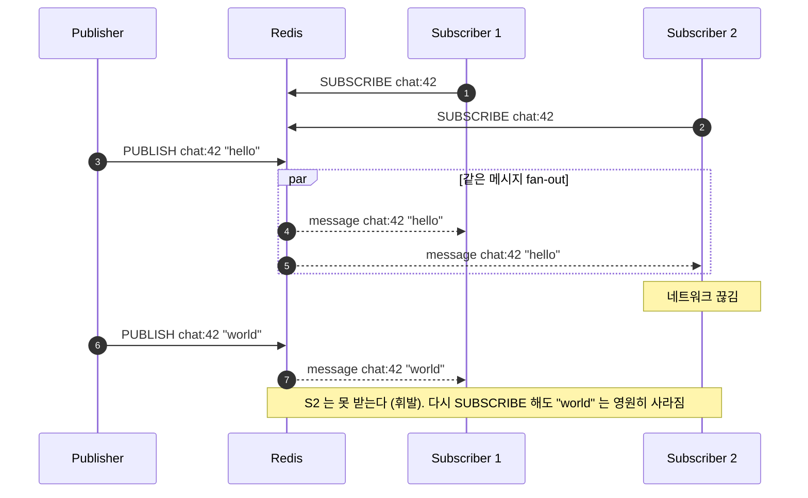
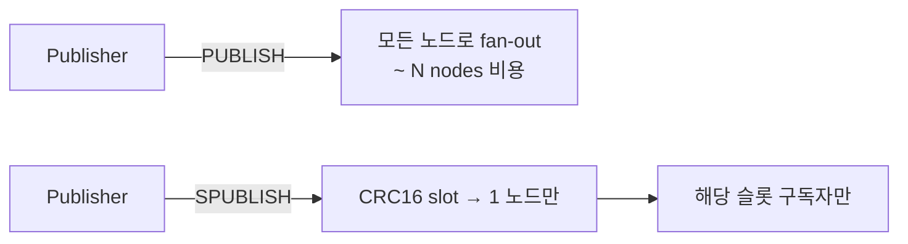
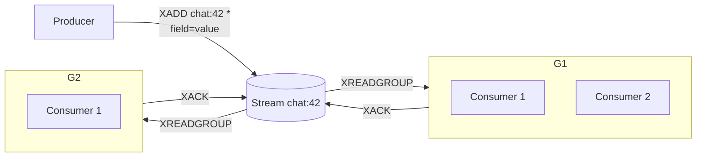
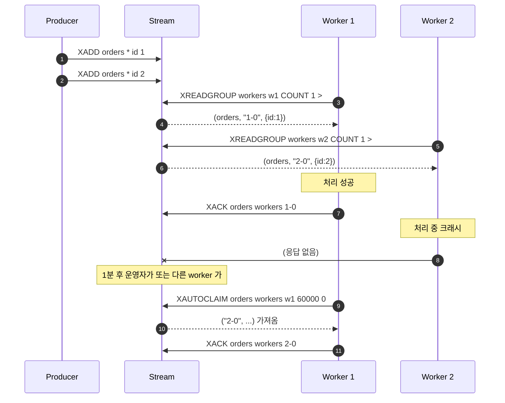
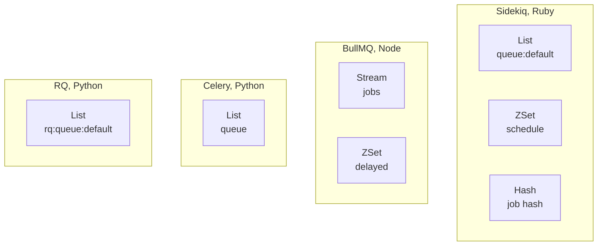
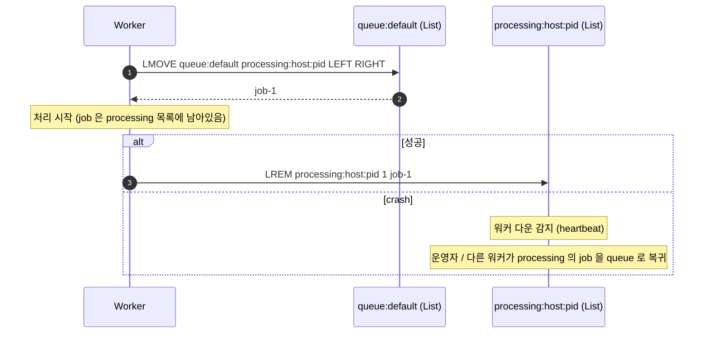
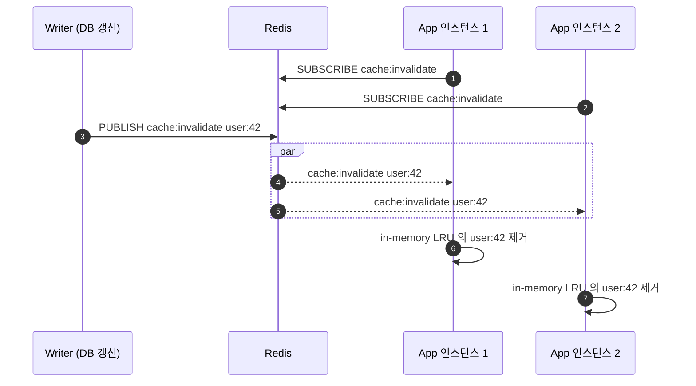
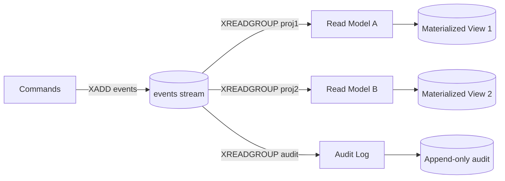

## 정의

- **Pub/Sub** (`PUBLISH` / `SUBSCRIBE`): *지금 듣고 있는 구독자* 에게만 메시지가 전달되는 *휘발성* 신호. *영속 없음*, ACK 없음. *fan-out*.
- **Streams** (`XADD` / `XREAD` / `XREADGROUP` / `XACK`): 영속적인 *append-only 로그*. *consumer group* 으로 *작업 분배*. Kafka 에 가장 가까운 Redis 자료구조.

> [!IMPORTANT]
> *Pub/Sub 는 메시지 큐가 아니다*. 다운된 구독자가 *나중에 돌아와도 지난 메시지는 못 받는다*. *처리 보장* 이 필요하면 *Streams* 또는 *List 큐* 로.

## Pub/Sub 의 동작

```anim:pubsub-bus
{}
```



### 명령 셋

```bash
# 구독
SUBSCRIBE chat:42 chat:99           # 정확한 채널
PSUBSCRIBE chat:*                   # 패턴
SSUBSCRIBE shardchannel             # Redis 7+ Sharded Pub/Sub (Cluster 친화)

# 발행
PUBLISH chat:42 "hello"             # 받은 구독자 수 반환
SPUBLISH shardchannel "msg"         # Sharded

# 상태
PUBSUB CHANNELS chat:*              # 활성 채널
PUBSUB NUMSUB chat:42               # 채널별 구독자 수
PUBSUB NUMPAT                       # 패턴 구독 수
```

### Sharded Pub/Sub (Redis 7+)

전통 Pub/Sub 는 *Cluster 에서 모든 노드로 fan-out* → 노드 수 늘수록 *낭비*. *Sharded Pub/Sub* 는 채널을 *슬롯에 매핑* 해 *해당 슬롯의 노드만* 받게 한다.



## Streams: 영속 로그 + Consumer Group

```anim:queue
{}
```

위 애니메이션은 *FIFO 큐 동작* 의 일반 직관. Streams 는 *큐 + 영속 + 다중 consumer group* 으로 확장된 형태.



각 *group* 은 *자기 진행 위치 (last-delivered-id)* 를 *Stream 안에* 저장. *consumer* 하나가 죽어도 *다른 consumer* 가 *XPENDING* 으로 *못 ACK 된 메시지* 를 *XCLAIM* 으로 이어받음.

### 명령 셋

```bash
# 추가
XADD chat:42 * user "alice" body "hi"           # ID = millis-seq
XLEN chat:42                                     # 길이

# 단일 consumer 읽기
XREAD COUNT 10 STREAMS chat:42 0                 # 처음부터
XREAD BLOCK 5000 STREAMS chat:42 $               # 새 것만 5초 블록

# Consumer group
XGROUP CREATE chat:42 workers $ MKSTREAM         # 그룹 생성 (가장 최신부터)
XREADGROUP GROUP workers c1 COUNT 10 STREAMS chat:42 >
XACK chat:42 workers 1709305822-0                # 처리 완료 표시
XPENDING chat:42 workers                         # 미완료 목록
XCLAIM chat:42 workers c2 60000 1709305822-0     # 60초 이상 응답 없는 메시지 빼앗아 옴
XAUTOCLAIM chat:42 workers c2 60000 0            # 일괄 (Redis 6.2+)

# 정리
XTRIM chat:42 MAXLEN ~ 100000                    # approximate, ~ 가 효율적
XADD chat:42 MAXLEN ~ 100000 * field value       # add 와 함께
```

### XADD ↔ XACK 의 전형적 흐름



### 8.x 의 신규 명령

| 명령 | 의미 |
|---|---|
| `XDELEX` *(Redis 8.2)* | 지정 ID 를 *delete + 즉시 reclaim*. consumer group ack 와 동시에 처리 |
| `XACKDEL` *(Redis 8.2)* | ack + delete 한 번에 |
| `XNACK` *(Redis 8.8)* | consumer 가 *명시적으로* 메시지를 *release*. 재시도 가능 |

## Pub/Sub vs Streams: 결정 매트릭스

| 특성 | Pub/Sub | Streams |
|---|---|---|
| 영속성 | *없음* | *있음* (MAXLEN 으로 조절) |
| 다운된 구독자의 메시지 | *영구 손실* | *복귀 후 수신 가능* |
| Consumer group | 없음 (broadcast 만) | *있음* (작업 분배) |
| ACK / 재시도 | 없음 | *있음* (XACK / XCLAIM) |
| Fan-out | *N 구독자* 에게 모두 | *그룹 단위* 1개 |
| Cluster | 전체 fan-out (Sharded 로 완화) | 키 (Stream) 별 슬롯 |
| 메모리 비용 | *0* (즉시 버림) | *길이 비례* |
| 적합 | 알림, 무효화 신호, 라이브 채팅 | 메시지 큐, 이벤트 소싱 |

### 처리량 / 지연 (직관)

<ChartJs
  client:visible
  type="bar"
  title="Pub/Sub vs Streams 처리량/지연 (직관 비교)"
  caption="Pub/Sub 는 지연이 가장 낮지만 영속 보장 없음. Streams 는 영속 + ACK 의 trade."
  height="280px"
  data={{
    labels: ['Pub/Sub', 'Streams (XADD)', 'List 큐 (LPUSH+BRPOP)'],
    datasets: [
      {
        label: '처리량 (배수)',
        data: [1.0, 0.72, 0.85],
        backgroundColor: '#3b82f6',
      },
      {
        label: '평균 지연 (배수)',
        data: [1.0, 1.4, 1.2],
        backgroundColor: '#f59e0b',
      },
    ],
  }}
  options={{
    scales: { y: { title: { display: true, text: '상대 값 (Pub/Sub = 1.0)' } } },
  }}
/>

## Redis 위의 큐 시스템들



| 라이브러리 | 기본 구현 | 신뢰성 |
|---|---|---|
| Sidekiq (OSS) | `BRPOPLPUSH` (현 `LMOVE`) 로 *fetch + 처리 중 표시*, ACK 시 제거 | crash 시 *처리 중 목록* 에서 회수 |
| Sidekiq Pro | "reliable fetch" 강화 | 동일, 보강 |
| BullMQ | Streams 기반 | XACK + retry 로 견고 |
| Celery (Redis broker) | List 기반 단순 fetch | crash 시 일부 손실 가능 |
| RQ | List 기반 단순 | 동일 |

### Sidekiq 의 reliable fetch 원리



> [!TIP]
> *영원히 *List* 기반인 이유* 는 *호환성*. 이론적으로는 *Streams 로 다시 짤 수* 있지만 *모든 user 의 큐 키 / 미들웨어 / 콘솔* 이 *List 인 것을 가정*.

## Keyspace Notifications

키 변경을 *Pub/Sub 채널* 로 받는 기능. *invalidation broadcast* 에 흔히 사용.

```conf
notify-keyspace-events "KEA"
```

플래그 (조합):

| 플래그 | 의미 |
|---|---|
| `K` | keyspace 채널 (`__keyspace@0__:key` 로 *이벤트 이름* 발행) |
| `E` | keyevent 채널 (`__keyevent@0__:event` 로 *키 이름* 발행) |
| `g` | 일반 (DEL, EXPIRE, RENAME) |
| `$` | String |
| `l` | List |
| `s` | Set |
| `h` | Hash |
| `z` | ZSet |
| `x` | expired |
| `e` | evicted |
| `A` | `g$lshzxe` 의 alias (all) |

```bash
PSUBSCRIBE '__keyevent@0__:expired'
# expired 가 발생할 때마다 키 이름이 메시지로 옴
```

> [!CAUTION]
> *expired 이벤트* 는 *실제 키 만료 시점* 이 아니라 *Redis 가 발견한 시점*. lazy expiration 때문에 *수 초 지연* 가능. 정확한 시각이 필요하면 *Streams + 스케줄러* 가 답.

## 실전 패턴

### 캐시 무효화 fan-out (Pub/Sub)



*로컬 L1 캐시 + Redis L2 캐시* 인 환경의 *L1 무효화*.

### 이벤트 소싱 + projection (Streams)



각 *projection* 이 *독립 group*. 한 projection 이 *과거 이벤트 다시 처리* 가 필요하면 *XGROUP CREATE ... 0* 으로 처음부터.

## 김신건의 현장 메모

- hera-webapp 의 *알림 fan-out* 은 *Pub/Sub*. *놓쳐도 되는 라이브 신호* 만. 영속이 필요한 *재발송 가능 이메일* 은 *Sidekiq 의 List 큐*.
- *Streams 로 큐를 직접 운영* 한 경험: *XACK 누락 시 무한 retry* 와 *DLQ (XCLAIM 한도 초과 시 별도 stream)* 의 *수동 운영* 부담이 크다. *Sidekiq* 가 *훨씬 더 운영자 친화*.
- *Sharded Pub/Sub* 는 *Cluster + Pub/Sub fan-out* 환경에서 *네트워크 대역폭* 을 *수 배 절감*. 신규 시스템은 *처음부터 SPUBLISH/SSUBSCRIBE*.
- *Keyspace notifications* 의 *expired* 는 *재미있지만 위험*. 의존하면 안 된다. 항상 *별도 스케줄러* 가 *재확인*.

## 관련 위키

- [[Redis]] (라이센스 / 신 기능)
- [[Redis Cache Patterns]] (캐시 무효화 fan-out)
- [[Redis Distributed Lock]] (큐 작업의 멱등성)
- [[Sidekiq]] (Ruby 큐 운영)

## 참고

- 공식: [Pub/Sub](https://redis.io/docs/latest/develop/interact/pubsub/), [Streams](https://redis.io/docs/latest/develop/data-types/streams/)
- Sidekiq Wiki: [github.com/sidekiq/sidekiq/wiki](https://github.com/sidekiq/sidekiq/wiki)
- BullMQ: [docs.bullmq.io](https://docs.bullmq.io/)
