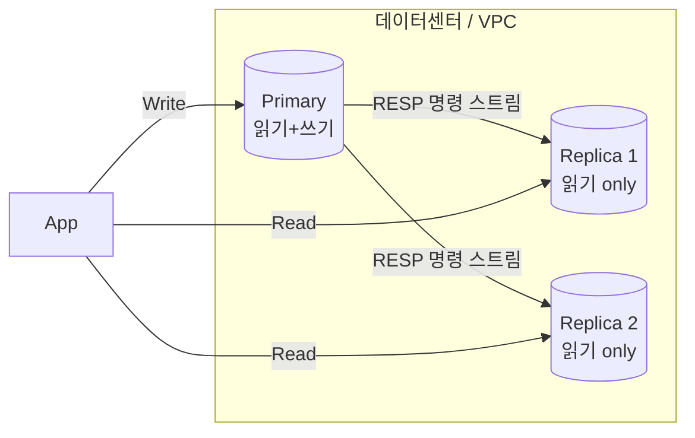
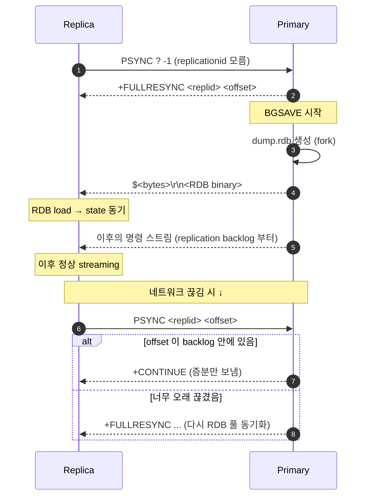
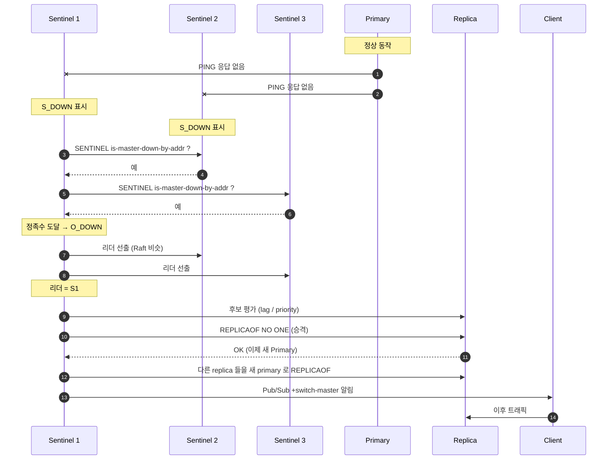

## 정의

**Redis Replication** 은 *primary (master) → replica (slave)* 방향의 *비동기 단방향 복제*. *읽기 부하 분산* 과 *고가용성* 의 토대.

**Redis Sentinel** 은 *그 위에 얹는 watchdog* 시스템. 일정 quorum 이상이 primary 가 *죽었다* 라고 동의하면, *replica 하나를 새 primary 로 승격* + *다른 replica 들을 재구성* + *클라이언트에 알림*.

> [!IMPORTANT]
> **Sentinel ≠ Cluster**. Sentinel 은 *키 분할이 없다*. *전체 데이터셋이 한 노드 메모리 안에 들어가야* 한다. 분할이 필요하면 *Cluster* 로. [[Redis Cluster]] 참고.

## Replication 의 시각

```anim:db-replication
{}
```

토폴로지:



특징:

- **비동기**: write 가 primary 에서 성공하면 *바로 응답*. replica 에 *반영되었는지 모름*.
- **단방향**: replica 에 직접 write 하면 *조용히 거부* (또는 *replica 가 read-only 가 아니면 분기*. 절대 금지).
- **PSYNC**: 처음 한 번은 RDB 풀 동기화, 이후엔 *backlog 의 offset 부터 증분* 동기화.

## PSYNC: 풀 / 부분 동기화



`replication backlog` 가 *크기 (메모리)* 만큼만 *부분 재동기화* 가 가능. 끊김 시간이 backlog 보다 길면 *RDB 풀 동기화로 회귀*.

```conf
# redis.conf
repl-backlog-size 64mb       # 끊김에 견딜 최대 시간 = backlog / 처리량
repl-backlog-ttl 3600        # replica 없을 때 backlog 유지 시간
repl-diskless-sync yes       # primary 가 RDB 를 socket 으로 직접 전송 (디스크 우회)
repl-diskless-sync-delay 5   # 더 많은 replica 가 모일 때까지 기다림
```

> [!TIP]
> *replica 다수가 동시에 재접속* 하면 (예: 배포 후) `repl-diskless-sync-delay` 가 *동일 BGSAVE 를 여러 replica 가 공유* 하게 해준다. fork 비용 절감.

## Replication Lag 의 시각화

primary 에 *지속적인 쓰기* 가 있을 때 replica 가 *얼마나 늦었는지*. 일반적인 *행복한 경우 vs 네트워크 혼잡* 비교:

<ChartJs
  client:visible
  type="line"
  title="Replication Lag (ms) 시간대별, 두 시나리오"
  caption="가상 시나리오. 네트워크 혼잡 / 큰 RDB 동기화 시점에 lag spike."
  height="280px"
  data={{
    labels: ['00:00', '00:05', '00:10', '00:15', '00:20', '00:25', '00:30', '00:35', '00:40', '00:45', '00:50', '00:55'],
    datasets: [
      {
        label: '평상시 (정상)',
        data: [3, 4, 4, 3, 5, 4, 6, 4, 3, 4, 5, 4],
        borderColor: '#22c55e',
        backgroundColor: 'transparent',
        borderWidth: 2.5,
        tension: 0.3,
        pointRadius: 3,
      },
      {
        label: '네트워크 혼잡 / RDB 동기화',
        data: [3, 5, 8, 24, 132, 410, 280, 95, 35, 15, 8, 5],
        borderColor: '#ef4444',
        backgroundColor: 'transparent',
        borderWidth: 2.5,
        tension: 0.3,
        pointRadius: 3,
      },
    ],
  }}
  options={{
    scales: {
      y: { title: { display: true, text: 'lag (ms, log scale)' }, type: 'logarithmic' },
      x: { title: { display: true, text: '시간' } },
    },
  }}
/>

핵심 지표 (`INFO replication`):

- `master_repl_offset` / `slave_repl_offset` 의 *차이* = *명령 단위* lag.
- `master_link_status` = `up` / `down`.
- `master_last_io_seconds_ago` = primary 로부터 *마지막 명령 수신* 후 경과.

## 안전 가드: WAIT 와 min-replicas

비동기라도 *일부 동기 보장* 을 흉내내는 두 장치:

### `WAIT numreplicas timeout`

마지막 쓰기가 *numreplicas 개 이상* 의 replica 에 도달할 때까지 *최대 timeout ms* 대기. 도달하지 못하면 *실제로 도달한 수* 를 반환.

```bash
# 1개 replica 이상 ACK 받을 때까지 100ms 대기
SET payment:42 paid
WAIT 1 100
# → (integer) 1   # 1개에 도달
# → (integer) 0   # 어디에도 못 갔음 (네트워크 끊김 등)
```

> [!CAUTION]
> WAIT 는 *완벽한 동기 복제* 가 아니다. *primary 가 죽어도 replica 가 못 받은 케이스* 는 여전히 존재. *결제 / 주문* 의 *primary store* 로 Redis 를 쓰면 안 되는 이유.

### `min-replicas-to-write` / `min-replicas-max-lag`

```conf
min-replicas-to-write 1
min-replicas-max-lag 10
```

→ "*최소 1개 이상* 의 replica 가 *지난 10초 안에* 응답했어야 *primary 가 write 를 받아준다*". *split-brain 의 write 손실* 을 줄인다.

## Sentinel: 자동 Failover

Sentinel 은 *별도 프로세스* (3 ~ 5개 짝수 피하기). 각 Sentinel 이 *모든 노드를 주기적으로 ping + INFO*. *quorum 명이 동의* 하면 *Subjective Down → Objective Down → Election → Promotion*.



핵심 단계:

| 단계 | 의미 |
|---|---|
| `S_DOWN` (Subjective) | *나 (이 Sentinel) 보기엔* primary 가 죽었다. 단독 판단 |
| `O_DOWN` (Objective) | *quorum 명 이상* 의 Sentinel 이 동의. 진짜 죽었다고 합의 |
| `Election` | Sentinel 들이 *리더* 1개를 선출 |
| `Promote` | 리더가 *replica 중 하나를* 새 primary 로 승격 |
| `Reconfigure` | 나머지 replica 들을 새 primary 의 replica 로 *REPLICAOF* |
| `Notify` | Sentinel 의 Pub/Sub 채널 (`+switch-master`) 로 알림 |

설정 (`sentinel.conf`):

```conf
port 26379
sentinel monitor mymaster 10.0.0.10 6379 2     # quorum = 2
sentinel down-after-milliseconds mymaster 5000  # 5초 응답 없으면 S_DOWN
sentinel failover-timeout mymaster 60000        # failover 한 사이클 한도
sentinel parallel-syncs mymaster 1              # 동시에 새 primary 와 sync 할 replica 수
```

## RTO / RPO 의 직관

```mermaid
gantt
    title Failover 타임라인 (예시, 단위 = 초)
    dateFormat ss
    axisFormat %Ss

    section Primary 다운
    실제 다운             :done, p1, 00, 1s

    section Sentinel
    down-after (5s)       :crit, s1, 01, 5s
    Election             :active, s2, after s1, 2s
    Promote              :active, s3, after s2, 1s
    Replicas 재구성      :active, s4, after s3, 3s

    section Client
    Sentinel Pub/Sub 수신 :milestone, m1, after s3, 0s
    재연결               :active, c1, after m1, 2s
```



| 지표 | 의미 | Sentinel 의 보통 범위 |
|---|---|---|
| **RTO** (Recovery Time Objective) | 서비스 복구까지 | 5초 (down-after) + 5 ~ 15초 (election + promote + reconnect) |
| **RPO** (Recovery Point Objective) | 데이터 손실 허용 시점 | 비동기 복제 이므로 *마지막 ACK 안 된 write 만큼* (수십 ms ~ 수 초) |

> [!TIP]
> RTO 를 *수 초* 로 줄이려면 `down-after-milliseconds` 를 작게. 너무 작으면 *네트워크 jitter 만으로도 false failover*. 보통 1 ~ 5초 사이에서 *false positive 와 RTO* 의 균형.

## 흔한 함정

> [!WARNING]
> *클라이언트 라이브러리* 가 *Sentinel 의 알림* 을 *제대로 처리* 해야 한다. *connection pool* 이 *옛 primary 의 IP* 를 가지고 있으면 failover 후에도 *옛 노드* 로 계속 시도. *Lettuce*, *redis-py-cluster*, *redis-rb* 등 *Sentinel discovery* 가 켜져 있는지 확인.

흔한 사고:

1. **Split-brain**: 네트워크 분할로 *옛 primary 와 새 primary 가 동시* 에 write 받음. `min-replicas-to-write` 가 핵심 방어.
2. **Replica 가 너무 lag** 한 상태에서 승격 → *최근 write 손실 큼*. Sentinel 의 *replica 우선순위* 와 *replica-priority* (낮은 값 우선) 로 *lag 적은 replica* 가 선정되도록.
3. **Quorum = 노드 수와 동일** → *어떤 Sentinel 한 명이 죽어도 failover 못함*. *quorum = (N/2)+1*.
4. **Sentinel 이 같은 호스트 / VM** 에서 동작 → *호스트 장애가 모든 Sentinel 을 한꺼번에 죽임*. *반드시 분산*.

## Redis 자체 HA: Standalone vs Sentinel vs Cluster

| 모드 | 데이터 분할 | 자동 failover | 클라이언트 복잡도 |
|---|---|---|---|
| Standalone | 없음 | *수동* | 가장 단순 |
| Sentinel | 없음 (전체 데이터 한 노드 메모리에) | *자동* | Sentinel 발견 필요 |
| Cluster | 16384 슬롯 분할 | *자동* | *cluster-aware* 클라이언트 |

## 김신건의 현장 메모

- hera-webapp 에서는 *AWS ElastiCache Redis Cluster Mode Off + Multi-AZ* 사용. *managed Sentinel* 이라고 봐도 된다. 직접 Sentinel 운영은 *3 노드 분산 + Sentinel 모니터링 알람* 이 필수.
- *failover 동안 *짧은 timeout* 으로 *connection pool 이 즉시 새 primary 를 잡도록* 셋업했더니, *간헐적 5xx* 가 안 보이기 시작.
- *Sidekiq* 은 *Sentinel 친화적*. `:sentinels` 옵션 + `:role => :master` 로 *항상 primary 로 라우팅*.
- *failover 연습* 을 *카오스 엔지니어링 한 일과* 로. *primary 에 일부러 `DEBUG SLEEP 30`* 을 날려 Sentinel 이 *실전처럼 동작* 하는지 검증.

## 관련 위키

- [[Redis]] (라이센스 / 신 기능)
- [[Redis Persistence]] (replica 에서 RDB 활용)
- [[Redis Cluster]] (수평 확장이 필요할 때)
- [[Zero Downtime Deployment]] (failover 와 무중단 배포)

## 참고

