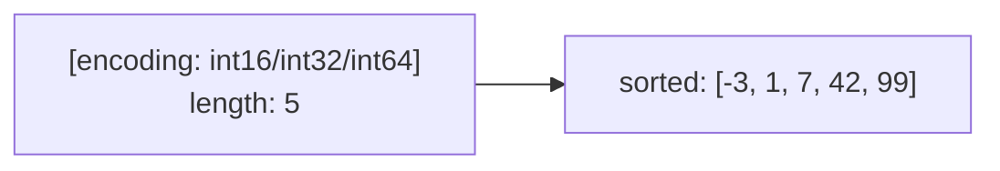

## 정의

**Redis Set** 은 *중복 없는 unordered 멤버 집합*. *SADD / SREM / SISMEMBER* 가 *O(1)*, *SINTER / SUNION / SDIFF* 의 *집합 연산* 이 자료구조 자체에 박혀 있다.

활용:

- **멤버십** ("이 사용자가 그룹에 속하나?")
- **태그** (게시물 → 태그들, 태그 → 게시물들)
- **친구 / 팔로워** (양방향, 공통 친구 SINTER)
- **고유 카운트** (정확한, 작은 집합)
- **권한 / 역할**

> [!NOTE]
> *순서가 필요* 하면 [[Redis Sorted Sets]] 로. *대규모 cardinality (정확도 약간 희생 가능)* 면 [[Redis HyperLogLog Geo]] 의 HLL 로.

## 내부 인코딩

| 인코딩 | 조건 (기본) |
|---|---|
| `intset` | *모든 멤버가 정수* 이고 *길이 ≤ `set-max-intset-entries`* (512) |
| `listpack` | 작은 set (Redis 7.2+) ≤ `set-max-listpack-entries` (128) AND 멤버 크기 작음 |
| `hashtable` | 그 외 |

```conf
set-max-intset-entries 512
set-max-listpack-entries 128
set-max-listpack-value 64
```

### intset 의 마법

```anim:hash-set
{}
```

> 위 애니메이션은 *Hash Set* 의 *bucket + 충돌 해결* 직관. Redis 의 *hashtable 인코딩* 은 정확히 이 구조.



*정렬된 정수 배열*. *binary search* 로 SISMEMBER 가 *O(log N)*. *최소 정수 비트 폭* 으로 *극도로 압축*. 1 만개 정수도 *수십 KB* 면 충분.

> [!TIP]
> *순수 정수 ID 의 큰 멤버십* 은 `intset` 이 *비현실적으로 효율*. 사용자 ID 같은 정수만 다룬다면 *Redis 가 자동* 으로 가장 좋은 인코딩을 고른다.

### hashtable 인코딩

```anim:hashing
{}
```

큰 set 또는 *문자열 멤버* 면 *해시 테이블* 로 전환. 같은 dict 구현체이지만 *value 가 없는 dict*.

## 핵심 명령

### 기본

```bash
SADD friends:42 100 200 300
SREM friends:42 200
SISMEMBER friends:42 100             # 1
SMISMEMBER friends:42 100 200 300    # [1, 0, 1]  (Redis 6.2+)
SMEMBERS friends:42                  # 전체 (작을 때만!)
SCARD friends:42                     # 길이
SRANDMEMBER friends:42 3             # 랜덤 3개
SPOP friends:42 1                    # pop (제거하면서 반환)
SMOVE friends:42 blocked:42 200      # 멤버 이동 (atomic)
SSCAN friends:42 0 MATCH '*' COUNT 100   # 페이지 스캔
```

### 집합 연산

```bash
SINTER friends:42 friends:99           # 공통 친구
SUNION friends:42 friends:99           # 전체 합집합
SDIFF friends:42 friends:99            # 42 의 친구 중 99 의 친구가 아닌 사람

# STORE 변형: 결과를 키에 저장
SINTERSTORE result friends:42 friends:99
SUNIONSTORE result friends:42 friends:99
SDIFFSTORE result friends:42 friends:99

# SINTERCARD: 결과 크기만 (Redis 7+)
SINTERCARD 2 friends:42 friends:99 LIMIT 100
```

```mermaid
flowchart LR
    A["friends:42<br/>{100, 200, 300, 400}"] --> Op
    B["friends:99<br/>{200, 300, 500, 600}"] --> Op
    Op{집합 연산} --> SI[SINTER<br/>{200, 300}]
    Op --> SU[SUNION<br/>{100, 200, 300, 400, 500, 600}]
    Op --> SD["SDIFF (42 - 99)<br/>{100, 400}"]
```

> [!IMPORTANT]
> 집합 연산은 *Cluster 에서 같은 슬롯* 의 키여야 동작. *친구 / 팔로워* 같이 *함께 다닐 키* 는 `{user:42}:friends` 처럼 *hash tag* 로 같은 슬롯 보장.

## 활용 패턴

### 1. 태그 시스템 (양방향 인덱스)

```bash
# 게시물 1 의 태그
SADD post:1:tags ruby rails redis

# 태그 → 게시물 역인덱스
SADD tag:ruby:posts 1
SADD tag:rails:posts 1
SADD tag:redis:posts 1

# "ruby 와 redis 가 둘 다 달린 게시물"
SINTER tag:ruby:posts tag:redis:posts
```

> *역인덱스 만들기 + atomic 검색* 이 *한 줄*. 검색엔진 없이 *Redis 만으로 작은 검색* 가능.

### 2. 친구 관계 (양방향)

```bash
# 양방향 친구 = a 와 b 모두에 추가
MULTI
SADD friends:42 99
SADD friends:99 42
EXEC

# 공통 친구
SINTER friends:42 friends:99

# 친구의 친구 (확장)
SUNION friends:99 friends:100 friends:101   # 친구 99/100/101 의 모든 친구
SDIFF temp friends:42                       # 내 친구 제외
```

### 3. 권한 / 역할

```bash
SADD user:42:roles admin editor reviewer
SISMEMBER user:42:roles admin              # 1
SMEMBERS user:42:roles

# 모든 admin
SADD role:admin:users 42 99 100
SMEMBERS role:admin:users
```

### 4. 중복 방지 (deduplication)

```python
# 같은 ID 가 *처음* 들어왔는지 atomic 체크
def first_time(r, event_id: str) -> bool:
    return r.sadd("seen:events", event_id) == 1
```

*1 == 처음 (추가됨)*, *0 == 이미 있음*. 멱등성 보장의 *한 줄 패턴*.

### 5. 분리 집합 (Disjoint Set)

집합 연산 직관:

```anim:disjoint-set
{}
```

> Union-Find 의 *find / union* 패턴. Redis Set 으로 *느슨한 disjoint* 표현 가능 (정밀하게는 알고리즘 자료구조가 더 적합).

## 성능 표

| 명령 | 복잡도 |
|---|---|
| `SADD`, `SREM`, `SISMEMBER`, `SCARD`, `SPOP` | O(1) |
| `SMISMEMBER (k)` | O(k) |
| `SMEMBERS` | O(N) |
| `SINTER (N1, N2, ..., Nk)` | O(N * k) (최소 집합 기준) |
| `SUNION (N1, N2, ..., Nk)` | O(N) |
| `SDIFF (N1, N2, ..., Nk)` | O(N) |
| `SRANDMEMBER (count)` | O(N) (큰 count 일 때) |
| `SSCAN` | amortized O(N) |

> [!CAUTION]
> *SINTER 의 최적화* = Redis 는 *가장 작은 집합* 부터 처리. *큰 집합 ∩ 작은 집합* 을 자주 쓰면 *작은 집합을 첫 인자로* 주는 것이 *명시적으로 빠르다*.

## 메모리 효율 비교

같은 1만 정수 멤버를 각 자료형에 저장:

<ChartJs
  client:visible
  type="bar"
  title="1만 정수 멤버, 자료형/인코딩별 메모리 (직관)"
  caption="intset 의 정수 전용 압축이 가장 효율. hashtable 은 *문자열 멤버* 필요시 자동 전환."
  height="240px"
  data={{
    labels: ['Set (intset, ≤512)', 'Set (listpack)', 'Set (hashtable)', 'Hash (1만 키:1값)', 'String 1만 키'],
    datasets: [
      {
        label: '메모리 (MB)',
        data: [0.06, 0.18, 0.85, 1.2, 6.8],
        backgroundColor: ['#22c55e', '#3b82f6', '#f59e0b', '#a78bfa', '#ef4444'],
      },
    ],
  }}
  options={{
    scales: {
      y: { type: 'logarithmic', title: { display: true, text: 'MB (log scale)' } },
    },
    plugins: { legend: { display: false } },
  }}
/>

> intset 은 *수십 배 효율*. *멤버가 정수 + 작은 set* 이면 *자동* 으로 intset 이 잡힌다.

## Set vs HyperLogLog 결정

```mermaid
flowchart TD
    Q1{정확한 cardinality<br/>필요?}
    Q1 -->|예| Q2
    Q1 -->|아니오 0.81% 오차 OK| HLL[HyperLogLog<br/>12KB 고정]
    Q2{개별 멤버에<br/>접근 필요?}
    Q2 -->|예 (SISMEMBER 등)| Set[Set]
    Q2 -->|아니오 cardinality 만| Q3
    Q3{메모리 한계?}
    Q3 -->|충분| Set
    Q3 -->|타이트| HLL
```

## 흔한 함정

> [!WARNING]
> 1. **`SMEMBERS` 대용량** = O(N) single-thread 차단. *작은 set* 에서만.
> 2. **`SUNION/SINTER` cross-slot** = Cluster 에서 *키들이 다른 슬롯* 이면 에러. *hash tag* 필수.
> 3. **`SADD` 의 매우 큰 batch** = 한 명령에 *수만 개 인자* 면 *명령 자체* 가 *single-thread 차단*. *나눠서*.
> 4. **intset → hashtable 전환** = 한 번 hashtable 가 되면 *되돌리지 않는다*. 메모리 사용량이 *영구히 늘어남*. *전환 임계* 를 알고 운영.

## 김신건의 현장 메모

- *태그 시스템* 을 Set + 역인덱스로 만들면 *검색엔진 없이도* *AND/OR/NOT* 가 즉각 가능. 작은 / 중간 규모에서는 ElasticSearch 도입 *직전까지* 충분.
- *팔로워 / 팔로잉* 같은 *대칭 관계* 는 *MULTI/EXEC* 로 묶어 *둘 다 정합 보장*. *비대칭 (블록 같은)* 은 한 쪽만.
- *intset 의 자동 효율* 이 *너무 좋아서* 종종 *intset 이 잡혔는지 OBJECT ENCODING* 으로 확인하는 습관이 들었다. *멤버가 비정수로 섞이면 자동 hashtable 로 영구 전환*.
- *Sidekiq unique jobs* 같은 *멱등성 토큰* 은 *Set 으로 simple 한 자기 멱등 보장* 이 자연스럽다. `SADD` 의 *0/1 반환* 을 *조건* 으로 직접 사용.

## 관련 위키

- [[Redis]] (자료구조 카탈로그)
- [[Redis Sorted Sets]] (순서가 필요할 때)
- [[Redis HyperLogLog Geo]] (대규모 cardinality)
- [[Redis Hashes]] (값이 필요할 때)

## 참고

- 공식: [Sets](https://redis.io/docs/latest/develop/data-types/sets/)
- intset 소스: [redis/redis/src/intset.c](https://github.com/redis/redis/blob/unstable/src/intset.c)
