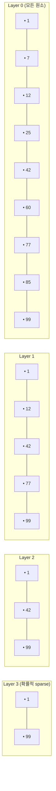

## 정의

**Redis Sorted Set (ZSet)** 은 *멤버 + 점수 (score)* 의 *순서 보존 unique 집합*. *score 기준 정렬* + *멤버 기준 O(1) 조회* 가 *동시에* 가능한 *하이브리드 자료구조*.

내부적으로 **skiplist + hash (dict) 동시 유지**:

- **skiplist**: score 기준 *O(log N) 범위 검색 / 랭킹*
- **dict**: 멤버 → score 의 *O(1) 조회*

활용:

- **리더보드 (Leaderboard)**: score 가 점수
- **타임라인**: score 가 timestamp
- **우선순위 큐**: score 가 우선순위
- **Sliding window rate limiter**: score 가 timestamp + ZREMRANGEBYSCORE
- **스케줄러**: score 가 *실행 시각 UnixMillis*

> [!IMPORTANT]
> Redis 의 *가장 강력한 자료구조*. *순서 + atomic 갱신 + 범위 + 랭킹* 이 *한 자료구조* 안에. 다른 KV store 가 흉내 못 내는 *Redis 의 핵심 정체성*.

## 내부 구조: Skiplist + Dict

```anim:bbst
{}
```

> 위는 *Balanced BST* 의 동작 직관. Skiplist 도 *유사한 log-time 검색 / 삽입* 성질을 *확률적으로* 달성.

### Skiplist 의 구조



각 *원소가 layer 에 등록될 확률* 은 *코인 토스* (`p=0.25` Redis 기본). 평균적으로 *log_4(N)* 레이어. *검색 / 삽입 / 삭제 모두 평균 O(log N)*.

### 왜 Skiplist (Red-Black Tree 가 아니라)?

antirez 가 선택한 이유 (Redis 소스 주석 + 인터뷰):

| 항목 | Skiplist | Red-Black Tree |
|---|---|---|
| 구현 복잡도 | *간단* | 복잡 (rotation, color) |
| 캐시 친화성 | *낫다* (linked list 의 linear scan) | 보통 |
| 범위 쿼리 | *자연* (linked list 의 next pointer) | 별도 처리 필요 |
| 메모리 (포인터) | *조금 더 큼* | 약간 적음 |
| Lock 없는 동시성 | 가능 | 어렵다 |

> Range query (`ZRANGEBYSCORE`) 가 *시퀀스 next 의 단순 산책* 이라는 점이 *결정적*.

### Dict + Skiplist 의 *이중 자료구조*


- **`ZADD key score member`**: dict 와 skiplist *둘 다* 갱신
- **`ZSCORE key member`**: dict 에서 *O(1)*
- **`ZRANGE`, `ZRANGEBYSCORE`, `ZRANK`**: skiplist 에서 *O(log N + k)*

### Listpack 인코딩 (작은 ZSet)

```conf
zset-max-listpack-entries 128
zset-max-listpack-value 64
```

작은 ZSet 은 *flat 배열* (member, score, member, score...). 128 항목 이하면 *skiplist + dict 의 오버헤드를 회피*.

## 핵심 명령

### 기본

```bash
ZADD board 100 alice 85 bob 70 charlie
ZADD board NX 90 alice            # *없을 때만* 추가
ZADD board XX 95 alice            # *있을 때만* 갱신
ZADD board GT 80 alice            # 기존보다 *크면만* (Redis 6.2+)
ZADD board INCR 5 alice           # score += 5 (= ZINCRBY)

ZSCORE board alice                # 점수 조회
ZMSCORE board alice bob charlie   # 여러 멤버 동시 (Redis 6.2+)

ZCARD board                       # 멤버 수
ZCOUNT board 80 100               # score 범위 안의 멤버 수
ZINCRBY board 10 alice            # score += 10
```

### 범위 조회 (Top-K, 페이지네이션)

```bash
ZRANGE board 0 9                          # 점수 낮은 순 10개
ZRANGE board 0 9 REV                      # 점수 높은 순 10개 (= ZREVRANGE)
ZRANGE board 0 9 WITHSCORES               # 점수 포함

# Score 범위
ZRANGEBYSCORE board 80 100 LIMIT 0 10
ZRANGE board 80 100 BYSCORE LIMIT 0 10    # Redis 6.2+ 통합 문법

# Lex 범위 (같은 score 일 때 알파벳 정렬 활용)
ZRANGEBYLEX events:2026-06-25 "[ap" "[at" LIMIT 0 10

ZRANK board alice                         # 순위 (낮은 순)
ZREVRANK board alice                      # 순위 (높은 순)
```

### Pop (우선순위 큐)

```bash
ZPOPMIN schedule 1                # 가장 작은 score 1개 pop
ZPOPMAX board 1                    # 가장 큰 score 1개
BZPOPMIN schedule 0                # 블록 (큐가 비면 대기)
BZPOPMAX board 5                   # 5초 대기

ZMPOP 2 schedule:high schedule:low MIN COUNT 5    # 여러 키 중 한 곳 (Redis 7+)
```

### 집합 연산

```bash
ZUNION 2 board:europe board:asia AGGREGATE SUM
ZINTER 2 board:europe board:asia AGGREGATE MIN

ZUNIONSTORE result 2 board:europe board:asia
ZINTERSTORE result 2 board:europe board:asia WEIGHTS 1 0.5

# 8.8 의 새 COUNT aggregator
ZUNION 2 board:europe board:asia AGGREGATE COUNT
```

### 삭제 / 잘라내기

```bash
ZREM board charlie
ZREMRANGEBYSCORE board -inf 50              # 50 이하 전부
ZREMRANGEBYRANK board 0 -101                # 끝에서 100개만 남기고 자름
```

## 활용 패턴

### 1. 리더보드 (전형)

```bash
# 점수 갱신
ZADD leaderboard:2026-06 INCR 10 user:42

# Top 10
ZRANGE leaderboard:2026-06 0 9 REV WITHSCORES

# 내 순위와 점수
ZREVRANK leaderboard:2026-06 user:42
ZSCORE leaderboard:2026-06 user:42

# 내 주변 사람 (앞뒤 5명)
my_rank = ZREVRANK leaderboard:2026-06 user:42      # 예: 247
ZRANGE leaderboard:2026-06 (242) (252) REV WITHSCORES
```

### 2. 우선순위 큐

```anim:priority-queue
{}
```

```bash
ZADD jobs:queue 1 urgent-job-1     # priority 1 = 가장 빨리
ZADD jobs:queue 5 normal-job-1
ZADD jobs:queue 10 low-job-1

# 가장 우선순위 높은 거 pop (작은 score)
ZPOPMIN jobs:queue 1

# 워커: 큐가 빌 때까지 대기
BZPOPMIN jobs:queue 0
```

### 3. 타임라인 (timestamp = score)

```bash
ZADD timeline:user:42 $(date +%s) "tweet:1234"
ZADD timeline:user:42 $(date +%s) "tweet:1235"

# 최근 50개
ZRANGE timeline:user:42 0 -1 REV LIMIT 0 50

# 24시간 이전 항목 정리
ZREMRANGEBYSCORE timeline:user:42 -inf $(($(date +%s) - 86400))
```

### 4. Sliding Window Rate Limiter

```python
def allow(r, user_id: str, max_req: int, window_s: int) -> bool:
    key = f"rate:{user_id}"
    now = time.time()
    pipe = r.pipeline()
    # 윈도우 밖 제거
    pipe.zremrangebyscore(key, 0, now - window_s)
    pipe.zcard(key)
    pipe.zadd(key, {f"{now}-{uuid()}": now})
    pipe.expire(key, window_s + 1)
    _, count, _, _ = pipe.execute()
    return count < max_req
```

> [!TIP]
> *정확한 sliding window* 가 *한 ZSet* 에. token bucket / fixed window 보다 정확하다. 비용은 *모든 요청을 ZSet 에 기록* 이라 트래픽 큰 곳은 *Lua 한 호출* 로 줄여야 한다.

### 5. 스케줄러 (Sidekiq scheduled queue)

```bash
# 5분 뒤 실행
ZADD schedule $(($(date +%s) + 300)) "job:1234"

# 워커 폴링: 지금 시점 이전 (=실행 대기 완료) job 들 옮기기
ZRANGEBYSCORE schedule -inf $(date +%s)         # 대상 조회
ZREMRANGEBYSCORE schedule -inf $(date +%s)      # 일괄 제거

# 또는 ZRANGESTORE 로 atomic 이동
ZRANGESTORE due schedule -inf $(date +%s) BYSCORE
DEL schedule:due
```

## 성능 표

| 명령 | 복잡도 |
|---|---|
| `ZADD`, `ZREM`, `ZSCORE`, `ZINCRBY`, `ZCARD` | O(log N) |
| `ZRANGE (k)` | O(log N + k) |
| `ZRANGEBYSCORE (k)` | O(log N + k) |
| `ZRANK` | O(log N) |
| `ZPOPMIN`, `ZPOPMAX` | O(log N) |
| `ZUNIONSTORE` | O((N+M) log(N+M)) |
| `ZINTERSTORE` | O(N * log(N)) (큰 것부터 우선) |
| `ZSCAN` | amortized O(N) |

> [!CAUTION]
> *ZUNIONSTORE / ZINTERSTORE* 는 *입력 ZSet 의 크기 합* 에 비례. 큰 ZSet 들의 합집합은 *single thread 차단* 위험.

## 메모리 비교

10만 멤버 + score, 자료형별:

<ChartJs
  client:visible
  type="bar"
  title="10만 멤버 + score, 자료형별 메모리 (직관)"
  caption="Sorted Set 의 *skiplist + dict* 이중 자료구조 비용은 인정. 그 대가가 *순서 + 랭킹 + 범위* 의 한 줄."
  height="240px"
  data={{
    labels: ['ZSet (listpack, ≤128)', 'ZSet (skiplist+dict)', 'Hash (member→score)', 'List + 매번 정렬'],
    datasets: [
      {
        label: '메모리 (MB)',
        data: [0.04, 11, 6, 4],
        backgroundColor: ['#22c55e', '#3b82f6', '#f59e0b', '#ef4444'],
      },
    ],
  }}
  options={{
    scales: { y: { type: 'logarithmic', title: { display: true, text: 'MB (log)' } } },
    plugins: { legend: { display: false } },
  }}
/>

> 메모리 만으로 보면 Hash 가 적지만, *순위 / 범위* 조회를 *클라이언트 정렬* 로 하면 *매번 N log N*. ZSet 이 *operation 비용을 통째로 가져가는* 가치.

## Skiplist vs Java TreeMap / SkipListMap

```anim:java-skiplist-map
{}
```

```anim:java-treemap-rbtree
{}
```

> Java 표준 라이브러리의 ConcurrentSkipListMap 과 TreeMap (Red-Black Tree) 비교. Redis 의 ZSet 은 *Skiplist 방식* 에 가깝다.

## 흔한 함정

> [!WARNING]
> 1. **`ZRANGE` 의 큰 범위** = O(log N + k). k 가 클 때 *single thread 차단*. *LIMIT* 필수.
> 2. **`ZUNIONSTORE` 의 큰 집합** = 분당 한 번 같은 *어쩌다 한 번* 만. 트래픽 path 에 두면 위험.
> 3. **score 의 부동소수 정밀도** = `9999999999999999` 같은 큰 정수는 정밀도 손실. 큰 정수 score 가 필요하면 *둘로 분할*.
> 4. **`ZADD INCR` + `NX/XX`** = INCR 와 NX 는 *동시 사용 가능*. *없을 때만 0 으로 만들고 증가* 같은 패턴.

## 김신건의 현장 메모

- *Sidekiq scheduled queue* 가 *전부 ZSet*. score = *실행 시각 unix ms*. 워커가 *주기적 ZRANGEBYSCORE + ZREMRANGEBYSCORE* 로 *due jobs* 를 가져온다.
- *리더보드* 의 *친구 N명 비교* 는 *별도 ZSet 으로 친구 score 복제* 하는 게 *fan-out write* 의 *전형*. *읽기 폭발 < 쓰기 복제*.
- *Sliding window rate limiter* 는 *정확한* 트래픽 제어가 필요한 곳에 *한 줄로 정확*. *고트래픽 경로* 에는 *Lua 한 호출* 로 *3 RTT → 1 RTT* 압축.
- *Redis 8.8 의 `ZUNION ... COUNT`* 는 *교집합 size* 가 *집합 자체보다 빨리 필요할 때* (예: *공통 친구 수* 만 보여주기) *명령 한 줄*.

## 관련 위키

- [[Redis]] (자료구조 카탈로그)
- [[Redis Sets]] (순서 불필요할 때의 대안)
- [[Redis Streams]] (시간 순 영속 로그 대안)
- [[Redis Cache Patterns]] (rate limiter / scheduler 패턴)
- [[Sidekiq]] (scheduled queue 운영)

## 참고

- 공식: [Sorted Sets](https://redis.io/docs/latest/develop/data-types/sorted-sets/)
- Pugh 원논문: [Skip Lists](https://www.epaperpress.com/sortsearch/download/skiplist.pdf)
- Redis 구현: [t_zset.c](https://github.com/redis/redis/blob/unstable/src/t_zset.c)
