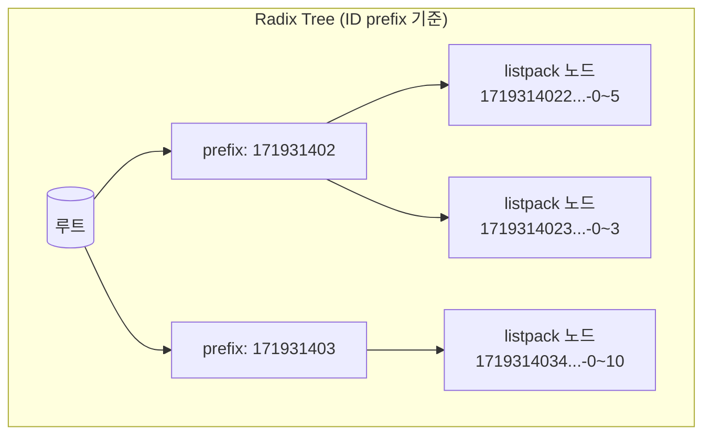
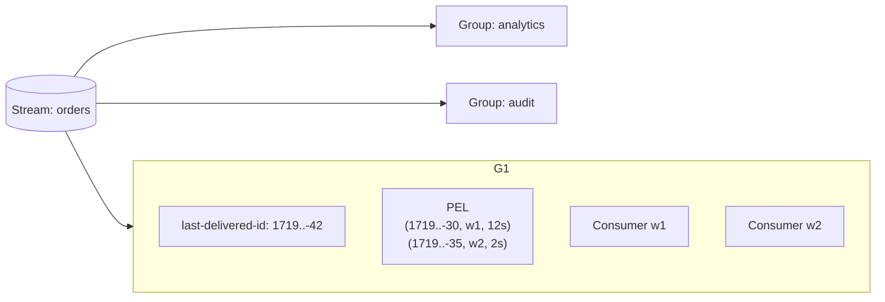
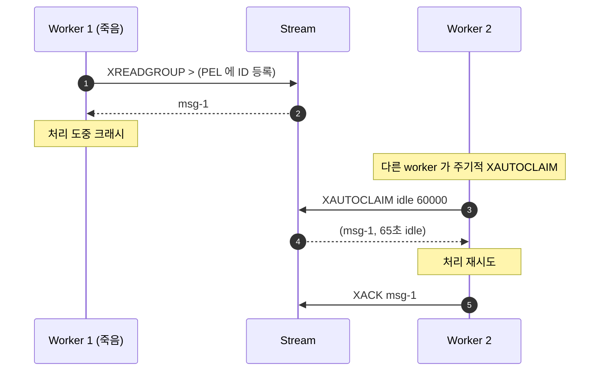

## 정의

**Redis Stream** 은 *append-only 로그* 자료구조. *시간 순서가 보존되는 영속 메시지 시퀀스* + *consumer group 으로 작업 분배*. Kafka 의 *Redis 친화 버전* 으로 자주 비유.

큐 관점은 [[Redis Pub Sub vs Streams]] 가 다룬다. 이 페이지는 *내부 자료구조 / ID 체계 / Consumer Group 내부 상태* 에 집중.

> [!IMPORTANT]
> Streams 는 Redis 5.0 (2018) 의 *가장 큰 자료구조 신규*. 이전엔 *List + 별도 cursor 추적* 으로 흉내 내던 패턴들이 *자료구조로 일등 시민화*.

## Stream ID 의 구조

`<millisTime>-<sequence>` 형태의 ID. 같은 ms 안의 다중 메시지를 *sequence* 로 구분.

```bash
XADD chat:42 * user "alice" body "hi"
# → "1719314022417-0"

XADD chat:42 * user "bob" body "hello"
# → "1719314022417-1"   ← 같은 ms

# 명시 ID
XADD chat:42 1719314023000-5 user "carol" body "test"
```

규칙:

- `*` = *자동 (현재 시각 + 증가 sequence)*.
- 명시 ID 는 *반드시 마지막 ID 보다 커야* 한다 (`XADD` 에러).
- *시간 역행* 으로부터 보호 (NTP 조정 등).

> [!TIP]
> ID 의 *ms 부분* 이 *적당히 큰 cardinality* 의 *압축* 에 맞춰져 있다 ─ radix tree 노드가 *같은 prefix ID 들* 을 *한 listpack 으로 묶을 수* 있다.

## 내부 자료구조



| 자료구조 | 역할 |
|---|---|
| **Radix tree** | ID prefix 로 *log time* 검색 (Patricia trie 변형) |
| **Listpack 노드** | 실제 메시지들 (필드/값 packed) |
| **Consumer Group dict** | group 이름 → group 상태 |
| **PEL (Pending Entries List)** | group 별 *delivered 후 ACK 안 된 메시지 ID + consumer + idle ms* |

> [!NOTE]
> *Radix tree* 라는 선택은 ID 가 *시간 prefix 공유* 한다는 점에 *최적*. *Range 쿼리 (XRANGE)* 가 *연속된 listpack 의 직선 산책*.

## XADD 와 트리밍

```bash
XADD chat:42 * user alice body hi

# 자동 trim
XADD chat:42 MAXLEN 100000 * user alice body hi          # 정확히 10만개로
XADD chat:42 MAXLEN ~ 100000 * user alice body hi        # 근사 (효율적!)
XADD chat:42 MINID ~ 1719300000000 * user alice body hi  # ID 이하 제거
```

| Trim 옵션 | 동작 |
|---|---|
| `MAXLEN N` | 정확히 N 개 (느림, 노드 분할 발생) |
| `MAXLEN ~ N` | *근사* (listpack 노드 단위, 빠름) |
| `MINID id` | ID 이하 제거 |
| `MINID ~ id` | 근사 |

> [!CAUTION]
> `MAXLEN` (정확) 은 *listpack 노드를 쪼개야* 해서 *O(N) 도 가능*. 운영에서는 *항상* `MAXLEN ~ N` (근사).

## Consumer Group: 자료구조 측면



각 group 의 상태:

- `last-delivered-id`: *다음 `>` 호출이 가져올 시작점*
- `PEL` (Pending Entries List): *consumer 가 받았지만 ACK 안 한* 메시지들의 *<ID, consumer, idle time, delivery count>*

### `>` vs ID 의 의미

```bash
XREADGROUP GROUP shipping w1 COUNT 10 STREAMS orders >
# > = "아직 이 group 에 전달되지 않은 새 메시지"

XREADGROUP GROUP shipping w1 COUNT 10 STREAMS orders 0
# 0 또는 특정 ID = "이 ID 이후 *PEL 안의 메시지* 만 다시 보냄"
# (재시도 / crash 복구용)
```

→ `> ` 로 *새 일* 받고, *ID 명시* 로 *내가 처리 못 끝낸 옛 일* 다시 보기.

## Consumer 흐름의 시각

```anim:queue
{}
```

> 위는 *큐의 일반 동작*. Consumer Group 의 *XREADGROUP → 처리 → XACK* 도 같은 직관이지만 *PEL 이라는 별도 보관소* 가 *crash safety* 를 추가한다.

```anim:microtask-queue-detail
{}
```

> JavaScript microtask 큐의 *다단 처리* 직관. *Streams 의 multi-consumer group* 도 *각 group 이 독립 큐* 라는 점에서 비슷한 직관.

## XPENDING / XCLAIM / XAUTOCLAIM

처리 중 *consumer 가 죽어도* *다른 consumer 가 회수*.

```bash
# 미완 (PEL) 요약
XPENDING orders shipping
# 1) 5 (총 미완 수)
# 2) "1719..-30" (가장 작은 ID)
# 3) "1719..-50" (가장 큰 ID)
# 4) consumer 별 분포

# 상세 (idle > 60s 인 5개)
XPENDING orders shipping IDLE 60000 - + 5

# 다른 consumer 가 회수 (수동)
XCLAIM orders shipping w2 60000 1719..-30

# 자동 (Redis 6.2+)
XAUTOCLAIM orders shipping w2 60000 0 COUNT 10
```



> [!IMPORTANT]
> *Sidekiq 의 reliable fetch* 와 같은 보장. 차이는 *PEL 이 자료구조 안에 정식 구성요소* 라는 점.

## 8.x 신규 명령

| 명령 | 의미 |
|---|---|
| `XDELEX` *(8.2)* | 지정 ID *삭제 + PEL 정리* 한 번에 |
| `XACKDEL` *(8.2)* | ACK + DEL 한 호출 |
| `XNACK` *(8.8)* | consumer 가 *명시적으로 release* (다시 delivery 가능) |

> [!TIP]
> `XACKDEL` 은 *consumer 가 ACK 와 동시에 stream 길이 절약* 이 가능. *immediate trimming 워크로드* 에 유용.

## XINFO: 운영 가시성

```bash
XINFO STREAM orders FULL          # 전체 상태
XINFO GROUPS orders               # group 별
XINFO CONSUMERS orders shipping   # consumer 별
```

```bash
XINFO GROUPS orders
# 1) 1) "name"
#    2) "shipping"
#    3) "consumers"
#    4) (integer) 3
#    5) "pending"
#    6) (integer) 12         ← PEL 길이
#    7) "last-delivered-id"
#    8) "1719314022417-42"
#    9) "lag"                ← 새 메시지와의 차이
#   10) (integer) 5
```

## 외부 정렬: 시간 순 보장

```anim:external-merge-sort
{}
```

> Stream 안의 *시간 순 유지* 는 *ID 의 단조 증가* 가 보장. *클라이언트 시계 어긋남* 같은 *외부 정렬 압력* 도 *XADD 의 ID 검증* 으로 흡수.

## 성능 표

| 명령 | 복잡도 |
|---|---|
| `XADD` | O(log N) (radix tree insertion) |
| `XLEN` | O(1) |
| `XRANGE`, `XREVRANGE` (k 개) | O(log N + k) |
| `XREAD` (k 개) | O(log N + k) |
| `XREADGROUP` (k 개) | O(log N + k + PEL update) |
| `XACK` (k 개) | O(k * log N) |
| `XTRIM MAXLEN ~ N` | O(N) *근사 trimming* |
| `XAUTOCLAIM` | O(N + log M) |

## 메모리 / 길이 비교 (10만 메시지)

<ChartJs
  client:visible
  type="bar"
  title="10만 메시지 (각 ~64B), 자료구조별 메모리"
  caption="Stream 의 radix tree + listpack 은 *작은 메시지가 많을 때* 가장 효율."
  height="240px"
  data={{
    labels: ['Stream', 'List + 별도 cursor', 'Sorted Set (ts=score)', 'Hash + List index'],
    datasets: [
      {
        label: '메모리 (MB)',
        data: [9.5, 14, 22, 18],
        backgroundColor: ['#22c55e', '#3b82f6', '#ef4444', '#f59e0b'],
      },
    ],
  }}
  options={{
    scales: { y: { title: { display: true, text: 'MB' }, beginAtZero: true } },
    plugins: { legend: { display: false } },
  }}
/>

## 흔한 함정

> [!WARNING]
> 1. **`MAXLEN` (정확)** = O(N) 가능, *주기적 정리는 항상 `~`*.
> 2. **PEL 의 무한 누적** = `XACK` 누락 시 *PEL 이 무한* 으로. *주기적 XAUTOCLAIM* 으로 정리.
> 3. **`>` 와 ID 명시의 혼동** = `>` 는 *새 일*, 명시 ID 는 *PEL 의 옛 일*. 둘을 섞으면 *예상 외 동작*.
> 4. **Stream 도 *복제 비동기*** = primary 실패 시 *최근 XADD 일부 손실 가능*. 영속 보장에는 *AOF + replica* 와 *애플리케이션 idempotency* 가 한 셋.

## 김신건의 현장 메모

- *이벤트 소싱 + Stream* 조합으로 *Audit log + 다중 projection* 을 *한 인프라* 로 운영. *audit / search index / metric* 이 각자 *consumer group*.
- *Sidekiq 을 Streams 로 다시 짜려는 시도* 는 매번 *호환성과 운영 도구* (sidekiq-web 등) 의 벽에 부딪힌다. *기존 큐 = List*, *새 시스템 = Streams* 의 *공존* 이 현실적.
- *XAUTOCLAIM 의 주기* 가 *너무 짧으면* *처리 중인데 빼앗기는* 현상. *처리 평균 시간 + 충분한 마진* (예: 60초) 으로.
- *XINFO STREAM FULL* 은 *큰 stream 에서 무거움*. 모니터링 / 알람은 *GROUPS / CONSUMERS* 만으로.

## 관련 위키

- [[Redis]] (자료구조 카탈로그)
- [[Redis Pub Sub vs Streams]] (큐 관점 비교)
- [[Redis Sorted Sets]] (timestamp 인덱스 대안)
- [[Redis Lists]] (전통 큐)

## 참고

- 공식: [Streams](https://redis.io/docs/latest/develop/data-types/streams/)
- 소스: [t_stream.c](https://github.com/redis/redis/blob/unstable/src/t_stream.c)
