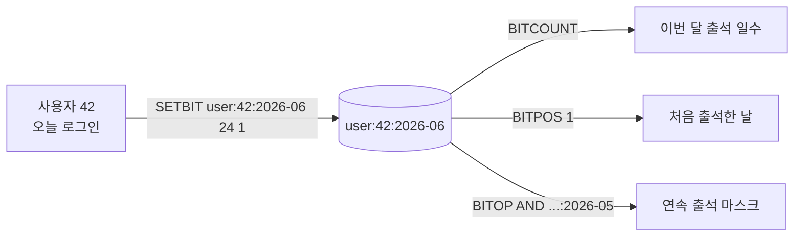

## 정의

**Redis String** 은 *binary-safe* 한 *바이트 열*. 최대 *512 MB*. *문자열만이 아니라* 정수, 부동소수, 직렬화된 객체, *비트맵 (Bitmap)*, *패킹된 정수 (Bitfield)*, 심지어 *작은 이미지* 까지 같은 자료형 하나에 담는다.

내부적으로 [SDS (Simple Dynamic String)](https://github.com/antirez/sds): *길이 + alloc + flags + 본문* 구조. *strlen()* 이 O(1), *append* 가 *amortized O(1)*.

> [!IMPORTANT]
> Redis 에서 *"String"* 은 *"바이트열" 이라는 단일 컨테이너*. 정수 카운터, 비트 플래그, 캐시된 객체, base64 이미지, *모두 동일 자료형*. *MEMcached 와 가장 비교되는 부분이자* Redis 의 *원형*.

## 핵심 명령 (요약)

| 카테고리 | 명령 | 의미 |
|---|---|---|
| 기본 | `SET key val [EX s|PX ms|NX|XX]`, `GET`, `DEL`, `EXISTS` | 기본 CRUD |
| 만료 | `EXPIRE`, `TTL`, `PERSIST`, `EXPIREAT` | TTL 관리 |
| 정수 | `INCR`, `INCRBY`, `DECR`, `DECRBY`, `INCRBYFLOAT` | atomic 카운터 |
| 범위 | `SETRANGE`, `GETRANGE`, `APPEND`, `STRLEN` | 부분 조작 |
| 캐시 패턴 | `GETEX`, `GETDEL`, `SETNX`, `MSET`, `MGET`, `MSETNX` | 다양한 조합 |
| 새 hash 친화 (Redis 8) | `HGETEX`, `HSETEX`, `HGETDEL` | 동일 패턴 hash 버전 |

## 사용 패턴

### 1. 카운터 (가장 흔함)

원자적 증가가 *Redis 의 가장 큰 셀링 포인트*. *single-thread event loop* 덕에 *경쟁 없이* atomic.

<CodeWithOutput
  language="bash"
  label="redis-cli"
  outputLanguage="text"
  outputLabel="응답"
  title="페이지 뷰 카운터"
  code={`INCR pageviews:home
INCR pageviews:home
INCRBY pageviews:home 5
GET pageviews:home
EXPIRE pageviews:home 86400
TTL pageviews:home`}
  output={`(integer) 1
(integer) 2
(integer) 7
"7"
(integer) 1
(integer) 86399`}
/>

### 2. 캐시 (TTL + GET/SET)

```bash
SET user:42 '{"name":"koa","tier":"pro"}' EX 600
GET user:42
GETEX user:42 EX 60      # 가져오면서 TTL 갱신 (touch)
GETDEL user:42           # 가져오면서 삭제 (once-token 패턴)
```

> [!TIP]
> `GETEX` 는 *세션 활성도 갱신*, `GETDEL` 은 *one-time token / OTP 소비* 의 *atomic 한 줄*.

### 3. 분산 락 토큰 (`SET NX EX`)

자세한 건 [[Redis Distributed Lock]] 참고. 핵심은 *한 명령으로 NX + EX 동시*.

```bash
SET lock:order:42 uuid-abc NX PX 30000
```

### 4. 객체 저장 (JSON / msgpack 직렬화)

Hash 와의 *결정점*:

| 저장 방식 | 적합 |
|---|---|
| String + JSON | *전체 갱신* 위주, *작은 객체*, *언어 호환성 중요* |
| Hash + field | *필드별 갱신* 위주, *큰 객체*, *부분 GET 자주* |

> [!NOTE]
> *부분 갱신이 거의 없으면* String + JSON 이 *더 단순하고 빠르다*. *Hash 가 무조건 객체용* 이라는 통념은 *맞지 않음*.

## Bitmap: String 의 강력한 두번째 얼굴

String 의 *각 비트* 를 *0/1* 로 다룬다. *플래그 / 활성 사용자 / 출석* 같은 *대규모 boolean 집합* 의 *메모리 최적* 표현.

```bash
SETBIT user:active:2026-06-25 42 1     # 42번 사용자 활성
SETBIT user:active:2026-06-25 99 1
GETBIT user:active:2026-06-25 42       # 1
GETBIT user:active:2026-06-25 50       # 0

BITCOUNT user:active:2026-06-25        # 활성 수
BITPOS user:active:2026-06-25 1        # 첫 활성 위치
```

### Bitmap 시각화

```anim:bitmap-or-scan
{}
```

> 위 애니메이션은 *BITCOUNT/BITOP* 류 명령이 *바이트 단위 OR/POPCOUNT* 로 *순회* 하는 직관을 보여준다.

### 다중 비트맵 OR/AND

```bash
# 6/24 와 6/25 *둘 다* 활성인 사용자
BITOP AND user:active:both \
  user:active:2026-06-24 user:active:2026-06-25

# 7일 중 한 번이라도 활성
BITOP OR user:active:week \
  user:active:2026-06-19 user:active:2026-06-20 \
  user:active:2026-06-21 user:active:2026-06-22 \
  user:active:2026-06-23 user:active:2026-06-24 \
  user:active:2026-06-25

BITCOUNT user:active:week              # 7일 unique active
```

> [!IMPORTANT]
> Redis 8.2+ 의 `BITOP` 에 *새 연산자* 가 추가되었다. *복잡한 bitmap 워크플로* 가 *한 명령으로 가능*.

### 메모리 비용 비교 (1억 사용자)

<ChartJs
  client:visible
  type="bar"
  title="1억 사용자 daily active 추적, 데이터 구조별 메모리"
  caption="Bitmap 은 사용자 ID 가 *조밀한 정수* 일 때 가장 효율. ID 가 sparse 하면 HyperLogLog 가 답."
  height="240px"
  data={{
    labels: ['Set (string IDs)', 'Set (integer IDs)', 'Bitmap', 'HyperLogLog'],
    datasets: [
      {
        label: '추정 메모리 (MB)',
        data: [3000, 800, 12, 0.012],
        backgroundColor: ['#ef4444', '#f59e0b', '#3b82f6', '#22c55e'],
        borderWidth: 0,
      },
    ],
  }}
  options={{
    scales: {
      y: {
        type: 'logarithmic',
        title: { display: true, text: 'MB (log scale)' },
      },
    },
    plugins: { legend: { display: false } },
  }}
/>

> Bitmap 은 *1억 비트 = 12.5 MB*. 사용자 ID 가 *조밀* 한 경우 *압도적*. ID 가 *sparse* (예: UUID) 면 [[Redis HyperLogLog Geo]] 의 HLL 로.

### 출석 체크 패턴



```python
def mark_attendance(uid: int, year: int, month: int, day: int, r):
    key = f"user:{uid}:{year:04d}-{month:02d}"
    r.setbit(key, day - 1, 1)
    r.expire(key, 86400 * 60)   # 두 달 보관

def attendance_count(uid, year, month, r):
    return r.bitcount(f"user:{uid}:{year:04d}-{month:02d}")
```

## Bitfield: 정수 패킹

`BITFIELD` 는 *하나의 String 안에서* *여러 비트 폭의 정수* 를 *동시에 조작*. *세분화된 게임 통계* 같은 *작은 정수 묶음* 에 유용.

```bash
# 8비트 unsigned 두 개를 한 자리에
BITFIELD mystats SET u8 #0 80 SET u8 #1 200
BITFIELD mystats GET u8 #0 GET u8 #1
# → 80, 200

# 16비트 signed 카운터 atomic 증가
BITFIELD counters INCRBY i16 #0 5
BITFIELD counters INCRBY i16 #0 5
BITFIELD counters GET i16 #0
# → 10

# OVERFLOW 정책
BITFIELD counters OVERFLOW WRAP INCRBY i8 #0 200    # 8-bit 범위 wrap
BITFIELD counters OVERFLOW SAT INCRBY i8 #0 200     # max 에서 saturate
BITFIELD counters OVERFLOW FAIL INCRBY i8 #0 200    # 넘으면 nil
```

| 타입 | 의미 | 폭 |
|---|---|---|
| `u<N>` | unsigned | 1~63 |
| `i<N>` | signed | 1~64 |

> [!TIP]
> 한 게임 캐릭터의 *level / hp / mp / gold* 등 *작은 정수 4-8개* 를 *한 키* 에 *packed* 로 저장하면 *Hash 보다 메모리/속도 모두 우수*.

## 인코딩 (내부)

Redis 는 *값의 크기/형태* 에 따라 *자동 인코딩*:

| 인코딩 | 조건 |
|---|---|
| `int` | `SET key 42` 같이 *long 범위 정수* |
| `embstr` | <= 44 바이트 (RobJ + SDS 가 하나의 메모리 블록) |
| `raw` | 그 외 |

```bash
SET counter 42
OBJECT ENCODING counter
# "int"

SET name "Alice"
OBJECT ENCODING name
# "embstr"

SET payload "$(head -c 100 /dev/urandom | base64)"
OBJECT ENCODING payload
# "raw"
```

> [!NOTE]
> *embstr* 은 *단일 메모리 할당* 이라 *cache locality 가 좋다*. *45 바이트 이하* 의 *짧은 값* 이 *예상보다 빠른* 이유.

## 흔한 함정

> [!WARNING]
> 1. **`SET key val EX 0`** = TTL 미설정, 영구. 의도와 반대. *항상 `EX > 0`* 확인.
> 2. **큰 값 (예: 10 MB) 의 GET** = *single thread* 가 *해당 시간 동안 모든 명령* 을 *블록*. *작은 단위* 로 분할.
> 3. **INCR 의 overflow** = 64-bit signed 한도 초과 시 *에러*. *세션 카운터* 처럼 *오래 누적* 되는 키는 *주기적 리셋* 필요.
> 4. **`INCRBYFLOAT` 의 정밀도** = 부동소수 정밀도 한계. *돈 / 잔액* 은 *정수 (센트 단위)* 와 `INCRBY` 로.

## 김신건의 현장 메모

- *분 단위 카운터* (광고 노출 같은) 는 `INCR key:2026062512` + `EXPIRE 86400` 패턴이 *디스크 부담 0 으로 분 단위 집계*. *분 → 시간 → 일* 로 *백그라운드 aggregator* 가 옮긴다.
- *Bitmap 출석 체크* 는 hera-webapp 의 *학생 출석 통계* 에 *최적의 메모리 / 속도 조합*. 1 학기 = 1 키, *과목 출석 누적* 도 BITOP AND.
- *Bitfield 의 OVERFLOW SAT* 는 *게임 통계* 의 *max 값 캡* 을 *DB 트리거 없이* 처리. *Sat-counter* 라는 *반도체 분야 패턴* 의 응용.
- *String + JSON* 으로 *작은 객체 저장* 이 *Hash 보다 빠른* 경우가 의외로 많다. *부분 갱신* 이 *드물면* String + JSON 이 *심플 + 빠름*.

## 관련 위키

- [[Redis]] (라이센스 / 신 기능 인덱스)
- [[Redis Hashes]] (객체 저장의 대안)
- [[Redis Sorted Sets]] (정렬 카운터)
- [[Redis HyperLogLog Geo]] (sparse ID 의 cardinality)
- [[Redis Cache Patterns]] (캐시로서의 String)

## 참고

- 공식: [Strings](https://redis.io/docs/latest/develop/data-types/strings/), [Bitmaps](https://redis.io/docs/latest/develop/data-types/bitmaps/), [Bitfields](https://redis.io/docs/latest/develop/data-types/bitfields/)
- SDS: [github.com/antirez/sds](https://github.com/antirez/sds)
