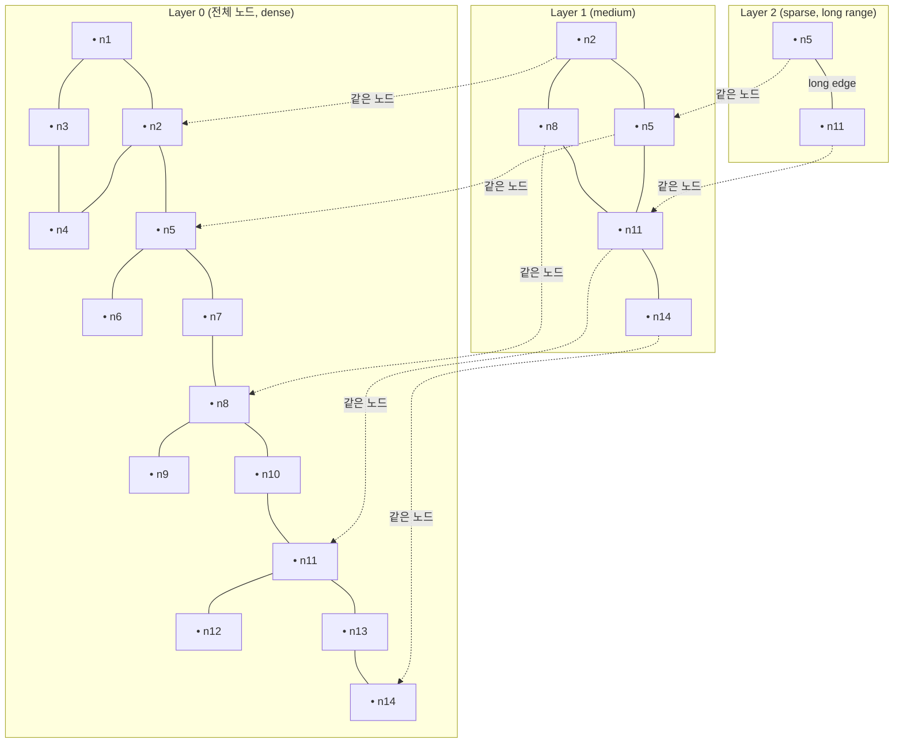
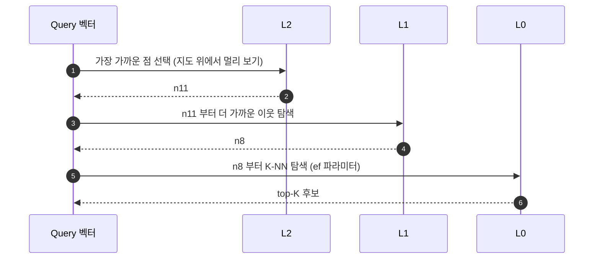
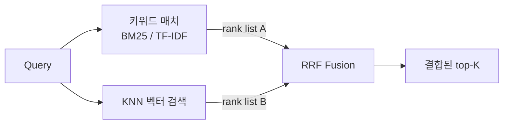
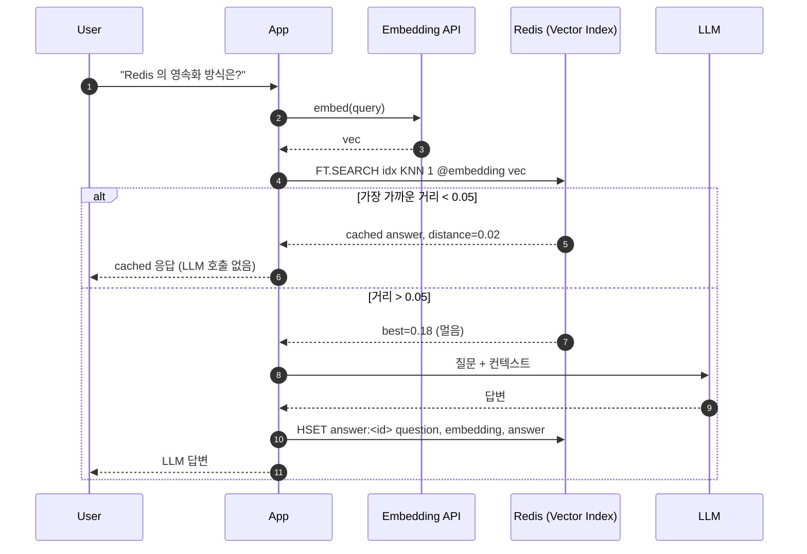

## 정의

**Vector Search** 는 *임베딩 벡터의 거리/유사도* 기준으로 *근접한 K 개* 를 찾는 검색. Redis 는 *RediSearch* 모듈 (Redis 8 부터는 *코어*) 과 *Valkey Search* 양쪽에서 *HNSW / FLAT / SVS-VAMANA* 인덱스를 제공한다.

LLM 시대의 *de facto* 사용처:

1. **Semantic Cache**: 비슷한 질문에 *기존 답변 재사용* → LLM 비용 절감.
2. **RAG (Retrieval-Augmented Generation)**: 문서 청크의 벡터 검색 → 컨텍스트 주입.
3. **Conversation / Agent Memory**: 과거 대화의 *의미 검색* 으로 *관련 turn* 만 prompt 에.
4. **Hybrid Search**: 키워드 + 의미 + 메타데이터 *한 쿼리* 로.

## 인덱스 종류

| 알고리즘 | 정확도 | 속도 | 메모리 | Redis/Valkey 지원 |
|---|---|---|---|---|
| `FLAT` | *exact* (brute force) | 느림 (O(N)) | 작음 | 둘 다 |
| `HNSW` | *approximate*, 99%+ recall 가능 | 빠름 (O(log N)) | 큼 (그래프 노드 + 링크) | 둘 다 |
| `SVS-VAMANA` | approximate, HNSW 대비 *메모리/속도 균형* | 빠름 | 중간 | Redis 8.2+ |

### Recall vs Latency (직관)

<ChartJs
  client:visible
  type="scatter"
  title="Recall vs Latency (가상 벤치마크 직관)"
  caption="HNSW 는 ef 파라미터로 조절 가능. SVS-VAMANA 는 HNSW 와 비슷한 곡선에 메모리 효율."
  height="320px"
  data={{
    datasets: [
      {
        label: 'FLAT (정확, 느림)',
        data: [{ x: 100, y: 320 }],
        backgroundColor: '#ef4444',
        pointRadius: 8,
      },
      {
        label: 'HNSW (ef=10)',
        data: [{ x: 78, y: 1.2 }],
        backgroundColor: '#3b82f6',
        pointRadius: 8,
      },
      {
        label: 'HNSW (ef=64)',
        data: [{ x: 95, y: 3.4 }],
        backgroundColor: '#3b82f6',
        pointRadius: 8,
      },
      {
        label: 'HNSW (ef=256)',
        data: [{ x: 99, y: 12.0 }],
        backgroundColor: '#3b82f6',
        pointRadius: 8,
      },
      {
        label: 'SVS-VAMANA',
        data: [{ x: 96, y: 2.1 }, { x: 98, y: 4.5 }, { x: 99, y: 9.2 }],
        backgroundColor: '#22c55e',
        pointRadius: 7,
      },
    ],
  }}
  options={{
    scales: {
      x: { title: { display: true, text: 'Recall (%)' }, min: 70, max: 100 },
      y: { title: { display: true, text: '쿼리 지연 (ms)' }, type: 'logarithmic' },
    },
  }}
/>

## HNSW: Hierarchical Navigable Small World

HNSW 는 *작은 세계 (Small World)* 그래프를 *계층적* 으로 쌓아 *log-time greedy search* 를 가능하게 한다.



### 탐색 (Greedy Search):



### 핵심 파라미터

| 파라미터 | 의미 | 트레이드오프 |
|---|---|---|
| `M` | 각 노드의 *이웃 수* | 큼 = 정확도 ↑, 메모리 / 빌드 시간 ↑ |
| `ef_construction` | 빌드 시 *후보군 크기* | 큼 = 정확도 ↑, 빌드 시간 ↑ |
| `ef_runtime` | 쿼리 시 *후보군 크기* | 큼 = 정확도 ↑, 지연 ↑ |

## SVS-VAMANA (Redis 8.2+)

[Intel SVS](https://github.com/intel/ScalableVectorSearch) + [Microsoft DiskANN VAMANA](https://github.com/microsoft/DiskANN) 의 결합. *상위 노드 그래프 단일 레이어 + 양방향 sparse 연결* 로 *HNSW 의 메모리 오버헤드* 를 줄이면서 비슷한 정확도.

| 특성 | HNSW | SVS-VAMANA |
|---|---|---|
| 그래프 레이어 | 다층 | 단층 |
| 메모리 (vs HNSW) | 기준 | *약 60-70%* |
| 빌드 속도 | 기준 | 비슷 또는 빠름 |
| Query 속도 | 빠름 | 비슷 |
| Filtered search | 가능 | *우수* (저자 클레임) |

Redis 8.2 의 `FT.HYBRID` 와 함께 *2026 시점 Redis 의 벡터 검색 기본 권장*.

## 인덱스 생성과 검색

### Hash 기반

<CodeWithOutput
  language="bash"
  label="redis-cli"
  outputLanguage="text"
  outputLabel="OK"
  title="HNSW 인덱스 + KNN 검색"
  code={`FT.CREATE idx ON HASH PREFIX 1 doc:
  SCHEMA
    title TEXT
    tag TAG
    embedding VECTOR HNSW 6
      TYPE FLOAT32
      DIM 1536
      DISTANCE_METRIC COSINE

HSET doc:1 title "Redis 8 release" tag "backend"
   embedding "\\x12\\x34\\x56\\x78..."   # 1536 dim FLOAT32 binary

FT.SEARCH idx "*=>[KNN 10 @embedding $vec AS score]"
  PARAMS 2 vec "\\x12\\x34..."
  DIALECT 2
  RETURN 3 title tag score`}
  output={`OK
1
1) 10
2) "doc:1"
3) 1) "score"
   2) "0.0024"
   3) "title"
   4) "Redis 8 release"
   5) "tag"
   6) "backend"
...`}
/>

### JSON 기반

```bash
FT.CREATE jidx ON JSON PREFIX 1 jdoc:
  SCHEMA
    $.content AS content TEXT
    $.tag AS tag TAG
    $.embedding AS embedding VECTOR SVS-VAMANA 6
      TYPE FLOAT32
      DIM 1536
      DISTANCE_METRIC COSINE

JSON.SET jdoc:1 $ '{"content":"...", "tag":"backend", "embedding":[0.1, 0.2, ...]}'
```

## Hybrid Search: 키워드 + 벡터 + 메타데이터

`FT.HYBRID` (Redis 8.2+) 는 *키워드 점수와 벡터 점수* 를 *RRF (Reciprocal Rank Fusion)* 로 결합:

```
FT.HYBRID idx
  TEXT "redis cluster slot"
  KNN 50 @embedding $vec
  PARAMS 2 vec ...
  RETURN 2 title score
  RRF 60
```



> [!TIP]
> RAG 에서 *키워드 매치 + 의미 검색* 을 *별도로 호출하고 클라이언트에서 결합* 하는 시대는 끝났다. 한 호출로 *충분히 빠르고 정확*.

## Semantic Cache (LLM 비용 절감)

같은 의미의 질문은 *임베딩 거리가 가깝다*. 임계값 (예: 코사인 거리 < 0.05) 이하면 *기존 답변 재사용*.



### 비용 절감 직관

가상 워크로드에서 *cache hit rate 별 LLM 호출 비용 절감*:

<ChartJs
  client:visible
  type="line"
  title="Semantic Cache hit rate vs 월간 LLM 비용 (직관, $1000 기준)"
  caption="실제 hit rate 는 *유사 질문 분포* 에 의존. FAQ 위주 챗봇은 40~70% 도 가능."
  height="280px"
  data={{
    labels: ['0%', '10%', '20%', '30%', '40%', '50%', '60%', '70%', '80%'],
    datasets: [
      {
        label: '월간 LLM 비용 ($)',
        data: [1000, 900, 800, 700, 600, 500, 400, 300, 200],
        borderColor: '#3b82f6',
        backgroundColor: 'rgba(59, 130, 246, 0.1)',
        borderWidth: 2.5,
        tension: 0.2,
        fill: true,
      },
    ],
  }}
  options={{
    scales: {
      y: { title: { display: true, text: '비용 ($)' }, beginAtZero: true },
      x: { title: { display: true, text: 'Semantic Cache hit rate' } },
    },
  }}
/>

## 메모리 비용 계산

벡터 인덱스 비용은 *벡터 자체 + 그래프 연결*. 대략:

```
HNSW 메모리 ≈ N × (dim × byte_per_dim + M × 8 × layers)
```

| 데이터 | DIM | 타입 | 노드 수 N | 추정 메모리 |
|---|---|---|---|---|
| OpenAI text-embedding-3-small | 1536 | FLOAT32 | 100K | ~ 0.6 GB |
| Cohere embed-multilingual | 1024 | FLOAT32 | 100K | ~ 0.4 GB |
| OpenAI text-embedding-3-large | 3072 | FLOAT32 | 1M | ~ 12 GB |
| Voyage rerank-1 | 1024 | FLOAT32 | 10M | ~ 40 GB |

> [!WARNING]
> *수억 벡터* 면 *Redis 메모리만으로* 부담. *FLAT 인덱스 + 디스크 미러* (DiskANN 류) 또는 *Pinecone / Milvus / Weaviate* 같은 *디스크 친화 벡터 DB* 가 더 적합.

## Vector Set (Redis 8): 새 데이터 구조

antirez 가 *직접 설계* 한 Redis 8 의 *별도 데이터 구조* (RediSearch 와 별개). 첫 *Redis-native primitive*.

```bash
VADD myset elem1 0.1 0.2 0.3 ...
VADD myset elem2 0.15 0.18 0.25 ...
VSIM myset 0.12 0.22 0.28 ... COUNT 10
VLINKS myset elem1
```

| 명령 | 의미 |
|---|---|
| `VADD key elem vector...` | 벡터 추가 |
| `VSIM key vector... COUNT k` | 가까운 k 개 |
| `VLINKS key elem` | 이웃 그래프 노드 |
| `VREM key elem` | 제거 |

> *경량 KV API* 처럼 다룰 수 있다는 점이 *벡터 셋* 의 본질. 풀 *FT.HYBRID* 가 필요 없는 *간단한 KNN* 시나리오에 적합.

## 활용 시나리오 비교

| 시나리오 | 데이터량 | 권장 |
|---|---|---|
| Semantic cache (질문 ~ 만 단위) | 작음 | *Vector Set* 또는 HNSW |
| RAG (문서 청크 수십만 ~ 백만) | 중간 | *HNSW + Hybrid* |
| 사진 검색 / 추천 (수억 벡터) | 큼 | *전용 벡터 DB* (Pinecone, Milvus, Vespa) 또는 SVS-VAMANA + 디스크 미러 |
| 에이전트 메모리 (대화 turn 수만) | 작음 | *Streams + Vector Index* 조합 |

## 김신건의 현장 메모

- *역량 리포트* 같은 *세션/대화 기반* 환경에서 *Redis 8 의 Vector Set + Streams* 조합으로 *agent memory* 를 *프로토타입 → 본 프로덕션* 까지 *Redis 한 인프라* 로 갈 수 있다.
- *Hybrid search* (FT.HYBRID) 는 *RAG 정확도의 가장 빠른 손*. 단순 KNN 만으로는 *최근 문서* 가 *키워드 매치* 보다 *벡터 거리* 가 가까워 *오답* 인 경우가 잦다.
- *Semantic cache 임계값 결정* 은 *측정으로*. 일반적으로 *코사인 거리 0.02 ~ 0.08* 사이가 시작점. *너무 낮으면 hit rate ↓*, *너무 높으면 잘못된 cache hit*.
- *managed Valkey* 의 *vector search* 가 *2026 시점* 에서 *AWS / GCP 모두 GA*. *Redis 8 의 vector set* 은 *self-hosted* 가 더 자연스럽다.

## 관련 위키

- [[Redis]] (라이센스 / 신 기능)
- [[Redis Cache Patterns]] (semantic cache 의 일반 캐시 패턴 부분)
- [[Redis Cluster]] (벡터 인덱스의 분산)
- [[LLM RAG]] (벡터 DB 가 RAG 의 한 컴포넌트)

## 참고

- 공식: [RediSearch Vectors](https://redis.io/docs/latest/develop/interact/search-and-query/advanced-concepts/vectors/)
- Valkey Search 1.2: [valkey.io/blog/valkey-search-1_2](https://valkey.io/blog/valkey-search-1_2/)
- HNSW paper: [arxiv.org/abs/1603.09320](https://arxiv.org/abs/1603.09320)
- DiskANN: [github.com/microsoft/DiskANN](https://github.com/microsoft/DiskANN)
- Agent memory 사례: [valkey.io/blog/ai-agent-memory-with-valkey-and-mem0](https://valkey.io/blog/ai-agent-memory-with-valkey-and-mem0/)
