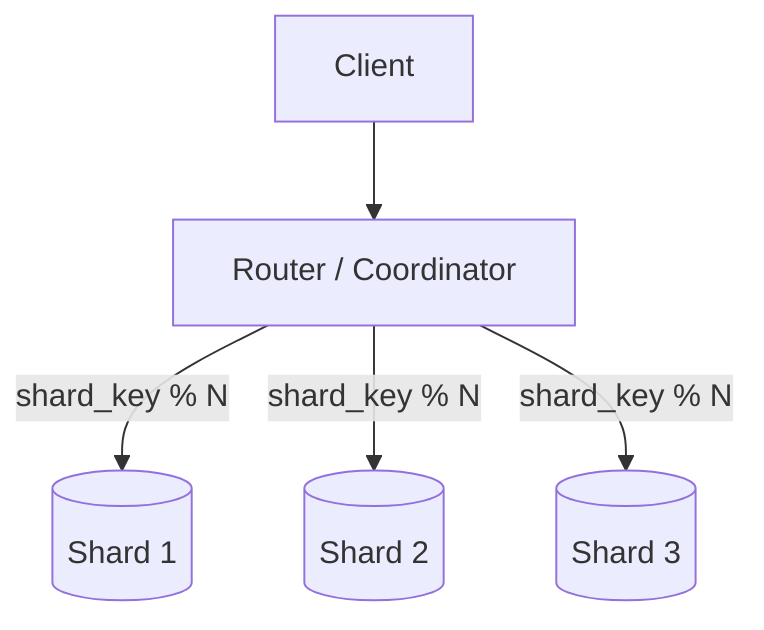
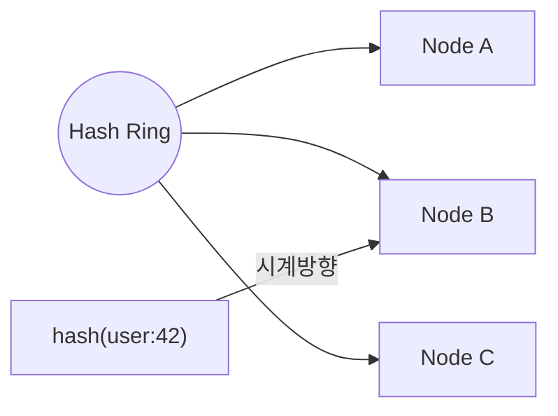
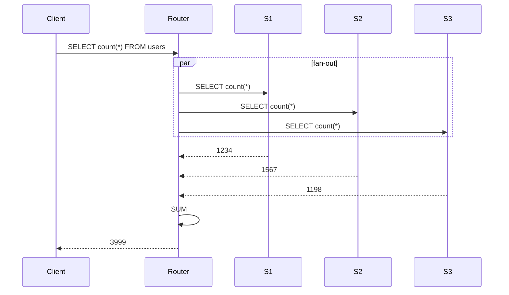
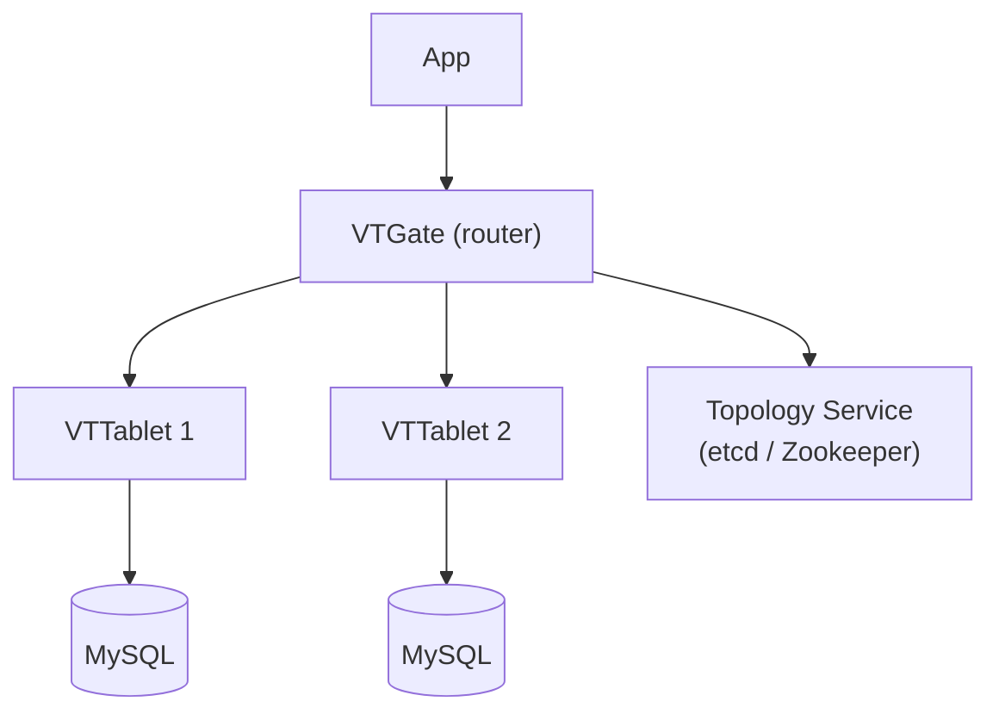
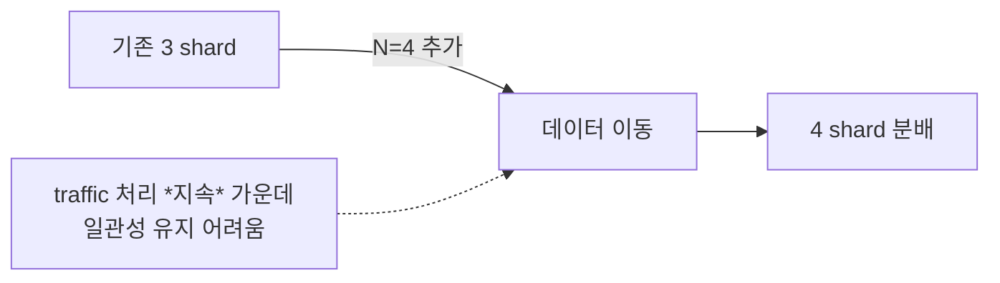

## 정의

| | Partitioning | Sharding |
|---|---|---|
| 범위 | *한 DB 안* | *여러 DB 노드* |
| 목적 | 큰 테이블 관리 | 수평 확장 (write/storage) |
| 투명성 | DB 가 처리 | 보통 *애플리케이션 인지* |
| 예 | PostgreSQL `PARTITION BY` | Citus, Vitess, MongoDB |

> 둘 다 *"데이터를 여러 조각으로 나눈다"*. *경계* 가 *DB 노드 안인지 밖인지* 차이.

## Partitioning (한 DB 안)

```sql
-- PostgreSQL: 시간 기준 range partition
CREATE TABLE events (
  id BIGSERIAL,
  created_at TIMESTAMPTZ,
  body JSONB
) PARTITION BY RANGE (created_at);

CREATE TABLE events_2026_06 PARTITION OF events
  FOR VALUES FROM ('2026-06-01') TO ('2026-07-01');

CREATE TABLE events_2026_07 PARTITION OF events
  FOR VALUES FROM ('2026-07-01') TO ('2026-08-01');
```

| 종류 | 의미 |
|---|---|
| **Range** | 시간, 숫자 범위 |
| **List** | 미리 정한 값 (region 등) |
| **Hash** | 해시 (균등 분포) |

장점:

- *큰 테이블 → 작은 partition* (VACUUM, index 작음)
- *오래된 partition drop* = 빠른 보관 정리
- *partition pruning* = WHERE 조건이 partition 키면 *그것만 스캔*

## Sharding (여러 DB 노드)



### Shard Key 선택

| 키 선택 | 결과 |
|---|---|
| `user_id` hash | *고른 분포*, 한 user 가 한 shard |
| `created_at` range | hot shard (최근만 트래픽) |
| `tenant_id` | *멀티 테넌트*. 큰 테넌트 = hot |
| `geographic` | data residency |

> [!IMPORTANT]
> Shard key 는 *바꾸기 어렵다*. *모든 query 가 shard key 포함 가능한지* 먼저 검토.

### Consistent Hashing

자세한 건 [[Load Balancer]] 의 consistent hashing 절.



*노드 추가/제거 시 N/M 만 재분배*. *Cassandra, DynamoDB, Redis Cluster* 의 토대.

## Cross-shard Query 의 비용



| 쿼리 | 비용 |
|---|---|
| `WHERE shard_key = X` | *1 shard* |
| `WHERE shard_key IN (X, Y)` | 2 shard |
| `WHERE other_field = ...` | *전 shard fan-out* |
| `JOIN` cross-shard | *매우 비쌈* (피하기) |
| `GROUP BY` cross-shard | *router 가 merge* |

> [!CAUTION]
> *대부분 쿼리가 shard key 포함 안 됨* = 디자인 실패. shard key 결정 *전에* access pattern 정의.

## Vitess (MySQL sharding) 아키텍처



- *YouTube* 가 만들고 기여.
- *MySQL 호환* (Vitess client 가 *MySQL 프로토콜*).
- *re-sharding 자동화*.

## Citus (PostgreSQL extension)

```sql
SELECT create_distributed_table('events', 'user_id');
SELECT create_reference_table('countries');   -- 모든 노드 복제
```

- PostgreSQL 의 *extension* 으로 동작.
- *PG 의 모든 기능 + sharding*.
- *Microsoft Azure Cosmos DB for PostgreSQL* 이 기반.

## 다른 sharding 전략

| 전략 | 의미 |
|---|---|
| **Hash-based** | hash(key) % N. 균등하지만 *N 변경 어려움* |
| **Range-based** | 키 범위. *hot shard 위험* |
| **Directory-based** | lookup table. *유연 + 단일 장애* |
| **Consistent hash** | hash ring. *N 변경 friendly* |

## Re-sharding

*shard 추가/제거 시 데이터 이동*. 가장 어려운 운영.



- *온라인 re-sharding* 은 *몇 주 ~ 몇 달* 운영.
- Vitess, Citus, MongoDB 가 *자동 도구 제공*.
- *수동 sharding (애플리케이션 레벨)* 은 *매우 고통*.

## 흔한 함정

> [!WARNING]
> 1. **Sharding 너무 일찍** = 운영 비용 폭증. *수직 확장 + replica* 가 *수십 TB 까지* 가능.
> 2. **Cross-shard transaction** = *2PC* 또는 *saga* 필요. 비용 큼.
> 3. **Hot shard 무시** = 한 노드만 100% CPU. shard key 재선택 필요.
> 4. **Partition pruning 작동 안 함** = partition key 가 WHERE 에 없으면 *모든 partition 스캔*.

## 관련 위키

- [[postgresql]], [[mysql-innodb]]
- [[dynamodb]], [[mongodb]]
- [[Load Balancer]] (consistent hashing)
- [[distributed-systems-consensus]]
