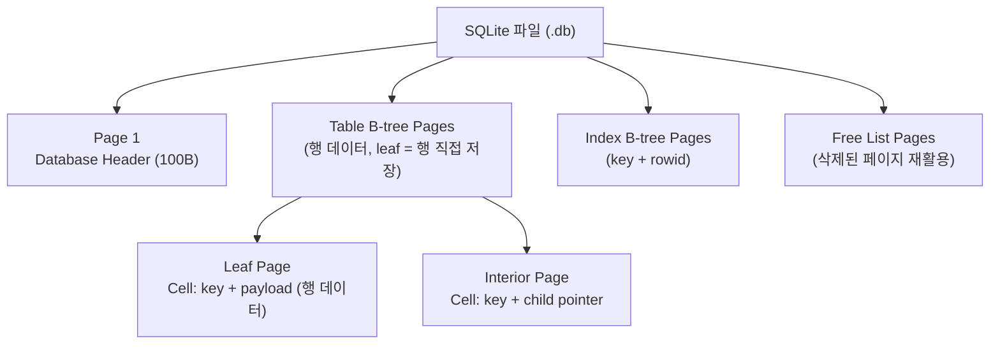
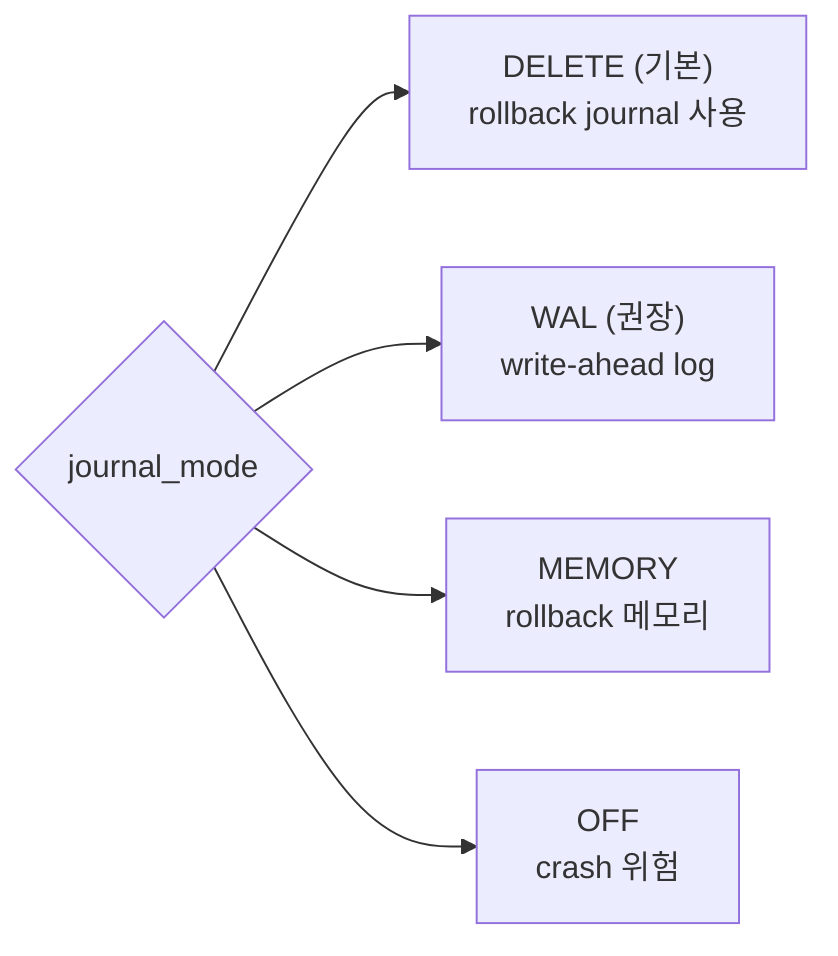
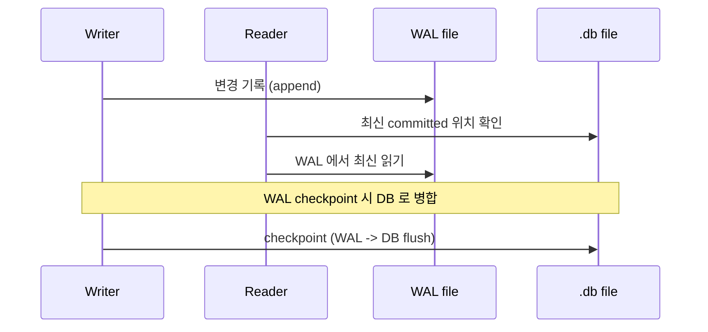
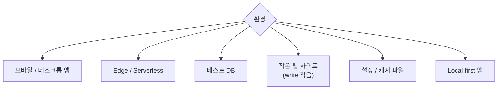
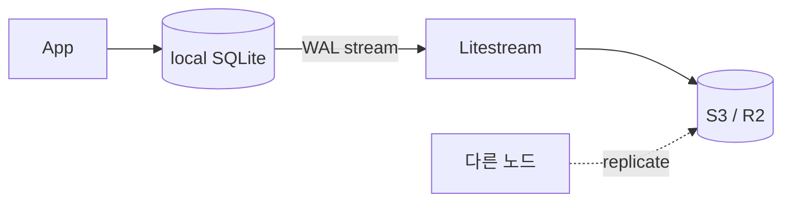

## 정의

**SQLite** 는 *세계에서 가장 많이 배포된 DB* (모든 스마트폰, 브라우저, OS). *서버 없이 라이브러리*, *단일 파일*, *zero-config*. *embedded* + *edge* 의 표준.

## 핵심 특성

| 항목 | SQLite |
|---|---|
| 구조 | 단일 파일 (`.db`) |
| 프로세스 | 없음 (앱 안 라이브러리) |
| 동시성 | *동시 reader 다수, writer 1개* |
| 트랜잭션 | ACID |
| 크기 | 라이브러리 ~600KB |
| SQL 표준 | 부분 (SQL-92 의 일부) |
| Type | *dynamic typing* (TYPE AFFINITY) |

## 스토리지 구조: B-tree Page

SQLite 파일 = *B-tree 페이지들의 배열*. 페이지 크기는 512 ~ 65536 bytes (기본 4096).



| 페이지 타입 | 내용 |
|---|---|
| Table B-tree leaf | 실제 행 데이터 (rowid + payload) |
| Table B-tree interior | rowid 범위 + child page 포인터 |
| Index B-tree leaf | indexed key + rowid |
| Freelist trunk/leaf | 삭제된 빈 페이지 목록 |

```sql
PRAGMA page_size;          -- 기본 4096
PRAGMA page_count;         -- 총 페이지 수
PRAGMA freelist_count;     -- 미사용 페이지 수
```

## Journal Mode



### WAL 모드 (운영 권장)

```bash
PRAGMA journal_mode=WAL;
PRAGMA synchronous=NORMAL;
```

| 모드 | reader vs writer | 동시성 |
|---|---|---|
| DELETE (기본) | writer 가 reader 막음 | 낮음 |
| WAL | *분리*. reader 가 옛 snapshot 봄 | *높음* |

> [!IMPORTANT]
> *프로덕션 SQLite 는 거의 항상 WAL*. 동시 reader 폭증.

### WAL 내부 동작



- *writer* 는 WAL 에 append → WAL 이 일정 크기 (`wal_autocheckpoint = 1000 pages`) 넘으면 checkpoint.
- *reader* 는 WAL + DB 를 *최신 commit 기준으로* 합쳐서 읽음.
- `-wal`, `-shm` 두 부속 파일이 생성됨.

## In-Memory DB

```python
import sqlite3

# 메모리 DB (프로세스 종료 시 사라짐)
conn = sqlite3.connect(":memory:")

# 공유 메모리 (동일 프로세스 내 여러 연결)
conn1 = sqlite3.connect("file:mydb?mode=memory&cache=shared", uri=True)
conn2 = sqlite3.connect("file:mydb?mode=memory&cache=shared", uri=True)
```

> *테스트 DB* 로 최적. `pytest` 등에서 각 테스트마다 격리된 인메모리 DB.

## FTS5 (Full-Text Search)

```sql
-- FTS5 가상 테이블 생성
CREATE VIRTUAL TABLE articles_fts USING fts5(
  title,
  body,
  content='articles',    -- content 테이블 (외부 content)
  content_rowid='id'
);

-- 동기화 트리거
CREATE TRIGGER articles_ai AFTER INSERT ON articles BEGIN
  INSERT INTO articles_fts(rowid, title, body)
  VALUES (new.id, new.title, new.body);
END;

-- 검색
SELECT rowid, rank
FROM articles_fts
WHERE articles_fts MATCH 'sqlite OR database'
ORDER BY rank;

-- 스니펫 하이라이트
SELECT snippet(articles_fts, 1, '<b>', '</b>', '...', 32)
FROM articles_fts
WHERE articles_fts MATCH 'query';
```

| FTS5 기능 | 설명 |
|---|---|
| BM25 랭킹 | 기본 정렬 (`rank` 컬럼) |
| `snippet()` | 매칭 부분 추출 |
| `highlight()` | 마킹 텍스트 |
| Porter stemmer | `tokenize="porter ascii"` |
| 접두어 쿼리 | `sqlite*` |

## JSON 지원 (JSON1 Extension)

```sql
-- JSON 컬럼
CREATE TABLE events (
  id INTEGER PRIMARY KEY,
  payload TEXT  -- JSON 문자열
);

-- JSON 함수
SELECT json_extract(payload, '$.user.name') AS name
FROM events
WHERE json_extract(payload, '$.type') = 'login';

-- JSON 경로 배열
SELECT json_each.value
FROM events, json_each(payload, '$.tags')
WHERE id = 1;

-- 3.38+ jsonb (binary JSON) 지원
SELECT jsonb_extract(payload, '$.amount') FROM orders;
```

> SQLite 3.38+ 부터 `jsonb` 함수로 *이진 JSON* 저장 + 파싱 비용 절감.

## 적합한 사용처



부적합:

- *write throughput* 큰 멀티 노드
- *cross-server 트랜잭션* 필요

## 옛 평가와 현재 (2026)

> "*SQLite 는 장난감*" 은 수년 전 평가.

| 옛 주장 | 현재 (2026) |
|---|---|
| writer 1개 | 1 writer 분 단위 1만 commit. 대부분 충분 |
| 백업 어려움 | Litestream, LiteFS, Turso 가 *실시간 streaming* |
| 분산 안 됨 | Turso (libSQL), Cloudflare D1 = *edge 분산* |
| 큰 쿼리 느림 | 인덱스 잘 박으면 PostgreSQL 비교 가능 |

## Litestream / LiteFS



- *실시간 streaming 백업* (1초 지연).
- *S3, GCS, ABS, R2* 어디든.
- 마치 *Postgres WAL streaming* 처럼.

## libSQL / Turso

- libSQL = SQLite fork. *async/await*, *embedded replica*, *vector search*.
- Turso = libSQL 의 *서버리스 클라우드*.
- 2026 시점 *edge DB 의 표준* 으로 빠르게 성장.

## 동시성: BEGIN IMMEDIATE

```sql
-- 기본 (DEFERRED): 첫 write 명령 시 lock 시도 → SQLITE_BUSY 위험
BEGIN;
SELECT ...;  -- shared lock
UPDATE ...;  -- exclusive lock 시도 → 다른 writer 와 충돌 가능
COMMIT;

-- IMMEDIATE: 시작 시 이미 write lock
BEGIN IMMEDIATE;
SELECT ...;
UPDATE ...;
COMMIT;
```

> [!TIP]
> *write 가 섞인 트랜잭션* 은 `BEGIN IMMEDIATE` 가 정통. *SQLITE_BUSY* 폭증을 막는다.

## Type Affinity (NUMERIC, INTEGER, REAL, TEXT, BLOB)

```sql
-- SQLite 는 dynamic typing. 컬럼 타입은 affinity hint.
CREATE TABLE t (id INTEGER, name TEXT);
INSERT INTO t VALUES ('not number', 42);   -- 동작 (STRICT 아닐 때)

-- 3.37+ STRICT 모드
CREATE TABLE t (id INTEGER, name TEXT) STRICT;
INSERT INTO t VALUES ('not number', 42);   -- ERROR
```

> [!CAUTION]
> *Production 은 STRICT 모드 권장*. 옛 SQLite 코드는 *implicit conversion* 으로 *조용한 버그*.

## Performance PRAGMA 치트시트

```sql
PRAGMA journal_mode = WAL;          -- 동시성 최대
PRAGMA synchronous = NORMAL;        -- 성능/안전 균형 (crash 시 WAL 손실 없음)
PRAGMA cache_size = -64000;         -- 64MB 페이지 캐시 (음수 = KB)
PRAGMA temp_store = MEMORY;         -- 임시 테이블 메모리
PRAGMA mmap_size = 268435456;       -- 256MB mmap I/O
PRAGMA optimize;                    -- 주기적 최적화 (분석/ANALYZE 유사)
PRAGMA wal_checkpoint(TRUNCATE);    -- WAL 수동 체크포인트
```

## 흔한 함정

> [!WARNING]
> 1. **WAL 모드 안 켬** = *writer 가 reader 막음*. 첫 운영 사고.
> 2. **`PRAGMA synchronous=OFF`** = crash 시 *DB 손상 가능*. NORMAL 이 권장 (성능 + 안전 균형).
> 3. **여러 프로세스가 같은 파일** = *NFS / 네트워크 파일시스템* 위에서 *lock 실패*. 로컬 디스크 필수.
> 4. **백업이 `cp file.db`** = *진행 중 쿼리* 때문에 *손상*. `sqlite3 .backup` 또는 Litestream.
> 5. **큰 트랜잭션 없이 1행씩 INSERT** = WAL fsync 오버헤드 폭발. *배치 트랜잭션* 으로 묶어야.
> 6. **WAL 부속 파일 (.wal, .shm) 별도 관리** = 반드시 .db 와 함께 백업/이동.

## 관련 위키

- [[postgresql]], [[mysql-innodb]]
- [[wal-write-ahead-log]]
- [[mvcc]]
