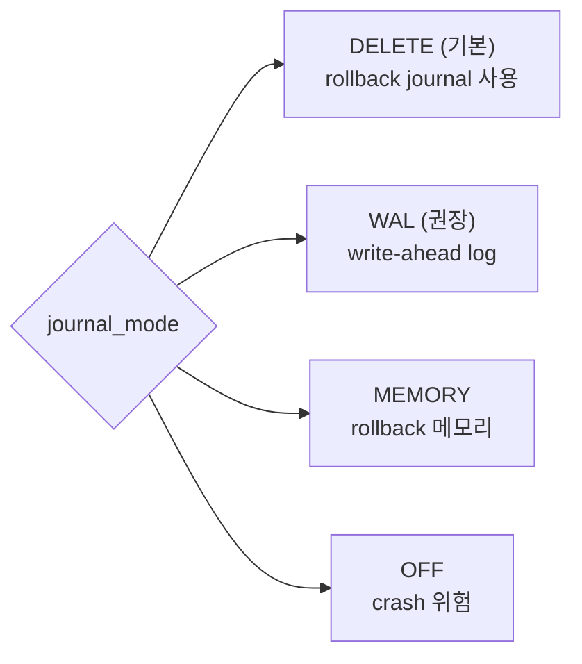
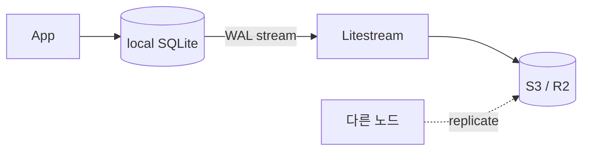

## 정의

**SQLite** 는 *세계에서 가장 많이 배포된 DB* (모든 스마트폰, 브라우저, OS). *서버 없이 라이브러리*, *단일 파일*, *zero-config*. *embedded* + *edge* 의 표준.

## 핵심 특성

| 항목 | SQLite |
|---|---|
| 구조 | 단일 파일 (`.db`) |
| 프로세스 | 없음 (앱 안 라이브러리) |
| 동시성 | *동시 reader 다수, writer 1개* |
| 트랜잭션 | ACID |
| 크기 | 라이브러리 ~600KB |
| SQL 표준 | 부분 (SQL-92 의 일부) |
| Type | *dynamic typing* (TYPE AFFINITY) |

## Journal Mode



### WAL 모드 (운영 권장)

```bash
PRAGMA journal_mode=WAL;
PRAGMA synchronous=NORMAL;
```

| 모드 | reader vs writer | 동시성 |
|---|---|---|
| DELETE (기본) | writer 가 reader 막음 | 낮음 |
| WAL | *분리*. reader 가 옛 snapshot 봄 | *높음* |

> [!IMPORTANT]
> *프로덕션 SQLite 는 거의 항상 WAL*. 동시 reader 폭증.

## 적합한 사용처

```mermaid
flowchart TD
    Q{환경}
    Q --> A[모바일 / 데스크톱 앱]
    Q --> B[Edge / Serverless]
    Q --> C[테스트 DB]
    Q --> D[작은 웹 사이트<br/>(write 적음)]
    Q --> E[설정 / 캐시 파일]
    Q --> F[Local-first 앱]
```

부적합:

- *write throughput* 큰 멀티 노드
- *cross-server 트랜잭션* 필요

## 옛 평가와 현재 (2026)

> "*SQLite 는 장난감*" 은 *수년 전 평가*.

| 옛 주장 | 현재 (2026) |
|---|---|
| writer 1개 | 1 writer * 분 단위 1만 commit. 대부분 충분 |
| 백업 어려움 | Litestream, LiteFS, Turso 가 *실시간 streaming* |
| 분산 안 됨 | Turso (libSQL), Cloudflare D1 = *edge 분산* |
| 큰 쿼리 느림 | 인덱스 잘 박으면 PostgreSQL 비교 가능 |

## Litestream / LiteFS



- *실시간 streaming 백업* (1초 지연).
- *S3, GCS, ABS, R2* 어디든.
- 마치 *Postgres WAL streaming* 처럼.

## libSQL / Turso

- libSQL = SQLite fork. *async/await*, *embedded replica*, *vector search*.
- Turso = libSQL 의 *서버리스 클라우드*.
- 2026 시점 *edge DB 의 표준* 으로 빠르게 성장.

## 동시성: BEGIN IMMEDIATE

```sql
-- 기본 (DEFERRED): 첫 write 명령 시 lock 시도 → SQLITE_BUSY 위험
BEGIN;
SELECT ...;  -- shared lock
UPDATE ...;  -- exclusive lock 시도 → 다른 writer 와 충돌 가능
COMMIT;

-- IMMEDIATE: 시작 시 이미 write lock
BEGIN IMMEDIATE;
SELECT ...;
UPDATE ...;
COMMIT;
```

> [!TIP]
> *write 가 섞인 트랜잭션* 은 `BEGIN IMMEDIATE` 가 정통. *SQLITE_BUSY* 폭증을 막는다.

## Type Affinity (NUMERIC, INTEGER, REAL, TEXT, BLOB)

```sql
-- SQLite 는 *dynamic typing*. 컬럼 타입은 *affinity hint*.
CREATE TABLE t (id INTEGER, name TEXT);
INSERT INTO t VALUES ('not number', 42);   -- 동작! (strict 모드 끄면)

-- 3.37+ STRICT 모드
CREATE TABLE t (id INTEGER, name TEXT) STRICT;
INSERT INTO t VALUES ('not number', 42);   -- 에러
```

> [!CAUTION]
> *Production 은 STRICT 모드 권장*. 옛 SQLite 코드는 *implicit conversion* 으로 *조용한 버그*.

## 흔한 함정

> [!WARNING]
> 1. **WAL 모드 안 켬** = *writer 가 reader 막음*. 첫 운영 사고.
> 2. **`PRAGMA synchronous=OFF`** = crash 시 *DB 손상 가능*. NORMAL 이 권장 (성능 + 안전 균형).
> 3. **여러 프로세스가 같은 파일** = *NFS / 네트워크 파일시스템* 위에서 *lock 실패*. 로컬 디스크 필수.
> 4. **백업이 `cp file.db`** = *진행 중 쿼리* 때문에 *손상*. `sqlite3 .backup` 또는 Litestream.

## 관련 위키

- [[postgresql]], [[mysql-innodb]]
- [[wal-write-ahead-log]]
- [[mvcc]]
