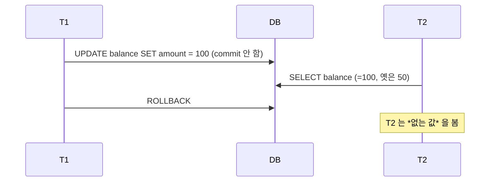
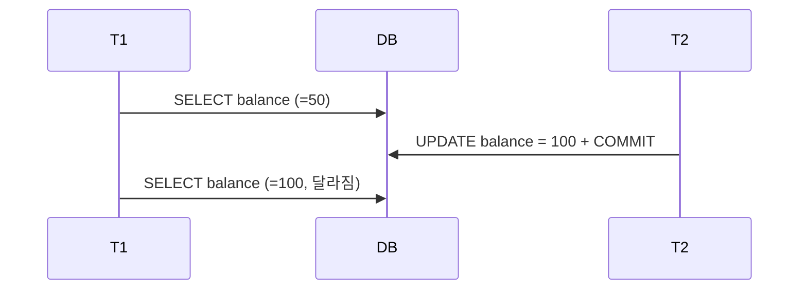
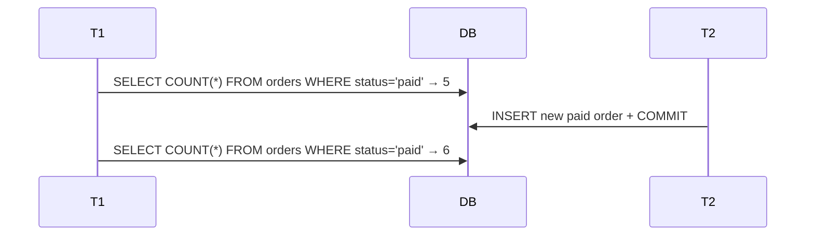
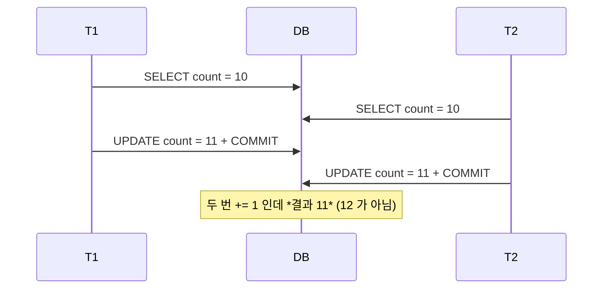
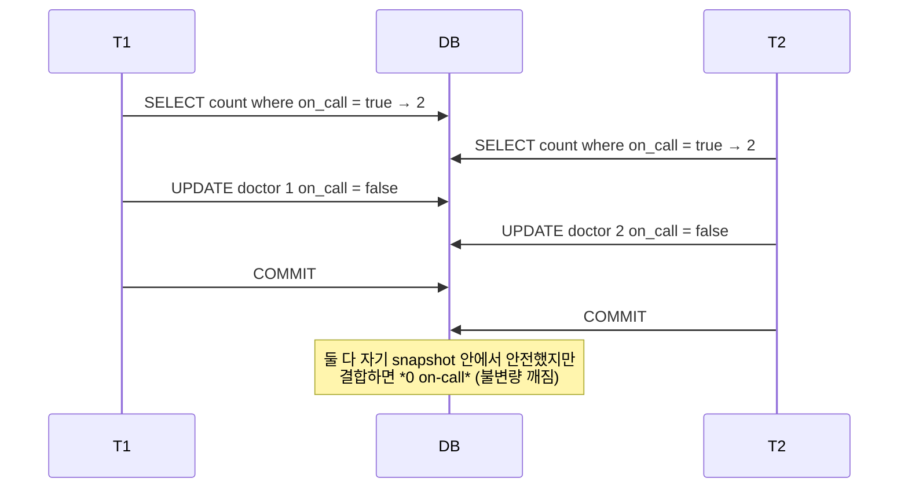
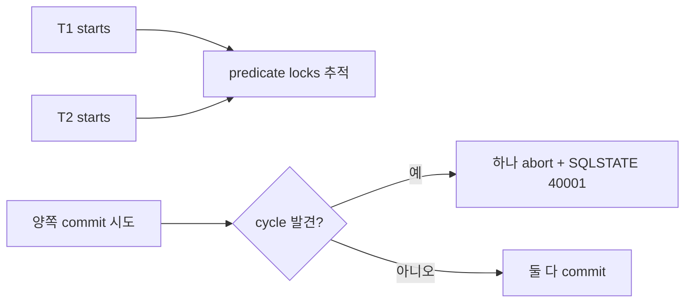

## 정의

**Transaction Isolation Level** = *동시 트랜잭션이 서로의 변경을 어디까지 볼 수 있는지*. ACID 의 *I*.

## 4 anomaly + 1 (lost update)

| Anomaly | 정의 |
|---|---|
| **Dirty Read** | 다른 tx 의 *commit 안 된 값* 읽음 |
| **Non-Repeatable Read** | 같은 쿼리 두 번 → 다른 결과 (UPDATE 영향) |
| **Phantom Read** | 같은 쿼리 두 번 → *새 row* (INSERT 영향) |
| **Lost Update** | 동시 UPDATE 중 하나 사라짐 |
| **Write Skew** (Snapshot 만) | 각자는 안전 같지만 *둘 결합* 시 불변량 깨짐 |

## ANSI SQL Level

| Level | Dirty | Non-Repeatable | Phantom | Lost Update | Write Skew |
|---|---|---|---|---|---|
| Read Uncommitted | 허용 | 허용 | 허용 | 허용 | 허용 |
| Read Committed | 방지 | 허용 | 허용 | 허용 | 허용 |
| Repeatable Read | 방지 | 방지 | (ANSI: 허용) | 가능 | 허용 |
| Serializable | 방지 | 방지 | 방지 | 방지 | 방지 |

## 실제 DB 의 기본 + 매핑

| DB | 기본 | 비고 |
|---|---|---|
| PostgreSQL | Read Committed | RR 는 *snapshot isolation* (SI), SS 는 *Serializable Snapshot Isolation* (SSI) |
| MySQL InnoDB | Repeatable Read | *next-key lock* 으로 phantom 도 방지 |
| Oracle | Read Committed | SS 는 SI |
| SQL Server | Read Committed | RCSI 옵션 |
| CockroachDB | Serializable | 기본부터 SS |

> [!IMPORTANT]
> 같은 *Repeatable Read* 라도 *실제 동작 다름*. *PostgreSQL RR vs MySQL RR* 의 phantom 동작이 *주요 차이*.

## Anomaly 시나리오

### 1. Dirty Read



### 2. Non-Repeatable Read



### 3. Phantom Read



### 4. Lost Update



해결:
- *비관적 lock*: `SELECT ... FOR UPDATE`
- *낙관적 lock*: `UPDATE ... WHERE version = X`
- *원자 연산*: `UPDATE counts SET n = n + 1`

### 5. Write Skew (SI 의 함정)

```sql
-- 의사 시나리오: 의사 2명이 *반드시 1명 이상 on-call*
T1: SELECT count(*) FROM doctors WHERE on_call = true;   -- 2
T1: UPDATE doctors SET on_call = false WHERE id = 1;

T2 (동시): SELECT count(*) FROM doctors WHERE on_call = true;   -- 2
T2: UPDATE doctors SET on_call = false WHERE id = 2;

-- COMMIT 둘 다 → 0 on-call (불변량 깨짐!)
```



> **Snapshot Isolation 만으로는 write skew 막지 못함**. PostgreSQL 의 *SERIALIZABLE (SSI)* 또는 *FOR UPDATE* 로 방지.

## PostgreSQL SSI

*Snapshot Isolation* 위에 *predicate lock 추적*. write skew 감지 시 *한 트랜잭션 abort*. 클라이언트가 retry 해야.



> [!TIP]
> SSI 는 *throughput 손해 적음 + 정확*. 단 *abort retry 코드* 필수. 운영 표준의 *고급 패턴*.

## 흔한 함정

> [!WARNING]
> 1. **Lock 으로 *모든* 동시성 문제 해결 시도** = 데드락 폭증. SSI / 낙관적 / 원자 연산 조합.
> 2. **`READ COMMITTED` 의 *변동값* 의존** = race condition. 트랜잭션 안에서도 *같은 쿼리 다른 결과*.
> 3. **`SERIALIZABLE` 만 박고 abort 처리 없음** = 부하 시 40001 폭증.
> 4. **MySQL `REPEATABLE READ` 의 *gap lock*** = 의도치 않은 *deadlock* 흔함. `SHOW ENGINE INNODB STATUS\G` 확인.

## 관련 위키

- [[mvcc]]
- [[postgresql]], [[mysql-innodb]]
- [[distributed-systems-distributed-transaction]]
