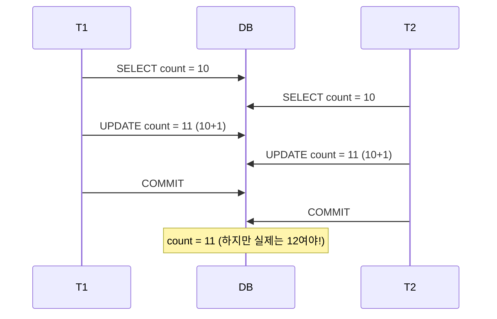
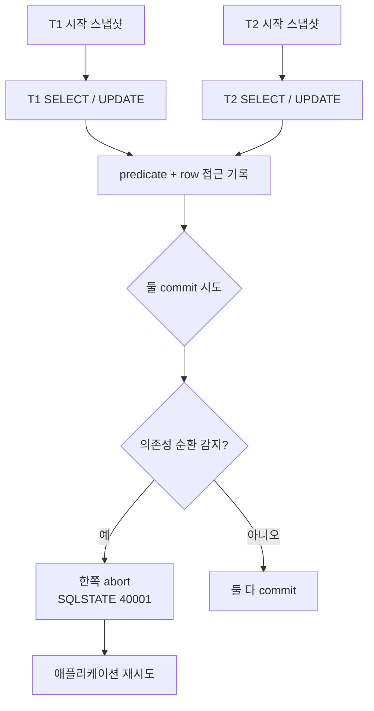

## 정의

**Transaction Isolation Level (트랜잭션 격리 수준)** = *동시에 실행되는 여러 트랜잭션이 서로의 변경을 어디까지 볼 수 있는지* 규정하는 수준. ACID 의 *I*.

격리 수준이 강할수록 *데이터 정합성*이 올라가지만 *동시성/처리량*이 떨어진다. 이 트레이드오프의 극단을 두 가지가 정의한다:

- 완전 직렬 실행 (queue) = 정합성 최상, 처리량 최하
- 완전 자유 병렬 = 처리량 최상, 정합성 파괴

DB 는 그 사이의 4단계 (ANSI SQL 표준) 를 제공한다.

## 왜 격리가 필요한가

동시성 없는 시스템은 없다. 서로 다른 트랜잭션이 같은 데이터를 건드릴 때 다음이 발생 가능:

- A 가 읽는 도중 B 가 쓴다 → A 는 어떤 값을 봐야 하나?
- A 가 쓰는 도중 B 도 쓴다 → 어떤 값이 남나?
- A 가 두 번 읽는 사이 B 가 쓴다 → A 의 두 결과가 달라도 되나?

격리 수준은 이 질문들에 대한 *DB 의 규칙*이다.

## 격리 수준 매트릭스 (한눈에)

```anim:tx-isolation-matrix
{}
```

## 4가지 이상 현상 (Phenomena)

ANSI SQL-92 는 3가지 이상 현상을 정의했고, Berenson et al. (1995) 이 2가지를 추가했다.

| 이상 | 정의 | 원인 | 최소 방지 수준 |
|---|---|---|---|
| **Dirty Read** | *커밋 안 된* 값을 읽음 | 다른 tx 의 미커밋 write 노출 | READ COMMITTED |
| **Non-Repeatable Read** | 같은 row 를 두 번 읽으면 다름 | 사이에 UPDATE + COMMIT | REPEATABLE READ |
| **Phantom Read** | 같은 WHERE 를 두 번 실행하면 row 개수 다름 | 사이에 INSERT + COMMIT | SERIALIZABLE (ANSI), 엔진마다 다름 |
| **Lost Update** | 두 UPDATE 중 하나가 사라짐 | read-modify-write 경쟁 | 낙관/비관 lock 또는 SSI |
| **Write Skew** | 각자는 안전하지만 결합 시 불변량 위반 | Snapshot 안에서 서로 다른 row 를 write | SERIALIZABLE |

> [!IMPORTANT]
> **Write Skew** 는 ANSI 표준에 없다. Berenson et al. 이 SI (Snapshot Isolation) 의 함정을 지적하며 도입한 개념. PostgreSQL SSI (9.1+) 가 이를 감지한다.

## 3가지 Read 이상 현상 시각화

```anim:tx-read-anomalies
{}
```

### 1. Dirty Read

**커밋되지 않은 값을 다른 트랜잭션이 읽는다.** 롤백되면 그 값은 "존재한 적 없는" 유령 데이터가 된다.

```sql
-- 초기: balance = 500
-- T1
SET TRANSACTION ISOLATION LEVEL READ UNCOMMITTED;
BEGIN;
UPDATE accounts SET balance = 1000 WHERE id = 1;
-- 아직 COMMIT 안 함

-- T2 (다른 세션, READ UNCOMMITTED)
BEGIN;
SELECT balance FROM accounts WHERE id = 1;
-- 결과: 1000  ← 미커밋 값을 읽음!

-- T1
ROLLBACK;
-- balance 는 500 으로 복귀. 하지만 T2 는 이미 1000 을 봤음.
```

**목적/발생 조건**: READ UNCOMMITTED 격리에서만. 다른 모든 수준은 방지.

**해결 (대안)**:
1. **READ COMMITTED 이상 사용** (권장, 대부분 기본값)
2. Read-only tx 로 명시: `SET TRANSACTION READ ONLY;`
3. MVCC 엔진 (PostgreSQL, MySQL, Oracle) 은 *구조적으로* 아예 dirty read 가 불가능

**장단점**:
- ✓ READ UNCOMMITTED 는 락이 전혀 없어 최대 동시성
- ✗ 정합성 파괴 위험. *거의 모든 실무 시스템* 에서 사용 금지

### 2. Non-Repeatable Read

**같은 트랜잭션 안에서 같은 row 를 두 번 읽었는데 값이 다르다.**

```sql
-- 초기: balance = 500
-- T1
SET TRANSACTION ISOLATION LEVEL READ COMMITTED;
BEGIN;
SELECT balance FROM accounts WHERE id = 1;  -- 500

-- T2 (다른 세션)
BEGIN;
UPDATE accounts SET balance = 1000 WHERE id = 1;
COMMIT;

-- T1 (계속)
SELECT balance FROM accounts WHERE id = 1;  -- 1000 ← 값이 바뀜!
COMMIT;
```

**목적/발생 조건**: READ COMMITTED 이하. REPEATABLE READ 이상은 방지.

**해결 (대안)**:
1. **REPEATABLE READ 이상**: 같은 tx 에서는 항상 같은 값 (MVCC 로 구현)
2. `SELECT ... FOR UPDATE`: 명시적 row lock
3. 애플리케이션 레벨 캐싱 (첫 결과 재사용) - *복잡하니 지양*

**장단점**:
- ✓ READ COMMITTED 는 성능/동시성이 REPEATABLE READ 보다 좋음
- ✗ 리포트 생성, 잔액 확인 등 *같은 값을 여러 번 사용* 하는 로직에서 버그

### 3. Phantom Read

**같은 WHERE 조건을 두 번 실행했는데 row 개수가 다르다.** UPDATE 가 아닌 *INSERT/DELETE* 로 발생.

```sql
-- 초기: orders 에 amount > 100 인 row 3개
-- T1
SET TRANSACTION ISOLATION LEVEL REPEATABLE READ;
BEGIN;
SELECT COUNT(*) FROM orders WHERE amount > 100;  -- 3

-- T2 (다른 세션)
BEGIN;
INSERT INTO orders (id, amount) VALUES (999, 200);
COMMIT;

-- T1 (계속)
SELECT COUNT(*) FROM orders WHERE amount > 100;  -- ANSI 정의상 4 (Phantom)
COMMIT;
```

> [!IMPORTANT]
> **ANSI 정의로는** REPEATABLE READ 에서 Phantom Read 가 허용되지만, *실제 엔진마다 다르다*:
> - **MySQL InnoDB REPEATABLE READ**: *next-key lock* 으로 phantom 방지 (범위 잠금)
> - **PostgreSQL REPEATABLE READ**: *Snapshot Isolation* 이라 사실상 phantom 없음 (스냅샷 시점 이후 insert 는 보이지 않음)
> - **Oracle REPEATABLE READ**: 지원 안 함 (READ COMMITTED / SERIALIZABLE 만)

**해결 (대안)**:
1. **SERIALIZABLE**: ANSI 상 유일한 완전 방지
2. **MySQL 은 REPEATABLE READ 로 충분** (next-key lock)
3. **PostgreSQL 도 REPEATABLE READ 로 충분** (SI 이므로)
4. `SELECT ... FOR UPDATE` 로 범위 잠금

## 2가지 Write 이상 현상

### 4. Lost Update

**동시에 실행된 read-modify-write 중 한 트랜잭션의 UPDATE 가 다른 트랜잭션의 UPDATE 로 덮어써진다.**



`counter++` 를 두 번 했지만 결과는 한 번만 반영.

**해결 (대안)**:

```sql
-- ① 비관적 lock: SELECT FOR UPDATE
BEGIN;
SELECT count FROM counters WHERE id = 1 FOR UPDATE;  -- row lock 획득
UPDATE counters SET count = count + 1 WHERE id = 1;
COMMIT;

-- ② 낙관적 lock: version 컬럼
UPDATE counters SET count = count + 1, version = version + 1
WHERE id = 1 AND version = 5;   -- 어긋나면 0 row affected → 애플리케이션에서 재시도

-- ③ 원자 연산 (권장, 가능하면)
UPDATE counters SET count = count + 1 WHERE id = 1;
-- 단일 UPDATE 문은 원자적, lost update 없음

-- ④ SNAPSHOT ISOLATION + 자동 감지 (PostgreSQL SERIALIZABLE)
-- 위에서 T1, T2 모두 SI 로 시작하면 second-writer 에 40001 발생

-- ⑤ 카운터 = Redis INCR 등 별도 원자 저장소
```

| 방식 | 언제? | 단점 |
|---|---|---|
| **원자 UPDATE** | 단순 counter, 사용 가능하면 항상 | 복잡 로직 못 표현 |
| **비관적 lock** | 충돌 잦음 | 대기 시간 ↑, deadlock 위험 |
| **낙관적 lock** | 충돌 적음 | 실패 시 재시도 로직 필요 |
| **SERIALIZABLE** | 정확성 우선 | 40001 재시도 필요 |

### 5. Write Skew (Snapshot Isolation 의 함정)

*ANSI 표준에 없다.* Berenson et al. 이 Snapshot Isolation 의 결함을 지적한 개념.

**각자의 스냅샷 안에서는 조건이 참이지만, 두 트랜잭션의 결과를 합치면 불변량이 깨진다.**

```anim:tx-write-skew
{}
```

**시나리오: 병원 온콜 스케줄**
- 규칙: 최소 1명은 항상 on-call.
- 현재 Alice, Bob 두 명이 on-call.
- Alice, Bob 각각 아파서 off-call 요청.

```sql
-- T1 (Alice 세션)
BEGIN ISOLATION LEVEL REPEATABLE READ;
SELECT COUNT(*) FROM doctors WHERE on_call = true;  -- 2, OK
UPDATE doctors SET on_call = false WHERE id = 'alice';

-- T2 (Bob 세션, 동시 실행)
BEGIN ISOLATION LEVEL REPEATABLE READ;
SELECT COUNT(*) FROM doctors WHERE on_call = true;  -- 2, OK (자기 snapshot 기준)
UPDATE doctors SET on_call = false WHERE id = 'bob';

-- 둘 다 COMMIT 성공. 서로 다른 row 를 건드렸으므로 Snapshot Isolation 은 충돌 감지 못함.

SELECT COUNT(*) FROM doctors WHERE on_call = true;  -- 0 (불변량 위반!)
```

**핵심 차이 vs Lost Update**:
- Lost Update: 같은 row 를 두 tx 가 UPDATE → 하나 사라짐
- Write Skew: *다른 row* 를 각자 UPDATE → 둘 다 성공하지만 불변량 위반

**해결**:
1. **SERIALIZABLE** (PostgreSQL SSI 는 정확히 감지)
2. **materialize the conflict**: SELECT 대신 `SELECT ... FOR UPDATE` 로 predicate lock
3. **애플리케이션 lock**: 별도 lock table 에서 조율

```sql
-- PostgreSQL SSI 로 자동 감지
SET TRANSACTION ISOLATION LEVEL SERIALIZABLE;
-- Alice tx 실행 후 Bob tx 시도 시 → ERROR: could not serialize access due to read/write dependencies
-- 애플리케이션은 재시도
```

## 4가지 격리 수준 상세

### Level 1: READ UNCOMMITTED

**커밋되지 않은 변경까지 읽는다.** 이론적으로만 존재하는 경우가 많음.

| 특성 | 값 |
|---|---|
| 방지: Dirty Read | ✗ |
| 방지: Non-Repeatable Read | ✗ |
| 방지: Phantom Read | ✗ |
| 방지: Lost Update | ✗ |
| 방지: Write Skew | ✗ |
| 동시성 | 최상 |
| 정합성 | 최하 |
| 실무 사용 | 거의 없음 |

**대안**:
- 통계/대략적 리포트: 그냥 READ COMMITTED + `SET TRANSACTION READ ONLY;`
- SQL Server 의 `NOLOCK` hint 로 유사 효과 (역시 지양)
- 실시간 데시보드 → replica DB 사용

**PostgreSQL 특징**: PostgreSQL 은 READ UNCOMMITTED 를 지정해도 *내부적으로 READ COMMITTED 로 승격*. MVCC 특성상 dirty read 가 원천 불가능.

### Level 2: READ COMMITTED

**커밋된 값만 읽는다.** *가장 널리 쓰이는 기본값.*

| 특성 | 값 |
|---|---|
| 방지: Dirty Read | ✓ |
| 방지: Non-Repeatable Read | ✗ |
| 방지: Phantom Read | ✗ |
| 방지: Lost Update | ✗ |
| 방지: Write Skew | ✗ |
| 동시성 | 상 |
| 정합성 | 중 |
| PostgreSQL 기본 | ✓ |
| Oracle 기본 | ✓ |
| SQL Server 기본 | ✓ |
| MySQL 기본 | ✗ (RR) |

**동작 방식** (MVCC):
- 각 *문장 (statement)* 마다 새 스냅샷을 잡음
- 같은 tx 안에서도 SELECT 마다 다른 결과 가능 (Non-Repeatable)

```sql
BEGIN;
SELECT balance FROM accounts WHERE id = 1;   -- 500
-- 다른 tx 가 UPDATE + COMMIT
SELECT balance FROM accounts WHERE id = 1;   -- 1000 (같은 tx 인데 다름)
COMMIT;
```

**언제 사용?**
- 대부분의 일반 웹 서비스 CRUD
- 짧은 tx (수십 ms 이내)
- 정합성 요구가 극단적이지 않은 경우

### Level 3: REPEATABLE READ

**같은 트랜잭션 안에서 같은 row 는 항상 같은 값.** MVCC 로는 *스냅샷 격리 (Snapshot Isolation)* 로 구현.

| 특성 | 값 |
|---|---|
| 방지: Dirty Read | ✓ |
| 방지: Non-Repeatable Read | ✓ |
| 방지: Phantom Read | △ (엔진마다 다름) |
| 방지: Lost Update | △ (SI 는 감지) |
| 방지: Write Skew | ✗ |
| MySQL 기본 | ✓ |
| PostgreSQL 사용 | 명시적 |

**엔진별 실제 동작**:

| 엔진 | RR 구현 | Phantom | Lost Update | Write Skew |
|---|---|---|---|---|
| **MySQL InnoDB** | next-key lock (2PL + gap lock) | ✓ 방지 | ✗ 발생 | ✗ 발생 |
| **PostgreSQL** | Snapshot Isolation (MVCC) | ✓ 사실상 방지 | ✓ 감지 (40001) | ✗ 발생 |
| **Oracle** | 미지원 (READ COMMITTED 또는 SERIALIZABLE 만) | - | - | - |
| **SQL Server** | 2PL | ✗ 발생 | ✗ 발생 | ✗ 발생 |

> [!IMPORTANT]
> **같은 REPEATABLE READ 라도 엔진마다 완전히 다른 동작**을 한다. MySQL InnoDB 의 RR 은 사실상 SERIALIZABLE 에 가깝고, PostgreSQL RR 은 Snapshot Isolation 이다.

**MySQL 의 next-key lock**:

```
[gap lock][row lock][gap lock][row lock][gap lock]...
```

WHERE 조건에 해당하는 인덱스 범위 전체에 lock. INSERT 로 새 row 가 들어올 여지를 막음 → phantom 방지. 대신 *예상치 못한 deadlock* 이 잦음.

### Level 4: SERIALIZABLE

**모든 이상 현상 방지.** 개념적으로 *직렬 실행 (serial execution)* 과 결과가 같아야 함.

| 특성 | 값 |
|---|---|
| 방지: Dirty Read | ✓ |
| 방지: Non-Repeatable Read | ✓ |
| 방지: Phantom Read | ✓ |
| 방지: Lost Update | ✓ |
| 방지: Write Skew | ✓ |
| 동시성 | 하 |
| 정합성 | 최상 |

**구현 방식** (엔진별):

| 엔진 | 구현 | 특징 |
|---|---|---|
| **PostgreSQL 9.1+** | SSI (Serializable Snapshot Isolation) | *성능 손해 적음*, abort 재시도 필요 |
| **MySQL InnoDB** | Strict 2PL (all SELECT = shared lock) | 대기 많음, deadlock 위험 |
| **SQL Server** | 2PL | MySQL 유사 |
| **CockroachDB** | SSI 변형 | 기본이 SERIALIZABLE |

**언제 사용?**
- 금융 거래, 재고 관리, 티켓 발권 등 *정합성 극단적으로 중요한* 로직
- Write Skew 위험이 있는 불변량
- **필수: SQLSTATE 40001 (serialization failure) 발생 시 재시도 로직**

```python
# 재시도 예시 (Python + PostgreSQL)
import time
for attempt in range(5):
    try:
        with conn.cursor() as cur:
            cur.execute("SET TRANSACTION ISOLATION LEVEL SERIALIZABLE")
            cur.execute("BEGIN")
            # ... 비즈니스 로직 ...
            cur.execute("COMMIT")
        break
    except psycopg2.errors.SerializationFailure:
        conn.rollback()
        time.sleep(0.01 * (2 ** attempt))   # 지수 backoff
        if attempt == 4:
            raise
```

## PostgreSQL SSI (Serializable Snapshot Isolation)

PostgreSQL 9.1 부터 도입된 SSI 는 *Snapshot Isolation 위에 predicate lock 추적을 얹어* 진정한 serializability 를 달성한다.



**핵심 아이디어**:
1. 각 tx 는 자기 스냅샷 위에서 자유롭게 실행 (락 없음)
2. 백그라운드에서 *predicate lock* 을 추적: "T1 은 이 범위를 읽었다", "T2 는 이 row 를 썼다"
3. 커밋 시점에 *rw-dependency* 순환이 있으면 한쪽 abort
4. 애플리케이션은 재시도

**장점**: throughput 손해 적음 (2PL 대비 큰 차이), 정확성 완벽.
**단점**: 재시도 코드 필수. 순환 감지 오탐 (false positive) 가능하지만 정확성에는 영향 없음.

```sql
-- SSI 로 write skew 감지
SET TRANSACTION ISOLATION LEVEL SERIALIZABLE;

-- T1
BEGIN;
SELECT COUNT(*) FROM doctors WHERE on_call = true;  -- 2
UPDATE doctors SET on_call = false WHERE id = 'alice';
COMMIT;   -- OK

-- T2 (동시 실행 상태였음)
BEGIN;
SELECT COUNT(*) FROM doctors WHERE on_call = true;  -- 2
UPDATE doctors SET on_call = false WHERE id = 'bob';
COMMIT;   -- ERROR: could not serialize access due to read/write dependencies
-- HINT: The transaction might succeed if retried.
```

## MVCC 기반 스냅샷 격리의 원리

각 트랜잭션은 시작 시점의 *스냅샷* 을 잡고, 그 시점 이후의 변경은 자기에게 보이지 않는다.

PostgreSQL 은 각 row (tuple) 에 hidden column `xmin`, `xmax` 를 저장:

```
row 1: (id=1, name='Alice', xmin=100, xmax=0)
        → T200 이 UPDATE
row 1: (id=1, name='Alice', xmin=100, xmax=200)  ← 옛 버전
row 1: (id=1, name='Bob',   xmin=200, xmax=0)    ← 새 버전
```

트랜잭션 T150 은:
- xmin ≤ 150 이고 (xmax = 0 or xmax > 150) 인 tuple 만 봄
- 즉, "내 스냅샷 시점에 살아 있던" 버전만 봄

자세한 구현은 [[mvcc]] 참조.

## 격리 vs 성능 트레이드오프

```
정합성 ↑                              성능 ↓
READ UNCOMMITTED ← 최상 동시성
READ COMMITTED   ← 대부분 실무 기본
REPEATABLE READ  ← 리포트, 잔액 계산
SERIALIZABLE     ← 금융, 재고
정합성 ↓                              성능 ↑
```

**실제 성능 비교** (일반적 워크로드):
- READ COMMITTED 대비 REPEATABLE READ: 약간 느림 (~5-10%)
- READ COMMITTED 대비 SERIALIZABLE (PostgreSQL SSI): 약 10-20% 느림
- READ COMMITTED 대비 SERIALIZABLE (2PL 기반): 최대 수 배 느림

> [!TIP]
> "무조건 SERIALIZABLE" 은 나쁜 선택. 대부분 상황은 *READ COMMITTED + 필요한 로직에 SELECT FOR UPDATE 또는 원자 UPDATE* 조합이 이상적.

## 실무 가이드

### 언제 어느 수준을?

| 시나리오 | 권장 수준 | 이유 |
|---|---|---|
| 일반 CRUD, 짧은 tx | **READ COMMITTED** | 성능 좋음, dirty read 만 방지 |
| 배치 리포트 (일관 스냅샷) | **REPEATABLE READ** | 같은 값 여러 번 사용 |
| 잔액 계산, 재고 확인 | **REPEATABLE READ + FOR UPDATE** | phantom 안전 |
| 금융 거래, 티켓 발권 | **SERIALIZABLE** | write skew 방지 |
| Analytics (최신성 덜 중요) | **READ COMMITTED READ ONLY** | 최대 동시성 |

### 격리 수준 명시 방법

```sql
-- 세션 전체
SET SESSION TRANSACTION ISOLATION LEVEL SERIALIZABLE;

-- 트랜잭션 하나만
BEGIN;
SET TRANSACTION ISOLATION LEVEL REPEATABLE READ;
-- ...
COMMIT;

-- PostgreSQL: 시작과 동시에
BEGIN ISOLATION LEVEL SERIALIZABLE;

-- 프로그램 레벨 (JDBC 예시)
connection.setTransactionIsolation(Connection.TRANSACTION_SERIALIZABLE);
```

### 프레임워크 예시

```python
# Django
from django.db import transaction

@transaction.atomic(using='default')
def transfer(from_id, to_id, amount):
    with connection.cursor() as cursor:
        cursor.execute("SET TRANSACTION ISOLATION LEVEL SERIALIZABLE")
    # ... 로직 ...
```

```java
// Spring
@Transactional(isolation = Isolation.SERIALIZABLE)
public void transfer(Long from, Long to, BigDecimal amount) { ... }
```

자세한 프레임워크별 사용은 [[django-transactions]], [[spring-transaction]] 참조.

## 흔한 함정

> [!WARNING]
> 1. **"REPEATABLE READ 라니 안전하겠지"** = MySQL 과 PostgreSQL 의 RR 은 *완전히 다른 것*. Write Skew 는 여전히 발생.
> 2. **SERIALIZABLE 만 박고 abort 처리 없음** = 부하 시 40001 폭증하여 요청 실패. *재시도 필수*.
> 3. **READ COMMITTED 로 잔액 계산** = tx 안에서도 잔액이 바뀔 수 있음. 은행 앱에서 문제.
> 4. **MySQL RR + gap lock deadlock** = 의도치 않은 범위 잠금으로 데드락 폭증. `SHOW ENGINE INNODB STATUS\G` 로 진단.
> 5. **낙관적 lock 없이 read-modify-write** = 트래픽 증가 시 lost update 폭증.
> 6. **`SELECT FOR UPDATE` 를 잔뜩 걸음** = 대기 시간 폭증 + deadlock. 필요한 최소 범위만.
> 7. **긴 트랜잭션 (long-running tx)** = VACUUM 방해, snapshot 유지 비용, lock 대기 폭증. 5분 넘으면 검토.
> 8. **격리 수준을 애플리케이션 코드에서 매번 바꿈** = 세션 풀에서 오염 (다음 요청이 이전 설정 상속). 명시적 리셋 필요.

## Anti-Pattern: Lock 으로 모든 것 해결 시도

```sql
-- ✗ 나쁜 예: 모든 SELECT 에 FOR UPDATE
SELECT * FROM users FOR UPDATE;
SELECT * FROM orders FOR UPDATE;
SELECT * FROM products FOR UPDATE;
-- → deadlock 폭증, 대기 시간 ↑
```

**개선**:
- 필요한 곳만 SELECT ... FOR UPDATE (충돌 실제 발생하는 row 만)
- 순서 일관성 (항상 users → orders → products 순으로 lock)
- SSI 로 전환 (retry 로 처리)
- 원자 UPDATE 가능하면 그것으로

## 다른 시스템 대응

| 시스템 | 격리 정책 |
|---|---|
| **PostgreSQL** | READ COMMITTED 기본, SERIALIZABLE = SSI |
| **MySQL InnoDB** | REPEATABLE READ 기본, next-key lock |
| **Oracle** | READ COMMITTED 기본, SERIALIZABLE = SI 유사 |
| **SQL Server** | READ COMMITTED 기본, RCSI 옵션 (MVCC) |
| **CockroachDB** | SERIALIZABLE 기본 (SSI) |
| **MongoDB** | 트랜잭션은 snapshot isolation |
| **DynamoDB** | 단일 item 원자성, 트랜잭션 API 는 SSI |
| **Cassandra** | 트랜잭션 미지원, LWT (Lightweight Transactions) 로 우회 |

## 관련 위키

- [[mvcc]], MVCC 구현 상세, xmin/xmax, snapshot
- [[postgresql]], PostgreSQL 프로세스 모델 + MVCC
- [[mysql-innodb]], InnoDB 락 시스템 (record, gap, next-key)
- [[sql-dcl-tcl]], TCL 명령 (BEGIN, COMMIT, SAVEPOINT)
- [[wal-write-ahead-log]], 크래시 복구와 durability
- [[spring-transaction]], Spring `@Transactional` 사용법
- [[django-transactions]], Django 트랜잭션 관리
- [[distributed-systems-distributed-transaction]], 분산 트랜잭션 (2PC, Saga)
