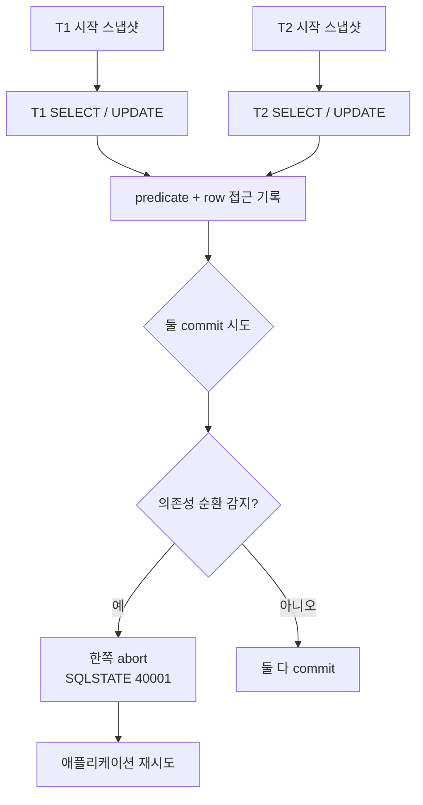

## 정의

**Transaction Isolation Level (트랜잭션 격리 수준)** = *동시에 실행되는 여러 트랜잭션이 서로의 변경을 어디까지 볼 수 있는지* 규정하는 수준. ACID 의 *I*.

격리를 완전히 없애면 최대 처리량, 완전히 직렬화하면 최상의 정합성. DB 는 이 사이 *4단계 (ANSI SQL 표준)* 를 제공한다. **더 강한 격리 = 더 많은 이상 현상 방지 = 더 낮은 동시성.** 실무는 이 트레이드오프를 이해하고 상황에 맞게 고르는 문제다.

## 이 문서의 흐름

각 격리 수준을 낮은 것부터 하나씩 짚는다. 각 수준에서:

1. **이 수준은 무엇을 보장하는가**
2. **하지만 여기서도 어떤 문제가 발생하는가** (애니메이션으로 시각화)
3. **그 문제의 해결법과 대안** (다음 수준으로 올릴지, 다른 기법으로 우회할지)

## 격리 수준 매트릭스 (전체 지도)

먼저 어떤 이상 현상이 어느 수준에서 방지되는지 한눈에.

```anim:tx-isolation-matrix
{}
```

| 이상 현상 | READ&nbsp;UNCOMMITTED | READ&nbsp;COMMITTED | REPEATABLE&nbsp;READ | SERIALIZABLE |
|---|:---:|:---:|:---:|:---:|
| Dirty Read | 발생 | ✓ 방지 | ✓ 방지 | ✓ 방지 |
| Non-Repeatable Read | 발생 | 발생 | ✓ 방지 | ✓ 방지 |
| Phantom Read | 발생 | 발생 | △ 엔진별 | ✓ 방지 |
| Lost Update | 발생 | 발생 | △ SI는 감지 | ✓ 방지 |
| Write Skew | 발생 | 발생 | 발생 | ✓ 방지 |

> **엔진별 차이**가 매우 크다. 특히 REPEATABLE READ 는 *같은 이름이라도 완전히 다른 것*. 아래에서 자세히.

---

## Level 1: READ UNCOMMITTED

### 이 수준의 정의

**커밋되지 않은 값까지 다른 트랜잭션에 노출된다.** 어떤 격리도 없다시피 하는 상태.

- ANSI 4단계 중 가장 낮음
- 락을 거의 사용 안 함 → 최대 동시성
- 그러나 정합성은 최하

### 발생하는 문제: Dirty Read

트랜잭션 A 가 UPDATE 만 하고 아직 COMMIT 안 한 시점에 트랜잭션 B 가 그 값을 읽어 간다. A 가 ROLLBACK 하면 B 는 *실존하지 않는 값* 을 본 것.

```anim:tx-dirty-read
{}
```

**시나리오** (위 애니메이션):

```sql
-- 초기: balance = 500
-- T1
SET TRANSACTION ISOLATION LEVEL READ UNCOMMITTED;
BEGIN;
UPDATE accounts SET balance = 1000 WHERE id = 1;
-- 아직 COMMIT 안 함

-- T2 (별도 세션)
BEGIN;
SELECT balance FROM accounts WHERE id = 1;
-- 결과: 1000  ← 미커밋 값 (dirty)!

-- T1
ROLLBACK;
-- balance 는 다시 500 이 됨. T2 가 봤던 1000 은 유령.
```

**왜 문제인가**:
- T2 는 1000 을 보고 다음 판단 (송금 승인, 통계 계산 등) 을 내림
- 실제 커밋된 적 없는 값에 기반한 결정 → 데이터 일관성 파괴
- ROLLBACK 이 잦다면 유령 데이터가 시스템 곳곳에 남음

### 해결법 / 대안

| 접근 | 방법 | 언제? |
|---|---|---|
| **격리 올림** | READ COMMITTED 이상 사용 | 대부분의 실무 (권장) |
| **MVCC 엔진 채택** | PostgreSQL, MySQL, Oracle 등 | *구조적으로* dirty read 가 불가능 |
| **read-only 명시** | `SET TRANSACTION READ ONLY;` | 대략적 통계, 리포트 |
| **replica 분리** | Analytics 는 replica DB 로 | 최신성 덜 중요한 워크로드 |

> [!IMPORTANT]
> **PostgreSQL** 은 `READ UNCOMMITTED` 를 지정해도 *내부적으로 READ COMMITTED 로 승격*. MVCC 특성상 dirty read 가 원천 불가능. 즉 PostgreSQL 에서 이 수준을 "쓰는" 것은 명목상만 의미 있음.

**READ UNCOMMITTED 를 실제 쓰는 경우가 있나?**
- SQL Server 의 `WITH (NOLOCK)` hint 로 유사 효과. 대시보드 스냅샷 등에 종종 쓰이지만 *공식적으로 지양*.
- Analytics/OLAP 워크로드는 대개 replica 로 분리하는 편이 낫다.
- 결국 *거의 안 씀*. 실무에서는 이 수준을 이해하되 실제 사용은 피한다.

---

## Level 2: READ COMMITTED

### 이 수준의 정의

**커밋된 값만 읽는다.** Dirty Read 는 완전히 방지.

- PostgreSQL, Oracle, SQL Server 의 *기본값*
- MVCC 엔진에서는 *문장 (statement) 마다* 새 스냅샷을 잡음
- 락 사용 최소 → 높은 동시성

```sql
-- PostgreSQL 기본
BEGIN;
SELECT balance FROM accounts WHERE id = 1;  -- 이 시점의 committed 값만 봄
COMMIT;
```

### 발생하는 문제: Non-Repeatable Read

**같은 트랜잭션 안에서 같은 SELECT 를 두 번 실행했는데 결과가 다르다.** 두 SELECT 사이에 다른 tx 가 UPDATE + COMMIT 하면 발생.

```anim:tx-non-repeatable-read
{}
```

**시나리오** (위 애니메이션):

```sql
-- 초기: balance = 500
-- T1
SET TRANSACTION ISOLATION LEVEL READ COMMITTED;
BEGIN;
SELECT balance FROM accounts WHERE id = 1;   -- 500

-- T2 (별도 세션): UPDATE + COMMIT 완료

-- T1 (계속)
SELECT balance FROM accounts WHERE id = 1;   -- 1000  ← 같은 tx인데 다름!
COMMIT;
```

**왜 문제인가**:
- 트랜잭션 안에서 계산에 쓴 값이 중간에 바뀜
- 예: `총액 = 첫 SELECT`, `수수료 = 두번째 SELECT * 0.1` 조합에서 총액과 수수료 비율이 불일치
- 리포트 생성 중 값이 흔들리면 통계가 왜곡됨

### 해결법 / 대안

| 접근 | 방법 | 트레이드오프 |
|---|---|---|
| **격리 올림** | REPEATABLE READ 이상 | 같은 값 보장, 성능 약간 손해 |
| **명시적 락** | `SELECT ... FOR UPDATE` (row lock) | 정확, 대기 시간 발생 |
| **원자 연산** | `UPDATE ... SET x = x - 100` | 애초에 read-modify-write 안 함 |
| **애플리케이션 캐싱** | 첫 결과 저장, 재사용 | 코드 복잡, 지양 |

```sql
-- 옵션 1: REPEATABLE READ 로 올림
SET TRANSACTION ISOLATION LEVEL REPEATABLE READ;

-- 옵션 2: FOR UPDATE 로 row 잠금
SELECT balance FROM accounts WHERE id = 1 FOR UPDATE;
-- 이후 tx 끝까지 다른 tx의 UPDATE는 대기

-- 옵션 3: 원자 UPDATE 로 변경
UPDATE accounts SET balance = balance - 100 WHERE id = 1;
-- read-modify-write 자체를 피함
```

> [!TIP]
> **일반 CRUD 웹 서비스는 READ COMMITTED 로 충분.** Non-Repeatable Read 가 실제 문제가 되는 상황은 리포트, 잔액 계산 등 *같은 값을 여러 번 참조하는 로직*. 그런 부분만 골라 REPEATABLE READ 나 FOR UPDATE 를 붙이는 편이 낫다.

---

## Level 3: REPEATABLE READ

### 이 수준의 정의

**같은 트랜잭션 안에서 같은 row 는 항상 같은 값.** ANSI 정의로는 Non-Repeatable Read 만 방지하고 Phantom Read 는 허용. 하지만 *실제 엔진마다 다르다*.

- MySQL InnoDB 의 *기본값*
- PostgreSQL 은 명시적으로 지정 시 사용
- MVCC 엔진에서는 *트랜잭션 시작 시점의 스냅샷*을 tx 끝까지 유지

**엔진별 실제 구현**:

| 엔진 | 구현 방식 | Non-Rep | Phantom | Lost Update | Write Skew |
|---|---|:---:|:---:|:---:|:---:|
| **MySQL InnoDB** | 2PL + next-key lock (범위 잠금) | ✓ | ✓ 방지 | ✗ | ✗ |
| **PostgreSQL** | Snapshot Isolation (MVCC) | ✓ | ✓ 사실상 방지 | △ 감지 | ✗ |
| **Oracle** | 미지원 (READ COMMITTED / SERIALIZABLE 만) | - | - | - | - |
| **SQL Server** | 2PL | ✓ | ✗ | ✗ | ✗ |

> [!IMPORTANT]
> **같은 REPEATABLE READ 라도 엔진마다 완전히 다르다.** MySQL RR 은 사실상 SERIALIZABLE 에 가까운 락 사용, PostgreSQL RR 은 Snapshot Isolation (락 없이 스냅샷). 이름 하나로 여러 개념을 뭉뚱그린 대표적 사례.

### 발생하는 문제: Phantom Read (ANSI 정의상)

**같은 WHERE 조건을 두 번 실행했는데 row 개수가 다르다.** UPDATE 가 아니라 *INSERT/DELETE* 가 원인.

```anim:tx-phantom-read
{}
```

**시나리오** (위 애니메이션):

```sql
-- 초기: orders 에 amount > 100 인 row 3개
-- T1
SET TRANSACTION ISOLATION LEVEL REPEATABLE READ;
BEGIN;
SELECT COUNT(*) FROM orders WHERE amount > 100;  -- 3

-- T2 (별도 세션)
BEGIN;
INSERT INTO orders (id, amount) VALUES (999, 200);
COMMIT;

-- T1 (계속)
SELECT COUNT(*) FROM orders WHERE amount > 100;
-- ANSI 정의상: 4 (phantom!)
-- MySQL InnoDB: 3 (next-key lock으로 방지)
-- PostgreSQL: 3 (snapshot으로 방지)
COMMIT;
```

**왜 문제인가**:
- WHERE 범위에 해당하는 row 개수를 두 번 재는 로직에서 결과가 달라짐
- 예: 재고 검색 → 예약 처리 → 재확인 시 새 항목이 튀어나옴
- 리포트 통계, 배치 처리에서 count/sum 이 흔들림

### 해결법 / 대안

| 엔진 | 상황 | 조치 |
|---|---|---|
| **MySQL InnoDB** | REPEATABLE READ (기본) | *이미 방지됨* (next-key lock). 별도 조치 불필요 |
| **PostgreSQL** | REPEATABLE READ (SI) | *이미 방지됨* (snapshot). 스냅샷 시점 이후 insert 는 안 보임 |
| **Oracle / SQL Server (2PL)** | REPEATABLE READ | SERIALIZABLE 로 올리거나 `SELECT ... FOR UPDATE` 로 범위 잠금 |
| **모든 엔진** | 안전 확실 필요 | SERIALIZABLE 또는 predicate lock |

**MySQL 의 next-key lock 이란?**

```
[gap lock][row lock][gap lock][row lock][gap lock]...
```

WHERE 조건에 매칭되는 인덱스 범위 전체에 lock. 새 row 가 그 범위에 INSERT 되지 못하게 막아 phantom 방지. 강력하지만 *예상치 못한 deadlock* 이 잦음.

**PostgreSQL 의 SI 는?**

트랜잭션 시작 시점의 스냅샷만 계속 봄. T2 가 나중에 INSERT + COMMIT 해도 T1 의 스냅샷에는 없으므로 count 가 그대로.

> [!WARNING]
> **PostgreSQL REPEATABLE READ 는 Snapshot Isolation 이지 진짜 Serializable 이 아니다.** 아래 Write Skew 절에서 다룰 함정이 있다. 정합성이 극단적으로 중요하면 SERIALIZABLE 로 올려야 함.

---

## Level 4: SERIALIZABLE

### 이 수준의 정의

**개념적으로 트랜잭션이 하나씩 직렬 실행된 것과 같은 결과.** 모든 이상 현상을 방지.

- 가장 강한 격리 수준
- 성능 대가 큼 (엔진마다 다름)
- 진짜 필요한 경우에만 (금융, 재고, 티켓팅 등)

**엔진별 구현 방식**:

| 엔진 | 구현 | 특징 |
|---|---|---|
| **PostgreSQL 9.1+** | SSI (Serializable Snapshot Isolation) | *성능 손해 적음*, 충돌 시 abort → retry 필요 |
| **MySQL InnoDB** | Strict 2PL (모든 SELECT 이 shared lock 획득) | 대기 많음, deadlock 위험 |
| **SQL Server** | 2PL (SERIALIZABLE 힌트) | MySQL 유사 |
| **CockroachDB** | SSI 변형 | 기본이 SERIALIZABLE |

### SERIALIZABLE 을 쓸 때 알아야 할 것

**abort → retry 패턴 필수** (특히 PostgreSQL SSI):

```python
import time
import psycopg2

for attempt in range(5):
    try:
        with conn.cursor() as cur:
            cur.execute("BEGIN ISOLATION LEVEL SERIALIZABLE")
            # ... 비즈니스 로직 ...
            cur.execute("COMMIT")
        break
    except psycopg2.errors.SerializationFailure:
        conn.rollback()
        time.sleep(0.01 * (2 ** attempt))  # 지수 backoff
        if attempt == 4:
            raise
```

**왜 abort 가 필요한가**: SSI 는 각 tx 가 자유롭게 진행하다가 커밋 직전에 *충돌 감지*. 감지되면 한쪽을 강제 abort (SQLSTATE 40001). 애플리케이션은 이를 잡아 재시도해야 함.

### 성능 트레이드오프

일반 워크로드에서 READ COMMITTED 대비:
- **PostgreSQL SSI**: 약 10-20% 느림
- **2PL 기반 (MySQL, SQL Server)**: 최대 수 배 느림 (경합 심한 경우)

> [!TIP]
> "무조건 SERIALIZABLE" 은 나쁜 선택. 대부분 상황은 *READ COMMITTED + 필요한 로직에 SELECT FOR UPDATE 또는 원자 UPDATE* 조합이 최적. SERIALIZABLE 은 *진짜로 write skew 위험이 있는 로직* 에만.

---

## ANSI 표준을 벗어난 이상 현상들

ANSI SQL-92 표준의 4단계 매트릭스는 *3가지 이상 현상만* 정의했다. Berenson et al. (1995) 논문이 이 결함을 지적하며 2가지를 추가했다.

### Lost Update (읽고 → 계산 → 쓰기 경쟁)

**같은 데이터를 두 tx 가 read-modify-write 하는 사이, 한쪽의 UPDATE 가 사라진다.**

```anim:tx-lost-update
{}
```

**시나리오** (위 애니메이션):

```sql
-- 초기: count = 10
-- T1
BEGIN;
SELECT count FROM counters WHERE id = 1;   -- 10
-- 로컬 계산: 10 + 1 = 11
UPDATE counters SET count = 11 WHERE id = 1;
COMMIT;

-- T2 (T1과 병렬)
BEGIN;
SELECT count FROM counters WHERE id = 1;   -- 10 (T1 커밋 전에 SELECT)
-- 로컬 계산: 10 + 1 = 11
UPDATE counters SET count = 11 WHERE id = 1;   -- T1이 쓴 값 위에 덮어씀
COMMIT;

-- 결과: count = 11 (기대치는 12)
```

**어느 수준에서 발생하는가**: READ COMMITTED, REPEATABLE READ 모두 가능. PostgreSQL 의 SI (REPEATABLE READ) 는 first-writer-wins 로 감지해서 두번째 UPDATE 에서 에러를 냄. SERIALIZABLE 은 항상 방지.

**해결법** (권장 순서):

```sql
-- ① 원자 UPDATE (가장 단순, 항상 우선)
UPDATE counters SET count = count + 1 WHERE id = 1;
-- 단일 UPDATE 문은 atomic. race condition 없음.

-- ② 낙관적 lock (version 컬럼)
UPDATE counters SET count = count + 1, version = version + 1
WHERE id = 1 AND version = <읽었을 때의 값>;
-- 0 row affected 면 race 발생 → 애플리케이션에서 재시도

-- ③ 비관적 lock (SELECT FOR UPDATE)
BEGIN;
SELECT count FROM counters WHERE id = 1 FOR UPDATE;  -- row 잠금
UPDATE counters SET count = count + 1 WHERE id = 1;
COMMIT;

-- ④ SERIALIZABLE 로 격리 올림
BEGIN ISOLATION LEVEL SERIALIZABLE;
-- 충돌 시 abort 재시도

-- ⑤ 별도 원자 저장소 (예: Redis INCR)
```

| 방법 | 언제? | 단점 |
|---|---|---|
| **원자 UPDATE** | 단순 counter/누계, 사용 가능하면 항상 | 복잡 로직 못 표현 |
| **낙관적 lock** | 충돌 드물게 | 실패 시 재시도 로직 |
| **비관적 lock** | 충돌 잦음 | 대기 시간 ↑, deadlock 위험 |
| **SERIALIZABLE** | 정확성 우선 | abort 재시도 필요 |
| **Redis 등 별도 저장소** | 극한 성능 | 이중 저장 복잡성 |

### Write Skew (Snapshot Isolation 의 치명적 함정)

**각자의 스냅샷 안에서는 조건이 참이지만, 두 tx 의 결과를 합치면 불변량이 깨진다.**

Lost Update 와 다른 점: Lost Update 는 *같은 row* 를 두 tx 가 UPDATE 해서 하나가 사라짐. Write Skew 는 *다른 row* 를 각자 UPDATE 해서 first-writer-wins 감지가 안 됨.

```anim:tx-write-skew
{}
```

**시나리오: 병원 온콜 스케줄** (위 애니메이션)
- 규칙: 최소 1명은 항상 on-call
- 현재 Alice, Bob 두 명이 on-call
- 둘 다 아파서 동시에 off-call 요청

```sql
-- 초기: on-call 2명 (alice, bob)
-- T1 (Alice의 세션)
BEGIN ISOLATION LEVEL REPEATABLE READ;
SELECT COUNT(*) FROM doctors WHERE on_call = true;  -- 2, 조건 OK
UPDATE doctors SET on_call = false WHERE id = 'alice';
COMMIT;   -- 성공

-- T2 (Bob의 세션, T1과 동시)
BEGIN ISOLATION LEVEL REPEATABLE READ;
SELECT COUNT(*) FROM doctors WHERE on_call = true;  -- 2 (자기 스냅샷), 조건 OK
UPDATE doctors SET on_call = false WHERE id = 'bob';
COMMIT;   -- 성공 (T1이 alice 를 건드렸을 뿐 bob 은 안 건드렸으므로)

SELECT COUNT(*) FROM doctors WHERE on_call = true;  -- 0 !! 규칙 위반
```

**왜 SI 가 못 막나**: 두 tx 가 *다른 row* 를 UPDATE 했으므로 write-write 충돌이 없음. SI 의 first-writer-wins 는 같은 row 에 대해서만 감지. 각자의 스냅샷 안에서는 count(on_call) >= 1 조건이 참이었지만, 실제로는 결합되어 위반됨.

**해결법**:

```sql
-- ① SERIALIZABLE (PostgreSQL SSI는 이를 자동 감지)
BEGIN ISOLATION LEVEL SERIALIZABLE;
SELECT COUNT(*) FROM doctors WHERE on_call = true;
UPDATE doctors SET on_call = false WHERE id = 'alice';
COMMIT;
-- 동시 T2 시도 시 ERROR: could not serialize access due to read/write dependencies
-- → 애플리케이션은 재시도

-- ② SELECT ... FOR UPDATE 로 predicate 잠금
BEGIN;
SELECT COUNT(*) FROM doctors WHERE on_call = true FOR UPDATE;
-- 이제 다른 tx는 on_call=true 인 row 를 UPDATE 할 수 없음
UPDATE doctors SET on_call = false WHERE id = 'alice';
COMMIT;

-- ③ materializing the conflict (강제 write-write 충돌 만들기)
CREATE TABLE on_call_lock (locked BOOLEAN);
INSERT INTO on_call_lock VALUES (true);

BEGIN;
UPDATE on_call_lock SET locked = true;  -- 모든 tx가 이 row 를 UPDATE → 충돌 감지 가능
SELECT COUNT(*) FROM doctors WHERE on_call = true;
UPDATE doctors SET on_call = false WHERE id = 'alice';
COMMIT;
```

> [!IMPORTANT]
> Write Skew 는 *ANSI 표준에 없다*. Berenson et al. 이 SI 의 함정을 지적하며 도입한 개념. PostgreSQL SSI (9.1+) 가 이를 자동 감지하는 유일한 격리 수준. MySQL SERIALIZABLE 은 strict 2PL 로 결과적으로 방지하지만 방법이 다름.

---

## PostgreSQL SSI (Serializable Snapshot Isolation)

PostgreSQL 9.1 부터 도입된 SSI 는 *Snapshot Isolation 위에 predicate lock 추적을 얹어* 진정한 serializability 를 달성한다.



**핵심 아이디어**:
1. 각 tx 는 자기 스냅샷 위에서 자유롭게 실행 (락 최소)
2. 백그라운드에서 *predicate lock* 추적 (T1 이 이 범위를 읽었다, T2 는 이 row 를 썼다)
3. 커밋 시점에 *rw-dependency* 순환 있으면 한쪽 abort
4. 애플리케이션은 40001 잡아서 재시도

**장점**: throughput 손해 적음 (2PL 대비 큰 차이), 정확성 완벽.
**단점**: 재시도 코드 필수. false positive 가능하지만 정확성에는 영향 없음.

---

## MVCC 기반 스냅샷 격리의 원리

각 트랜잭션은 시작 시점의 *스냅샷* 을 잡고, 그 시점 이후의 변경은 자기에게 보이지 않는다.

PostgreSQL 은 각 row (tuple) 에 hidden column `xmin`, `xmax` 를 저장:

```
row 1: (id=1, name='Alice', xmin=100, xmax=0)
        → T200 이 UPDATE
row 1: (id=1, name='Alice', xmin=100, xmax=200)  ← 옛 버전
row 1: (id=1, name='Bob',   xmin=200, xmax=0)    ← 새 버전
```

트랜잭션 T150 은:
- xmin ≤ 150 이고 (xmax = 0 or xmax > 150) 인 tuple 만 봄
- 즉, "내 스냅샷 시점에 살아 있던" 버전만 봄

자세한 구현은 [[mvcc]] 참조.

---

## 실무 가이드

### 언제 어느 수준을?

| 시나리오 | 권장 수준 | 이유 |
|---|---|---|
| 일반 CRUD, 짧은 tx | **READ COMMITTED** | 성능 좋음, dirty read 만 방지 |
| 배치 리포트 (일관 스냅샷) | **REPEATABLE READ** | 같은 값 여러 번 사용 |
| 잔액 계산, 재고 확인 | **REPEATABLE READ + FOR UPDATE** | phantom 안전 |
| 금융 거래, 티켓 발권 | **SERIALIZABLE** | write skew 방지 |
| Analytics (최신성 덜 중요) | **READ COMMITTED READ ONLY** | 최대 동시성 |

### 격리 수준 명시 방법

```sql
-- 세션 전체
SET SESSION TRANSACTION ISOLATION LEVEL SERIALIZABLE;

-- 트랜잭션 하나만
BEGIN;
SET TRANSACTION ISOLATION LEVEL REPEATABLE READ;
-- ...
COMMIT;

-- PostgreSQL: 시작과 동시에
BEGIN ISOLATION LEVEL SERIALIZABLE;

-- 프로그램 레벨 (JDBC 예시)
connection.setTransactionIsolation(Connection.TRANSACTION_SERIALIZABLE);
```

### 프레임워크 예시

```python
# Django
from django.db import transaction
from django.db import connection

@transaction.atomic
def transfer(from_id, to_id, amount):
    with connection.cursor() as cursor:
        cursor.execute("SET TRANSACTION ISOLATION LEVEL SERIALIZABLE")
    # ... 로직 ...
```

```java
// Spring
@Transactional(isolation = Isolation.SERIALIZABLE)
public void transfer(Long from, Long to, BigDecimal amount) { ... }
```

자세한 프레임워크별 사용은 [[django-transactions]], [[spring-transaction]] 참조.

## 실제 DB 엔진 매핑

| 엔진 | 기본 격리 | SERIALIZABLE 구현 | 특징 |
|---|---|---|---|
| **PostgreSQL** | READ COMMITTED | SSI (Serializable Snapshot Isolation) | RR = Snapshot Isolation |
| **MySQL InnoDB** | REPEATABLE READ | Strict 2PL | RR 에서 next-key lock 으로 phantom 방지 |
| **Oracle** | READ COMMITTED | SI 유사 (완전 SS 아님) | RR 미지원 |
| **SQL Server** | READ COMMITTED | 2PL | RCSI 옵션 (MVCC), Snapshot 옵션 별개 |
| **CockroachDB** | SERIALIZABLE | SSI 변형 | 기본이 SS |
| **MongoDB** | (트랜잭션은 SS) | SI | 단일 문서는 원자적 |
| **DynamoDB** | (item 원자성) | TransactWriteItems (SSI 유사) | 트랜잭션 API 사용 시 |
| **Cassandra** | (트랜잭션 미지원) | LWT (Lightweight Transactions) | Paxos 기반 우회 |

## 흔한 함정

> [!WARNING]
> 1. **"REPEATABLE READ 라니 안전하겠지"** = MySQL 과 PostgreSQL 의 RR 은 완전히 다른 것. Write Skew 는 어느 쪽에서도 발생.
> 2. **SERIALIZABLE 만 박고 abort 처리 없음** = 부하 시 40001 폭증하여 요청 실패. *재시도 코드 필수*.
> 3. **READ COMMITTED 로 잔액 계산** = tx 안에서도 잔액이 바뀔 수 있음. 은행 앱에서 문제.
> 4. **MySQL RR + gap lock deadlock** = 의도치 않은 범위 잠금으로 데드락 폭증. `SHOW ENGINE INNODB STATUS\G` 로 진단.
> 5. **낙관적 lock 없이 read-modify-write** = 트래픽 증가 시 lost update 폭증.
> 6. **`SELECT FOR UPDATE` 를 잔뜩 걸음** = 대기 시간 폭증 + deadlock. 필요한 최소 범위만.
> 7. **긴 트랜잭션 (long-running tx)** = VACUUM 방해, snapshot 유지 비용, lock 대기 폭증. 5분 넘으면 검토.
> 8. **격리 수준을 애플리케이션 코드에서 매번 바꿈** = 세션 풀에서 오염 (다음 요청이 이전 설정 상속). 명시적 리셋 필요.

## Anti-Pattern: Lock 으로 모든 것 해결 시도

```sql
-- ✗ 나쁜 예: 모든 SELECT 에 FOR UPDATE
SELECT * FROM users FOR UPDATE;
SELECT * FROM orders FOR UPDATE;
SELECT * FROM products FOR UPDATE;
-- → deadlock 폭증, 대기 시간 ↑
```

**개선**:
- 필요한 곳만 SELECT ... FOR UPDATE (충돌 실제 발생하는 row 만)
- 순서 일관성 (항상 users → orders → products 순으로 lock)
- SSI 로 전환 (retry 로 처리)
- 원자 UPDATE 가능하면 그것으로

## 관련 위키

- [[mvcc]], MVCC 구현 상세, xmin/xmax, snapshot
- [[postgresql]], PostgreSQL 프로세스 모델 + MVCC
- [[mysql-innodb]], InnoDB 락 시스템 (record, gap, next-key)
- [[sql-dcl-tcl]], TCL 명령 (BEGIN, COMMIT, SAVEPOINT)
- [[wal-write-ahead-log]], 크래시 복구와 durability
- [[spring-transaction]], Spring `@Transactional` 사용법
- [[django-transactions]], Django 트랜잭션 관리
- [[distributed-systems-distributed-transaction]], 분산 트랜잭션 (2PC, Saga)
