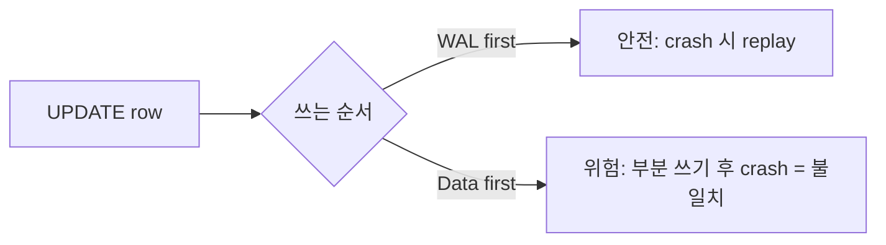
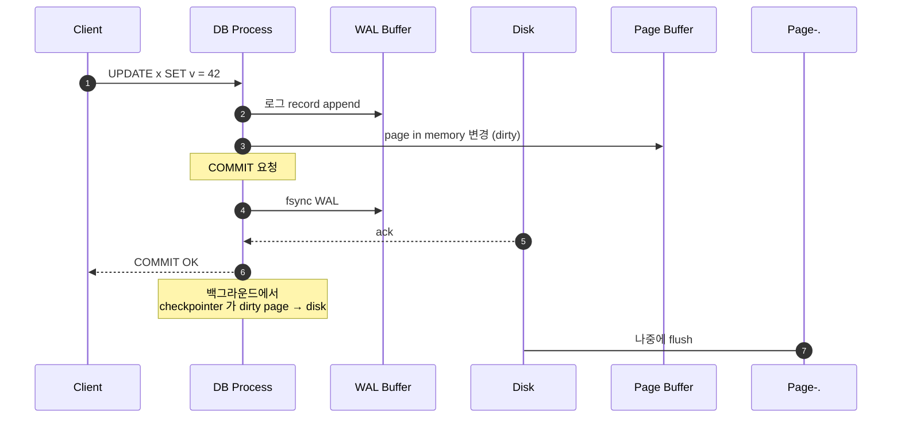
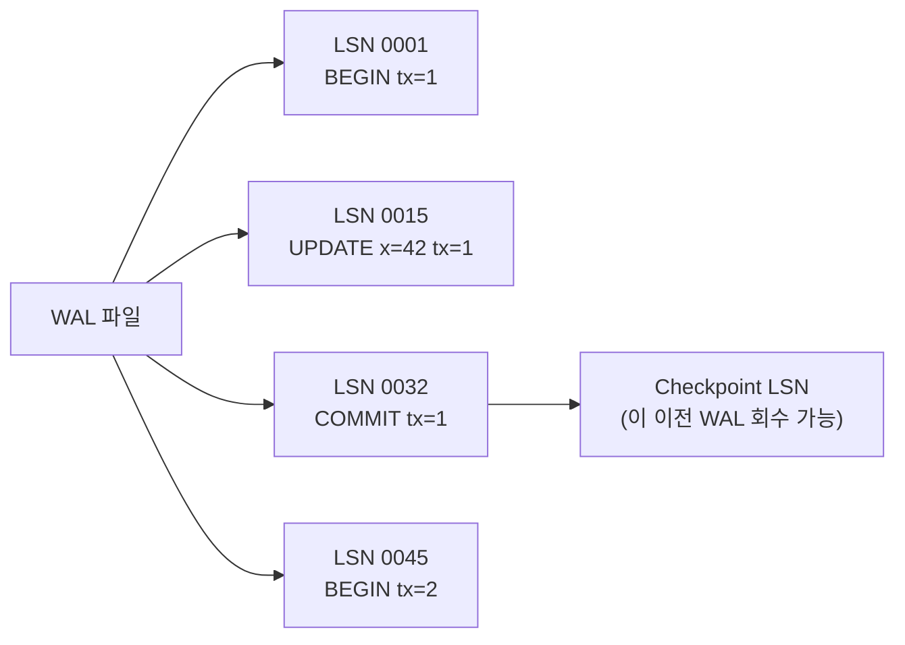
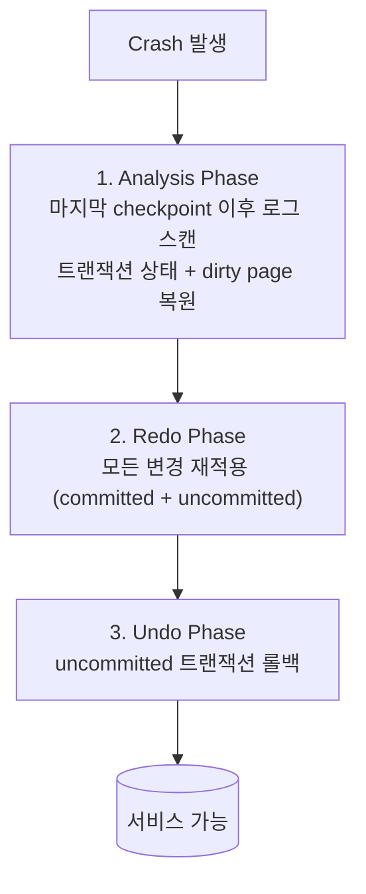
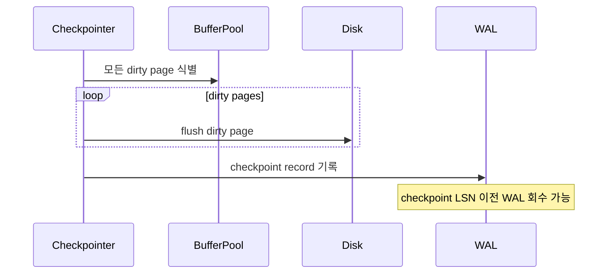
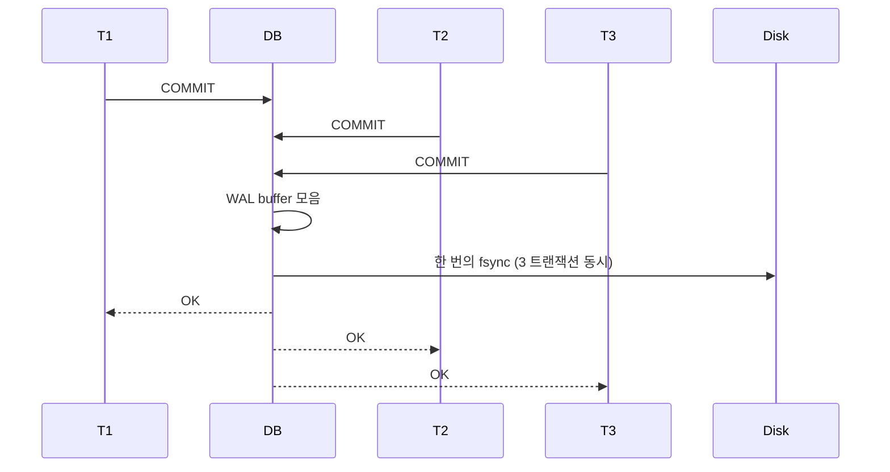
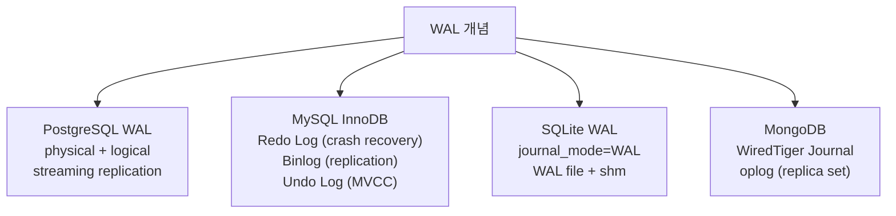
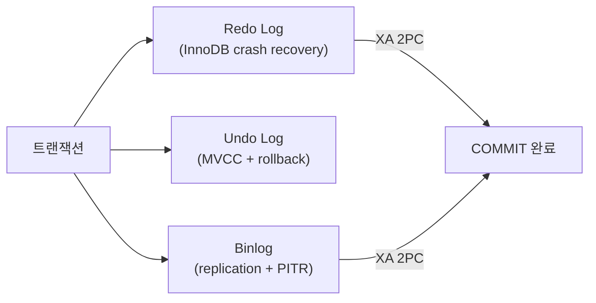
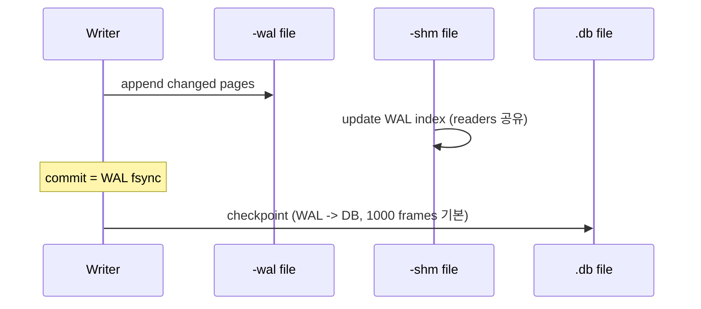
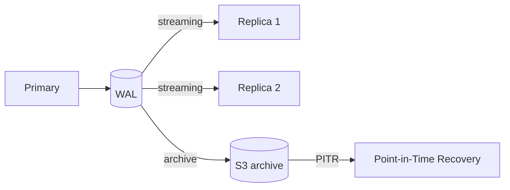

## 정의

**Write-Ahead Log (WAL)** = *데이터 변경 전 로그를 먼저 디스크에 기록*. 모든 모던 RDB / KV / 분산 시스템의 *내구성 기반*.

핵심 약속: **로그가 디스크에 있으면 → 데이터도 복구 가능**.

## 왜 WAL?



*데이터 페이지를 디스크에 쓰는 건 비쌈*. *로그는 sequential append 라 빠름*. *commit = 로그 fsync* 만 보장하면 *crash 후에도 복구 가능*.

## 일반 흐름



## LSN (Log Sequence Number)

*WAL 내 각 레코드의 단조 증가 번호*. 모든 WAL 기반 DB 의 핵심 좌표.



| DB | LSN 이름 | 형식 |
|---|---|---|
| PostgreSQL | LSN | `X/YYYYYYYY` (hex, 64bit) |
| MySQL InnoDB | Log Sequence Number | 64bit int |
| SQLite | WAL frame counter | frame index |

```sql
-- PostgreSQL: 현재 WAL 위치
SELECT pg_current_wal_lsn();
SELECT pg_walfile_name(pg_current_wal_lsn());

-- MySQL: 현재 binlog 위치
SHOW MASTER STATUS;
```

## Crash Recovery: ARIES 알고리즘

*Algorithms for Recovery and Isolation Exploiting Semantics* (Mohan et al., 1992) - 모든 모던 RDB 의 복구 기반.



| 단계 | 의미 | 핵심 원리 |
|---|---|---|
| **Analysis** | 마지막 checkpoint 이후 로그 스캔. 트랜잭션/dirty page 상태 복원 | `winner` (committed) / `loser` (uncommitted) 분류 |
| **Redo** | *모든* 변경 재적용 (committed + uncommitted 둘 다) | "steal + no-force" 정책 기반 |
| **Undo** | uncommitted 트랜잭션 역순 롤백 | CLR (Compensation Log Record) 기록 |

> [!IMPORTANT]
> ARIES 는 *steal + no-force* 정책: *commit 전 dirty page 도 disk 에 쓸 수 있음* (steal), *commit 시 dirty page 강제 flush 안 함* (no-force). 이 덕분에 buffer pool 을 자유롭게 운용.

### Steal / No-force 정책

| 정책 | steal | no-steal | force | no-force |
|---|---|---|---|---|
| 의미 | commit 전 page 를 disk 에 써도 됨 | 안 됨 | commit 시 모든 dirty page flush | 안 해도 됨 |
| ARIES | *steal* | | | *no-force* |
| 장점 | buffer pool 자유 관리 | | | commit latency 최소 |
| 복구 필요 | Undo 필요 (uncommitted 가 disk 에) | | Redo 불필요 | Redo 필요 |

## Checkpoint



*checkpoint = recovery 시작점*. 자주 하면 *recovery 빠름 + I/O 부담*. 드물게 하면 *I/O 적음 + recovery 길음*.

```sql
-- PostgreSQL checkpoint 튜닝
checkpoint_timeout = 15min       -- checkpoint 간격
max_wal_size = 4GB               -- WAL 최대 크기 (초과 시 강제 checkpoint)
checkpoint_completion_target = 0.9  -- checkpoint I/O 를 interval 의 90% 분산

-- 수동 checkpoint
CHECKPOINT;
```

## fsync 의 비용과 Group Commit



*Group commit*: 동시 commit 들을 *한 fsync 로 묶음*. throughput 큰 향상.

| 정책 | 의미 | 손실 |
|---|---|---|
| `fsync = on` | 매 commit fsync | 0 |
| `synchronous_commit = off` | WAL 버퍼만, fsync 지연 | ~수 ms |
| `fsync = off` | fsync 안함 | *crash 시 손실 가능* |

> [!CAUTION]
> *`fsync = off`* 는 *벤치마크 외 절대 금지*. crash 시 *DB 복구 불가* 가능.

## Physical vs Logical WAL

| | Physical WAL | Logical WAL |
|---|---|---|
| 단위 | *page 단위 변경* | *행 단위 변경* |
| 크기 | 큼 (페이지 전체) | 작음 |
| 복구 | 1:1 page restore | 행 단위 apply |
| 용도 | primary → replica (streaming) | CDC, 필터링 복제 |
| 예 | PG streaming replication | PG logical replication, Debezium |

```sql
-- PostgreSQL 논리적 복제 슬롯
SELECT pg_create_logical_replication_slot('myslot', 'pgoutput');
SELECT * FROM pg_logical_slot_get_changes('myslot', NULL, NULL);
```

## DB별 WAL 구현 비교



| DB | WAL 이름 | 특징 |
|---|---|---|
| PostgreSQL | WAL | physical + logical 분리. streaming replication |
| MySQL InnoDB | redo log + undo log + binlog | 3 종 분리. binlog 로 replication |
| SQLite | journal / WAL mode | `journal_mode=WAL`. WAL + shm 파일 |
| Redis | AOF | 옵션. append-only file |
| LMDB | (copy-on-write, no WAL) | 다른 모델 |
| RocksDB | WAL | LSM-tree 에 WAL 조합 |
| etcd / CockroachDB | Raft log | consensus + WAL |

### MySQL InnoDB 구현 차이

MySQL 은 WAL 이 *세 가지*:



- Redo + Binlog 를 *2PC (two-phase commit)* 로 원자 커밋 → *split-brain 방지*.
- `innodb_flush_log_at_trx_commit = 1` (기본) = Redo fsync per commit.
- `sync_binlog = 1` = Binlog fsync per commit.

### SQLite WAL 구현



## WAL → Replication



- *Physical replication*: WAL 그대로 전송
- *Logical replication*: 행 단위 변경 (필터링 / 변환 가능)
- *Point-in-Time Recovery*: archive + WAL = 임의 시점 복원

자세한 건 [[postgresql]] / [[mysql-innodb]] 참고.

## fsync 만 = 안전?


> *Disk cache* 까지가 전제. *power loss 시 disk cache 손실* → *battery-backed cache 또는 SSD 의 power-loss-protection (PLP)* 필요.

## 흔한 함정

> [!WARNING]
> 1. **fsync 안 함 + 빠르다고 자랑** = 사실 *D (Durability) 가 사라진* 상태. 벤치마크 무의미.
> 2. **WAL archive 보관 부족** = PITR 시 *복원 시점 없음*. 최소 3-7일 보관.
> 3. **Checkpoint 너무 자주** = I/O spike. PG `checkpoint_timeout`, `max_wal_size` 튜닝.
> 4. **Group commit 안 켬 (MySQL)** = throughput 1/N. `innodb_flush_log_at_trx_commit` + binlog group commit.
> 5. **LSN 불일치로 replica 깨짐** = MySQL GTID 또는 PG streaming replication 슬롯 관리 필요.
> 6. **WAL 세그먼트 파일 수동 삭제** = PITR / replica 연결 끊김. pg_archivecleanup 등 도구 사용.

## 관련 위키

- [[postgresql]], [[mysql-innodb]], [[sqlite]]
- [[mvcc]]
- [[redis-persistence]] (Redis 의 AOF)
- [[redis-replication]]
