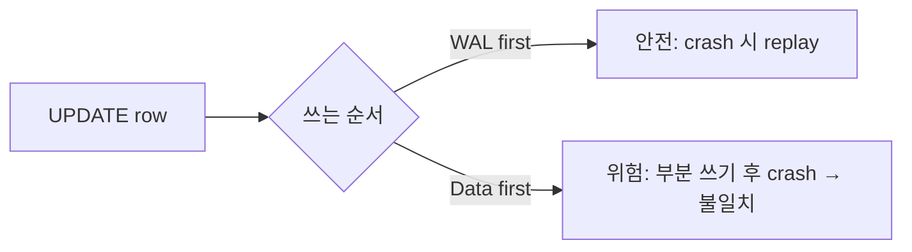
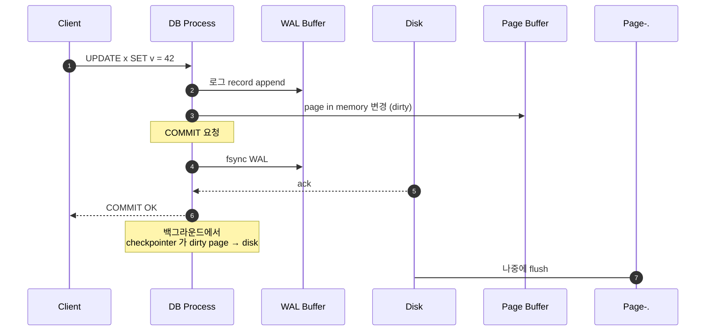
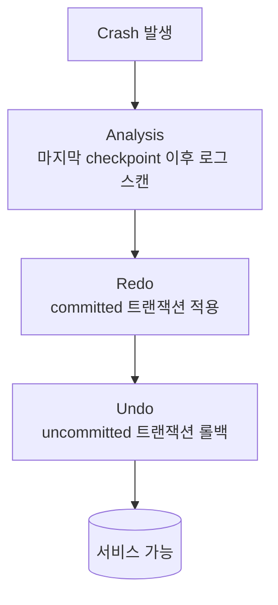
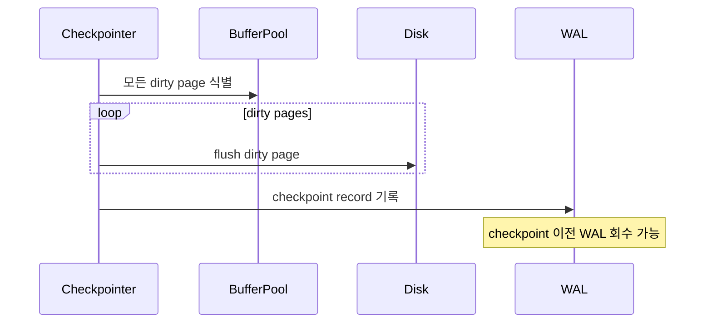
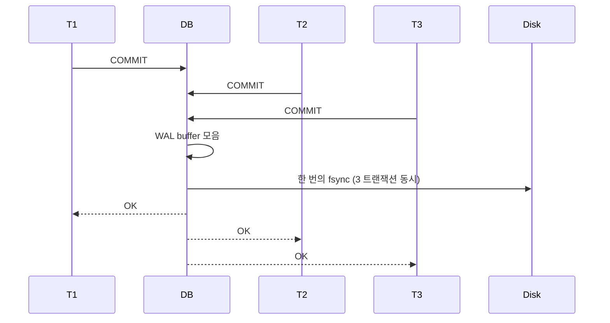
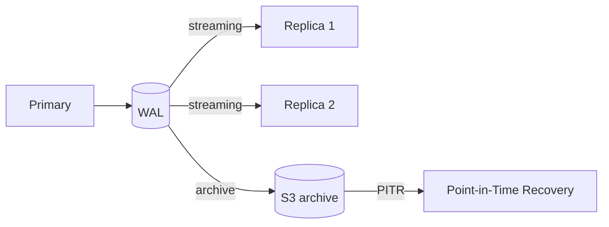

## 정의

**Write-Ahead Log (WAL)** = *데이터 변경 전 로그를 먼저 디스크에 기록*. 모든 모던 RDB / KV / 분산 시스템의 *내구성 기반*.

핵심 약속: **로그가 디스크에 있으면 → 데이터도 복구 가능**.

## 왜 WAL?

*데이터 페이지를 디스크에 쓰는 건 비쌈*. *로그는 sequential append 라 빠름*. *commit = 로그 fsync* 만 보장하면 *crash 후에도 복구 가능*.

## 일반 흐름

## Crash Recovery (ARIES 기반)

| 단계 | 의미 |
|---|---|
| **Analysis** | 마지막 checkpoint 이후의 로그 스캔. 트랜잭션 상태 복원 |
| **Redo** | committed 트랜잭션의 변경 *재적용* |
| **Undo** | uncommitted 트랜잭션 *롤백* |

> [!IMPORTANT]
> *모든 modern DB* 가 ARIES 또는 변형. *최초 commit 후 즉시 fsync* 가 *D (Durability) 의 정의*.

## Checkpoint

*checkpoint = recovery 시작점*. 자주 하면 *recovery 빠름 + I/O 부담*. 드물게 하면 *I/O 적음 + recovery 길음*.

## fsync 의 비용과 group commit

*Group commit*: 동시 commit 들을 *한 fsync 로 묶음*. throughput 큰 향상.

| 정책 | 의미 | 손실 |
|---|---|---|
| `fsync = on` | 매 commit fsync | 0 |
| `synchronous_commit = off` | WAL 버퍼만, fsync 지연 | ~수 ms |
| `fsync = off` | fsync 안함 | *crash 시 손실 가능* |

> [!CAUTION]
> *`fsync = off`* 는 *벤치마크 외 절대 금지*. crash 시 *DB 복구 불가* 가능.

## WAL → Replication

- *Physical replication*: WAL 그대로 전송
- *Logical replication*: 행 단위 변경 (필터링 / 변환 가능)
- *Point-in-Time Recovery*: archive + WAL = 임의 시점 복원

자세한 건 [[postgresql]] / [[mysql-innodb]] / [[Redis Replication]].

## WAL 의 형태별 비교

| DB | WAL 이름 | 비고 |
|---|---|---|
| PostgreSQL | WAL | physical + logical |
| MySQL InnoDB | redo log + undo log + binlog | 3 종 분리 |
| SQLite | journal / WAL mode | journal_mode=WAL |
| Redis | AOF | 옵션 |
| LMDB | (copy-on-write, no WAL) | 다른 모델 |
| RocksDB | WAL | LSM-tree |
| etcd / CockroachDB | Raft log | consensus + WAL |

## fsync 만 = 안전?

> *Disk cache* 까지가 전제. *power loss 시 disk cache 손실* → *battery-backed cache 또는 SSD 의 power-loss-protection (PLP)* 필요.

## 흔한 함정

> [!WARNING]
> 1. **fsync 안 함 + 빠르다고 자랑** = 사실 *D 가 사라진* 상태. 벤치마크 무의미.
> 2. **WAL archive 보관 부족** = PITR 시 *복원 시점 없음*. *최소 3-7일* 보관.
> 3. **Checkpoint 너무 자주** = I/O spike. PG `checkpoint_timeout`, `max_wal_size` 튜닝.
> 4. **Group commit 안 켬 (MySQL)** = throughput 1/N. `innodb_flush_log_at_trx_commit` + binlog group commit.

## 관련 위키

- [[postgresql]], [[mysql-innodb]]
- [[mvcc]]
- [[Redis Persistence]] (Redis 의 AOF)
- [[Redis Replication]]
- [[distributed-systems-consensus]] (Raft)
