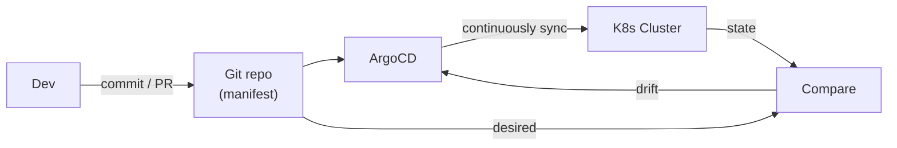
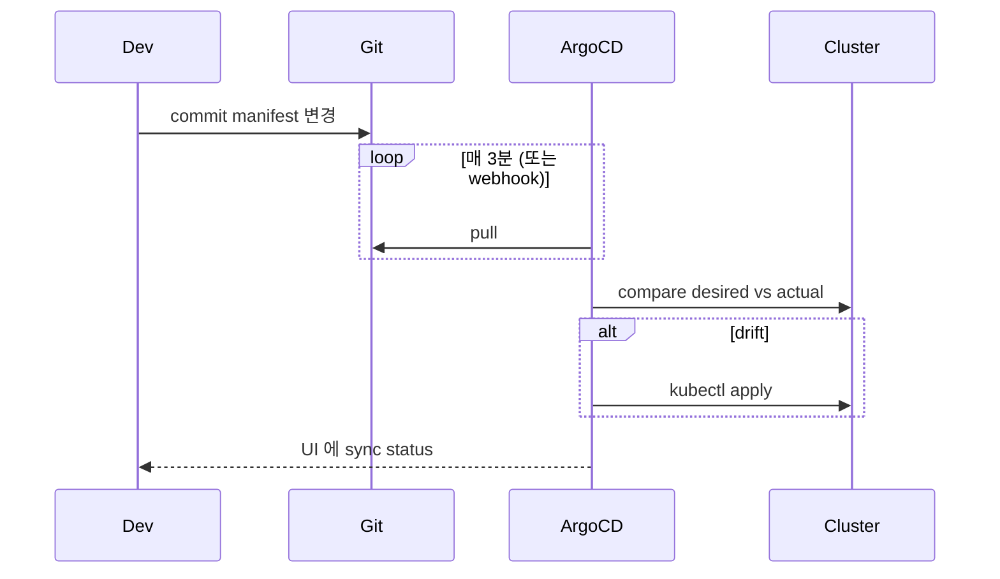
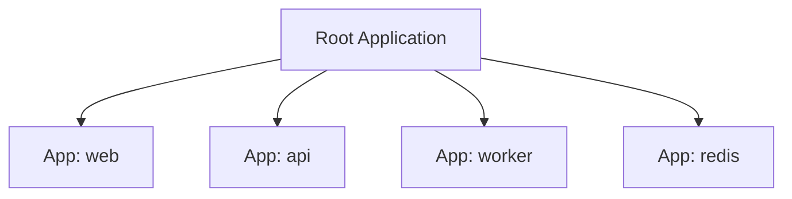
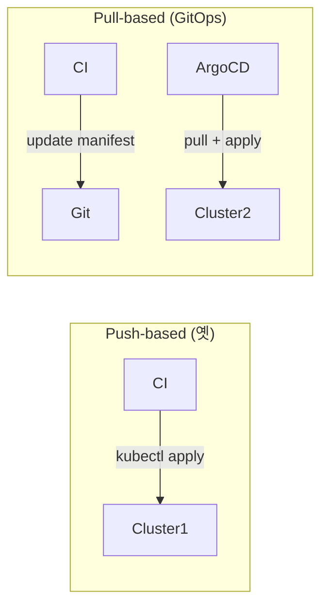

## 정의

**ArgoCD** = *Kubernetes 의 GitOps 컨트롤러*. Git 리포지토리의 *manifest 가 source of truth* → cluster 가 *자동 동기화*.

## GitOps 원칙



| 원칙 | 의미 |
|---|---|
| Git = source of truth | *모든 변경* 이 git 으로 |
| Declarative | YAML / Helm / Kustomize |
| Auto-sync | git 변경 → cluster 자동 적용 |
| Auto-healing | manual 변경도 *git 으로 복구* |
| Observable | UI / API 로 *항상 상태 가시* |

## Application 정의

```yaml
apiVersion: argoproj.io/v1alpha1
kind: Application
metadata:
  name: web
  namespace: argocd
spec:
  project: default
  source:
    repoURL: https://github.com/myorg/manifests
    targetRevision: main
    path: apps/web/overlays/prod
  destination:
    server: https://kubernetes.default.svc
    namespace: web
  syncPolicy:
    automated:
      prune: true       # git 에서 제거된 자원 → 삭제
      selfHeal: true    # 수동 변경 → git 으로 복구
    syncOptions:
      - CreateNamespace=true
```

## 동작



## App of Apps 패턴



> *Application 자체를 git 에서 관리*. 새 service 추가 = git PR 만.

## ApplicationSet

```yaml
apiVersion: argoproj.io/v1alpha1
kind: ApplicationSet
metadata: { name: cluster-bootstrap }
spec:
  generators:
    - clusters: {}    # 모든 등록된 cluster
  template:
    metadata: { name: '{{name}}-monitoring' }
    spec:
      source:
        repoURL: ...
        path: 'clusters/{{name}}/monitoring'
      destination:
        server: '{{server}}'
```

> *수많은 cluster / namespace 에 동일 app 자동 배포*.

## ArgoCD vs Flux

| 항목 | ArgoCD | Flux |
|---|---|---|
| UI | *강력* | 없음 (Weave GitOps UI 별도) |
| 학습 곡선 | 중간 | 낮음 |
| 단순성 | 중간 | *높음* |
| Multi-tenancy | 강 | 보통 |
| Notification | built-in | Alertmanager 통합 |

> *2026 시점 ArgoCD 가 더 인기*. UI + 다양 source (Helm, Kustomize, Jsonnet, ...).

## Argo Rollouts (Progressive Delivery)

```yaml
apiVersion: argoproj.io/v1alpha1
kind: Rollout
metadata: { name: web }
spec:
  replicas: 10
  strategy:
    canary:
      steps:
        - setWeight: 10
        - pause: { duration: 5m }
        - setWeight: 30
        - pause: { duration: 5m }
        - setWeight: 50
        - pause: { duration: 10m }
        - setWeight: 100
      analysis:
        templates:
          - templateName: success-rate
```

> *progressive rollout* + *자동 metric 분석* + 실패 시 *자동 롤백*.

## CI/CD 분리 (Push vs Pull)



| Pull (GitOps) | Push |
|---|---|
| 안전 (cluster credential 외부 없음) | CI 가 cluster 접근 |
| 자동 복구 | 한 번 실행 후 끝 |
| 감사 (git log) | CI history |
| 다중 cluster 쉬움 | 어렵 |

## 흔한 함정

> [!WARNING]
> 1. **수동 `kubectl apply`** = ArgoCD 가 *git 으로 복구*. 모든 변경은 git PR.
> 2. **Secret 의 git 평문** = SOPS / Sealed Secrets / External Secrets.
> 3. **거대한 단일 App** = 부분 sync 어려움. 작은 App 으로.
> 4. **Webhook 미설정** = 3분 polling 지연. GitHub webhook 권장.

## 관련 위키

- [[gitops-patterns]]
- [[github-actions]]
- [[k8s-deployment]]
- [[helm]]
