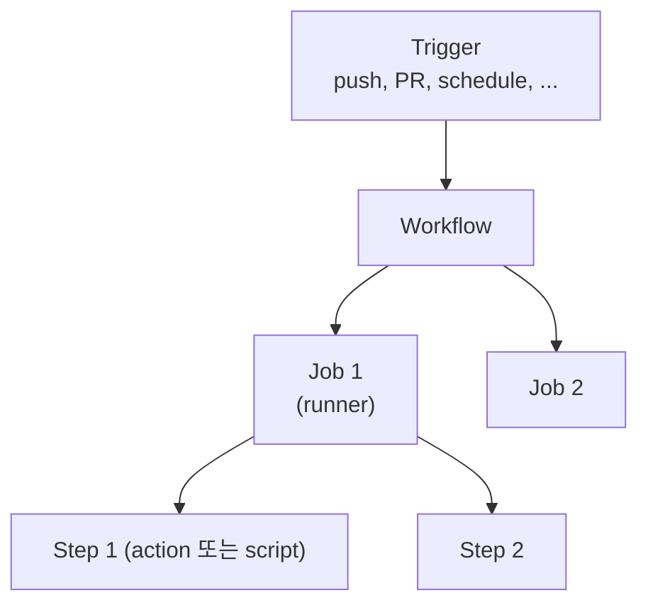
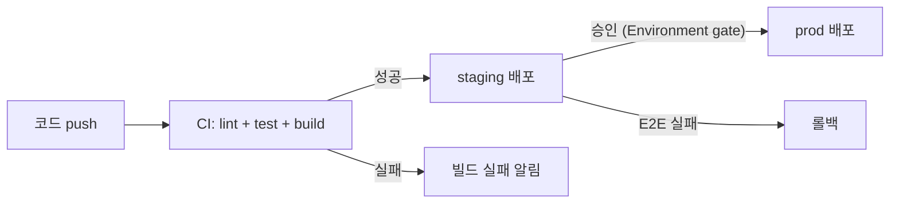

## 정의

**GitHub Actions** = GitHub *내장 CI/CD*. *YAML workflow* + *marketplace action*. 2018 출시 → *Travis CI 대체*.

## 구조



## Workflow YAML

```yaml
name: CI
on:
  push:
    branches: [main]
  pull_request:

jobs:
  test:
    runs-on: ubuntu-latest
    strategy:
      matrix:
        node: [20, 22]
    steps:
      - uses: actions/checkout@v4
      - uses: actions/setup-node@v4
        with:
          node-version: ${{ matrix.node }}
          cache: npm
      - run: npm ci
      - run: npm run lint
      - run: npm test
      - run: npm run build

  deploy:
    needs: test
    if: github.ref == 'refs/heads/main'
    runs-on: ubuntu-latest
    permissions:
      id-token: write
      contents: read
    steps:
      - uses: actions/checkout@v4
      - uses: aws-actions/configure-aws-credentials@v4
        with:
          role-to-assume: arn:aws:iam::123:role/gh-deploy
          aws-region: us-east-1
      - run: aws s3 sync ./dist s3://my-bucket
```

## Trigger 종류

| Trigger | 의미 |
|---|---|
| `push` | branch / tag push |
| `pull_request` | PR open / sync |
| `schedule` | cron |
| `workflow_dispatch` | 수동 실행 |
| `workflow_call` | 다른 workflow 가 호출 |
| `repository_dispatch` | 외부 API |
| `release` | release published |
| `issue_comment` | comment |

## Runner

| 종류 | 의미 |
|---|---|
| **GitHub-hosted** | Ubuntu/Windows/macOS, 매번 fresh |
| **Self-hosted** | 자체 VM, 빠름, 보안 책임 |
| **Larger runners** | GitHub-hosted 의 강한 사양 |
| **ARC (Actions Runner Controller)** | K8s 위 self-hosted |

## Marketplace Action

```yaml
- uses: actions/checkout@v4
- uses: actions/setup-python@v5
  with: { python-version: '3.13' }
- uses: docker/build-push-action@v6
- uses: actions/cache@v4
- uses: aws-actions/configure-aws-credentials@v4
```

## OIDC + AWS (long-term key 없이)

자세한 건 [[aws-sts-assume-role]] 의 OIDC.

```yaml
permissions:
  id-token: write
steps:
  - uses: aws-actions/configure-aws-credentials@v4
    with:
      role-to-assume: arn:aws:iam::123:role/gh-deploy
      aws-region: us-east-1
```

## Matrix Build

```yaml
strategy:
  fail-fast: false
  matrix:
    os: [ubuntu-latest, macos-latest]
    node: [20, 22]
    include:
      - os: ubuntu-latest
        node: 22
        coverage: true
    exclude:
      - os: macos-latest
        node: 20
```

> *N × M 조합* 자동 실행.

## Reusable Workflow

```yaml
# .github/workflows/reusable-deploy.yml
on:
  workflow_call:
    inputs:
      env:
        required: true
        type: string

jobs:
  deploy:
    runs-on: ubuntu-latest
    steps: [...]
```

```yaml
# 호출
jobs:
  call:
    uses: ./.github/workflows/reusable-deploy.yml
    with: { env: prod }
```

## Composite Action

`action.yml`:
```yaml
name: 'Setup Node + cache'
runs:
  using: 'composite'
  steps:
    - uses: actions/setup-node@v4
    - uses: actions/cache@v4
    - run: npm ci
      shell: bash
```

## 보안

```
✓ PR fork 의 secret 노출 방지 (pull_request_target 주의)
✓ Action SHA pinning (uses: actions/checkout@<sha>)
✓ OIDC (long-term key 회피)
✓ Permissions 최소화 (permissions: 명시)
✓ Secrets 환경 분리 (environment)
```

## 흔한 함정

> [!WARNING]
> 1. **`pull_request_target` + checkout PR code** = *코드 인젝션 가능*. PR 의 코드는 `pull_request` 만.
> 2. **Long-term AWS key** = 누출 위험. OIDC 권장.
> 3. **`uses: action@main`** = action 변경에 *영향 받음*. *SHA pinning*.
> 4. **Self-hosted runner 의 *fork PR*** = 임의 코드 실행. *fork 차단* 또는 GitHub-hosted.

## Cache와 Artifact

### Cache

```yaml
- uses: actions/cache@v4
  with:
    path: ~/.npm
    key: ${{ runner.os }}-node-${{ hashFiles('**/package-lock.json') }}
    restore-keys: |
      ${{ runner.os }}-node-
```

- `key` 가 정확히 매칭되면 cache hit, 아니면 `restore-keys` 순서로 prefix 매칭.
- `hashFiles('**/package-lock.json')` = lock 파일 변경 시 캐시 무효화.
- `actions/setup-node@v4` 의 `cache: npm` 은 위를 자동으로 수행.

### Artifact

```yaml
- uses: actions/upload-artifact@v4
  with:
    name: dist
    path: ./dist
    retention-days: 7

# 다른 job 에서 다운로드
- uses: actions/download-artifact@v4
  with:
    name: dist
    path: ./dist
```

job 간 파일 공유. `needs` + artifact 로 build → deploy 파이프라인 연결.
upload artifact 는 workflow 실행 당 5 GB, 기본 보존 90일.

## Concurrency 제어

```yaml
concurrency:
  group: ${{ github.workflow }}-${{ github.ref }}
  cancel-in-progress: true
```

- 같은 branch 에서 새 push 가 오면 기존 실행 취소.
- PR 에서 커밋 계속 올릴 때 이전 CI 낭비 방지.
- `cancel-in-progress: false` 로 배포 job 직렬화 가능.

## Environment와 Secret

```yaml
jobs:
  deploy:
    environment: production       # GitHub Environments 보호 규칙 적용
    steps:
      - name: Use secret
        env:
          API_KEY: ${{ secrets.API_KEY }}        # repository / org secret
          DB_PASS: ${{ secrets.DB_PASS }}
        run: deploy.sh
```

- `secrets.XXX` 는 로그에 자동 마스킹.
- `environment` = 환경별 secret 분리 + 수동 승인 게이트.
- `GITHUB_TOKEN` 은 Actions 가 자동 발급, 해당 repo 내 작업에만 유효.

```yaml
permissions:
  contents: read
  pull-requests: write
  id-token: write       # OIDC 필요 시
```

최소 권한 원칙. workflow 레벨 / job 레벨 모두 선언 가능.

## 배포 파이프라인 흐름



## Expressions 와 Context

| Context | 내용 |
|---|---|
| `github.ref` | 현재 branch/tag ref |
| `github.sha` | commit SHA |
| `github.actor` | trigger 한 사용자 |
| `github.event_name` | push, pull_request 등 |
| `runner.os` | Linux, macOS, Windows |
| `env.MY_VAR` | 환경변수 접근 |

```yaml
# 조건부 실행
if: github.ref == 'refs/heads/main' && success()
if: contains(github.event.pull_request.labels.*.name, 'deploy')
```

## 관련 위키

- [[argocd]]
- [[gitops-patterns]]
- [[aws-sts-assume-role]]
- [[docker]]
- [[OpenTelemetry]]
- [[zero-downtime deployment]]
