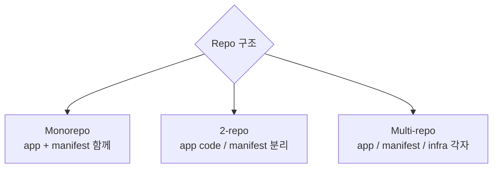
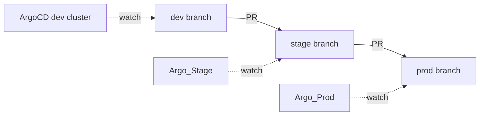
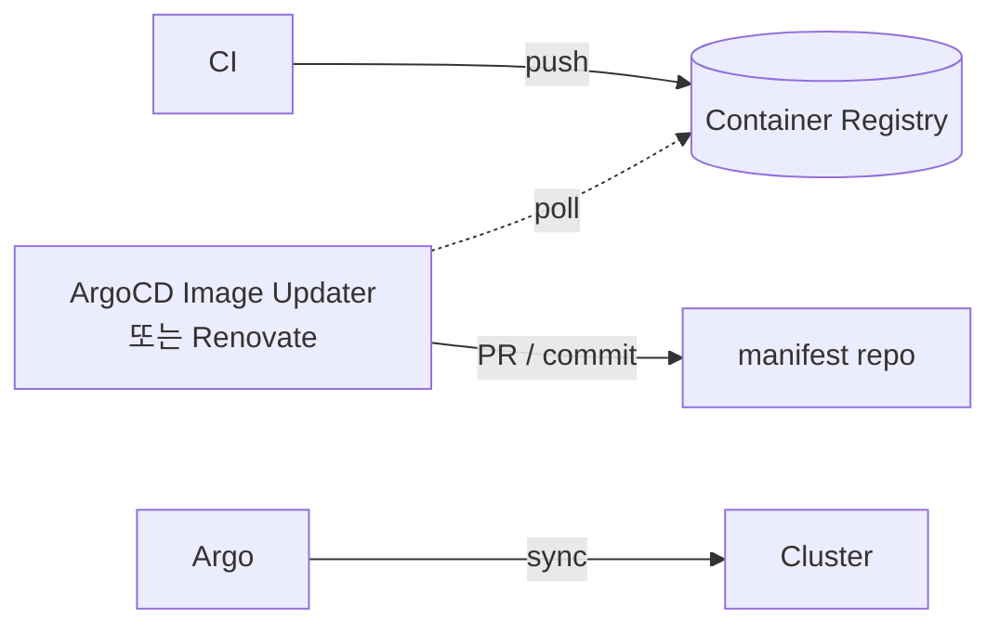
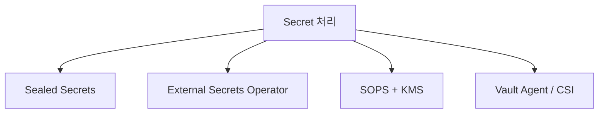
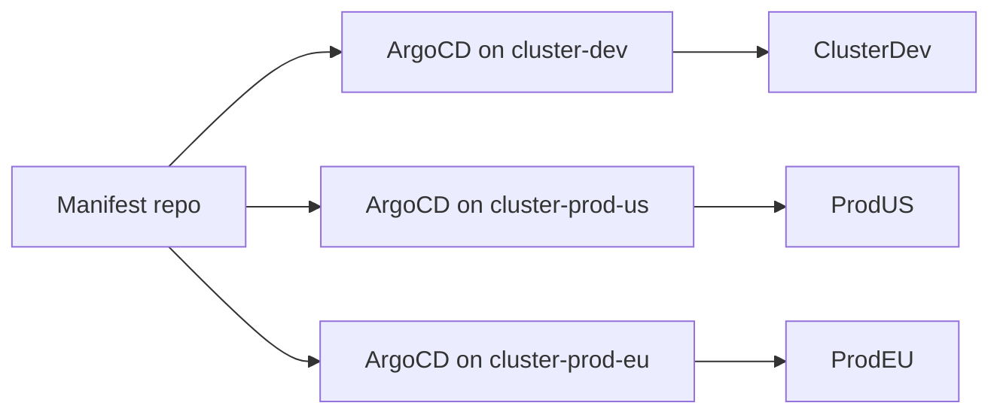

## GitOps 4가지 원칙 (OpenGitOps)

1. **Declarative**: 시스템 *원하는 상태* 가 *선언적* (YAML).
2. **Versioned and Immutable**: Git 으로 *버전 + 불변*.
3. **Pulled Automatically**: 시스템이 *자동 fetch + apply*.
4. **Continuously Reconciled**: 지속적 *desired vs actual 비교 + 수정*.

## Repo 구조 패턴



### 1. Monorepo (app + manifest)

```
my-repo/
├── src/         (app code)
├── k8s/         (manifest)
└── .github/workflows/
```

장점: 단순. 단점: *app PR 이 인프라 변경 동시 일으킴* → 위험.

### 2. 2-repo (권장)

```
app-repo/
├── src/
└── .github/workflows/
    └── build.yml (image push to ECR)

manifest-repo/
├── apps/
│   └── web/
│       └── deployment.yaml (image: ...:abc123)
└── argocd/
    └── applications.yaml
```

> *CI 가 새 image* → *manifest repo 의 yaml 의 image tag 자동 update* → ArgoCD 가 cluster 동기화.

### 3. Multi-repo

각 app, 각 component, 각 cluster 별 repo. 큰 조직.

## Environment Promotion



또는 *디렉토리 분리*:

```
manifests/
├── overlays/
│   ├── dev/      → dev cluster
│   ├── stage/    → stage cluster
│   └── prod/     → prod cluster
└── base/         → 공통
```

> *Kustomize* + ArgoCD app 별 path 분리.

## Image Updater



| 도구 | 의미 |
|---|---|
| ArgoCD Image Updater | tag 정책 기반 자동 |
| Renovate | dependency 갱신 PR |
| Flux Image Automation | Flux 내장 |

## Secret 처리 (git 안전)



자세한 건 [[k8s-configmap-secret]].

## Multi-cluster GitOps



또는 *중앙 ArgoCD + 다중 cluster credential*:

```yaml
apiVersion: v1
kind: Secret
type: stringData:
  name: prod-us-cluster
  server: https://k8s.prod-us.example.com
  config: |
    { "bearerToken": "..." }
```

## Drift Detection

| 상황 | ArgoCD 동작 |
|---|---|
| 수동 `kubectl edit` | Out of Sync 표시 + selfHeal 시 자동 복구 |
| Git update | Sync 트리거 |
| Image tag 변경 | Image Updater 가 manifest commit |

## 흔한 함정

> [!WARNING]
> 1. **수동 hotfix** = git 우회. 항상 git 으로.
> 2. **Branch 정책 부재** = main 직접 push. *PR + 리뷰 + branch protection*.
> 3. **모든 cluster 같은 manifest** = 환경별 차이 못 표현. Kustomize / Helm values.
> 4. **거대한 PR** = ArgoCD 가 *한 번에 모든 변경 적용*. 작은 PR 권장.

## 관련 위키

- [[argocd]]
- [[github-actions]]
- [[helm]]
- [[k8s-configmap-secret]]
