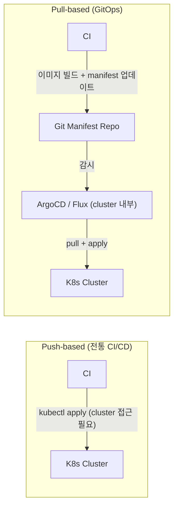
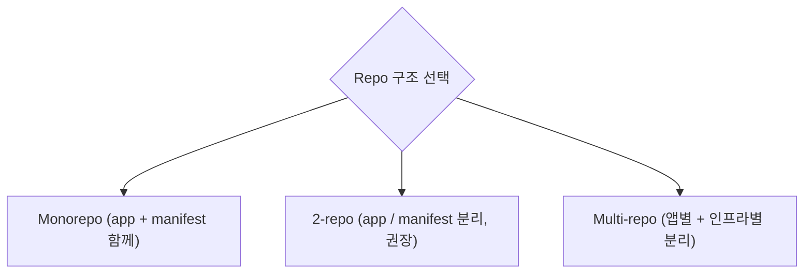
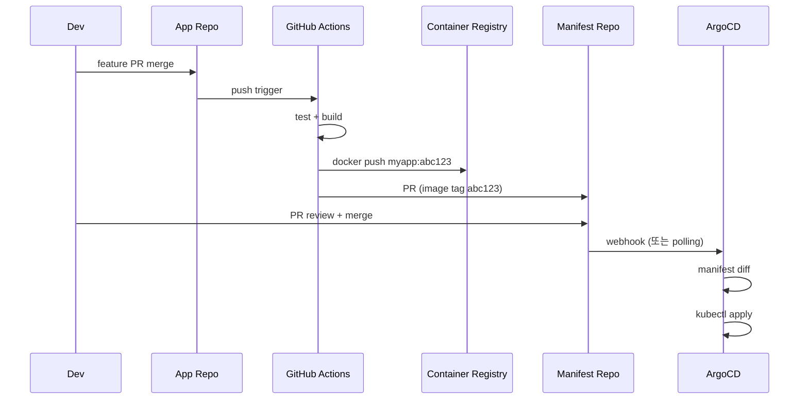
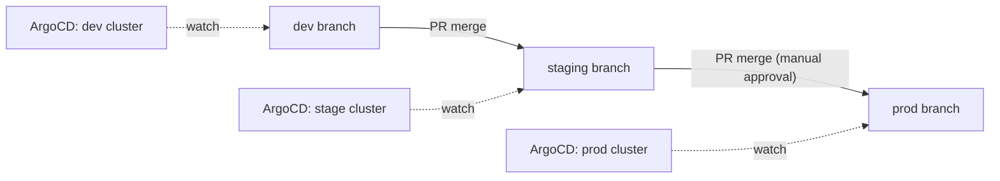
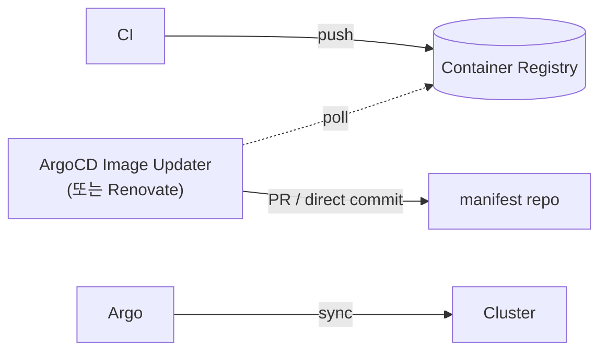
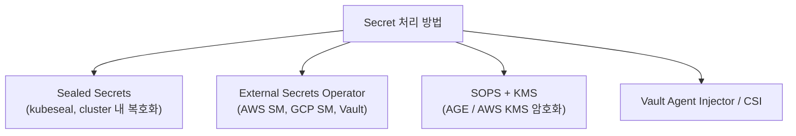
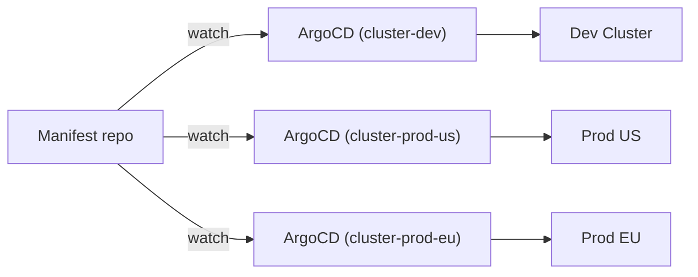

## 정의

**GitOps** = Git 을 *single source of truth* 로 삼아 *자동으로 인프라 + 앱 상태를 reconcile* 하는 운영 방식.

## GitOps 4가지 원칙 (OpenGitOps)

1. **Declarative**: 시스템 *원하는 상태* 가 *선언적* (YAML).
2. **Versioned and Immutable**: Git 으로 *버전 + 불변*.
3. **Pulled Automatically**: 시스템이 *자동 fetch + apply*.
4. **Continuously Reconciled**: 지속적 *desired vs actual 비교 + 수정*.

## Push vs Pull 모델



| 항목 | Push-based | Pull-based (GitOps) |
|---|---|---|
| Cluster 접근 | CI 서버가 직접 접근 | 에이전트가 내부에서 pull |
| 보안 | CI 에 cluster 권한 노출 | *cluster 권한 외부 노출 없음* |
| 자동 복구 | 없음 | *drift 감지 + 자동 복구* |
| 감사 (audit) | CI history | *Git log (PR + 리뷰)* |
| 다중 cluster | 복잡 | *에이전트 배포만으로 확장* |

## Repo 구조 패턴



### 1. Monorepo (app + manifest)

```
my-repo/
├── src/          (app code)
├── k8s/          (manifest)
│   ├── base/
│   └── overlays/
│       ├── dev/
│       └── prod/
└── .github/workflows/
    └── build.yml
```

장점: 단순. 단점: *app PR 이 인프라 변경 동시 일으킴* → 위험.

### 2. 2-repo (권장)

```
app-repo/
├── src/
└── .github/workflows/
    └── build.yml  # 이미지 빌드 → registry push

manifest-repo/
├── apps/
│   └── web/
│       ├── base/
│       │   ├── deployment.yaml
│       │   └── kustomization.yaml
│       └── overlays/
│           ├── dev/
│           │   └── kustomization.yaml  # image tag dev
│           └── prod/
│               └── kustomization.yaml  # image tag prod
└── argocd/
    └── applications.yaml
```

> *CI 가 새 image* → *manifest repo 의 image tag 자동 update* → ArgoCD 가 cluster 동기화.

## CI/CD 통합 흐름



```yaml
# GitHub Actions: build.yml
jobs:
  build:
    runs-on: ubuntu-latest
    steps:
      - uses: actions/checkout@v4
      - name: Build and push
        run: |
          docker buildx build \
            --platform linux/amd64,linux/arm64 \
            -t ghcr.io/myorg/myapp:${{ github.sha }} \
            --push .
      - name: Update manifest
        run: |
          git clone https://x-token:${{ secrets.MANIFEST_TOKEN }}@github.com/myorg/manifests
          cd manifests
          # yq 로 image tag 업데이트
          yq e '.images[0].newTag = "${{ github.sha }}"' \
            -i apps/web/overlays/prod/kustomization.yaml
          git commit -am "chore: update web image to ${{ github.sha }}"
          git push
```

## Environment Promotion



또는 *디렉토리 분리 (Kustomize overlay)*:

```
manifests/
├── base/
│   ├── deployment.yaml    # 공통 설정
│   └── kustomization.yaml
└── overlays/
    ├── dev/
    │   ├── kustomization.yaml  # replica: 1, image: dev-tag
    │   └── patch-resources.yaml
    ├── staging/
    │   └── kustomization.yaml  # replica: 2
    └── prod/
        ├── kustomization.yaml  # replica: 5, HPA
        └── patch-hpa.yaml
```

```yaml
# overlays/prod/kustomization.yaml
apiVersion: kustomize.config.k8s.io/v1beta1
kind: Kustomization
resources:
  - ../../base
images:
  - name: myapp
    newName: ghcr.io/myorg/myapp
    newTag: abc123sha
patches:
  - path: patch-hpa.yaml
```

## Image Updater



| 도구 | 방식 | 특징 |
|---|---|---|
| **ArgoCD Image Updater** | tag 정책 기반 자동 commit | ArgoCD 통합 |
| **Renovate** | dependency PR | 광범위한 ecosystem |
| **Flux Image Automation** | Flux 내장 | Flux 전용 |
| **Keel** | 자동 deploy | webhook 기반 |

```yaml
# ArgoCD Image Updater annotation
apiVersion: argoproj.io/v1alpha1
kind: Application
metadata:
  annotations:
    argocd-image-updater.argoproj.io/image-list: myapp=ghcr.io/myorg/myapp
    argocd-image-updater.argoproj.io/myapp.update-strategy: semver
    argocd-image-updater.argoproj.io/myapp.allow-tags: regexp:^v[0-9]+\.[0-9]+\.[0-9]+$
```

## Secret 처리 (git 안전)



```bash
# Sealed Secrets 예시
kubeseal --fetch-cert > pub-cert.pem
kubectl create secret generic db-pass \
  --from-literal=password=mysecret --dry-run=client -o yaml \
  | kubeseal --cert pub-cert.pem > sealed-secret.yaml
# sealed-secret.yaml 을 git 에 commit 가능

# External Secrets Operator
apiVersion: external-secrets.io/v1beta1
kind: ExternalSecret
metadata:
  name: db-password
spec:
  refreshInterval: 1h
  secretStoreRef:
    name: aws-ssm
    kind: ClusterSecretStore
  target:
    name: db-password
  data:
    - secretKey: password
      remoteRef:
        key: /prod/db/password
```

## ArgoCD vs Flux

| 항목 | ArgoCD | Flux |
|---|---|---|
| **UI** | 강력 | Weave GitOps UI 별도 |
| **학습 곡선** | 중간 | 낮음 |
| **설치 방식** | `kubectl apply` | Flux CLI (`flux bootstrap`) |
| **Multi-tenancy** | 강 (Project 개념) | 보통 |
| **Image automation** | 별도 Image Updater | 내장 |
| **Notification** | built-in | Alertmanager 통합 |
| **OCI artifact** | 지원 | 지원 |
| **인기** | *2026 기준 더 인기* | 단순함 선호 |

## Multi-cluster GitOps



또는 *중앙 ArgoCD + 다중 cluster credential*:

```yaml
# ArgoCD Application: 다른 cluster 배포
spec:
  destination:
    server: https://k8s.prod-us.example.com   # 외부 cluster
    namespace: web
```

## Drift Detection

| 상황 | ArgoCD 동작 |
|---|---|
| 수동 `kubectl edit` | Out of Sync 표시 + selfHeal 시 자동 복구 |
| Git update | Sync 트리거 (webhook 또는 3분 polling) |
| Image tag 변경 | Image Updater 가 manifest commit |
| CRD 삭제 | Sync 오류 (finalizer 남음) |

## 흔한 함정

> [!WARNING]
> 1. **수동 hotfix** = git 우회. cluster 상태 ArgoCD 가 revert. 항상 git PR.
> 2. **Branch 정책 부재** = main 직접 push. *branch protection + PR 리뷰 필수*.
> 3. **모든 cluster 같은 manifest** = 환경별 차이 못 표현. Kustomize overlay / Helm values.
> 4. **Secret 평문 git commit** = 히스토리 영구 노출. SOPS / Sealed Secrets / ESO.
> 5. **거대한 단일 PR** = ArgoCD 가 한 번에 대량 변경 적용. *작은 PR + canary 배포*.
> 6. **Webhook 미설정** = 3분 polling 지연. GitHub webhook 설정 권장.

## 관련 위키

- [[argocd]]
- [[github-actions]]
- [[helm]]
- [[k8s-configmap-secret]]
