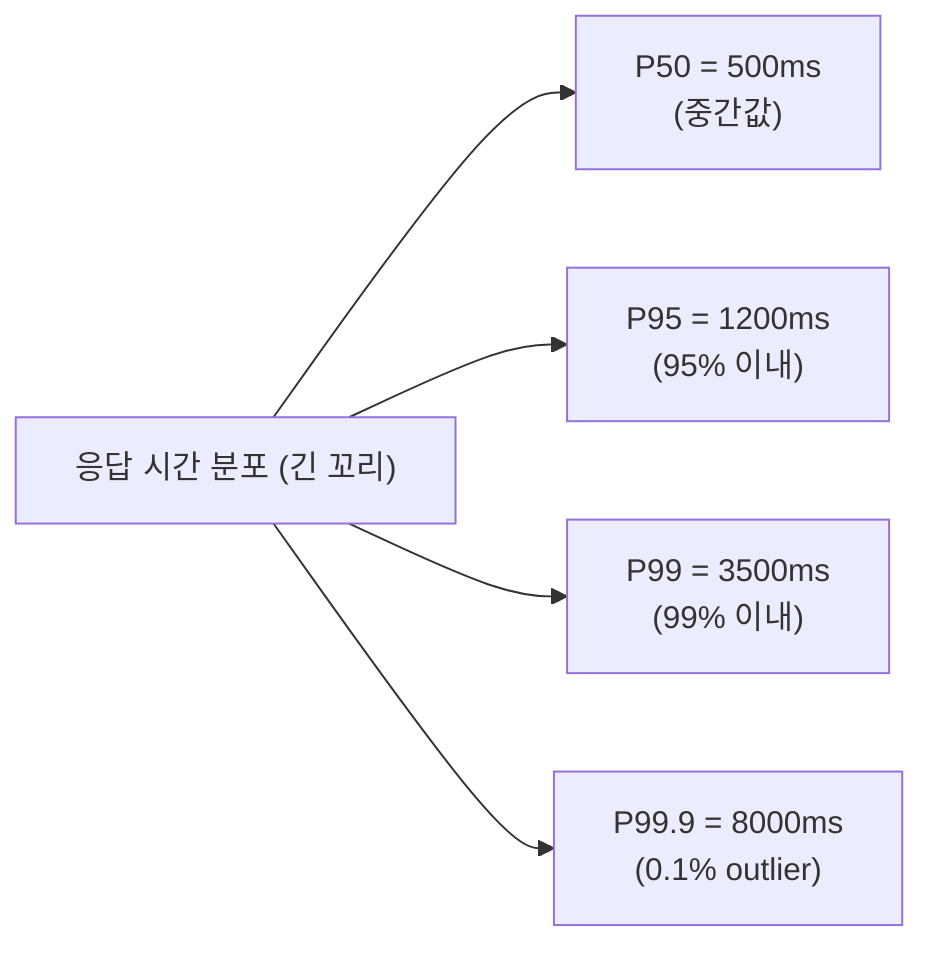

## 정의

**P50 / P95 / P99** = latency *분포의 분위수*. 평균은 *outlier 에 가려져 무의미*. 음성 에이전트의 *사용자 경험* 은 *p95/p99* 가 결정.

> [!IMPORTANT]
> *평균 응답 시간 800ms* 라도 *P99 = 5초* 면 *100명 중 1명은 5초 대기*. 음성 = "한 번 깨지면 대화 망함".

## Percentile 정의

```
정렬된 latency 값 100개 중:
- P50 (median) = 50번째 값
- P95 = 95번째 값
- P99 = 99번째 값
- P99.9 = 99.9번째 값
```



## 분포 시각화

<ChartJs
  client:visible
  type="line"
  title="음성 응답 latency 분포 (가상)"
  caption="long-tail. 평균은 거짓말, percentile 이 진실."
  height="280px"
  data={{
    labels: ['100ms','300ms','500ms','700ms','900ms','1200ms','2000ms','3000ms','5000ms','10000ms'],
    datasets: [{
      label: '요청 수',
      data: [50, 320, 800, 950, 700, 400, 200, 80, 30, 5],
      borderColor: '#3b82f6',
      backgroundColor: 'rgba(59,130,246,0.2)',
      fill: true,
      tension: 0.3,
    }],
  }}
  options={{ scales: { y: { title: { display: true, text: '요청 수' } } } }}
/>

> Tail (3초+) 이 *작아 보이지만* 사용자 입장에서는 *치명적*.

## 평균 vs Percentile

```python
# 가상 latency 데이터 (음성 응답)
latencies = [
    *[500] * 95,    # 95명이 500ms
    *[1000] * 4,    # 4명이 1초
    *[5000] * 1,    # 1명이 5초 (timeout 직전)
]

print(f"평균: {sum(latencies) / len(latencies):.0f}ms")
# → 평균: 590ms ← "괜찮네"

import numpy as np
print(f"P50: {np.percentile(latencies, 50):.0f}ms")
print(f"P95: {np.percentile(latencies, 95):.0f}ms")
print(f"P99: {np.percentile(latencies, 99):.0f}ms")
# → P50: 500ms, P95: 500ms, P99: 5000ms ← "1%가 5초!"
```

## 측정: HDR Histogram

```python
from hdrh.histogram import HdrHistogram

# 1ms ~ 60s, 3 자리 정밀도
hist = HdrHistogram(1, 60_000, 3)

for latency_ms in latencies:
    hist.record_value(latency_ms)

print(f"P50: {hist.get_value_at_percentile(50)}ms")
print(f"P95: {hist.get_value_at_percentile(95)}ms")
print(f"P99: {hist.get_value_at_percentile(99)}ms")
print(f"P99.9: {hist.get_value_at_percentile(99.9)}ms")
```

| 측정 도구 | 의미 |
|---|---|
| **HDR Histogram** | 정확, 고정 메모리 |
| **t-digest** | 분산 환경, 합치기 좋음 |
| **Prometheus Histogram** | 분산 + 시각화 |
| **CloudWatch p* metric** | 비싸지만 편함 |

## 분산 환경: t-digest

```python
from tdigest import TDigest

digest = TDigest()
for v in latencies:
    digest.update(v)

# 여러 노드의 digest 합치기
node1_digest + node2_digest + ...

# percentile query
digest.percentile(95)
```

> 각 노드의 digest 를 *Redis* 에 저장 → 주기적 머지. *전역 percentile*.

## Coordinated Omission

> Gil Tene 의 유명한 문제. 측정 시 *느린 요청 동안 *측정도 못 하는** → *진짜 latency 보다 좋게 나옴*.

```python
# ❌ 잘못된 측정
while True:
    start = time.time()
    do_request()
    elapsed = time.time() - start
    record(elapsed)
    # 만약 request 가 10초 걸렸으면, 그 10초간 *추가 측정 못 함*

# ✓ Coordinated omission 보정
expected_rate_ms = 100  # 100ms 마다 1개
last_send = time.time()
while True:
    target = last_send + expected_rate_ms / 1000
    sleep_until(target)
    start = time.time()

    # *예정된 시간이 지났는데 보내지 못한 시간* 도 latency 에 포함
    expected_start = target
    do_request()
    elapsed = time.time() - expected_start   # ← 보정

    record(elapsed)
    last_send = target
```

## Voice Agent SLO

| Metric | P50 | P95 | P99 |
|---|---|---|---|
| End-to-end | 700ms | 1200ms | 2000ms |
| STT | 200ms | 400ms | 800ms |
| LLM TTFT | 300ms | 600ms | 1500ms |
| TTS TTFB | 150ms | 300ms | 700ms |
| Network RTT | 30ms | 80ms | 200ms |

> [!IMPORTANT]
> *P99 가 1초 이상* 이면 *1% 사용자가 어색한 대화*. 음성 SLO 는 *P99 기준*.

## 단계별 분석

```python
class LatencyTracker:
    def __init__(self):
        self.stages = defaultdict(HdrHistogram)

    def record(self, stage: str, latency_ms: int):
        self.stages[stage].record_value(latency_ms)

    def report(self):
        for stage, hist in self.stages.items():
            print(f"{stage}:")
            for p in [50, 95, 99, 99.9]:
                print(f"  P{p}: {hist.get_value_at_percentile(p)}ms")

# 사용
tracker.record('stt', stt_elapsed)
tracker.record('llm_ttft', llm_ttft)
tracker.record('tts_ttfb', tts_ttfb)
tracker.record('end_to_end', total)
```

## SLO / Error Budget

자세한 건 [[slo-sli-error-budget]].

```
SLO: 30일 동안 P95 end-to-end < 1500ms
Error Budget = 30일 × 24h × 60min × 5% = 2160분

P95 > 1500ms 인 1분 = budget 1분 소진
budget 소진 → feature freeze + reliability 작업
```

## 흔한 함정

> [!WARNING]
> 1. **평균만 봄** = outlier 무시. P95/P99 필수.
> 2. **Prometheus histogram bucket 부정확** = bucket 범위 밖이면 정확도 손실. HDR / t-digest 권장.
> 3. **Coordinated omission** = 실측이 *너무 좋아 보임*. 보정 필요.
> 4. **샘플링 너무 적음** = P99 의미 X. 최소 1000+ 샘플.

## 관련 위키

- [[voice-agent-architecture]]
- [[slo-sli-error-budget]]
- [[prometheus]]
- [[opentelemetry]]
