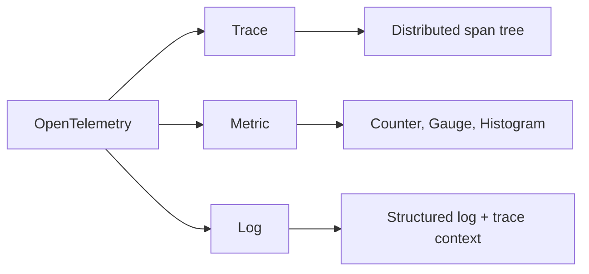
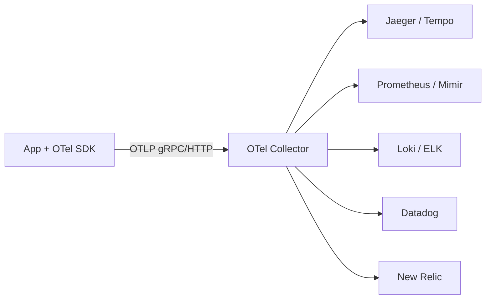
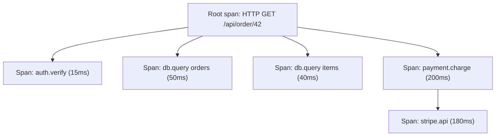
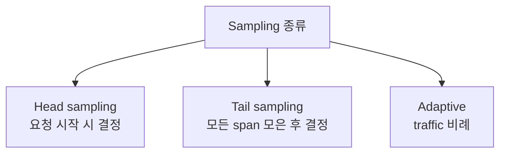

## 정의

**OpenTelemetry (OTel)** = *observability 의 vendor-neutral 표준*. CNCF. trace + metric + log 의 *SDK + protocol (OTLP) + collector*. 2019 출범 (OpenTracing + OpenCensus 합병).

## 3 signal



## 아키텍처



> **Vendor lock-in 없음**. SDK 는 표준. 어떤 backend 라도 collector 가 라우팅.

## Trace = Span Tree



각 span:

```json
{
  "traceId": "abc123...",
  "spanId": "def456",
  "parentSpanId": "xyz789",
  "name": "db.query",
  "kind": "CLIENT",
  "startTime": "...",
  "endTime": "...",
  "attributes": {
    "db.statement": "SELECT * FROM orders WHERE id=?",
    "db.system": "postgresql"
  },
  "events": [...],
  "status": { "code": "OK" }
}
```

## Context Propagation (W3C)

```http
traceparent: 00-abc123def456789...-1111222233334444-01
tracestate: vendor1=value1,vendor2=value2
```

> *모든 HTTP 호출에 traceparent 헤더*. 다른 service 가 *같은 trace 의 child span* 생성.

## Auto-instrumentation

```bash
# Java agent (코드 변경 없이)
java -javaagent:opentelemetry-javaagent.jar \
  -Dotel.service.name=order-service \
  -Dotel.exporter.otlp.endpoint=http://collector:4317 \
  -jar app.jar

# Python
opentelemetry-instrument --traces_exporter otlp python app.py

# Node
NODE_OPTIONS="--require @opentelemetry/auto-instrumentations-node/register" \
OTEL_SERVICE_NAME=order-service \
node app.js
```

> *코드 1 줄 변경 없이* HTTP/gRPC/DB 호출이 자동 instrumented.

## Manual Instrumentation

```typescript
import { trace } from '@opentelemetry/api';

const tracer = trace.getTracer('my-service');

async function processOrder(orderId: string) {
  const span = tracer.startSpan('processOrder', {
    attributes: { 'order.id': orderId },
  });
  try {
    const order = await fetchOrder(orderId);
    span.setAttribute('order.total', order.total);
    await charge(order);
    span.setStatus({ code: SpanStatusCode.OK });
  } catch (e) {
    span.recordException(e);
    span.setStatus({ code: SpanStatusCode.ERROR });
    throw e;
  } finally {
    span.end();
  }
}
```

## OTel Collector

```yaml
receivers:
  otlp:
    protocols:
      grpc:
      http:
  prometheus:
    config:
      scrape_configs: [...]

processors:
  batch:
  memory_limiter:
  attributes:
    actions:
      - key: env
        value: prod
        action: insert

exporters:
  otlp/jaeger:
    endpoint: jaeger:4317
  prometheus:
    endpoint: 0.0.0.0:8889
  loki:
    endpoint: http://loki:3100/loki/api/v1/push

service:
  pipelines:
    traces:
      receivers: [otlp]
      processors: [batch, attributes]
      exporters: [otlp/jaeger]
    metrics:
      receivers: [otlp, prometheus]
      processors: [batch]
      exporters: [prometheus]
    logs:
      receivers: [otlp]
      exporters: [loki]
```

## Sampling



- *Head*: 100% trace 보존 불가능 → 1-10%.
- *Tail*: 에러 / 느린 trace 만 보존 → 더 의미있는 데이터.

## OpenTelemetry vs Vendor

| | OTel | DataDog APM | New Relic |
|---|---|---|---|
| 표준 | *예 (CNCF)* | proprietary | proprietary |
| Lock-in | *없음* | 강함 | 강함 |
| 기능 | 표준 기능 | *advanced UI/AI* | 동일 |
| 가격 | 자체 호스팅 무료 | 비쌈 | 비쌈 |
| 추세 | *2026 표준* | OTel 통합 진행 | OTel 통합 |

## 흔한 함정

> [!WARNING]
> 1. **모든 trace 보존** = 비용 폭증. sampling 필수.
> 2. **PII (이메일, password) 가 attribute 에** = log 노출. *redact processor* 필수.
> 3. **Context propagation 미구현** = trace 가 *service 경계에서 끊김*. SDK 의 instrumentation 확인.
> 4. **OTel SDK + vendor SDK 동시 사용** = 충돌. *OTel only* 권장.

## 관련 위키

- [[prometheus]]
- [[slo-sli-error-budget]]
- [[aws-cloudwatch]]
- [[microservices-vs-monolith]]
