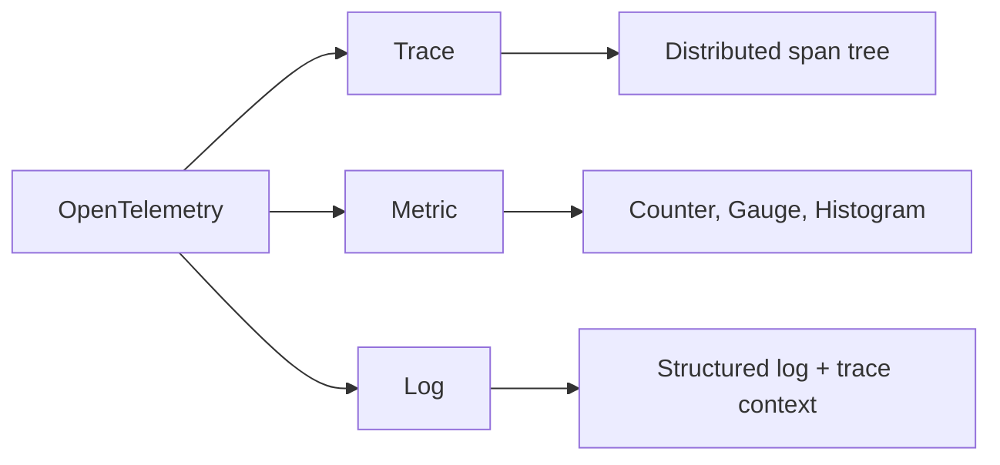
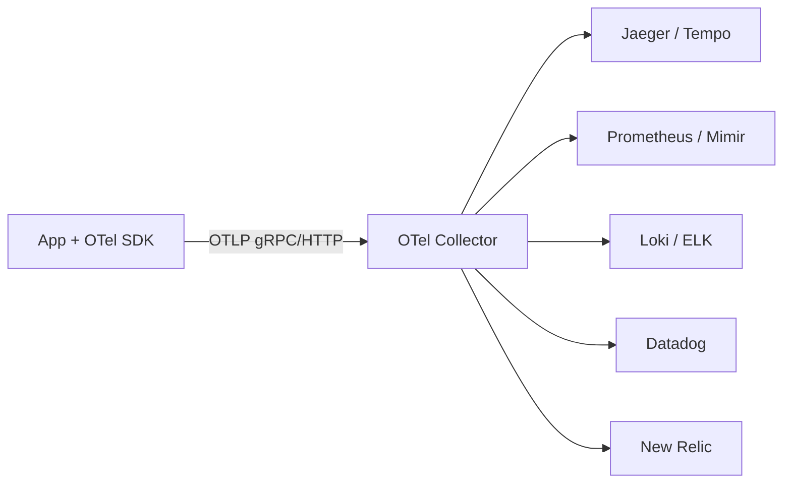
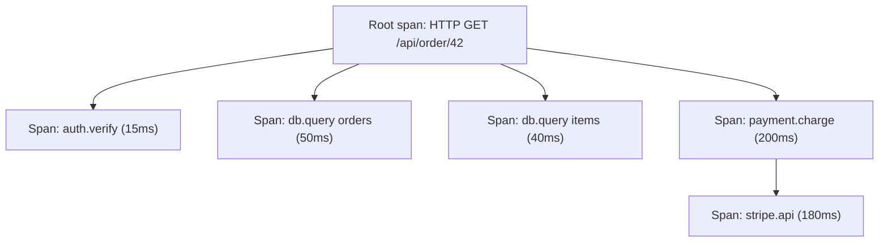
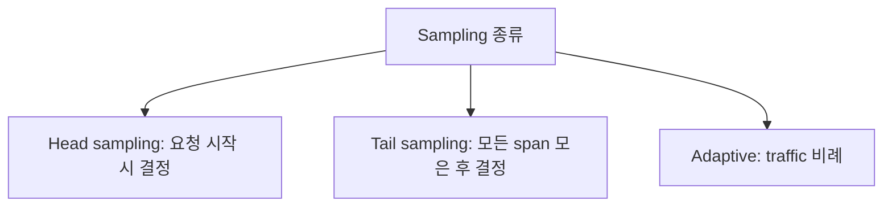

## 정의

**OpenTelemetry (OTel)** = *observability 의 vendor-neutral 표준*. CNCF. trace + metric + log 의 *SDK + protocol (OTLP) + collector*. 2019 출범 (OpenTracing + OpenCensus 합병).

OTel 이전에는 회사마다 Datadog, New Relic, Jaeger, Zipkin 각각 SDK 를 붙여야 했다. OTel 은 **하나의 SDK, 어떤 backend 로도 라우팅** 을 가능하게 한 표준이다.

## 문제 상황과 동기

마이크로서비스 환경에서 하나의 요청이 수십 개 서비스를 거칠 때:

- A 서비스에서 에러가 났는데 B, C, D 어디서 느려진 건지 모름
- 각 서비스 로그를 별도로 조회해야 하며 상관관계를 수동으로 찾아야 함
- 모니터링 vendor 를 바꾸면 모든 서비스 SDK 를 재작성해야 함

OTel 은 이 세 문제를 **trace ID 로 연결 + vendor-neutral SDK + collector 라우팅** 으로 해결한다.

## 3 signal



| Signal | 용도 | 질문 |
|:---|:---|:---|
| **Trace** | 요청의 전체 경로 추적 | "왜 이 요청이 느린가?" |
| **Metric** | 수치 집계 (latency, error rate) | "지금 시스템 상태는?" |
| **Log** | 이벤트 기록 (trace context 포함) | "그 시점에 정확히 무슨 일이?" |

## 아키텍처



> **Vendor lock-in 없음**. SDK 는 표준. 어떤 backend 라도 collector 가 라우팅.

### Collector 의 역할

```
App → [Receiver] → [Processor] → [Exporter] → Backend
```

- **Receiver**: OTLP, Prometheus, Jaeger 등 다양한 입력 형식 수신
- **Processor**: batch, 필터, redact (PII 제거), attribute 추가
- **Exporter**: 각 backend 형식으로 변환 후 전송

## Trace = Span Tree



각 span:

```json
{
  "traceId": "abc123...",
  "spanId": "def456",
  "parentSpanId": "xyz789",
  "name": "db.query",
  "kind": "CLIENT",
  "startTime": "...",
  "endTime": "...",
  "attributes": {
    "db.statement": "SELECT * FROM orders WHERE id=?",
    "db.system": "postgresql"
  },
  "events": [...],
  "status": { "code": "OK" }
}
```

### Span Kind

| Kind | 설명 | 예시 |
|:---|:---|:---|
| `SERVER` | 들어오는 요청 처리 | HTTP 서버 handler |
| `CLIENT` | 나가는 요청 생성 | HTTP client call |
| `PRODUCER` | 메시지 큐 발행 | Kafka publish |
| `CONSUMER` | 메시지 큐 소비 | Kafka consume |
| `INTERNAL` | 내부 처리 | 함수 내부 로직 |

## Context Propagation (W3C)

```http
traceparent: 00-abc123def456789...-1111222233334444-01
tracestate: vendor1=value1,vendor2=value2
```

> *모든 HTTP 호출에 traceparent 헤더*. 다른 service 가 *같은 trace 의 child span* 생성.

`traceparent` 구조:
- `00`: 버전
- `abc123def456789...`: trace ID (16 byte hex)
- `1111222233334444`: parent span ID (8 byte hex)
- `01`: flags (01 = sampled)

## Auto-instrumentation

```bash
# Java agent (코드 변경 없이)
java -javaagent:opentelemetry-javaagent.jar \
  -Dotel.service.name=order-service \
  -Dotel.exporter.otlp.endpoint=http://collector:4317 \
  -jar app.jar

# Python
opentelemetry-instrument --traces_exporter otlp python app.py

# Node
NODE_OPTIONS="--require @opentelemetry/auto-instrumentations-node/register" \
OTEL_SERVICE_NAME=order-service \
node app.js
```

> *코드 1 줄 변경 없이* HTTP/gRPC/DB 호출이 자동 instrumented.

자동 계측 지원 범위 (Java 기준):
- HTTP/gRPC 서버 및 클라이언트
- JDBC, MongoDB, Redis, Elasticsearch 등 DB
- Kafka, RabbitMQ, AWS SQS 등 메시지 큐
- 주요 프레임워크 (Spring, Quarkus, Micronaut)

## Manual Instrumentation

```typescript
import { trace } from '@opentelemetry/api';

const tracer = trace.getTracer('my-service');

async function processOrder(orderId: string) {
  const span = tracer.startSpan('processOrder', {
    attributes: { 'order.id': orderId },
  });
  try {
    const order = await fetchOrder(orderId);
    span.setAttribute('order.total', order.total);
    await charge(order);
    span.setStatus({ code: SpanStatusCode.OK });
  } catch (e) {
    span.recordException(e);
    span.setStatus({ code: SpanStatusCode.ERROR });
    throw e;
  } finally {
    span.end();
  }
}
```

## OTel Collector

```yaml
receivers:
  otlp:
    protocols:
      grpc:
      http:
  prometheus:
    config:
      scrape_configs: [...]

processors:
  batch:
  memory_limiter:
  attributes:
    actions:
      - key: env
        value: prod
        action: insert

exporters:
  otlp/jaeger:
    endpoint: jaeger:4317
  prometheus:
    endpoint: 0.0.0.0:8889
  loki:
    endpoint: http://loki:3100/loki/api/v1/push

service:
  pipelines:
    traces:
      receivers: [otlp]
      processors: [batch, attributes]
      exporters: [otlp/jaeger]
    metrics:
      receivers: [otlp, prometheus]
      processors: [batch]
      exporters: [prometheus]
    logs:
      receivers: [otlp]
      exporters: [loki]
```

## Sampling



- *Head*: 100% trace 보존 불가능 → 1-10%.
- *Tail*: 에러 / 느린 trace 만 보존 → 더 의미있는 데이터.

### Tail Sampling 설정 예시

```yaml
processors:
  tail_sampling:
    decision_wait: 10s
    num_traces: 100000
    policies:
      - name: errors-policy
        type: status_code
        status_code: { status_codes: [ERROR] }
      - name: slow-policy
        type: latency
        latency: { threshold_ms: 500 }
      - name: low-rate-policy
        type: probabilistic
        probabilistic: { sampling_percentage: 5 }
```

## OpenTelemetry vs Vendor

| | OTel | DataDog APM | New Relic |
|---|---|---|---|
| 표준 | *예 (CNCF)* | proprietary | proprietary |
| Lock-in | *없음* | 강함 | 강함 |
| 기능 | 표준 기능 | *advanced UI/AI* | 동일 |
| 가격 | 자체 호스팅 무료 | 비쌈 | 비쌈 |
| 추세 | *2026 표준* | OTel 통합 진행 | OTel 통합 |

## 흔한 함정

> [!WARNING]
> 1. **모든 trace 보존** = 비용 폭증. sampling 필수.
> 2. **PII (이메일, password) 가 attribute 에** = log 노출. *redact processor* 필수.
> 3. **Context propagation 미구현** = trace 가 *service 경계에서 끊김*. SDK 의 instrumentation 확인.
> 4. **OTel SDK + vendor SDK 동시 사용** = 충돌. *OTel only* 권장.

### 함정 5: Collector 없이 직접 backend 전송

App → Backend 직접 전송은 구성 변경 시 모든 서비스를 재배포해야 한다. Collector 를 sidecar 또는 daemonset 으로 두면 backend 변경 시 Collector 설정만 수정하면 된다.

### 함정 6: Span attribute semantic convention 무시

OTel 은 `db.statement`, `http.method`, `net.peer.name` 같은 **Semantic Conventions** 를 정의한다. 이를 무시하고 임의 attribute 이름을 쓰면 backend UI 의 자동 분석 기능이 동작하지 않는다.

## 관련 위키

- [[prometheus]]
- [[slo-sli-error-budget]]
- [[aws-cloudwatch]]
- [[microservices-vs-monolith]]
