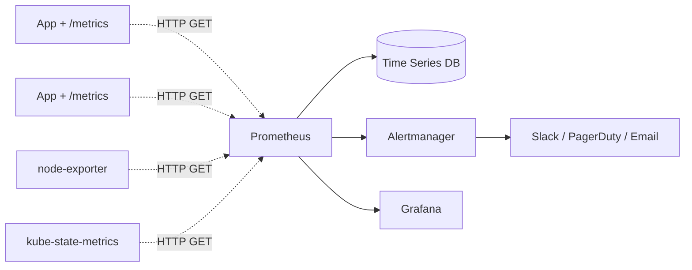
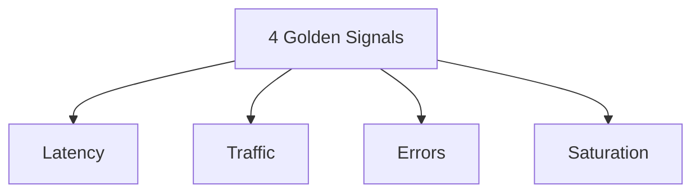

## 정의

**Prometheus** = *pull 기반 시계열 metric 시스템*. *PromQL* 로 쿼리. CNCF graduated. *2026 클라우드 네이티브 메트릭 표준*.

## 아키텍처



> **Pull 모델**: Prometheus 가 *각 target 의 `/metrics` 정기 scrape*. *Push* 가 아닌 이유: *target healthy 자동 확인*, *scrape interval 통제*.

## Exposition Format

```
# HELP http_requests_total Total HTTP requests
# TYPE http_requests_total counter
http_requests_total{method="GET",status="200",path="/api/users"} 1234
http_requests_total{method="POST",status="201",path="/api/orders"} 567

# HELP http_request_duration_seconds Request duration
# TYPE http_request_duration_seconds histogram
http_request_duration_seconds_bucket{le="0.1"} 5000
http_request_duration_seconds_bucket{le="0.5"} 5800
http_request_duration_seconds_bucket{le="1.0"} 5900
http_request_duration_seconds_bucket{le="+Inf"} 6000
http_request_duration_seconds_sum 412.5
http_request_duration_seconds_count 6000
```

## 4가지 메트릭 타입

| 타입 | 의미 | 예 |
|---|---|---|
| **Counter** | 단조 증가 | requests_total |
| **Gauge** | 임의 변동 | memory_usage_bytes |
| **Histogram** | 분포 (bucket) | request_duration_seconds |
| **Summary** | quantile (클라이언트 계산) | request_duration_quantile |

## PromQL 예시

```promql
# 요청률 (5분)
rate(http_requests_total[5m])

# 에러 비율
sum(rate(http_requests_total{status=~"5.."}[5m]))
  / sum(rate(http_requests_total[5m]))

# 평균 응답 시간
rate(http_request_duration_seconds_sum[5m])
  / rate(http_request_duration_seconds_count[5m])

# p95 latency (histogram_quantile)
histogram_quantile(0.95,
  sum by (le, service) (rate(http_request_duration_seconds_bucket[5m]))
)

# 메모리 사용량 (gauge)
process_resident_memory_bytes

# CPU 사용률
rate(process_cpu_seconds_total[1m])

# 가용성 (up)
avg_over_time(up{job="api"}[5m])
```

## Exporter

| Exporter | 메트릭 |
|---|---|
| node-exporter | Linux node (CPU, RAM, disk, network) |
| kube-state-metrics | K8s 객체 상태 |
| cAdvisor | container metric (K8s 기본 포함) |
| postgres_exporter | PG 통계 |
| redis_exporter | Redis |
| blackbox_exporter | HTTP/TCP probe |
| nginx-exporter | nginx |

## 4 Golden Signals (Google SRE)



> *모든 서비스 대시보드의 기본 4*. 이 4 가지면 *대부분의 문제 발견*.

## Alertmanager

```yaml
# Alert rule
groups:
  - name: api
    rules:
      - alert: HighErrorRate
        expr: |
          sum(rate(http_requests_total{status=~"5.."}[5m]))
            / sum(rate(http_requests_total[5m])) > 0.05
        for: 5m
        labels: { severity: page }
        annotations:
          summary: "5xx rate > 5%"
```

```yaml
# Alertmanager 설정
route:
  group_by: [alertname, severity]
  receiver: slack
  routes:
    - match: { severity: page }
      receiver: pagerduty
receivers:
  - name: slack
    slack_configs:
      - api_url: https://hooks.slack.com/...
  - name: pagerduty
    pagerduty_configs:
      - service_key: ...
```

## Long-Term Storage

| | Local TSDB | Thanos | Mimir | Cortex |
|---|---|---|---|---|
| Retention | 15일 기본 | 무제한 (S3) | 무제한 | 무제한 |
| HA | 없음 | 있음 | 있음 | 있음 |
| Multi-tenancy | 없음 | 있음 | 있음 | 있음 |

> *수년 retention + 다중 cluster* = Thanos / Mimir.

## Recording Rule

```yaml
- record: job:http_requests:rate5m
  expr: sum by (job) (rate(http_requests_total[5m]))
```

> *자주 쓰는 쿼리 결과 미리 계산*. 대시보드 속도 ↑.

## 흔한 함정

> [!WARNING]
> 1. **Label cardinality 폭증** = user_id, request_id 같은 *고유 값* 을 label 로. 메모리 / disk 폭발.
> 2. **`rate()` 의 *짧은 range*** = scrape interval 보다 작으면 NaN.
> 3. **Counter reset 인식 못함** = `rate()` 가 자동. `increase()` 와 차이.
> 4. **Push 가 필요한 경우** = Pushgateway 사용 (batch job 등). 일반 service 는 *pull*.

## 관련 위키

- [[opentelemetry]]
- [[slo-sli-error-budget]]
- [[aws-cloudwatch]]
- [[k8s-pod]]
