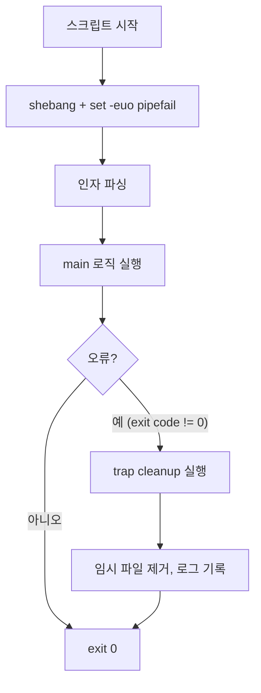

## 정의

**Shell Script** 는 shell (bash, zsh, sh) 커맨드를 파일로 저장하여 자동화하는 스크립트. DevOps, CI/CD, sysadmin 필수.

## 안전한 시작

```bash
#!/usr/bin/env bash
set -euo pipefail
IFS=$'\n\t'
```

- `-e`: 명령 실패 시 즉시 종료
- `-u`: 정의 안 된 변수 참조 시 오류
- `-o pipefail`: pipe 안의 실패도 캐치
- `IFS`: 안전한 word splitting (공백/탭/개행 문자만)

## 실행 흐름



## 변수

```bash
name="Alice"
echo "Hello, $name"
echo "Hello, ${name}"

# 기본값
echo "${port:-8080}"           # $port 없으면 8080

# 없으면 대입
: "${port:=8080}"

# 필수값 강제
echo "${API_KEY:?API_KEY is required}"

# 배열
arr=(a b c)
echo "${arr[0]}"
echo "${arr[@]}"
echo "${#arr[@]}"              # 길이

# 연관 배열 (bash 4+)
declare -A map
map["host"]="localhost"
map["port"]="5432"
echo "${map[host]}"
```

## 조건과 반복

```bash
if [[ -f "$file" ]]; then
    echo "exists"
fi

if [[ "$env" == "prod" ]]; then
    set_prod_vars
elif [[ "$env" == "dev" ]]; then
    set_dev_vars
fi

for f in *.log; do
    echo "$f"
done

while read -r line; do
    echo "$line"
done < input.txt

# C-style for
for ((i=0; i<10; i++)); do
    echo "$i"
done
```

### 파일 테스트 연산자

| 연산자 | 의미 |
|:---|:---|
| `-f $f` | 파일 존재 (regular file) |
| `-d $d` | 디렉토리 존재 |
| `-e $p` | 경로 존재 (파일/디렉토리 모두) |
| `-r $f` | 읽기 가능 |
| `-z $s` | 빈 문자열 |
| `-n $s` | 비어있지 않은 문자열 |
| `$a -lt $b` | 정수 비교 (less than) |

## 함수

```bash
greet() {
    local name="$1"
    echo "Hello, $name"
}

greet "World"

# exit code 로 불리언 역할
is_healthy() {
    curl -sf "http://localhost:8080/health" > /dev/null
}

if is_healthy; then
    echo "서비스 정상"
fi
```

## 에러 처리

```bash
trap 'cleanup' EXIT ERR INT TERM

cleanup() {
    local exit_code=$?
    rm -f "$temp_file"
    exit "$exit_code"
}

# 특정 명령 실패 허용
some_command || true

# 실패 시 대안 실행
some_command || fallback_command

# 에러 위치 기록 (디버그용)
set -E
trap 'echo "Error at line $LINENO in ${FUNCNAME[0]}"' ERR
```

## 파일과 경로

```bash
# 스크립트 자신의 디렉토리
SCRIPT_DIR="$(cd "$(dirname "${BASH_SOURCE[0]}")" && pwd)"

# 임시 파일 (자동 정리)
temp_file="$(mktemp)"
trap 'rm -f "$temp_file"' EXIT

# 경로 분리 (순수 bash, dirname/basename 없이)
path="/var/log/app/error.log"
filename="${path##*/}"          # error.log
extension="${filename##*.}"     # log
basename_no_ext="${filename%.*}" # error
dir="${path%/*}"                # /var/log/app
```

## 텍스트 처리

```bash
# grep: 패턴 검색
grep -E "^ERROR" app.log
grep -c "pattern" file          # 매칭 줄 수
grep -n "error" file            # 줄 번호 포함

# awk: 필드 파싱
awk '{print $1}' file           # 첫 번째 필드 (공백 구분)
awk -F: '{print $1}' /etc/passwd # 콜론 구분자

# awk 집계
awk '{sum += $1} END {print sum}' numbers.txt
awk 'NR==5' file                # 5번째 줄

# sed: 치환
sed 's/foo/bar/g' file          # 모든 foo -> bar
sed -i 's/foo/bar/g' file       # in-place 수정
sed '/^#/d' file                # # 로 시작하는 줄 삭제
sed -n '10,20p' file            # 10-20번째 줄 출력

# 파이프 조합: 상위 10 에러 유형
grep "ERROR" app.log \
    | awk '{print $NF}' \
    | sort \
    | uniq -c \
    | sort -rn \
    | head -10
```

## stdin/stdout 처리

```bash
cat file.txt | grep pattern | wc -l
grep pattern < file.txt
grep pattern file.txt > out.txt 2>&1

# 표준 에러만 버림
command 2>/dev/null

# 표준 에러를 표준 출력으로
command 2>&1 | tee output.log

# heredoc (멀티라인 입력)
cat <<'EOF'
line 1
line 2
EOF

# process substitution (subshell 없이 while read)
while read -r line; do
    echo "$line"
done < <(some_command)
```

## 병렬 실행

```bash
# & 로 백그라운드, wait 로 완료 대기
for host in host1 host2 host3; do
    ssh "$host" "uptime" &
done
wait

# 개별 pid 추적 + 실패 감지
pids=()
for item in "${items[@]}"; do
    process_item "$item" &
    pids+=($!)
done
for pid in "${pids[@]}"; do
    wait "$pid" || echo "pid $pid failed"
done

# xargs -P (병렬 프로세스 수 지정)
find . -name "*.csv" | xargs -P 4 -I{} process.sh {}
```

## 로깅 패턴

```bash
LOG_FILE="script-$(date +%Y%m%d-%H%M%S).log"

log_info()  { echo "[$(date +%T)] INFO  $*" | tee -a "$LOG_FILE"; }
log_warn()  { echo "[$(date +%T)] WARN  $*" | tee -a "$LOG_FILE" >&2; }
log_error() { echo "[$(date +%T)] ERROR $*" | tee -a "$LOG_FILE" >&2; }

# 컬러 (터미널)
RED='\033[0;31m'
GREEN='\033[0;32m'
NC='\033[0m'
echo -e "${GREEN}Success${NC}"
echo -e "${RED}Failed${NC}"
```

## 인자 파싱

```bash
while getopts "hi:o:v" opt; do
    case $opt in
        h) echo "usage: script.sh [-i input] [-o output] [-v]" ; exit 0 ;;
        i) input="$OPTARG" ;;
        o) output="$OPTARG" ;;
        v) verbose=1 ;;
        *) exit 1 ;;
    esac
done
shift $((OPTIND - 1))
# 나머지 positional args: "$@"
```

## 실전 패턴: 배포 스크립트

```bash
#!/usr/bin/env bash
set -euo pipefail

readonly ENV="${1:?ENV required (prod|staging)}"
readonly DEPLOY_LOG="deploy-$(date +%Y%m%d-%H%M%S).log"
temp_dir=""

log()     { echo "[$(date +%T)] $*" | tee -a "$DEPLOY_LOG"; }
cleanup() { [[ -n "$temp_dir" ]] && rm -rf "$temp_dir"; }
trap cleanup EXIT

deploy() {
    temp_dir="$(mktemp -d)"

    log "Pulling latest image..."
    docker pull "myapp:latest"

    log "Stopping old container..."
    docker stop myapp 2>/dev/null || true
    docker rm   myapp 2>/dev/null || true

    log "Starting container (ENV=$ENV)..."
    docker run -d \
        --name myapp \
        --env-file "/config/$ENV.env" \
        -p 8080:8080 \
        "myapp:latest"

    log "Health check..."
    local max=30
    for i in $(seq 1 "$max"); do
        if curl -sf "http://localhost:8080/health" > /dev/null; then
            log "Health OK after ${i}s"
            return 0
        fi
        sleep 1
    done
    log "Health check FAILED after ${max}s"
    return 1
}

deploy
```

## 함정

> [!WARNING]
> 1. **quoting**: `$var` 는 항상 `"$var"` 로 감싸야 공백 처리 안전. 배열은 `"${arr[@]}"` (원소별 개별 인자).
> 2. **[ vs [[**: bash 는 `[[` 가 안전 (short-circuit, no word splitting). `[` 는 POSIX sh 용.
> 3. **backtick vs `$()`**: `$( )` 가 nesting 가능, 가독성 좋음. backtick 안에서 백슬래시 규칙이 달라 혼동 유발.
> 4. **subshell**: `( )` 안에서 변경한 변수는 밖에 반영 안 됨. 파이프도 같은 문제 (`while read < <(...)` 로 해결).
> 5. **`set -e` 와 if 조건**: 0이 아닌 exit code 를 반환하는 함수가 if/while 조건이나 `||/&&` 뒤에 있으면 `-e` 가 반응 안 함. 명시적 처리 필요.

> [!CAUTION]
> `rm -rf "$dir/"` 에서 `$dir` 이 빈 문자열이면 루트 삭제. 반드시 `[ -z "$dir" ]` 빈 문자열 검사 후 실행.

## 관련 위키

- [[github-actions]] - CI/CD 파이프라인 자동화
- [[argocd]] - GitOps 기반 자동 배포
- [[prometheus]] - 메트릭 수집 (exporter 스크립트 연동)
- [[zero-downtime-deployment]] - Blue-Green, Canary 배포 전략
