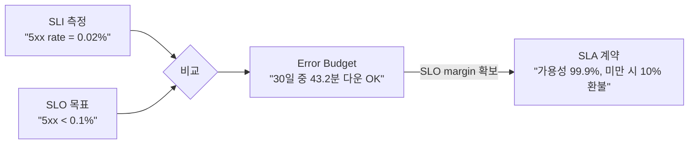
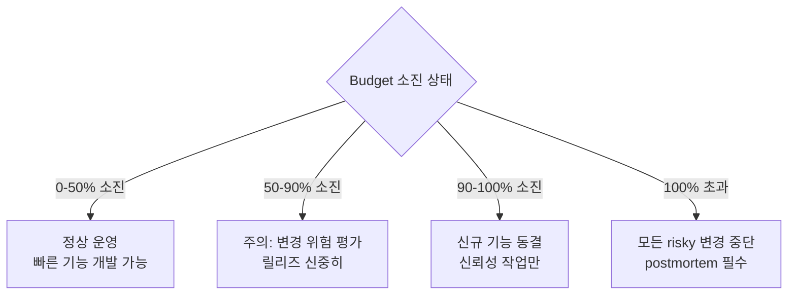
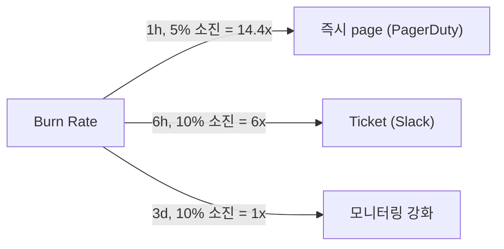

## 정의

| | 의미 |
|---|---|
| **SLI** (Indicator) | *측정 값* (예: 5xx 비율) |
| **SLO** (Objective) | *목표* (예: 99.9% 가용성) |
| **SLA** (Agreement) | *계약* (위반 시 환불 / 페널티) |
| **Error Budget** | *허용 가능한 실패 양* (SLO 에서 파생) |

## SRE 와 SLO 의 관계

**SRE (Site Reliability Engineering)** = Google 이 2003년 시작한 신뢰성 엔지니어링 방법론. SLO + Error Budget 을 *신뢰성과 개발 속도의 균형 메커니즘* 으로 활용.


> SLO + Error Budget = *개발팀과 운영팀의 공통 언어*. "서비스가 얼마나 안정적이어야 하는가?"

## 관계도



> *내부 SLO 는 SLA 보다 엄격하게* (margin). SLA 99.9% → 내부 SLO 99.95%.

## 좋은 SLI 4 카테고리

| 카테고리 | 예시 SLI | 측정 방식 |
|---|---|---|
| **Availability** | 성공 응답 비율 | `sum(rate(2xx+3xx)) / sum(rate(all))` |
| **Latency** | p95, p99 응답 시간 | `histogram_quantile(0.95, ...)` |
| **Throughput** | 처리량 (req/s) | `rate(requests_total[5m])` |
| **Correctness** | 올바른 응답 비율 | 비교 / sampling |

> Google SRE: *user-facing* 측면 → *서버 CPU 같은 내부 metric 보다 사용자 경험 중심*.

### 서비스 유형별 SLI

| 서비스 타입 | 주요 SLI |
|---|---|
| **Request / Response** (API) | Availability, Latency |
| **Data Processing** (batch) | Freshness, Correctness, Coverage |
| **Storage** | Durability, Availability, Latency |
| **Pub/Sub** (비동기) | Freshness (지연), Correctness |

## CUJ (Critical User Journey)

SLI 는 *사용자 관점* 의 여정 (CUJ) 기준으로 정의:

```
CUJ 예시: "사용자가 상품 검색 → 장바구니 → 결제"

SLI 1: 검색 API p95 < 300ms
SLI 2: 결제 성공률 > 99.99%
SLI 3: 장바구니 API availability > 99.9%
```

> *CPU 사용률, 메모리 같은 인프라 metric 이 아닌 사용자가 느끼는 것*.

## SLO 설정 예시

```
가용성 SLI = 성공_응답 / 총_응답
SLO = 30일 중 99.9% 이상

Error Budget = 30일 × 24h × 60min × (1 - 0.999)
             = 43,200 분 × 0.001
             = 43.2 분 / 월
```

| SLO | Error Budget (30일) | 적합한 서비스 |
|---|---|---|
| 99% | 7.2 시간 | 내부 도구 |
| 99.5% | 3.6 시간 | 중요 내부 서비스 |
| 99.9% | 43.2 분 | B2C 서비스 |
| 99.95% | 21.6 분 | 결제, 금융 |
| 99.99% | 4.32 분 | 핵심 인프라 |
| 99.999% | 26초 | 통신, 금융 핵심 |

> [!IMPORTANT]
> *SLO 99.999% (five-nines)* = 연간 5분. 매우 비싸고 달성하기 어려움. *비즈니스 임팩트에 맞는 수준 선택*.

## Error Budget Policy



> Error budget 의 *행동 contract*. 단순 메트릭이 아닌 *조직 정책* 이어야 의미 있음.

## SLO 계산 (PromQL)

```promql
# 30일 가용성 (rolling window)
sum_over_time(
  (sum(rate(http_requests_total{status!~"5.."}[1m]))
    / sum(rate(http_requests_total[1m])))[30d:1m]
)
/ count_over_time((sum(rate(http_requests_total[1m])))[30d:1m])

# Error Budget 남은 비율
1 - (
  (1 - current_availability) / (1 - 0.999)
)

# p95 latency SLI
histogram_quantile(0.95,
  sum by (le) (rate(http_request_duration_seconds_bucket[5m]))
)
```

## Multi-window Burn Rate Alert

*단순 threshold alert 보다 burn rate (소진 속도)* 가 의미 있음:



```promql
# fast burn (1h 기준 14.4배 초과 소진)
(
  sum(rate(http_5xx[1h])) / sum(rate(http_total[1h]))
) > (14.4 * (1 - 0.999))

# slow burn (6h 기준 6배)
(
  sum(rate(http_5xx[6h])) / sum(rate(http_total[6h]))
) > (6 * (1 - 0.999))
```

| 윈도우 | 배율 | 알림 종류 | 의미 |
|---|---|---|---|
| 1h | 14.4x | page | 2h 안에 budget 소진 |
| 6h | 6x | ticket | 5일 안에 소진 |
| 1d | 3x | weekly review | 10일 안에 소진 |

## SLA 예시 (실제 SaaS)

| SaaS | SLA | 위반 시 |
|---|---|---|
| AWS S3 | 99.99% (월) | service credit |
| AWS EC2 | 99.5% (월) | service credit |
| GitHub | 99.9% (분기) | credit |
| Stripe | 99.999% (결제 API) | credit |
| Cloudflare | 100% (보장) | credit |

## Postmortem 과 Error Budget

Error budget 소진 후에는 *postmortem* 필수:

```
Postmortem 구조
1. 요약: 무슨 일이 일어났는가 (5줄 이내)
2. 타임라인: 언제, 무엇을, 누가 (시간순)
3. 근본 원인 (5 WHY)
4. 영향 범위: 사용자 수, budget 소진량
5. Action items: 재발 방지 (owner + deadline)
```

> *blame-free postmortem*: 사람이 아닌 *시스템과 프로세스* 개선 집중. Google SRE 핵심 문화.

## SLO 대시보드 권장 항목

```
1. 현재 SLO 달성률 (rolling 30d): 99.97% ✓
2. Error budget 잔량: 22분 / 43.2분 (51%)
3. 이번 달 장애 이벤트: 3건
4. Burn rate (1h): 0.5x (정상)
5. Burn rate (6h): 1.2x (주의)
6. 다음 배포 예정: 2026-07-20
```

## SLO 도입 단계별 로드맵

SLO 가 처음이면 단계적 도입 권장:

| 단계 | 목표 | 기간 |
|---|---|---|
| **1. 측정** | SLI 데이터 수집 (Prometheus) | 1-2주 |
| **2. 설정** | 과거 데이터 기반 현실적 SLO 초안 | 1주 |
| **3. 정책 정의** | Error budget policy 팀 합의 | 1주 |
| **4. 대시보드** | Grafana SLO 대시보드 구축 | 1주 |
| **5. Alert** | Burn rate alert 설정 | 1주 |
| **6. 리뷰** | 월별 SLO review 프로세스 | 반복 |

```yaml
# Grafana SLO plugin 예시
apiVersion: v0alpha1
kind: SLO
metadata:
  name: api-availability
spec:
  objectives:
    - value: 0.999
      window: 30d
  indicator:
    ratio:
      errors:
        source: grafana-cloud-metrics
        metric: http_requests_total{status=~"5.."}
      total:
        source: grafana-cloud-metrics
        metric: http_requests_total
```

## 흔한 함정

> [!WARNING]
> 1. **SLO 가 *서버 metric*** (CPU 95%) = 사용자 경험과 무관. *user-facing SLI 만*.
> 2. **너무 높은 SLO** (99.999%) = *불가능 + 비용 폭증*. *비즈니스에 맞는* 수준.
> 3. **SLA = SLO** = SLA 는 *계약*, SLO 는 *내부 목표 (더 엄격)*.
> 4. **Budget 정책 부재** = SLO 만 측정하고 *행동 없음*. 무의미.
> 5. **SLO 를 너무 많이** = 피로감. CUJ 기반 핵심 3-5개.
> 6. **rolling window vs calendar window** = rolling 이 더 정확. calendar 는 월초 buffer 착각.

## 관련 위키

- [[prometheus]]
- [[opentelemetry]]
- [[aws-cloudwatch]]
- [[circuit-breaker]]
