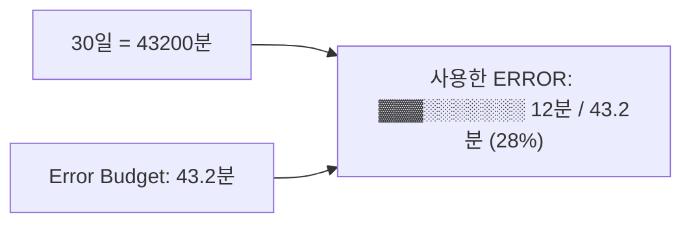
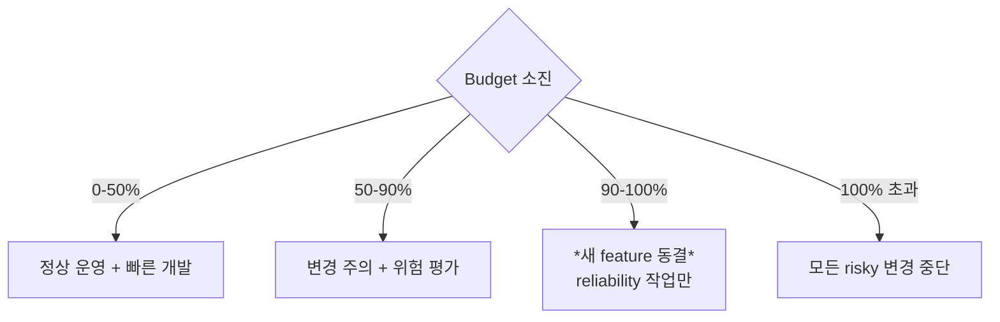
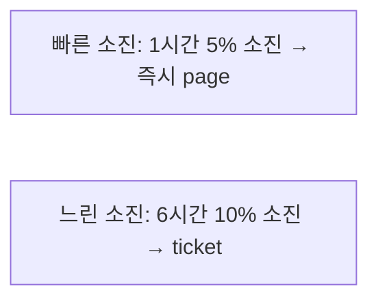

## 정의

| | 의미 |
|---|---|
| **SLI** (Indicator) | *측정 값* (예: 5xx 비율) |
| **SLO** (Objective) | *목표* (예: 99.9% 가용성) |
| **SLA** (Agreement) | *계약* (위반 시 환불 / 페널티) |
| **Error Budget** | *허용 가능한 실패 양* |

## 관계

```mermaid
flowchart LR
    SLI[SLI 측정<br/>"5xx rate = 0.02%"]
    SLO[SLO 목표<br/>"5xx < 0.1%"]
    SLA[SLA 계약<br/>"가용성 99.9%, 미만 시 10% 환불"]
    EB[Error Budget<br/>"30일 중 43분 다운 OK"]
    SLI --> Compare{비교}
    SLO --> Compare
    Compare --> EB
```

## 좋은 SLI 4 카테고리

| 카테고리 | 예시 |
|---|---|
| **Availability** | 성공 응답 비율 |
| **Latency** | p95, p99 응답 시간 |
| **Throughput** | 처리량 (req/s) |
| **Correctness** | 비율로 측정 가능한 정확성 |

> Google SRE: *user-facing* 측면 → *서버 CPU 같은 내부 metric 보다 사용자 경험*.

## SLO 설정 예시

```
가용성 SLI = 성공_응답 / 총_응답
SLO = 30일 중 99.9% 이상

→ Error Budget = 30일 × 24h × 60min × (1 - 0.999)
              = 43.2 분 / 월
```



## Error Budget Policy



> Error budget 의 *행동 contract*. 단순 메트릭이 아닌 *조직 정책*.

## SLO 계산 (PromQL)

```promql
# 30일 가용성
sum_over_time(
  (sum(rate(http_requests_total{status!~"5.."}[1m]))
    / sum(rate(http_requests_total[1m])))[30d:1m]
)
/ count_over_time((sum(rate(http_requests_total[1m])))[30d:1m])

# Budget 남은 %
1 - (
  (1 - currentAvailability) / (1 - SLO_target)
)
```

## SLA 예시 (실제 SaaS)

| SaaS | SLA |
|---|---|
| AWS S3 | 99.99% (월) - 미만 시 service credit |
| GitHub | 99.9% (분기) |
| Stripe | 99.999% (페이먼트) |

> *내부 SLO* 는 *SLA 보다 더 엄격* 하게 (margin).

## Burn Rate Alert



```promql
# fast burn (1h 의 budget 소진 속도가 14.4x)
(
  sum(rate(http_5xx[1h])) / sum(rate(http_total[1h]))
) > (14.4 * 0.001)   # SLO = 0.999 → error = 0.001
```

> 단순 *threshold alert* 보다 *budget 소진 속도* 가 *의미*.

## 흔한 함정

> [!WARNING]
> 1. **SLO 가 *서버 metric*** (CPU 95%) = 사용자 경험과 무관. *user-facing*.
> 2. **너무 높은 SLO** (99.999%) = *불가능 + 비용 폭증*. *비즈니스에 맞는* 수준.
> 3. **SLA = SLO** = SLA 는 *계약*, SLO 는 *내부 목표 (더 엄격)*.
> 4. **Budget 정책 부재** = SLO 만 측정하고 *행동 없음*. 무의미.

## 관련 위키

- [[prometheus]]
- [[opentelemetry]]
- [[aws-cloudwatch]]
- [[circuit-breaker]]
