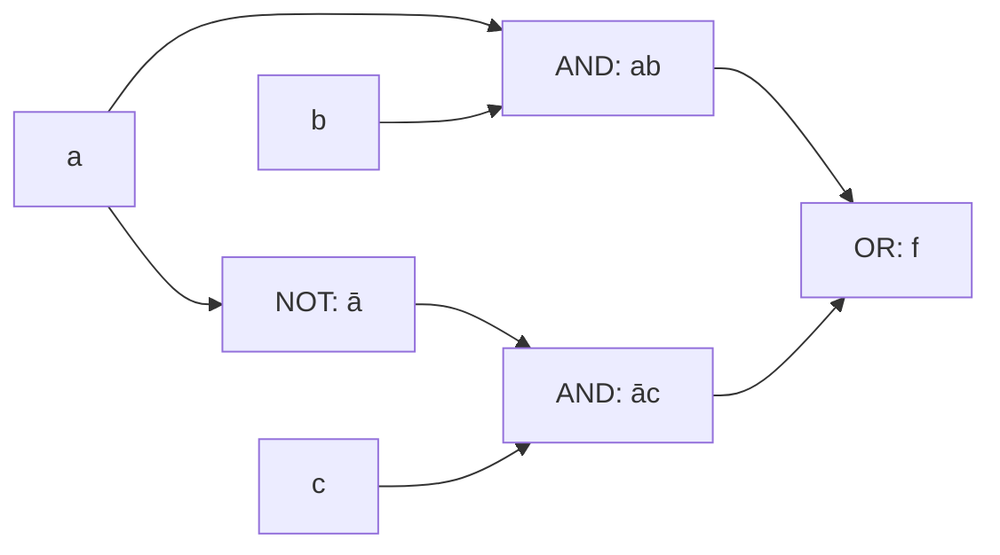

## 정의

**부울 대수 (Boolean Algebra)** 는 두 값 (참/거짓, 1/0) 과 세 연산 (AND, OR, NOT) 을 다루는 대수 시스템입니다. 1854년 George Boole 이 창시.

**컴퓨터의 심장**: 모든 디지털 회로는 부울 함수의 물리적 구현.

## 기본 연산

**정의역**: $B = \{0, 1\}$

| 연산 | 기호 | 대안 |
|:---|:---:|:---|
| **AND** | $\cdot$ 또는 $\land$ | $ab, a \cdot b$ |
| **OR** | $+$ 또는 $\lor$ | $a + b$ |
| **NOT** | $\overline{\cdot}$ 또는 $\neg$ | $\overline{a}, a'$ |

**진리표**:

| $a$ | $b$ | $a \cdot b$ | $a + b$ | $\overline{a}$ |
|:---:|:---:|:---:|:---:|:---:|
| 0 | 0 | 0 | 0 | 1 |
| 0 | 1 | 0 | 1 | 1 |
| 1 | 0 | 0 | 1 | 0 |
| 1 | 1 | 1 | 1 | 0 |

## 부울 대수 법칙

### 항등원
$$a + 0 = a, \quad a \cdot 1 = a$$

### 지배원 (Domination)
$$a + 1 = 1, \quad a \cdot 0 = 0$$

### 멱등 (Idempotent)
$$a + a = a, \quad a \cdot a = a$$

### 이중 부정
$$\overline{\overline{a}} = a$$

### 교환
$$a + b = b + a, \quad a \cdot b = b \cdot a$$

### 결합
$$a + (b + c) = (a + b) + c$$

### 분배
$$a + (b \cdot c) = (a + b) \cdot (a + c)$$
$$a \cdot (b + c) = (a \cdot b) + (a \cdot c)$$

### 드모르간
$$\overline{a + b} = \overline{a} \cdot \overline{b}$$
$$\overline{a \cdot b} = \overline{a} + \overline{b}$$

### 흡수
$$a + (a \cdot b) = a, \quad a \cdot (a + b) = a$$

### 여원
$$a + \overline{a} = 1, \quad a \cdot \overline{a} = 0$$

## 쌍대성 (Duality)

부울 대수의 모든 등식은 **AND ↔ OR**, **0 ↔ 1** 을 교체해도 성립. 이것이 쌍대 원리.

**예**:
- $a + 0 = a$ 의 쌍대: $a \cdot 1 = a$
- $a + (a \cdot b) = a$ 의 쌍대: $a \cdot (a + b) = a$

## 부울 함수

**$n$ 변수 부울 함수**: $f: B^n \to B$.

$2^n$ 개의 입력 조합에 대해 각각 0 또는 1 -> **$2^{2^n}$ 개의 서로 다른 부울 함수**.

예: 2변수는 $2^4 = 16$ 개 함수, 3변수는 $2^8 = 256$ 개.

## 정규형

### 논리합 정규형 (DNF, Sum of Products)

**민텀 (minterm)** = 모든 변수를 포함하는 AND 항.

**DNF** = 민텀들의 OR.

**예**: $f(a, b, c) = a \overline{b} c + \overline{a} b c + a b \overline{c}$

3변수 민텀은 $2^3 = 8$ 개.

### 논리곱 정규형 (CNF, Product of Sums)

**맥스텀 (maxterm)** = 모든 변수를 포함하는 OR 항.

**CNF** = 맥스텀들의 AND.

**예**: $f(a, b, c) = (a + b + c)(\overline{a} + b + c)(a + \overline{b} + c)$

### DNF/CNF 유도

진리표에서:
- **DNF**: 출력 1인 행마다 민텀 (해당 행의 변수 조합) OR
- **CNF**: 출력 0인 행마다 맥스텀 OR

## 시각화: 진리표 → 회로

**예**: $f(a, b, c) = ab + \overline{a}c$

| $a$ | $b$ | $c$ | $ab$ | $\overline{a}c$ | $f$ |
|:---:|:---:|:---:|:---:|:---:|:---:|
| 0 | 0 | 0 | 0 | 0 | 0 |
| 0 | 0 | 1 | 0 | 1 | 1 |
| 0 | 1 | 0 | 0 | 0 | 0 |
| 0 | 1 | 1 | 0 | 1 | 1 |
| 1 | 0 | 0 | 0 | 0 | 0 |
| 1 | 0 | 1 | 0 | 0 | 0 |
| 1 | 1 | 0 | 1 | 0 | 1 |
| 1 | 1 | 1 | 1 | 0 | 1 |

**회로**:

## 카르노 맵 (Karnaugh Map)

**진리표를 격자로 정리** 하여 부울 함수를 시각적으로 최소화.

### 2변수 카르노 맵

|  | $b=0$ | $b=1$ |
|:---:|:---:|:---:|
| $a=0$ | 0 | 1 |
| $a=1$ | 0 | 0 |

이 맵의 함수 = $\overline{a} b$.

### 3변수 카르노 맵

|  | $c=0$ | $c=1$ |
|:---:|:---:|:---:|
| $ab=00$ | 0 | 1 |
| $ab=01$ | 0 | 1 |
| $ab=11$ | 1 | 1 |
| $ab=10$ | 0 | 0 |

**Gray code** 순서로 배치 ($00, 01, 11, 10$) 하여 인접 셀이 한 변수만 다름.

### 최소화

인접한 1 셀들을 **최대 2의 거듭제곱** 크기로 묶어 항 축소.

- 1 개 셀 = 3변수 민텀
- 2 개 인접 셀 = 2변수 항
- 4 개 인접 셀 = 1변수 항
- 8 개 인접 셀 = 상수 1

**목적**: DNF 의 항 수와 리터럴 수 최소화 -> 회로 게이트 최소화.

## 논리 게이트

물리적 회로:

- **AND 게이트**: `⊃`
- **OR 게이트**: `⊃` (곡선 표현)
- **NOT 게이트**: `▷○`
- **NAND**: AND + NOT
- **NOR**: OR + NOT
- **XOR**: 배타적 OR ($a \oplus b = a\overline{b} + \overline{a}b$)

### 보편 게이트

**NAND** 하나만 있으면 모든 부울 함수 구현 가능.
- NOT($a$) = NAND($a$, $a$)
- AND($a$, $b$) = NOT(NAND($a$, $b$))
- OR($a$, $b$) = NAND(NOT($a$), NOT($b$))

**NOR** 도 마찬가지.

## 부울 함수의 응용

### 하드웨어 설계

- **ALU (Arithmetic Logic Unit)**: 덧셈, AND, OR 등의 회로
- **디코더**: n 비트 입력 -> $2^n$ 개 출력 (하나만 1)
- **멀티플렉서**: 여러 입력 중 하나 선택
- **레지스터, 플립플롭**: 순차 회로

### CPU 명령어

- 비트 연산 (`AND`, `OR`, `XOR`, `NOT`, `SHL`, `SHR`)
- 조건 플래그 (Zero, Negative, Overflow)

### 프로그래밍

- **비트마스킹**: 상태 저장 (권한, 플래그)
- **부울 표현식 최적화**: 컴파일러가 카르노 맵 유사 알고리즘

### SAT (Satisfiability)

**CNF 논리식이 만족 가능한가?** NP-완전.

**응용**:
- 하드웨어 검증
- 소프트웨어 검증
- 스케줄링
- 계획 (planning)
- 조합 최적화

## 완전 함수 집합

부울 함수 $f: B^n \to B$ 를 **유한한 연산 집합** 으로 표현할 수 있으면 "완전 (functionally complete)".

**대표 완전 집합**:
- $\{\text{AND}, \text{OR}, \text{NOT}\}$
- $\{\text{AND}, \text{NOT}\}$
- $\{\text{OR}, \text{NOT}\}$
- $\{\text{NAND}\}$
- $\{\text{NOR}\}$

**불완전 집합**: $\{\text{AND}, \text{OR}\}$ 는 NOT 필요.

## 함정

### 1. AND 우선순위

수식에서 곱 $\cdot$ 이 합 $+$ 보다 우선. $a + bc = a + (bc)$.

### 2. 드모르간 실수

$\overline{a + b} \neq \overline{a} + \overline{b}$. 부정하면 연산자도 바뀜.

### 3. 카르노 맵 순서

인접한 열/행이 **한 변수만** 달라야 함 -> Gray code ($00, 01, 11, 10$).

### 4. NAND 만으로 모든 것

가능하지만 실제 회로는 비효율. 표준 게이트 조합이 나음.

## 관련 위키

- [[discrete-mathematics|이산수학 (개요)]]
- [[propositional-logic|명제 논리]]
- [[sets-relations-functions|집합, 관계, 함수]]
- [[proof-techniques|증명 기법]]
