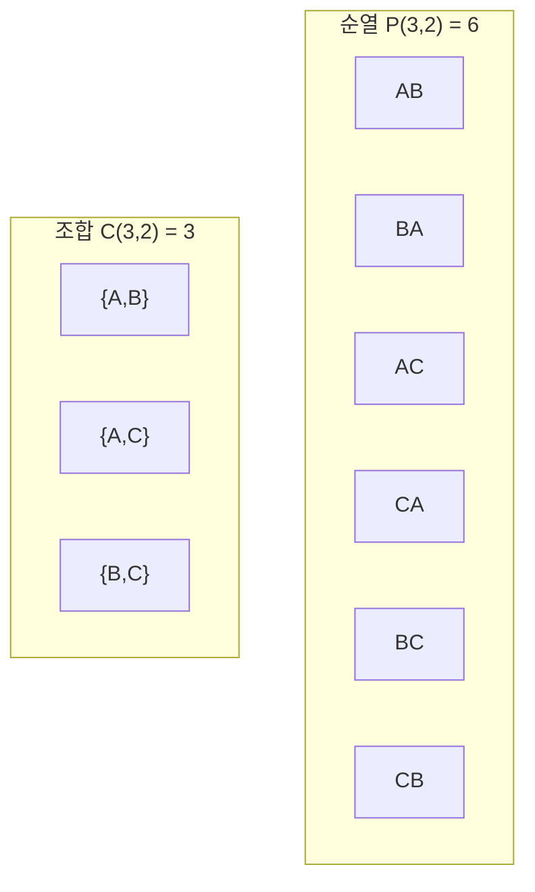

## 정의

**조합론 (Combinatorics)** 은 유한 집합의 원소를 세거나 배열하는 방법을 다루는 수학 분야입니다. "경우의 수 계산" 과 "구조의 존재/구성" 이 핵심 주제.

컴퓨터 과학에서 알고리즘 복잡도 분석, 확률 계산, 데이터 구조 분석에 필수.

## 두 기본 원리

### 합의 법칙 (Sum Rule)

서로소인 사건 $A$ 와 $B$ 가 각각 $n_1, n_2$ 가지 방법으로 발생 가능하다면, $A$ 또는 $B$ 는 $n_1 + n_2$ 가지.

**예**: 도서관에 소설 20권, 시집 10권. 한 권 선택하는 방법 = $20 + 10 = 30$.

### 곱의 법칙 (Product Rule)

절차가 두 단계로 이루어지고 첫 단계 $n_1$ 가지, 둘째 단계 $n_2$ 가지라면, 전체 방법 수 = $n_1 \cdot n_2$.

**예**: 4자리 PIN (0-9 각 자리). $10 \times 10 \times 10 \times 10 = 10^4 = 10000$.

## 순열 (Permutation)

**순서 있는 배열**.

### $n$ 개에서 $r$ 개 뽑아 배열

$$
P(n, r) = \frac{n!}{(n-r)!} = n \cdot (n-1) \cdot (n-2) \cdots (n-r+1)
$$

**예**: 5명 중 3명을 정렬해 세우기 = $P(5, 3) = 5 \cdot 4 \cdot 3 = 60$.

### $n$ 개 전체 순열

$$
P(n, n) = n!
$$

**예**: 5권의 책을 책장에 배열 = $5! = 120$.

### 원순열 (Circular Permutation)

$n$ 개를 원형 배열 = $(n-1)!$ (회전으로 같은 것 제외).

## 조합 (Combination)

**순서 없는 선택**.

### 이항계수 $\binom{n}{r}$

$$
\binom{n}{r} = C(n, r) = \frac{n!}{r! (n - r)!}
$$

**예**: 10명 중 3명 선택 (순서 무관) = $\binom{10}{3} = \frac{10!}{3! 7!} = 120$.

### 이항 정리

$$
(x + y)^n = \sum_{k=0}^{n} \binom{n}{k} x^{n-k} y^k
$$

**예**: $(x + y)^4 = x^4 + 4x^3 y + 6x^2 y^2 + 4 x y^3 + y^4$

### 파스칼 삼각형

$$
\binom{n}{k} = \binom{n-1}{k-1} + \binom{n-1}{k}
$$

시각화:

```
        1
      1   1
     1  2  1
    1  3  3  1
   1  4  6  4  1
  1  5 10 10  5  1
 1  6 15 20 15  6  1
```

각 원소는 위의 두 원소의 합.

## 시각화: 순열 vs 조합

**$\{A, B, C\}$ 에서 2개 선택**:



순열 6개 각각이 2! 씩 그룹지어 조합 3개로 축약. **$P(n,r) = C(n,r) \cdot r!$**.

## 중복 순열/조합

### 중복 순열

**중복 허용** 순서 있는 배열. $n^r$.

**예**: 각 자리에 0-9 넣는 4자리 PIN = $10^4 = 10000$.

### 중복 조합

**중복 허용** 순서 없는 선택. $\binom{n + r - 1}{r} = \binom{n + r - 1}{n - 1}$.

**예**: 5가지 맛 아이스크림에서 3 스쿱 (중복 허용) 선택 = $\binom{5 + 3 - 1}{3} = \binom{7}{3} = 35$.

### 별과 막대 (Stars and Bars)

$x_1 + x_2 + \ldots + x_k = n$ ($x_i \geq 0$ 정수) 의 해의 수 = $\binom{n + k - 1}{k - 1}$.

**시각화**: $n$ 개의 별 사이에 $k - 1$ 개의 막대를 배치.

```
★★|★|★★★    (3개 그룹으로 나눔)
n=6, k=3, 배치 = C(6+2, 2) = 28
```

## 포함배제 원리 (Inclusion-Exclusion)

두 집합:
$$
|A \cup B| = |A| + |B| - |A \cap B|
$$

세 집합:
$$
|A \cup B \cup C| = |A| + |B| + |C| - |A \cap B| - |A \cap C| - |B \cap C| + |A \cap B \cap C|
$$

일반:
$$
|A_1 \cup A_2 \cup \ldots \cup A_n| = \sum_i |A_i| - \sum_{i<j} |A_i \cap A_j| + \sum_{i<j<k} |A_i \cap A_j \cap A_k| - \ldots
$$

### 시각화 (3 집합 벤 다이어그램)

```
         A
        ┌──────┐
        │  a   │
    ┌───┼──────┼───┐
    │ b │ ab   │ c │  B
    │   │  abc │   │
    │   │ ac bc│   │
    └───┼──────┼───┘
        │  ??  │  C
        └──────┘
```

교차 영역들의 중복 카운트를 부호 교대로 보정.

**예**: 1부터 100까지 정수 중 2 또는 3 또는 5의 배수 개수.

$|A \cup B \cup C| = 50 + 33 + 20 - 16 - 10 - 6 + 3 = 74$.

## 계수 방법 카테고리

**핵심 질문 3가지**:
1. **순서 중요한가?** (yes -> 순열, no -> 조합)
2. **중복 허용?**
3. **완전히 채우는가 (모두 사용) or 일부만?**

| 상황 | 공식 |
|:---|:---|
| $r$ 개 뽑아 배열 (중복 X) | $P(n, r) = n!/(n-r)!$ |
| $r$ 개 뽑아 배열 (중복 O) | $n^r$ |
| $r$ 개 선택 (중복 X) | $C(n, r) = n! / [r!(n-r)!]$ |
| $r$ 개 선택 (중복 O) | $C(n+r-1, r)$ |
| 원 순열 | $(n-1)!$ |

## 비둘기집 원리 (Pigeonhole Principle)

$n+1$ 마리의 비둘기를 $n$ 개의 집에 넣으면, 어떤 집에는 **최소 2 마리**.

**일반화**: $N$ 개 원소를 $k$ 개 상자에 넣으면 어떤 상자에는 최소 $\lceil N/k \rceil$ 개.

### 응용 예

- **파일 시스템 해시 충돌**: 1000 파일을 100 버킷에 -> 어떤 버킷은 최소 10 파일.
- **생일 문제**: 366 명 있으면 반드시 생일 같은 사람 존재.
- **정보이론**: 압축의 이론 한계.

## 이항 항등식 (Binomial Identities)

핵심 항등식 (모두 조합적 의미가 있음):

$$
\binom{n}{k} = \binom{n}{n-k} \quad (\text{대칭})
$$

$$
\sum_{k=0}^{n} \binom{n}{k} = 2^n \quad (\text{모든 부분집합 수})
$$

$$
\sum_{k=0}^{n} (-1)^k \binom{n}{k} = 0 \quad (n \geq 1)
$$

$$
\sum_{k=0}^{n} \binom{n}{k}^2 = \binom{2n}{n} \quad (\text{Vandermonde})
$$

$$
\binom{n}{k} = \binom{n-1}{k-1} + \binom{n-1}{k} \quad (\text{파스칼})
$$

## 컴퓨터 과학 응용

### 알고리즘

- **정렬**: 비교 정렬의 최소 비교 횟수 $\Omega(n \log n)$ 는 **판정 트리 (decision tree)** 조합론.
- **DP**: 상태 수 = 경우의 수 계산.
- **NP-완전**: 조합 최적화 대부분.

### 해시

- **버킷 분배**: 비둘기집 -> 충돌 불가피.
- **해시 충돌 확률**: 생일 역설 응용.

### 정보이론

- **엔트로피**: 이산 확률 분포의 정보량.
- **Kraft 부등식**: 접두어 없는 코드의 조건.

### 그래프 알고리즘

- **경로 수**: 인접 행렬 거듭제곱.
- **매칭 수**: permanent (계산 hard).

## 함정

### 1. 순서와 중복

문제를 잘 읽어야. "선택" 이라도 순서가 중요한지, 중복 가능한지 별도 판단.

### 2. 케이스 분석 겹침

집합을 나누어 세면 **서로소** 여야 합의 법칙. 겹치면 포함배제로 보정.

### 3. 이항 계수 오버플로

$C(100, 50) \approx 10^{29}$. `long long` 도 넘음. mod 로 계산 필요.

### 4. $0!$ 은 1

관용. 조합 공식에서 자연스러움. $C(n, 0) = 1$.

## 관련 위키

- [[discrete-mathematics|이산수학 (개요)]]
- [[sets-relations-functions|집합, 관계, 함수]]
- [[combinatorics|조합론 심화]] (기존 위키)
- [[pascal-triangle|파스칼 삼각형]]
- [[inclusion-exclusion|포함배제 원리]]
- [[catalan-number|카탈란 수]]
- [[generating-function|생성함수]]
- [[graph-theory-basics|그래프 이론]]
