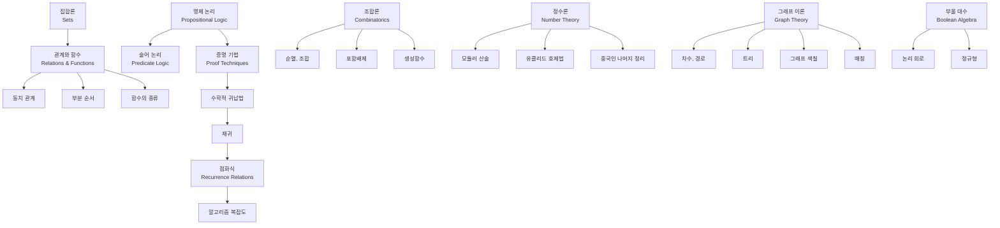
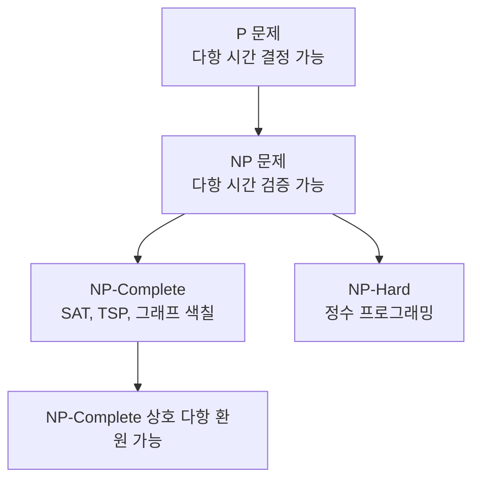

## 정의

**이산수학 (Discrete Mathematics)** 은 이산 (discrete, 셀 수 있는) 대상을 다루는 수학의 분야입니다. **연속 (continuous) 대상** 을 다루는 미적분학과 대조되며, 컴퓨터 과학의 근간을 이룹니다.

이산수학이 다루는 대상은 **자연수, 정수, 그래프, 집합, 명제, 문자열, 알고리즘** 등 셀 수 있는 개별 요소들이며, 이들에 대한 **논리, 계수, 관계, 구조** 를 다룹니다.

## 왜 컴퓨터 과학의 기초인가

컴퓨터는 근본적으로 이산적입니다.

- **비트, 바이트**: 유한한 상태
- **명령어**: 이산 실행
- **알고리즘**: 이산 단계의 나열
- **데이터 구조**: 이산 관계
- **네트워크**: 그래프
- **컴파일러**: 형식 언어 (문자열)
- **암호학**: 정수 이론

이산수학을 모르면 알고리즘 정확성 증명, 복잡도 분석, 데이터 구조 설계, 형식 검증이 불가능합니다.

## 학습 지도



## 주요 분야

### 1. 논리 (Logic)

**명제, 진리표, 술어, 양화사, 추론 규칙**. 모든 수학과 컴퓨터 프로그램의 기초.

자세한 것은 [[propositional-logic|명제 논리]] 참조.

### 2. 집합과 함수 (Sets, Relations, Functions)

**집합 연산, 관계의 성질, 함수의 정의역/치역, 단사/전사/전단사**. 자료구조와 데이터베이스의 이론적 배경.

자세한 것은 [[sets-relations-functions|집합, 관계, 함수]] 참조.

### 3. 조합론 (Combinatorics)

**계수 원리, 순열, 조합, 이항 정리, 포함배제 원리**. 알고리즘의 경우의 수 분석.

자세한 것은 [[combinatorics-basics|조합론]] 참조.

### 4. 정수론 (Number Theory)

**나눗셈, 소수, gcd, 모듈러 산술**. 암호학과 해싱의 근간.

관련: [[euclidean|유클리드 호제법]], [[modular-arithmetic|모듈러 산술]], [[crt|중국인 나머지 정리]]

### 5. 그래프 이론 (Graph Theory)

**정점, 간선, 경로, 사이클, 연결성, 트리, 그래프 색칠**. 네트워크와 알고리즘의 필수 언어.

자세한 것은 [[graph-theory-basics|그래프 이론]] 참조.

### 6. 부울 대수 (Boolean Algebra)

**AND, OR, NOT, 진리표, 정규형 (DNF/CNF), 논리 회로**. 디지털 회로 설계의 이론.

자세한 것은 [[boolean-algebra|부울 대수]] 참조.

### 7. 점화식과 알고리즘 (Recurrence Relations)

**재귀 정의, 마스터 정리, 생성함수**. 재귀 알고리즘의 시간 복잡도 분석.

자세한 것은 [[recurrence-relations|점화식]] 참조.

### 8. 증명 기법 (Proof Techniques)

**직접 증명, 대우 증명, 귀류법, 수학적 귀납법, 구조 귀납법**. 알고리즘 정확성 증명의 도구.

자세한 것은 [[proof-techniques|증명 기법]] 참조.

## 이산 vs 연속: 예시

| 개념 | 이산 | 연속 |
|:---|:---|:---|
| **수** | 정수 | 실수 |
| **함수** | $f: \mathbb{Z} \to \mathbb{Z}$ | $f: \mathbb{R} \to \mathbb{R}$ |
| **최적화** | 정수계획법, 조합최적화 | 미적분 |
| **확률** | 이산확률 (동전, 주사위) | 연속확률 (정규분포) |
| **기하** | 격자, 다각형 | 곡선, 곡면 |
| **미분/합** | 유한 차분 | 도함수 |

## 컴퓨터 과학 응용

### 알고리즘

- **최단 경로**: 그래프 이론
- **정렬**: 비교 횟수 분석 (조합론)
- **탐색**: 이진 탐색의 정확성 (귀납법)
- **동적 계획법**: 점화식 설계

### 자료구조

- **트리, 힙**: 그래프 이론
- **해시**: 정수론 (mod, 소수)
- **B-tree**: 조합론적 분석

### 시스템

- **파일 시스템**: 트리 구조
- **네트워크**: 그래프 라우팅
- **분산 합의**: 그래프 색칠, 그룹 이론

### 암호학

- **RSA**: 정수론 (오일러 정리, 소인수 분해)
- **AES**: 갈루아 필드 (유한체)
- **해시 함수**: 조합론

### 기계 학습

- **정보이론**: 엔트로피 (이산 확률)
- **결정 트리**: 그래프 이론
- **베이지안 네트워크**: DAG

### 형식 검증

- **모델 검사**: 유한 상태 기계
- **정리 증명**: 논리
- **타입 시스템**: 집합론

## 학습 자원

- **Rosen, Discrete Mathematics and Its Applications**: 정석 교과서 (한글 번역 있음)
- **Graham, Knuth, Patashnik, Concrete Mathematics**: 알고리즘 배경으로 심화
- **Oscar Levin, Discrete Mathematics: An Open Introduction**: 온라인 무료 교과서
- **MIT 6.042J**: 이산수학과 확률 (온라인 강의)

## 학습 순서 (권장)

1. **논리 + 증명 기법** ([[propositional-logic]] → [[proof-techniques]])
2. **집합 + 함수** ([[sets-relations-functions]])
3. **조합론** ([[combinatorics-basics]])
4. **그래프 이론** ([[graph-theory-basics]])
5. **부울 대수** ([[boolean-algebra]])
6. **점화식** ([[recurrence-relations]])

이 순서는 [이산수학 코스](/courses/discrete-mathematics-foundations/) 로 구성되어 있습니다.

## 이산 최적화와 NP

이산수학은 계산 복잡도 이론과 직결됩니다.



- **P**: 다항 시간에 결정 가능한 문제
- **NP**: 다항 시간에 검증 가능한 문제
- **P vs NP**: 미해결 문제 (Clay 밀레니엄 문제)
- **NP-Complete**: 가장 어려운 NP 문제, 하나만 P 이면 P=NP

> [!NOTE]
> TSP 결정 버전은 NP-Complete, 최적화 버전은 NP-Hard 입니다.

## 형식 언어와 오토마타

컴파일러와 정규식의 이론적 기반. 이산수학의 직접적인 응용.

| 계층 | 언어 | 오토마타 | 응용 |
|:---|:---|:---|:---|
| 정규 언어 | 정규 표현식 | 유한 오토마타 | lexer, grep |
| 문맥 자유 언어 | CFG | 푸시다운 오토마타 | parser, HTML |
| 문맥 의존 언어 | CSG | 선형 경계 오토마타 | 자연어 처리 |
| 재귀 가능 언어 | 재귀 가능 | 튜링 기계 | 일반 프로그래밍 |

Chomsky 계층에서 각 계층은 바로 아래 계층을 포함합니다.

## 증명 기법 빠른 참조

알고리즘 설계와 분석에 가장 많이 쓰는 증명 방법:

### 수학적 귀납법

```
목표: P(n) 이 모든 n >= n0 에서 성립
1. Base case: P(n0) 성립을 보임
2. Inductive step: P(k) 가 성립하면 P(k+1) 도 성립
```

예: 이진 탐색의 정확성, 재귀 알고리즘의 종료 조건.

### 귀류법

```
목표: P 가 참임을 보임
1. P 가 거짓이라고 가정
2. 모순 도출
결론: P 는 참
```

예: 소수 무한 개 증명, 알고리즘 하한 증명.

### 비둘기 집 원리

N+1 마리의 비둘기를 N 개의 집에 넣으면 적어도 한 집에 2마리 이상.

응용:
- 해시 충돌의 불가피성 증명
- 생일 역설: 23명 중 동일 생일자 존재 확률 > 50%
- 공간 압축의 한계 증명

## 이산 확률

이산 확률론 (Discrete Probability) 은 알고리즘 분석의 핵심 도구입니다.

```python
from math import comb

# 이항 분포: n번 시행, 성공 확률 p, k번 성공 확률
def binomial(n, k, p):
    return comb(n, k) * (p ** k) * ((1 - p) ** (n - k))
```

알고리즘 분석에서 쓰이는 핵심 도구:

- **기댓값 분석**: 퀵소트 평균 O(N log N) 증명
- **지시 확률 변수**: 해시 충돌 기대 횟수 계산
- **Markov 부등식**: 꼬리 확률 상한
- **Chernoff 경계**: 집중 부등식, 랜덤 알고리즘 분석

## 관련 위키

- [[propositional-logic|명제 논리]]
- [[sets-relations-functions|집합, 관계, 함수]]
- [[combinatorics-basics|조합론]]
- [[graph-theory-basics|그래프 이론]]
- [[boolean-algebra|부울 대수]]
- [[recurrence-relations|점화식]]
- [[proof-techniques|증명 기법]]
- [[euclidean|유클리드 호제법]]
- [[crt|중국인 나머지 정리]]
- [[combinatorics|조합론 심화]]
