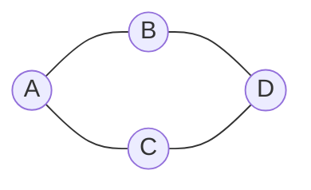
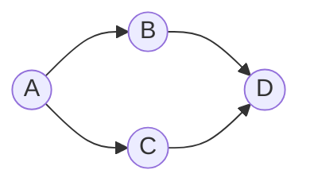
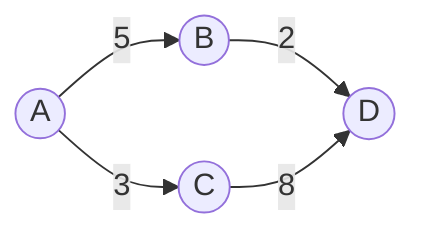
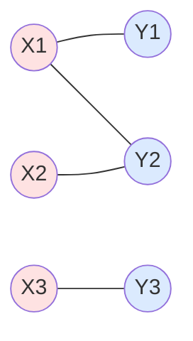

## 정의

**그래프 (Graph)** $G = (V, E)$ 는 **정점 (vertex)** 의 집합 $V$ 와 **간선 (edge)** 의 집합 $E$ 로 이루어진 이산 구조입니다. 간선은 정점의 쌍 (또는 순서쌍) 을 나타내며 정점 간 관계를 표현합니다.

컴퓨터 과학의 다양한 분야 (네트워크, 자료구조, 알고리즘, 데이터베이스, 컴파일러) 에서 그래프는 근본 언어.

## 그래프의 종류

### 무향 그래프 (Undirected Graph)

간선이 방향 없음. $\{u, v\}$ 로 표기 (순서 무관).

### 유향 그래프 (Directed Graph, Digraph)

간선이 방향 있음. $(u, v)$ 순서쌍.

### 가중 그래프 (Weighted Graph)

각 간선에 가중치 (weight, cost). 최단 경로 알고리즘의 대상.

### 다중 그래프 vs 단순 그래프

- **단순 그래프**: 자기 루프 없고 다중 간선 없음
- **다중 그래프**: 두 정점 간 여러 간선 허용

### 완전 그래프 $K_n$

모든 정점 쌍이 연결. $|E| = \binom{n}{2}$.

### 이분 그래프 (Bipartite Graph)

정점을 두 집합 $X, Y$ 로 나눌 수 있고 모든 간선은 $X$ 와 $Y$ 사이:

**정리**: 그래프가 이분 그래프 $\iff$ **홀수 길이 사이클이 없음**.

## 차수 (Degree)

정점 $v$ 의 **차수** $\deg(v)$ = 인접한 간선의 수.

### 악수 정리 (Handshake Theorem)

$$
\sum_{v \in V} \deg(v) = 2|E|
$$

**직관**: 각 간선은 두 정점의 차수에 각 1씩 기여.

**따름**: 홀수 차수 정점의 개수는 짝수.

### 유향 그래프의 in/out-degree

- $\deg^-(v)$ = 들어오는 간선 수 (in-degree)
- $\deg^+(v)$ = 나가는 간선 수 (out-degree)
- $\sum \deg^-(v) = \sum \deg^+(v) = |E|$

## 경로와 사이클

**경로 (path)**: 정점의 나열 $v_0, v_1, \ldots, v_k$ 로 각 $(v_i, v_{i+1})$ 이 간선.

**단순 경로**: 정점이 중복되지 않음.

**사이클 (cycle)**: 시작과 끝이 같은 경로 ($v_0 = v_k$).

**단순 사이클**: 시작/끝 외에 중복 정점 없음.

### 연결성 (Connectivity)

**연결 그래프**: 임의의 두 정점 사이에 경로 존재 (무향).

**연결 요소 (connected component)**: 최대 연결 부분 그래프.

**유향 그래프**:
- **약한 연결**: 무향으로 만들면 연결
- **강한 연결**: 모든 순서쌍 $(u, v)$ 에 대해 $u \to v$ 경로 존재

## 트리 (Tree)

**연결이며 사이클이 없는** 무향 그래프.

### 성질

- $|V|$ 개 정점의 트리는 $|V| - 1$ 개 간선을 가짐
- 임의의 두 정점 사이에 **유일한** 경로 존재
- 어떤 간선을 제거하면 연결성 잃음
- 어떤 두 정점 사이에 간선을 추가하면 사이클 생김

### 트리와 관련 개념

- **뿌리 트리 (rooted tree)**: 하나의 정점을 뿌리로 지정
- **잎 (leaf)**: 차수 1인 정점
- **이진 트리**: 각 정점의 자식이 최대 2개
- **완전 이진 트리**: 모든 잎이 같은 깊이

자세한 것은 [[trees|트리 (알고리즘)]] 참조.

## 그래프 표현

### 인접 행렬 (Adjacency Matrix)

$|V| \times |V|$ 행렬. $A[i][j] = 1$ 이면 간선 존재.

**장점**: $O(1)$ 간선 조회.
**단점**: $O(|V|^2)$ 공간. 희소 그래프에 낭비.

### 인접 리스트 (Adjacency List)

각 정점에 인접 정점 리스트.

**장점**: $O(|V| + |E|)$ 공간.
**단점**: 특정 간선 존재 확인 $O(\deg(v))$.

### 간선 리스트

간선의 순서쌍 목록. 크루스칼 알고리즘 등에 활용.

## 그래프 탐색

**깊이 우선 탐색 (DFS)**: 스택 (재귀). 사이클 감지, 위상 정렬, SCC.

**너비 우선 탐색 (BFS)**: 큐. 최단 거리 (간선 가중치 1).

자세한 것은 [[dfs|DFS]], [[bfs|BFS]] 참조.

## 그래프 색칠

**색칠 (coloring)**: 인접한 정점이 다른 색을 갖도록 색을 부여.

**색깔 수 최소 = 색채 수 (chromatic number)** $\chi(G)$.

### 대표 예

- 이분 그래프: $\chi = 2$
- $K_n$: $\chi = n$
- 홀수 사이클: $\chi = 3$

### 4색 정리

평면 그래프는 항상 4개 이하 색으로 색칠 가능. 지도 색칠 문제.

### 응용

- **레지스터 할당**: 컴파일러가 변수를 레지스터에 배치. 겹치는 라이프타임 = 인접 간선.
- **스케줄링**: 시험 시간표 (같은 학생 = 인접 = 다른 시간).
- **주파수 할당**: 인접 기지국 = 다른 주파수.

## 오일러 경로와 해밀턴 경로

### 오일러 경로 (Eulerian Path)

**모든 간선을 정확히 한 번씩** 지나는 경로.

**정리**: 오일러 경로 존재 $\iff$ 홀수 차수 정점 수가 0 또는 2. (2이면 그 두 정점이 시작/끝).

### 해밀턴 경로 (Hamiltonian Path)

**모든 정점을 정확히 한 번씩** 지나는 경로.

**결정 문제 NP-완전** (오일러와 대조적).

## 매칭 (Matching)

**매칭**: 간선의 부분집합으로, 어떤 두 간선도 공통 정점을 갖지 않음.

**완벽 매칭**: 모든 정점이 매칭에 포함.

### 이분 그래프 매칭

이분 그래프 $G = (X \cup Y, E)$ 에서 $|X|$ 만큼의 매칭.

**Hall 의 정리**: $X$ 를 모두 매칭 $\iff$ 임의의 $S \subseteq X$ 에 대해 $|N(S)| \geq |S|$.

**응용**: 작업 할당, 자원 배분.

## 그래프의 활용

### 네트워크

- **인터넷 라우팅**: 최단 경로 (다익스트라, BGP)
- **소셜 네트워크**: 친구 관계 (연결성, 커뮤니티 감지)
- **P2P**: 그래프 위상

### 컴파일러

- **CFG (Control Flow Graph)**: 프로그램 실행 흐름
- **DFG (Data Flow Graph)**: 데이터 의존
- **SSA 변환**: 지배자 트리
- **레지스터 할당**: 색칠

### 데이터베이스

- **관계형**: 외래 키 = 간선
- **그래프 DB**: Neo4j, Neptune

### 기계학습

- **베이지안 네트워크**: DAG
- **CRF**: 무향 그래프
- **GNN (Graph Neural Networks)**: 그래프 위 학습

### 게임

- **미로**: 그래프 최단 경로
- **체스, 오목**: 상태 그래프

## 함정

### 1. 방향/무방향 혼동

무향 그래프에서 $\{u, v\}$ 는 $\{v, u\}$ 와 같음. 유향은 다름.

### 2. 다중 간선

인접 행렬은 다중 간선 표현 힘듦. 인접 리스트 사용.

### 3. 그래프 vs 트리

트리는 그래프의 특수 케이스. 사이클 없는 연결 그래프.

### 4. 자기 루프

$(v, v)$ 형태 간선. 차수 계산 시 보통 2로 카운트 (양끝 같음).

## 관련 위키

- [[discrete-mathematics|이산수학 (개요)]]
- [[sets-relations-functions|집합, 관계, 함수]]
- [[trees|트리]]
- [[dfs|DFS]]
- [[bfs|BFS]]
- [[dijkstra|다익스트라]]
- [[combinatorics-basics|조합론]] - 그래프 계수
- [[matching|매칭]]
- [[topological-sort|위상 정렬]]
