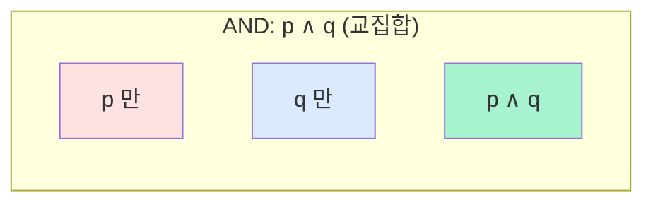

## 정의

**명제 (Proposition)** 는 참 (T) 또는 거짓 (F) 값을 가지는 서술문입니다. 참/거짓을 판단할 수 없는 문장 (질문, 명령, 감탄) 은 명제가 아닙니다.

**예 (명제)**:
- "2 + 2 = 4" (참)
- "지구는 정사각형이다" (거짓)
- "$n$ 은 소수이다" (변수 있음: 술어)

**예 (명제 아님)**:
- "안녕하세요?"
- "문을 닫아라"
- "$x + 3$"

## 논리 연산자

명제 $p, q$ 를 결합해 새 명제 생성.

| 연산 | 기호 | 의미 |
|:---|:---:|:---|
| **부정** | $\neg p$ | not p |
| **논리곱** | $p \land q$ | p 그리고 q |
| **논리합** | $p \lor q$ | p 또는 q (포함적 or) |
| **배타적 논리합** | $p \oplus q$ | p 또는 q 이지만 둘 다는 아님 |
| **함의** | $p \to q$ | p 이면 q (implication) |
| **동치** | $p \leftrightarrow q$ | p 이면 q 이고 q 이면 p |

## 진리표

각 연산의 정의:

### AND ($\land$)

| $p$ | $q$ | $p \land q$ |
|:---:|:---:|:---:|
| T | T | T |
| T | F | F |
| F | T | F |
| F | F | F |

### OR ($\lor$)

| $p$ | $q$ | $p \lor q$ |
|:---:|:---:|:---:|
| T | T | T |
| T | F | T |
| F | T | T |
| F | F | F |

### 함의 ($\to$)

**가장 헷갈리는 연산**. "p 이면 q" 는 **p 가 참인데 q 가 거짓일 때만 거짓**, 나머지는 참.

| $p$ | $q$ | $p \to q$ |
|:---:|:---:|:---:|
| T | T | T |
| T | F | **F** |
| F | T | T |
| F | F | T |

**직관**: "비가 오면 우산을 든다" 라는 약속.
- 비 O, 우산 O -> 약속 지킴 (T)
- 비 O, 우산 X -> 약속 어김 (F)
- 비 X, 우산 O -> 약속과 무관 (T, vacuously true)
- 비 X, 우산 X -> 약속과 무관 (T)

전제가 거짓이면 함의는 항상 참 = **vacuous truth**.

### 동치 ($\leftrightarrow$)

$p \leftrightarrow q$ 는 두 명제의 진리값이 같음.

| $p$ | $q$ | $p \leftrightarrow q$ |
|:---:|:---:|:---:|
| T | T | T |
| T | F | F |
| F | T | F |
| F | F | T |

## 진리표로 논리 등식 검증

**예**: 드모르간 법칙 $\neg (p \land q) \equiv \neg p \lor \neg q$

| $p$ | $q$ | $p \land q$ | $\neg(p \land q)$ | $\neg p$ | $\neg q$ | $\neg p \lor \neg q$ |
|:---:|:---:|:---:|:---:|:---:|:---:|:---:|
| T | T | T | F | F | F | F |
| T | F | F | T | F | T | T |
| F | T | F | T | T | F | T |
| F | F | F | T | T | T | T |

4번째, 7번째 열이 일치 -> 등식 성립.

## 시각화: 진리표를 다이어그램으로

### AND / OR 벤 다이어그램



$p \land q$ 는 두 원의 **교집합**, $p \lor q$ 는 두 원의 **합집합**.

## 논리 동치 (주요 법칙)

| 법칙 | 등식 |
|:---|:---|
| **항등** | $p \land T \equiv p$, $p \lor F \equiv p$ |
| **지배** | $p \lor T \equiv T$, $p \land F \equiv F$ |
| **멱등** | $p \land p \equiv p$, $p \lor p \equiv p$ |
| **이중부정** | $\neg (\neg p) \equiv p$ |
| **교환** | $p \land q \equiv q \land p$, $p \lor q \equiv q \lor p$ |
| **결합** | $(p \land q) \land r \equiv p \land (q \land r)$ |
| **분배** | $p \land (q \lor r) \equiv (p \land q) \lor (p \land r)$ |
| **드모르간** | $\neg(p \land q) \equiv \neg p \lor \neg q$ |
| **흡수** | $p \lor (p \land q) \equiv p$ |
| **함의 재작성** | $p \to q \equiv \neg p \lor q$ |
| **대우** | $p \to q \equiv \neg q \to \neg p$ |
| **동치 재작성** | $p \leftrightarrow q \equiv (p \to q) \land (q \to p)$ |

## 함의의 관련 명제

$p \to q$ 에 대해:

- **역 (converse)**: $q \to p$
- **이 (inverse)**: $\neg p \to \neg q$
- **대우 (contrapositive)**: $\neg q \to \neg p$

**중요**: 원 명제와 **대우 는 논리적으로 동치**. 역/이는 원 명제와 동치가 아님.

**예**: 원 명제 "비가 오면 땅이 젖는다"
- 대우: "땅이 젖지 않으면 비가 오지 않는다" (동치 O)
- 역: "땅이 젖으면 비가 온다" (동치 X, 물뿌리개일 수도)
- 이: "비가 오지 않으면 땅이 젖지 않는다" (동치 X)

## 항진명제와 모순

- **항진명제 (tautology)**: 모든 진리 할당에서 참. 예: $p \lor \neg p$
- **모순 (contradiction)**: 모든 진리 할당에서 거짓. 예: $p \land \neg p$
- **가능명제 (contingency)**: 참 또는 거짓 (진리 할당에 의존).

## 정규형

명제 논리식은 두 가지 표준형으로.

### 논리곱 정규형 (CNF, Conjunctive Normal Form)

**절 (clause) 의 논리곱**. 각 절은 리터럴의 논리합.

$$(l_1 \lor l_2 \lor \ldots) \land (l_3 \lor \ldots) \land \ldots$$

SAT solver 의 표준 입력. [[boolean-algebra|Boolean Algebra]] 참조.

### 논리합 정규형 (DNF)

**항 (term) 의 논리합**. 각 항은 리터럴의 논리곱.

$$(l_1 \land l_2 \land \ldots) \lor (l_3 \land \ldots) \lor \ldots$$

## 추론 규칙

전제로부터 결론을 도출하는 규칙:

### Modus Ponens (긍정 논법)

$$
\frac{p \to q, \quad p}{\therefore q}
$$

"p 이면 q, 그리고 p 이다. 따라서 q."

### Modus Tollens (부정 논법)

$$
\frac{p \to q, \quad \neg q}{\therefore \neg p}
$$

"p 이면 q, 그런데 q 가 아니다. 따라서 p 도 아니다." (대우 활용)

### 삼단논법

$$
\frac{p \to q, \quad q \to r}{\therefore p \to r}
$$

### 분리 규칙

$$
\frac{p \lor q, \quad \neg p}{\therefore q}
$$

## 컴퓨터 과학 응용

### 프로그래밍 조건문

```python
if (age >= 18) and (has_license):
    can_drive = True
```

이는 명제 논리의 AND. `and` 는 $\land$, `or` 는 $\lor$, `not` 은 $\neg$.

### 회로 설계

- AND 게이트, OR 게이트, NOT 게이트
- 진리표 -> DNF/CNF -> 회로
- 최소화: 카르노 맵

### 형식 검증

- 프로그램의 사전조건 / 사후조건을 명제로 표현
- 정리 증명기가 논리식 검사

### SAT 문제

- CNF 논리식이 만족 가능한 진리 할당이 있는가?
- NP-완전. 많은 조합 최적화 문제가 SAT 로 환원.

## 함정

### 1. 함의의 vacuous truth

전제 $p$ 가 거짓이면 $p \to q$ 는 자동으로 참. 이를 잊으면 오류.

**예**: "5 > 10 이면 지구는 평평하다" 는 논리적으로 참 (전제 거짓).

### 2. 역과 원 명제 혼동

"모든 소수는 홀수이다" 의 역은 "모든 홀수는 소수이다" (거짓, 예: 9). 원 명제와 동치가 아님. (사실 원 명제도 거짓, 2 는 짝수 소수).

### 3. 배타적 or 와 포함적 or

일상 언어의 "or" 는 종종 배타적 (either-or). 논리 $\lor$ 는 **포함적** (둘 다 참이어도 참). SQL 의 `OR` 등도 포함적.

### 4. 드모르간 실수

$\neg (p \land q) \equiv \neg p \lor \neg q$ 를 $\neg p \land \neg q$ 로 착각. 부정하면 연산자도 뒤집힘.

## 다음 학습

명제 논리 이후:
- **[[proof-techniques|증명 기법]]**: 명제 논리를 이용한 증명 방법
- **[[boolean-algebra|부울 대수]]**: 회로 설계로 확장
- **술어 논리 (Predicate Logic)**: 양화사 ($\forall, \exists$) 추가

## 관련 위키

- [[discrete-mathematics|이산수학 (개요)]]
- [[proof-techniques|증명 기법]]
- [[boolean-algebra|부울 대수]]
- [[sets-relations-functions|집합, 관계, 함수]]
- [[combinatorics-basics|조합론]]
