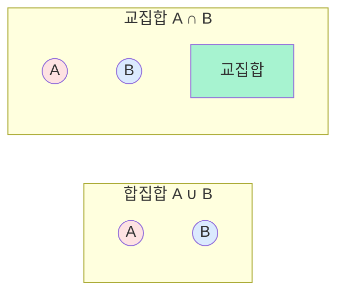
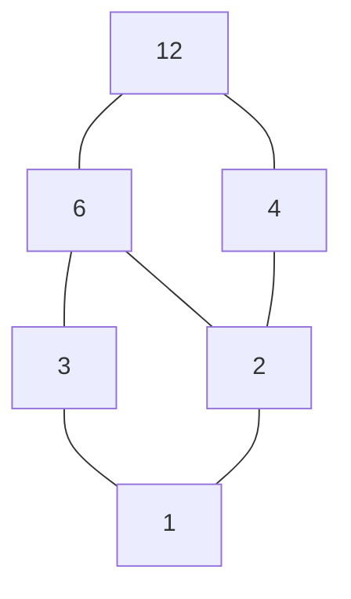
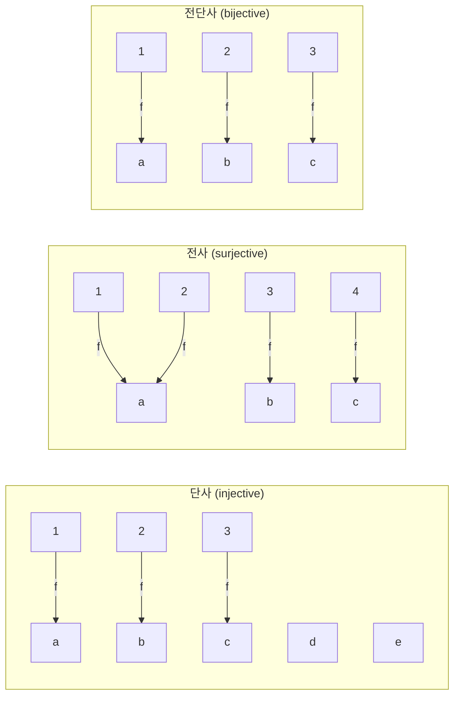

## 정의

- **집합 (set)**: 서로 다른 원소들의 모음
- **관계 (relation)**: 두 집합 사이의 원소들의 대응 규칙
- **함수 (function)**: 정의역의 각 원소를 치역의 유일한 원소로 대응시키는 관계

이 세 개념은 이산수학과 컴퓨터 과학의 근본. 자료구조, 데이터베이스, 타입 시스템, 함수형 프로그래밍의 이론적 배경.

## 집합 (Sets)

### 표기

**나열**: $\{1, 2, 3\}$, $\{a, b, c\}$

**조건 제시**: $\{x \mid x > 0, x \in \mathbb{Z}\}$ = 양의 정수

**중요한 집합**:
- $\mathbb{N}$: 자연수 $\{0, 1, 2, \ldots\}$ (또는 $\{1, 2, \ldots\}$)
- $\mathbb{Z}$: 정수
- $\mathbb{Q}$: 유리수
- $\mathbb{R}$: 실수
- $\mathbb{C}$: 복소수
- $\emptyset$ 또는 $\{\}$: 공집합

### 기본 연산

주어진 $A, B$ 에 대해:

| 연산 | 정의 |
|:---|:---|
| **합집합** $A \cup B$ | $A$ 또는 $B$ 의 원소 |
| **교집합** $A \cap B$ | $A$ 그리고 $B$ 의 원소 |
| **차집합** $A - B$ | $A$ 이고 $B$ 가 아닌 원소 |
| **대칭차** $A \oplus B$ | $A$ 또는 $B$ 이지만 둘 다는 아닌 원소 |
| **여집합** $\overline{A}$ | 전체집합 $U$ 에서 $A$ 아닌 원소 |
| **부분집합** $A \subseteq B$ | $A$ 의 모든 원소가 $B$ 에 |
| **진부분집합** $A \subsetneq B$ | 부분집합이면서 같지 않음 |
| **곱집합** $A \times B$ | 순서쌍 $\{(a, b) \mid a \in A, b \in B\}$ |
| **멱집합** $\mathcal{P}(A)$ | $A$ 의 모든 부분집합 |

### 시각화: 벤 다이어그램

### 집합의 크기 (기수)

- **유한 집합**: $|A|$ = 원소 개수. $|\{1, 2, 3\}| = 3$.
- **무한 집합**: 셀 수 있는 무한 (예: $\mathbb{N}$, $\mathbb{Z}$) 과 셀 수 없는 무한 (예: $\mathbb{R}$) 이 있음.

### 집합의 크기 공식

- $|A \cup B| = |A| + |B| - |A \cap B|$
- $|\mathcal{P}(A)| = 2^{|A|}$ (부분집합의 수)
- $|A \times B| = |A| \cdot |B|$

포함배제 원리로 3개 이상으로 확장. [[combinatorics-basics|조합론]] 참조.

### 집합 항등식 (드모르간 등)

| 법칙 | 등식 |
|:---|:---|
| 결합 | $A \cup (B \cup C) = (A \cup B) \cup C$ |
| 교환 | $A \cup B = B \cup A$ |
| 분배 | $A \cap (B \cup C) = (A \cap B) \cup (A \cap C)$ |
| 드모르간 | $\overline{A \cup B} = \overline{A} \cap \overline{B}$ |
| 흡수 | $A \cup (A \cap B) = A$ |

명제 논리와 완전히 대응 (isomorphic to Boolean algebra).

## 관계 (Relations)

### 정의

**이항 관계 (binary relation)** $R$ 은 $A \times B$ 의 부분집합. 즉 순서쌍 $(a, b)$ 들의 모임.

**표기**: $(a, b) \in R$ 또는 $a R b$.

**예**:
- $R = \{(x, y) \mid x < y, x, y \in \mathbb{Z}\}$ = 정수의 "미만" 관계
- $R = \{(u, v) \mid u \text{ 는 } v \text{ 의 부모}\}$ = 부모-자식 관계

### 관계의 성질

$A$ 위의 관계 $R$ 에 대해:

| 성질 | 정의 |
|:---|:---|
| **반사** (reflexive) | 모든 $a \in A$ 에 대해 $a R a$ |
| **대칭** (symmetric) | $a R b \implies b R a$ |
| **반대칭** (antisymmetric) | $a R b \land b R a \implies a = b$ |
| **추이** (transitive) | $a R b \land b R c \implies a R c$ |

### 동치 관계

**반사 + 대칭 + 추이** 를 모두 만족하는 관계. 집합을 **동치 클래스** 로 나눔.

**예**:
- "같다" ($=$)
- 정수 mod $n$: $a \equiv b \pmod{n}$
- 그래프의 "연결됨" 관계

### 부분 순서 (Partial Order)

**반사 + 반대칭 + 추이** 를 만족.

**예**:
- $\leq$ (정수, 실수)
- $\subseteq$ (집합)
- 정수의 나눗셈 관계 $a | b$
- 그래프의 위상 정렬

### Hasse Diagram

부분 순서를 시각화:

정수 12 의 약수 집합 $\{1, 2, 3, 4, 6, 12\}$ 의 나눗셈 관계.

## 함수 (Functions)

### 정의

**함수** $f: A \to B$ 는 $A$ 의 각 원소를 $B$ 의 **유일한** 원소에 대응시키는 관계.

- $A$: **정의역 (domain)**
- $B$: **공역 (codomain)**
- $f(A) = \{f(a) \mid a \in A\}$: **치역 (range)** (공역의 부분집합)

### 함수의 종류

**단사 (injective, one-to-one)**: $f(a_1) = f(a_2) \implies a_1 = a_2$. 서로 다른 입력은 서로 다른 출력.

**전사 (surjective, onto)**: 모든 $b \in B$ 에 대해 $f(a) = b$ 인 $a \in A$ 존재. 치역 = 공역.

**전단사 (bijective)**: 단사 + 전사. 역함수 존재.

### 시각화

- 단사: 안 쓰인 공역 원소 OK, 하지만 중복 대응 안 됨
- 전사: 공역 다 커버, 하지만 여러 정의역이 같은 곳으로 OK
- 전단사: 위 둘 다

### 함수의 합성

$f: A \to B$, $g: B \to C$ 이면 $g \circ f: A \to C$ 정의.

$(g \circ f)(x) = g(f(x))$

**성질**:
- 결합: $(h \circ g) \circ f = h \circ (g \circ f)$
- 교환 X: 일반적으로 $g \circ f \neq f \circ g$

### 역함수

$f: A \to B$ 가 전단사이면 역함수 $f^{-1}: B \to A$ 존재.

$f^{-1}(f(a)) = a$, $f(f^{-1}(b)) = b$

## 컴퓨터 과학 응용

### 자료구조

- **집합**: `HashSet`, `TreeSet`, `set` (Python)
- **관계**: 데이터베이스의 테이블 = $A \times B$ 의 부분집합
- **함수**: `Map`, `Dict`, `HashMap`

### 함수형 프로그래밍

- **First-class function**: 함수를 값으로
- **함수 합성**: $g \circ f$
- **불변성**: 수학적 함수처럼

### 타입 시스템

- **타입 = 집합**: `int` = 정수 집합, `bool` = $\{T, F\}$
- **함수 타입**: $A \to B$
- **곱 타입**: `(int, string)` = $\mathbb{Z} \times \text{String}$
- **합 타입**: `Result<T, E>` = $T \sqcup E$ (disjoint union)

### 관계형 데이터베이스

- **관계 (테이블)**: $R \subseteq A_1 \times A_2 \times \ldots \times A_n$
- **정규화**: 함수 종속성 (functional dependency) 이론
- **결합 (JOIN)**: 관계의 곱

### 그래프

**그래프 $G = (V, E)$** 는 정점 집합 $V$ 와 간선 관계 $E \subseteq V \times V$.

## 함정

### 1. 집합의 원소 개수 vs 순서

집합은 **순서 없음**: $\{1, 2\} = \{2, 1\}$
순서쌍은 **순서 있음**: $(1, 2) \neq (2, 1)$

### 2. $\in$ vs $\subseteq$

$1 \in \{1, 2\}$ (원소)
$\{1\} \subseteq \{1, 2\}$ (부분집합)

$1 \subseteq \{1, 2\}$ 는 **오류** (숫자 1 은 집합이 아님).

### 3. 함수의 well-defined

$f: \mathbb{Q} \to \mathbb{Q}$, $f(\frac{p}{q}) = p + q$ 는 함수가 아님. 왜? $\frac{1}{2} = \frac{2}{4}$ 지만 $1+2 \neq 2+4$. Well-defined 하지 않음.

### 4. 관계 vs 함수

관계는 한 입력에 여러 출력 가능. 함수는 유일.

## 관련 위키

- [[discrete-mathematics|이산수학 (개요)]]
- [[propositional-logic|명제 논리]] - 집합과의 대응
- [[combinatorics-basics|조합론]] - $|A \cup B|$
- [[graph-theory-basics|그래프 이론]] - 관계로서의 간선
- [[proof-techniques|증명 기법]] - 집합 등식 증명
- [[boolean-algebra|부울 대수]] - 집합 대수와 동형
