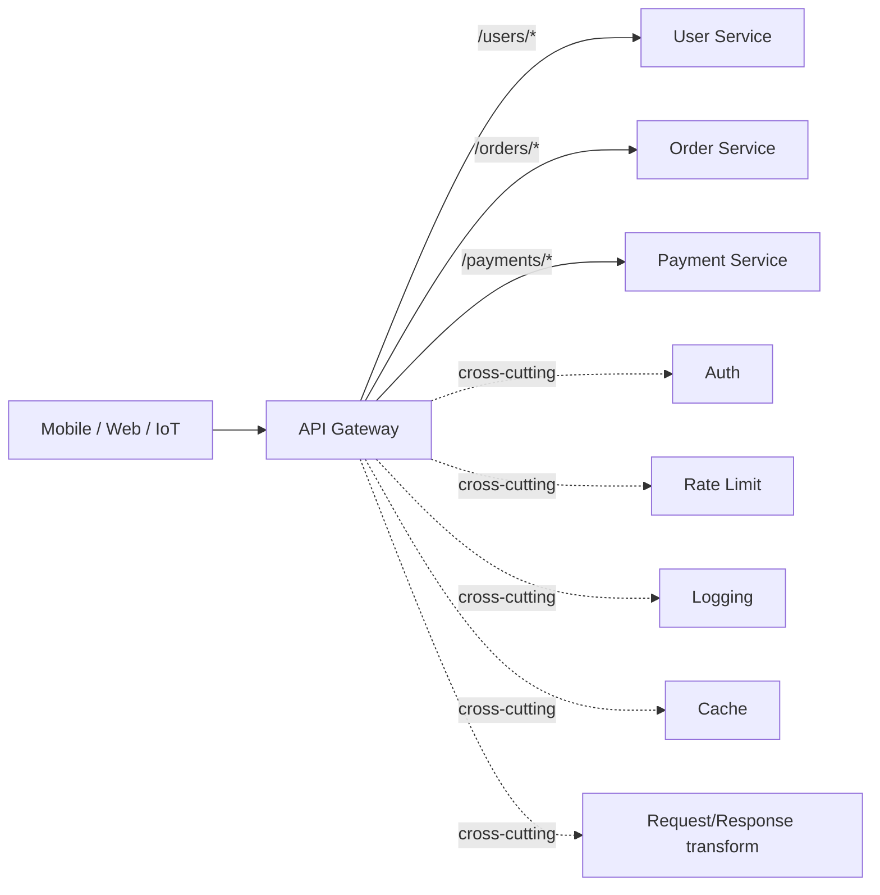
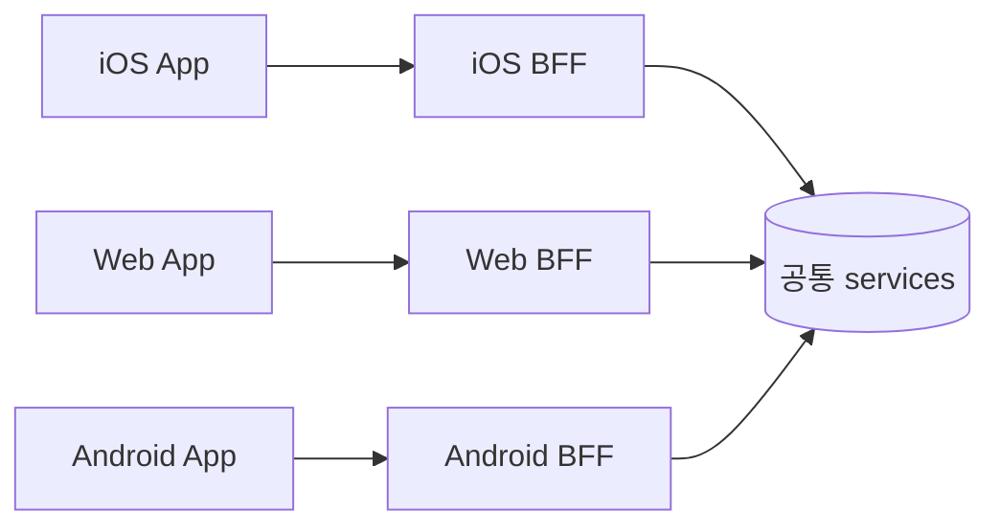
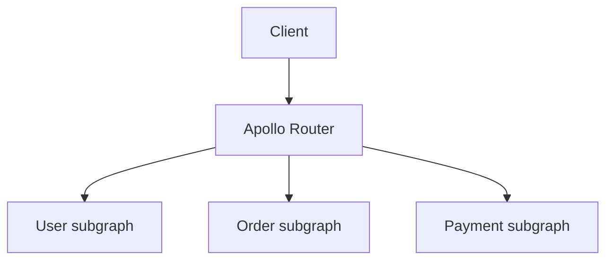

## 정의

**API Gateway** = *클라이언트와 마이크로서비스 사이의 단일 진입점*. 라우팅, auth, rate limit, transformation, monitoring 의 *cross-cutting 책임* 을 모음.

## 역할

## 책임 카탈로그

| 책임 | 예시 |
|---|---|
| 라우팅 | path / header / host 기준 |
| 인증 / 인가 | JWT 검증, OAuth, API key |
| Rate limiting | per-API key, per-IP |
| Transformation | request/response 변환 (gRPC↔REST) |
| 캐싱 | 응답 캐시 |
| Load balancing | 백엔드 분산 |
| Circuit breaker | 백엔드 다운 시 차단 |
| Logging / metrics | 중앙 집계 |
| WAF | SQLi, XSS 차단 |
| TLS termination | 인증서 관리 |
| Versioning | URL / 헤더 기반 분기 |

## BFF (Backend For Frontend)

> *각 클라이언트 종류마다 별도 gateway*. 클라이언트 별 *응답 형식 / 페이지네이션 / 압축* 차이 흡수. *모바일 = 작은 응답, 웹 = 큰 응답*.

## API Gateway vs Service Mesh

| 항목 | API Gateway | Service Mesh |
|---|---|---|
| 위치 | *외부 ↔ 내부 경계* (north-south) | *내부 ↔ 내부* (east-west) |
| 책임 | 인증, transformation, public API | mTLS, retry, circuit, observability |
| 클라이언트 인지 | 직접 호출 | sidecar 자동 |
| 예 | Kong, AWS API Gateway, Envoy | Istio, Linkerd |

> [!NOTE]
> *둘 다 운영하는 경우* 가 흔하다. *gateway 가 north-south*, *mesh 가 east-west*.

## 도구 비교

| 도구 | 종류 | 강점 |
|---|---|---|
| Kong | OSS gateway | plugin 생태계 |
| Tyk | OSS gateway | 옵션 |
| Envoy | Proxy | gRPC, L7, mesh 토대 |
| AWS API Gateway | Managed | Lambda 통합 |
| Cloudflare Workers | Edge | 글로벌 |
| Apigee | Enterprise (Google) | 엔터프라이즈 |
| Apollo Router | GraphQL | federation |

## 패턴: GraphQL Federation Gateway

자세한 건 [[graphql]] 참고.

## 흔한 함정

> [!WARNING]
> 1. **Gateway 가 *모든 비즈니스 로직* 흡수** = monolith 의 *재림*. cross-cutting 만.
> 2. **단일 gateway 의 *bottleneck*** = HA + auto-scaling 필수.
> 3. **Auth 검증 *백엔드 마다* 다시** = gateway 가 검증 → 백엔드는 *trust*. 단 *zero-trust* 환경에서는 백엔드도 검증.
> 4. **Rate limit 의 *분산 상태*** = 단일 노드 카운터 = race. 중앙 store (Redis) + sliding window.

## 관련 위키

- [[microservices-vs-monolith]]
- [[Service Mesh]] (mTLS, sidecar)
- [[Load Balancer]]
- [[JWT]], [[OAuth2]]
- [[graphql]] (federation)
