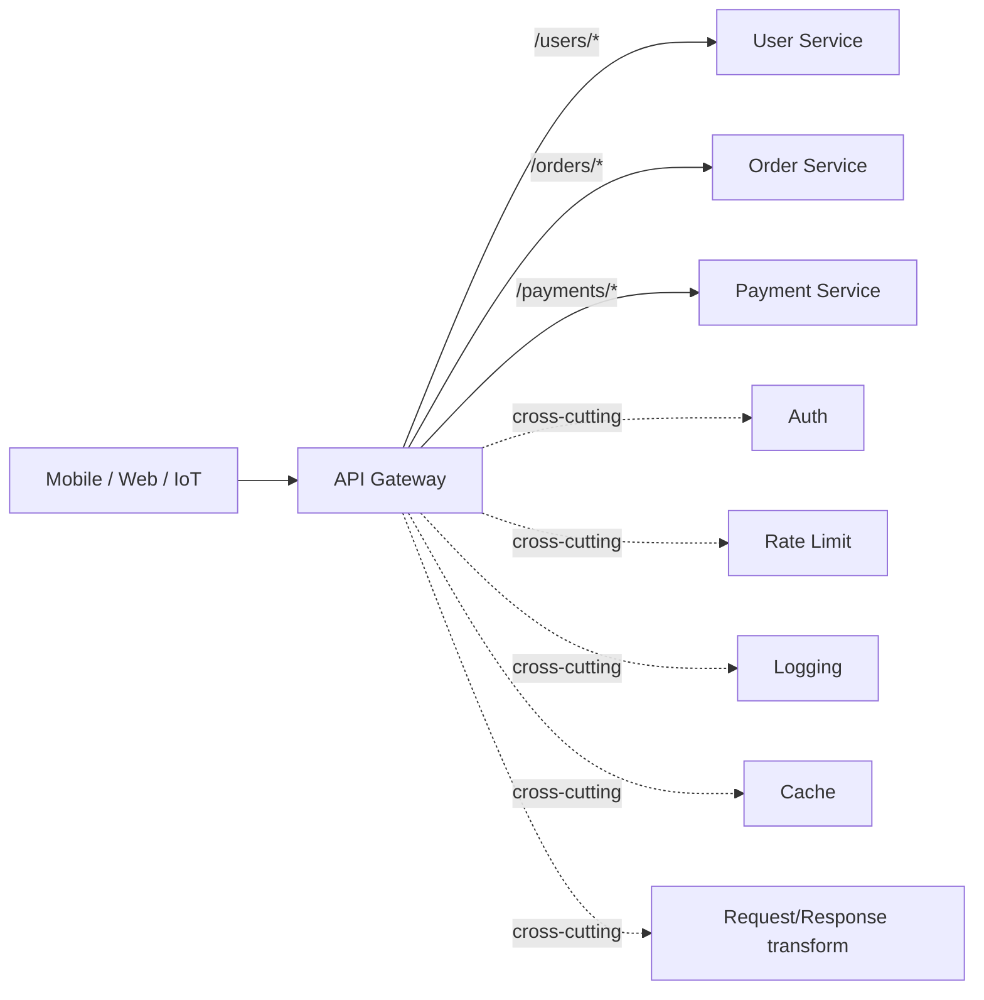
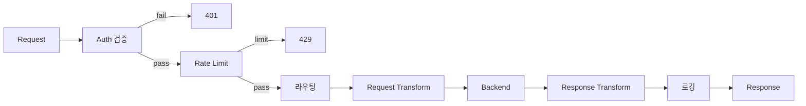
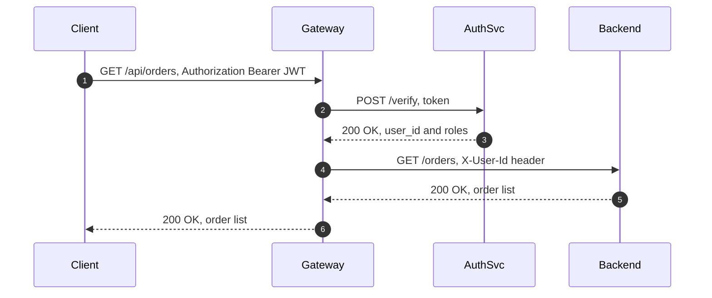
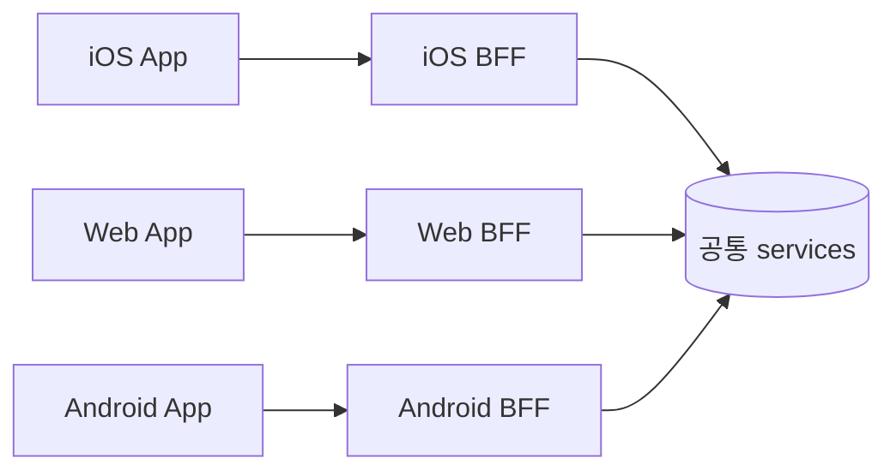
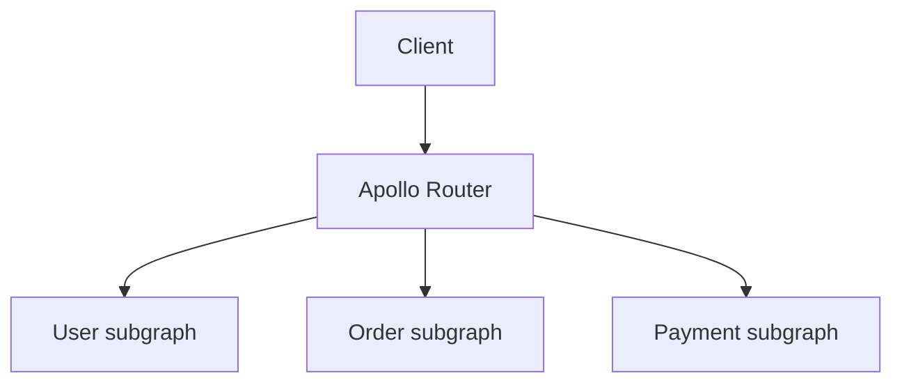

## 정의

**API Gateway** = *클라이언트와 마이크로서비스 사이의 단일 진입점*. 라우팅, auth, rate limit, transformation, monitoring 의 *cross-cutting 책임* 을 모음.

## 역할



## 요청 처리 파이프라인



모든 요청이 이 파이프라인을 통과한다. 각 단계는 plugin 또는 middleware 로 구현된다. 실패 시 해당 단계에서 즉시 응답을 반환한다.

## 책임 카탈로그

| 책임 | 예시 |
|---|---|
| 라우팅 | path / header / host 기준 |
| 인증 / 인가 | JWT 검증, OAuth, API key |
| Rate limiting | per-API key, per-IP |
| Transformation | request/response 변환 (gRPC, REST) |
| 캐싱 | 응답 캐시 |
| Load balancing | 백엔드 분산 |
| Circuit breaker | 백엔드 다운 시 차단 |
| Logging / metrics | 중앙 집계 |
| WAF | SQLi, XSS 차단 |
| TLS termination | 인증서 관리 |
| Versioning | URL / 헤더 기반 분기 |

## 인증 플로우



Gateway 가 JWT 를 검증하고 `X-User-Id` 헤더를 추가해 백엔드로 전달한다. 백엔드는 JWT 를 다시 검증하지 않아도 된다.

> [!IMPORTANT]
> Zero-trust 환경에서는 백엔드도 mTLS 또는 별도 인증 토큰으로 검증한다. Gateway 신뢰만으로는 lateral movement 공격에 취약하다.

## BFF (Backend For Frontend)



> *각 클라이언트 종류마다 별도 gateway*. 클라이언트 별 *응답 형식 / 페이지네이션 / 압축* 차이 흡수. *모바일 = 작은 응답, 웹 = 큰 응답*.

### BFF 패턴의 장점

- 클라이언트 팀이 BFF 를 직접 소유하고 배포 가능
- 공통 백엔드를 수정하지 않고 클라이언트별 최적화 가능
- 응답 데이터 형식, GraphQL/REST 혼용도 BFF 레벨에서 해결

## Kong 설정 예시

Kong 은 Nginx 기반 오픈소스 API Gateway. 선언적 YAML 설정이 가능하다.

```yaml
_format_version: "3.0"
services:
  - name: order-service
    url: http://order-svc:8080
    routes:
      - name: orders-route
        paths:
          - /api/orders
        methods:
          - GET
          - POST
    plugins:
      - name: jwt
        config:
          secret_is_base64: false
          key_claim_name: kid
      - name: rate-limiting
        config:
          minute: 100
          policy: redis
          redis_host: redis-host
          redis_port: 6379
      - name: request-transformer
        config:
          add:
            headers:
              - X-Gateway-Version:2
```

```bash
# Kong 적용
deck gateway sync kong.yaml
```

## AWS API Gateway

AWS 에서 관리되는 fully managed gateway. Lambda 통합이 강점이다.

```yaml
# SAM template 예시
Resources:
  ApiGateway:
    Type: AWS::Serverless::Api
    Properties:
      StageName: prod
      Auth:
        DefaultAuthorizer: CognitoAuthorizer
        Authorizers:
          CognitoAuthorizer:
            UserPoolArn: !GetAtt UserPool.Arn
      Cors:
        AllowMethods: "'GET,POST,PUT,DELETE'"
        AllowHeaders: "'Content-Type,Authorization'"
        AllowOrigin: "'*'"

  OrderFunction:
    Type: AWS::Serverless::Function
    Properties:
      Handler: index.handler
      Runtime: nodejs20.x
      Events:
        GetOrders:
          Type: Api
          Properties:
            RestApiId: !Ref ApiGateway
            Path: /orders
            Method: GET
```

| 항목 | HTTP API | REST API |
|:---|:---|:---|
| 지연 시간 | 낮음 | 높음 |
| 기능 | 기본 | 완전 (usage plan, caching) |
| 비용 | 저렴 | 비쌈 |
| gRPC | 미지원 | 미지원 |

## Envoy + gRPC 트랜스코딩

Envoy 는 Lyft 가 만든 C++ proxy. Service mesh 의 data plane 이자 standalone gateway 로도 쓰인다.

```yaml
# envoy.yaml: gRPC-JSON transcoding
http_filters:
  - name: envoy.filters.http.grpc_json_transcoder
    typed_config:
      "@type": type.googleapis.com/envoy.extensions.filters.http.grpc_json_transcoder.v3.GrpcJsonTranscoder
      proto_descriptor: /etc/envoy/api.pb
      services:
        - mypackage.UserService
      print_options:
        add_whitespace: true
        always_print_primitive_fields: true
```

HTTP JSON 요청이 들어오면 Envoy 가 gRPC 로 변환해 백엔드로 전달한다. 클라이언트는 REST 로, 내부는 gRPC 로 통신할 수 있다.

## Rate Limiting at Gateway

Gateway 레벨 rate limit 은 Redis 로 분산 카운터를 관리해야 한다. 단일 노드 in-memory 카운터는 인스턴스가 여럿이면 N배 한도가 허용된다.

```python
# Redis Lua atom: sliding window counter
SLIDING_WINDOW_LUA = """
local key = KEYS[1]
local now = tonumber(ARGV[1])
local window = tonumber(ARGV[2])
local limit = tonumber(ARGV[3])

redis.call('ZREMRANGEBYSCORE', key, 0, now - window)
local count = redis.call('ZCARD', key)
if count < limit then
    redis.call('ZADD', key, now, now)
    redis.call('EXPIRE', key, window)
    return 1
end
return 0
"""
```

Kong / Envoy / AWS API Gateway 모두 Redis 기반 rate limit 을 기본 지원한다.

## API Gateway vs Service Mesh

| 항목 | API Gateway | Service Mesh |
|---|---|---|
| 위치 | *외부 ↔ 내부 경계* (north-south) | *내부 ↔ 내부* (east-west) |
| 책임 | 인증, transformation, public API | mTLS, retry, circuit, observability |
| 클라이언트 인지 | 직접 호출 | sidecar 자동 |
| 예 | Kong, AWS API Gateway, Envoy | Istio, Linkerd |

> 둘 다 운영하는 경우가 흔하다. *gateway 가 north-south*, *mesh 가 east-west*.

## 도구 비교

| 도구 | 종류 | 강점 |
|---|---|---|
| Kong | OSS gateway | plugin 생태계 |
| Tyk | OSS gateway | 옵션 |
| Envoy | Proxy | gRPC, L7, mesh 토대 |
| AWS API Gateway | Managed | Lambda 통합 |
| Cloudflare Workers | Edge | 글로벌 |
| Apigee | Enterprise | 엔터프라이즈 |
| Apollo Router | GraphQL | federation |

## 패턴: GraphQL Federation Gateway



자세한 건 [[graphql]] 참고.

## 흔한 함정

> [!WARNING]
> 1. **Gateway 가 *모든 비즈니스 로직* 흡수** = monolith 의 *재림*. cross-cutting 만.
> 2. **단일 gateway 의 *bottleneck*** = HA + auto-scaling 필수.
> 3. **Auth 검증 *백엔드 마다* 다시** = gateway 가 검증 → 백엔드는 *trust*. 단 *zero-trust* 환경에서는 백엔드도 검증.
> 4. **Rate limit 의 *분산 상태*** = 단일 노드 카운터 = race. 중앙 store (Redis) + sliding window.

## 관련 위키

- [[microservices-vs-monolith]]
- [[Service Mesh]], mTLS, sidecar
- [[Load Balancer]]
- [[JWT]], [[OAuth2]]
- [[graphql]], federation
- [[rate-limiting]], gateway 레벨 rate limit 구현
- [[circuit-breaker]], 백엔드 장애 전파 차단
