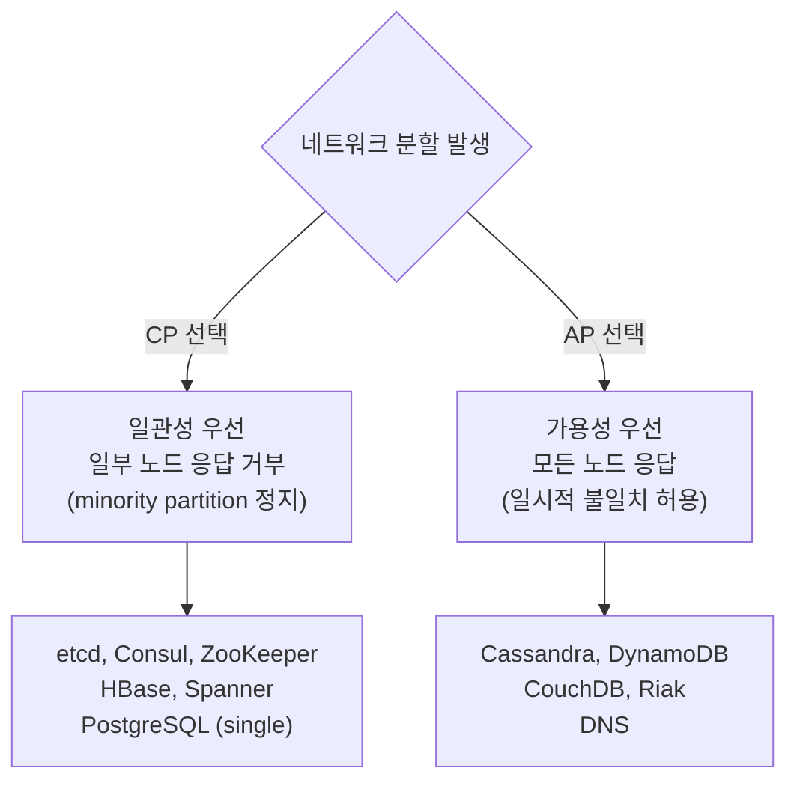
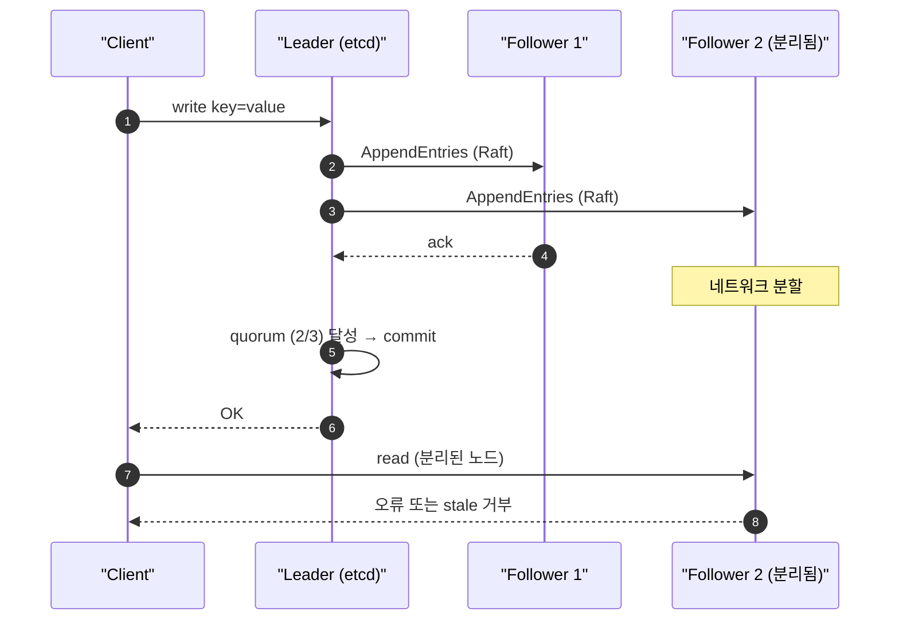
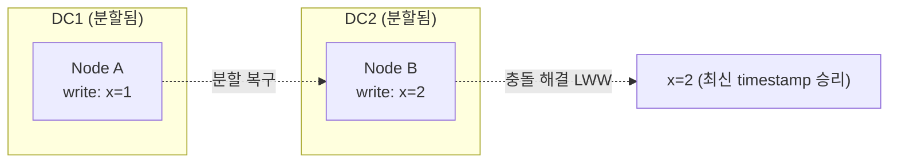
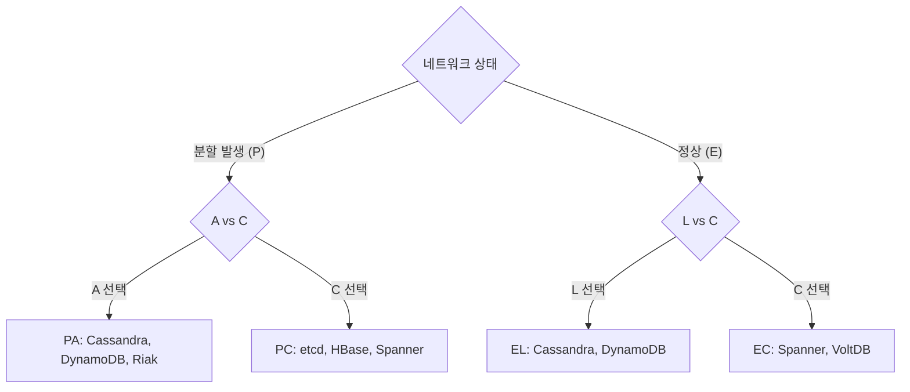
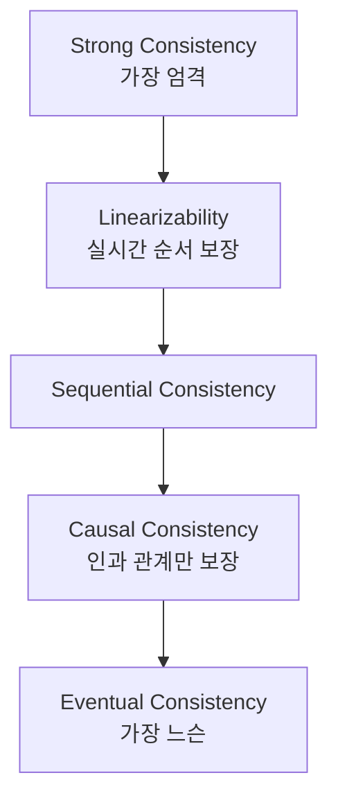

## 정의

**CAP Theorem** (Eric Brewer, 2000): 분산 시스템에서 **3가지 중 2개만 동시에 보장 가능**.

- **C (Consistency)**: 모든 노드가 같은 시점에 같은 데이터 반환 (강한 일관성)
- **A (Availability)**: 모든 요청이 응답 받음 (실패도 응답)
- **P (Partition Tolerance)**: 네트워크 분할이 있어도 동작

현실: **P는 선택지 아님** (네트워크는 항상 깨질 수 있음). 따라서 실질적 선택은:
- **CP**: 분할 시 일관성 우선 → 일부 노드 응답 안 함
- **AP**: 분할 시 가용성 우선 → 일관성 일시 깨짐

## CP vs AP 선택 다이어그램



## 실제 시스템 매핑

| 시스템 | CAP 분류 | 이유 |
|---|---|---|
| **etcd** | CP | Raft 합의, minority 정지 |
| **Consul** | CP | Raft 기반, quorum 필요 |
| **ZooKeeper** | CP | ZAB 프로토콜, leader 필요 |
| **Cassandra** | AP | 모든 노드 응답, eventual consistency |
| **DynamoDB** | AP (기본) | 가용성 우선, 강한 일관성 옵션 |
| **Riak** | AP | vector clock 기반 충돌 해결 |
| **CouchDB** | AP | MVCC, eventual consistency |
| **HBase** | CP | HDFS + ZooKeeper |
| **Spanner** | CP | TrueTime, global consistency |
| **MongoDB** | CP (기본) | primary-only write |
| **Redis Cluster** | AP | 분할 시 일부 write 손실 가능 |
| **DNS** | AP | 캐시로 stale 응답 허용 |

> [!IMPORTANT]
> 이 분류는 단순화. 실제 시스템은 설정에 따라 달라진다. DynamoDB는 `ConsistentRead=true`로 CP에 가깝게, Cassandra는 `CONSISTENCY ALL`로 CP에 가깝게 동작 가능.

## etcd / Consul: CP 상세



- Raft quorum (N/2 + 1)이 없으면 write 거부
- minority partition은 read도 거부 (stale 방지)
- 분할 복구 후 자동 동기화

## Cassandra: AP 상세



- 분할 중에도 양쪽 모두 write 허용
- 복구 후 *Last Write Wins (LWW)* 또는 *vector clock*으로 충돌 해결
- 일시적으로 다른 사용자가 다른 결과를 볼 수 있음

## CAP의 한계와 PACELC

CAP는 "분할 시" 시나리오만 다룸. **정상 작동 시의 trade-off**는?

**PACELC** (Daniel Abadi, 2010):
- **P**artition 시: **A**vailability vs **C**onsistency
- **E**lse (정상): **L**atency vs **C**onsistency



| 시스템 | PACELC | 해석 |
|---|---|---|
| MongoDB | PA / EC | 분할 시 A, 정상 시 C |
| Cassandra | PA / EL | 분할 시 A, 정상 시 L (낮은 latency) |
| HBase | PC / EC | 항상 C |
| DynamoDB | PA / EL | 항상 가용성 / latency 우선 |
| PostgreSQL | PC / EC | 단일 노드 강한 일관성 |
| Spanner | PC / EC | 글로벌 강한 일관성 |

PACELC가 더 실제적: 정상 시간이 훨씬 길기 때문.

## Conflict Resolution (충돌 해결)

AP 시스템에서 분할 후 복구 시 충돌 해결 방법:

### Last Write Wins (LWW)

```
Node A: x=1 at t=100
Node B: x=2 at t=101
→ x=2 승리 (최신 timestamp)
```

- 단순하지만 *clock skew* 위험 (NTP 오차로 잘못된 승리)
- Cassandra 기본 전략

### Vector Clock

```
Node A: x=1, vc=[A:1, B:0]
Node B: x=2, vc=[A:0, B:1]
→ 충돌 감지 (두 vc가 비교 불가)
→ 애플리케이션이 해결 (또는 두 값 모두 보존)
```

- 인과 관계 추적 가능
- Riak, Amazon Dynamo 사용

### CRDT (Conflict-free Replicated Data Type)

```
G-Counter: 각 노드가 자기 카운터만 증가
merge: max(A.count, B.count) per node
→ 충돌 없이 자동 병합
```

- 특정 데이터 타입 (counter, set, map)에서 자동 병합
- Redis CRDT, Riak 지원

## Consistency Spectrum

CAP의 "C"는 strong consistency. 실무는 더 세밀한 spectrum:



| 수준 | 의미 | 예시 |
|---|---|---|
| Linearizability | 실시간 순서 보장, 가장 강함 | etcd, Spanner |
| Sequential | 모든 노드가 같은 순서로 봄 | ZooKeeper |
| Causal | 인과 관계 있는 연산만 순서 보장 | MongoDB causal sessions |
| Eventual | 결국 수렴, 시간 보장 없음 | Cassandra (ONE), DNS |

대부분 AP 시스템 = eventual. CP 시스템 = strong (or linearizable).

### Tunable consistency (Cassandra 패턴)

```
CONSISTENCY LEVEL = ONE / QUORUM / ALL / EACH_QUORUM
```

- ONE: 1개 노드 응답이면 OK (빠르지만 stale 위험)
- QUORUM: 과반수 (N/2 + 1)
- ALL: 모든 replica 응답 (느리지만 가장 일관)

write QUORUM + read QUORUM = strong consistency 보장 (N=3이면 2+2 = 4 > 3).

```sql
-- Cassandra CQL
CONSISTENCY QUORUM;
SELECT * FROM orders WHERE id = ?;
```

## 실무 선택 기준

### 금융 / 결제: CP

```
계좌 잔액은 절대 stale 안 됨
→ HBase, PostgreSQL (single instance), Spanner
→ 분할 시 거래 차단이 안전
```

### SNS / Feed: AP

```
타임라인이 일시적으로 다르게 보여도 됨
→ Cassandra, DynamoDB
→ 분할이라도 게시 / 조회 가능
```

### 검색 인덱스: AP (eventual)

```
검색 결과가 몇 초 지연돼도 OK
→ Elasticsearch (near real-time)
```

### 서비스 디스커버리: CP

```
잘못된 서비스 주소 = 장애
→ etcd, Consul (Raft 기반)
→ 분할 시 등록 거부가 안전
```

### 메시지 큐: 두 모드

- Kafka: AP (high throughput)
- RabbitMQ: 모드별 선택 (mirror queue는 CP)

## CAP의 흔한 오해

### 오해 1: CA 시스템도 가능?

NO. 분산 환경에서 P는 선택지 아님 (네트워크는 항상 깨질 수 있음). "CA"는 single-node 시스템 (MySQL standalone).

### 오해 2: AP = 일관성 없음?

NO. AP는 eventual consistency 또는 weaker. 결국엔 수렴.

### 오해 3: CAP가 영구 선택?

NO. 분할 발생 시점에만 trade-off. 정상 시간엔 PACELC의 E (latency vs consistency).

### 오해 4: P는 datacenter 분할만?

분할 = network가 잠시라도 깨짐. 짧은 packet loss / latency spike도 포함. 빈번히 발생.

## consensus와의 관계

CAP의 "C"를 보장하려면 합의 (consensus) 필요. Raft, Paxos 같은 알고리즘이 분할 시 majority만 진행:

```
5-node cluster
├── 3-node majority (가능, 진행)
└── 2-node minority (정지)
```

majority가 사라지면 (3+ 노드 분할) cluster 전체 정지. [[distributed-systems-consensus]] 참고.

## 흔한 함정

> [!WARNING]
> 1. **CAP는 정상 시 trade-off 안 다룸**: PACELC가 더 현실적
> 2. **P는 항상**: CA 시스템은 single-node에서만
> 3. **eventual consistency도 정확한 정의**: 결국 수렴, 시간 보장 X
> 4. **Tunable consistency 활용**: Cassandra의 QUORUM 패턴
> 5. **금융은 CP, SNS는 AP**: 도메인별 명확
> 6. **단순화하지 말 것**: 모든 read가 strong 필요 X, 모든 write가 eventual OK X
> 7. **monitoring**: stale read 비율, partition 빈도 추적

## 관련 위키

- [[distributed-systems-consensus]]
- [[distributed-systems-distributed-transaction]]
- [[kafka]] (AP 시스템)
- [[idempotency-keys]] (AP 환경에서 중복 방지)
- [[outbox-pattern]] (eventual consistency 패턴)
