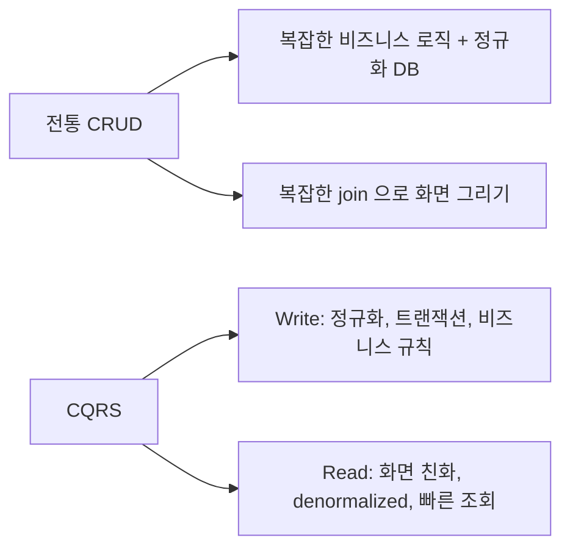
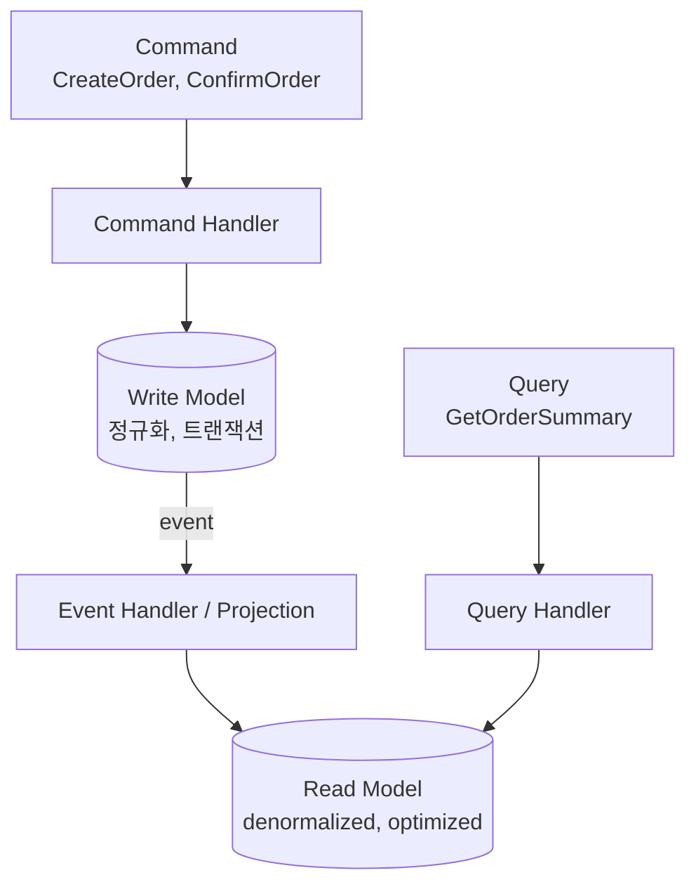
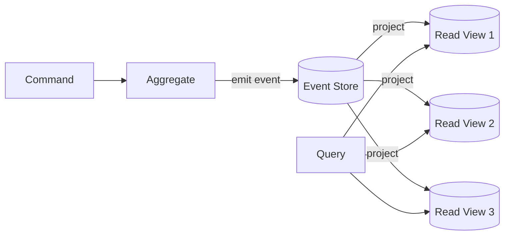
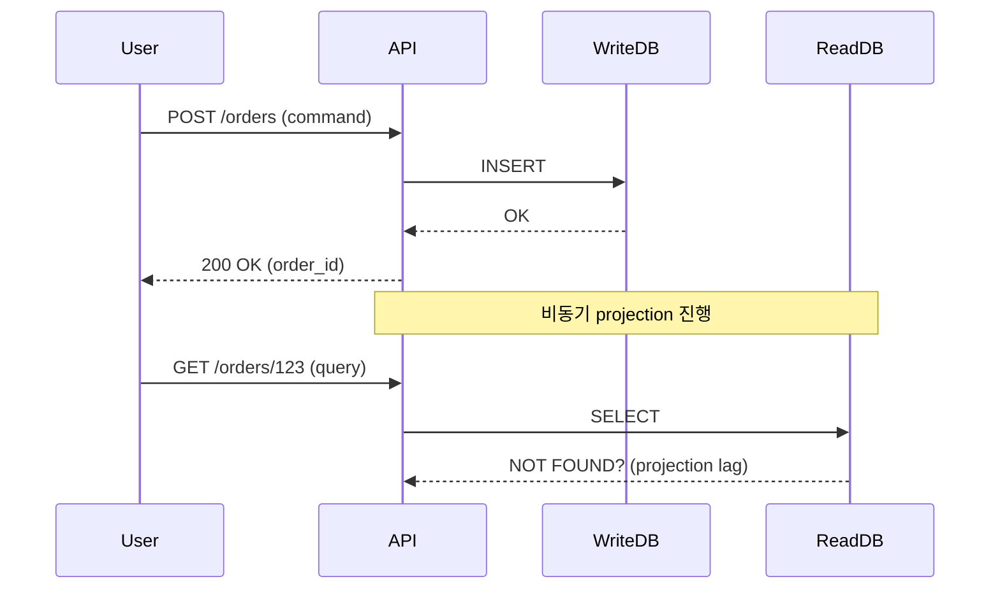
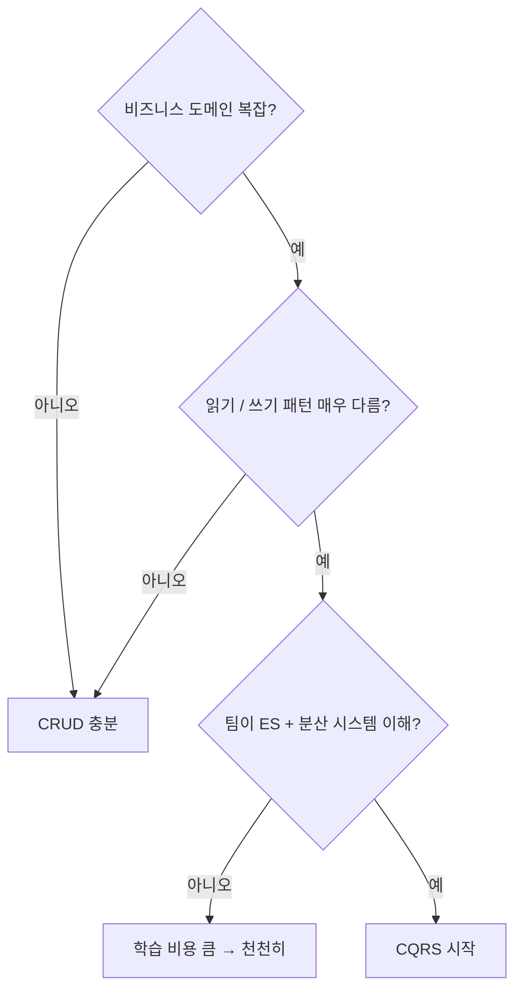
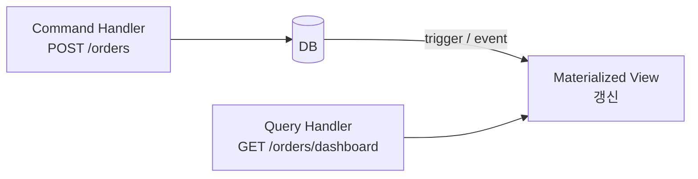

## 정의

**CQRS (Command Query Responsibility Segregation)** = *쓰기 모델* 과 *읽기 모델* 을 *분리*. 같은 데이터를 *다른 형태* 로 저장 / 조회.

> [!IMPORTANT]
> CQRS 는 *쓰기 / 읽기 모델 분리* 라는 *추상 패턴*. *반드시 다른 DB* 일 필요는 없다. *대부분 시작 단계는 같은 DB + 다른 모델*.

## 동기



> CRUD 의 *읽기 / 쓰기 사용 패턴이 매우 다른* 워크로드 (대시보드, 추천, 검색) 에서 효과적.

## 기본 구조



| 항목 | Command Side | Query Side |
|---|---|---|
| 입력 | 비즈니스 의도 (Command) | 정보 요청 (Query) |
| 검증 | 비즈니스 규칙 | 권한만 |
| 결과 | 변경 사실 (성공/실패) | 데이터 |
| 모델 | 정규화 (3NF) | denormalized |
| DB | RDB 가 일반 | 다양 (RDB, ES, Redis) |
| 일관성 | 강 | 보통 *eventual* |

## 예시: 전자상거래

```sql
-- Write Model (정규화)
TABLE orders (id, user_id, status, ...);
TABLE order_items (id, order_id, product_id, qty, price);
TABLE products (id, name, ...);

-- Read Model (denormalized, 화면 친화)
TABLE order_summary_view (
  order_id, user_name, total, item_count,
  status_label, created_at, items_json
);
```

읽기 1 쿼리:

```sql
SELECT * FROM order_summary_view WHERE order_id = ?;
```

쓰기 - 정상 트랜잭션 + event 발행:

```sql
BEGIN;
INSERT INTO orders ...;
INSERT INTO order_items ...;
INSERT INTO outbox (event) VALUES ('OrderCreated', ...);
COMMIT;
```

이후 *event handler* 가 *order_summary_view* 갱신.

## Event Sourcing 과 자주 같이



자세한 건 [[event-sourcing]].

## Read Model 종류

| Read Model | 적합 |
|---|---|
| Materialized view (DB) | 같은 RDB 안 |
| ElasticSearch / OpenSearch | 검색 + aggregation |
| Redis | 작은 hot data |
| Cassandra | 시계열 / 대용량 |
| GraphQL cache | API 응답 캐시 |
| 클라이언트 IndexedDB | offline-first |

## Eventual Consistency



> [!CAUTION]
> *방금 만든 주문이 안 보이는* UX 함정. 해결책:
> - *짧은 lag* (수 ms) 보장 + UI 가 *낙관적 표시*
> - *write 후 즉시 같은 transaction 으로 read* 시 *write DB 우회*
> - *작성자 본인은 강 일관성, 다른 사람은 eventual* (read-your-writes)

## 언제 CQRS? (안 쓸 때가 더 많다)



> [!IMPORTANT]
> *대부분의 앱은 CQRS 가 *과한* 솔루션*. *진짜 도움 되는 곳* (큰 e-commerce, 트레이딩 시스템, 큰 SaaS 대시보드) 가 아니면 *모듈 모놀리스 + 일부 read model* 정도면 충분.

## 단순 CQRS (가벼운 형태)



- 같은 DB.
- *materialized view* 또는 *summary table*.
- 별도 인프라 없이 *80% 의 효과*.

## 흔한 함정

> [!WARNING]
> 1. **모든 곳에 CQRS** = 단순 CRUD 도 분리. 복잡도 폭증.
> 2. **Projection 동기 실행** = read model 갱신이 *write 막음*. async + idempotent.
> 3. **Read-your-writes 무시** = 사용자가 *방금 한 일을 못 봄* UX.
> 4. **Read model 재구성 어려움** = event log 없으면 *replay 불가*. ES + CQRS 가 자주 묶이는 이유.

## 관련 위키

- [[event-sourcing]]
- [[outbox-pattern]]
- [[saga-pattern]]
- [[microservices-vs-monolith]]
- [[Redis Cache Patterns]] (read model 캐시)
