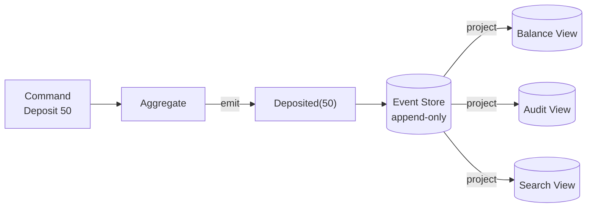
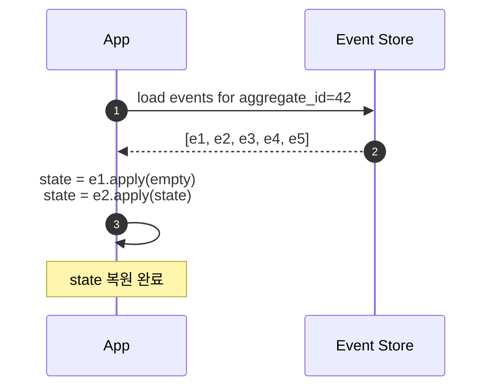
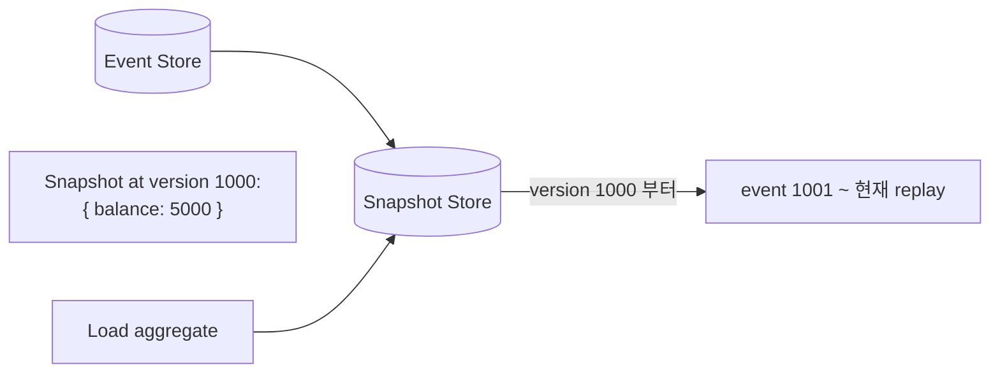
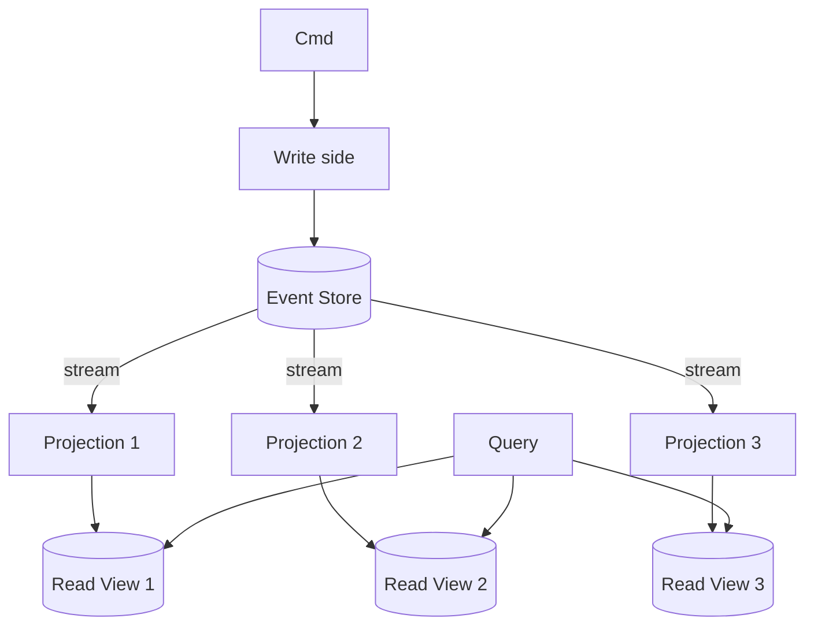
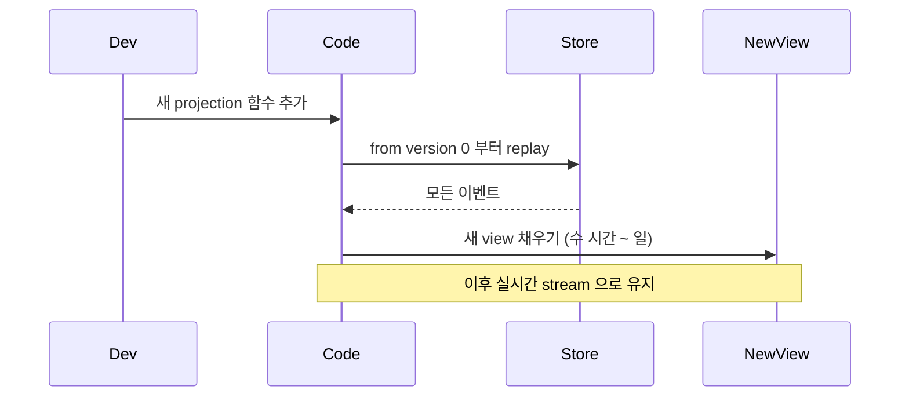
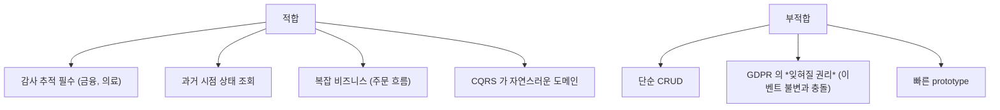
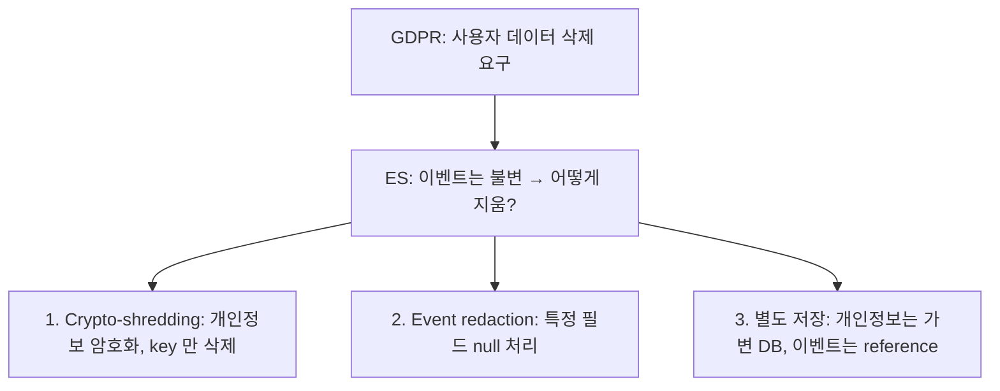
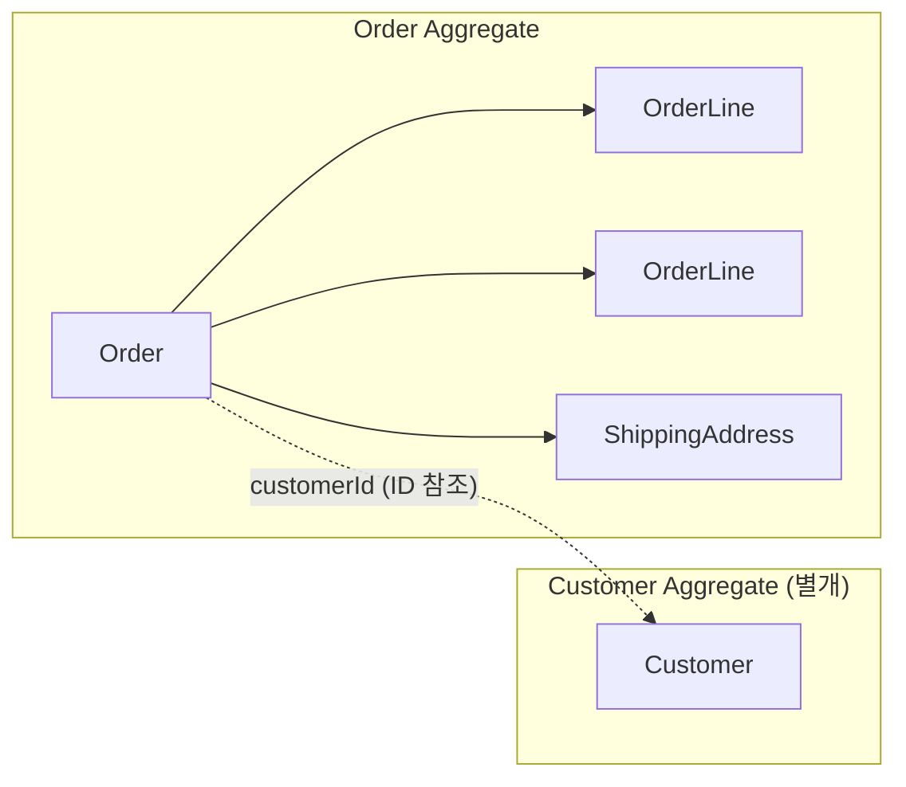
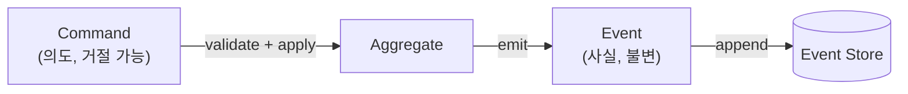
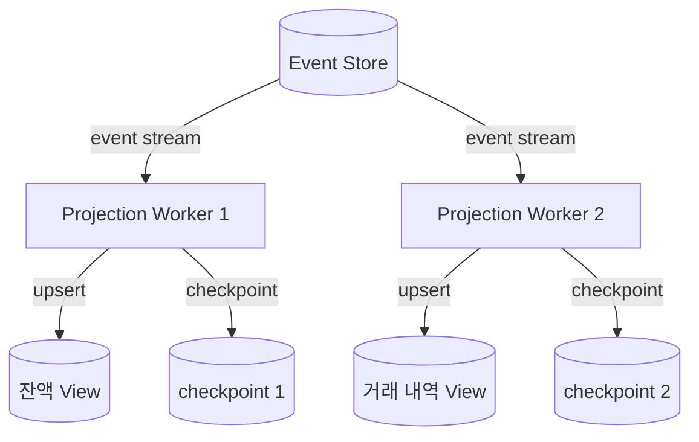

## 정의

**Event Sourcing** = *현재 상태 대신 *과거 이벤트 시퀀스* 를 저장*. 현재 상태 = *event 모두 replay 한 결과*.

```
전통: state = { balance: 100 }
ES:   events = [Deposited(50), Deposited(60), Withdrawn(10)]
      state = events.reduce(apply) = { balance: 100 }
```

## 핵심 약속

- *과거 모든 변화 기록*. 감사 / 디버깅 / 시간 여행 자유.
- *읽기 모델 자유* (어떻게든 projection).
- *replay 로 새 view 생성* (옛 데이터에서 새 통찰).
- *비파괴*. 옛 이벤트는 *불변*.

## 구조



## Event Store

이벤트 = 불변 사실. 형식:

```json
{
  "event_id": "evt_abc",
  "aggregate_id": "account_42",
  "aggregate_type": "Account",
  "event_type": "Deposited",
  "version": 5,
  "payload": { "amount": 50, "currency": "USD" },
  "metadata": { "user_id": "...", "correlation_id": "..." },
  "occurred_at": "2026-06-25T12:00:00Z"
}
```

| Store | 특징 |
|---|---|
| Kafka | log + retention |
| EventStoreDB | ES 전용 |
| PostgreSQL | append-only 테이블 + outbox |
| DynamoDB | partition key = aggregate_id |
| Axon | Java 프레임워크 |

## Replay (재계산)



## Snapshot

이벤트 수 만이면 *replay 가 느림*. 주기적 *snapshot* 저장:



```python
def load_aggregate(id):
    snapshot = snapshot_store.latest(id)
    events = event_store.from_version(id, snapshot.version)
    state = snapshot.state
    for e in events:
        state = e.apply(state)
    return state
```

## CQRS 와의 자연 결합



자세한 건 [[cqrs]].

## 새 View 추가

*기존 데이터에서 새 인사이트* 가 필요할 때:



> [!IMPORTANT]
> 이게 *ES 의 가장 큰 매력*. *과거에 안 묻던 질문* 을 *나중에 데이터로* 만들 수 있다.

## 적합 / 부적합



## 함정: 이벤트 진화

```
v1: Deposited(amount: int)
v2: Deposited(amount: int, currency: string)   ← currency 추가
```

옛 이벤트는 *currency 가 없다*. 처리 시:

| 전략 | 의미 |
|---|---|
| Default value | 옛 이벤트에 currency="USD" 가정 |
| Up-cast | load 시 옛 → 새 형태로 변환 |
| Lazy migration | 처리 시점에 보강 |
| Re-write event (안 권장) | *불변 원칙 위반* |

## GDPR 의 *잊혀질 권리* 문제



## Aggregate 설계 원칙

| 원칙 | 의미 |
|---|---|
| *단일 트랜잭션 경계* | Aggregate 안에서만 불변식 보장 |
| *작게 유지* | 한 개 Aggregate = 한 개 Entity + 직접 소유 ValueObject |
| *다른 Aggregate 는 ID 참조* | 직접 참조 금지 |
| *Eventually consistent* | Aggregate 간 일관성은 eventual |



## Command vs Event 구분



| 구분 | Command | Event |
|---|---|---|
| 형식 | `PlaceOrder` | `OrderPlaced` |
| 시제 | 현재/미래 | 과거 |
| 거절 가능? | Yes (validation) | No (이미 발생) |
| 저장 | 저장 안 함 (보통) | 영구 저장 |

## Projection 전략



- *checkpoint*: 마지막으로 처리한 event version. 재시작 시 여기서 재개.
- *eventual consistency*: projection 이 약간 뒤처짐 허용.

## 이벤트 스키마 진화 전략

| 전략 | 설명 | 추천 |
|---|---|---|
| Default value | 신규 필드에 기본값 삽입 | 단순 추가 시 |
| Up-cast | 로드 시 구버전 → 신버전 변환 | 필드 이름 변경 |
| Weak schema | JSON + 필드 검사 코드에서 | 스키마 불안정 |
| Re-write (비권장) | 옛 이벤트 수정 | 불변 원칙 위반 |

```python
# Up-cast 예시
class DepositedV1ToV2:
    def upcast(self, event: dict) -> dict:
        if event['version'] == 1:
            event['payload']['currency'] = 'USD'   # 기본값 보강
            event['version'] = 2
        return event
```

## 테스트 전략

```python
# Given-When-Then 패턴 (이벤트 기반)
def test_withdraw_sufficient_funds():
    # Given: 과거 이벤트로 상태 세팅
    account = Account.from_events([
        Deposited(amount=200),
        Deposited(amount=100),
    ])

    # When: 커맨드 실행
    events = account.withdraw(50)

    # Then: 발행 이벤트 검증
    assert len(events) == 1
    assert isinstance(events[0], Withdrawn)
    assert events[0].amount == 50

def test_withdraw_insufficient_funds():
    account = Account.from_events([Deposited(amount=30)])
    with pytest.raises(InsufficientFundsError):
        account.withdraw(50)
```

> [!TIP]
> ES 테스트의 핵심: *DB 없이 이벤트 리스트만으로 Aggregate 를 만들고 검증*. 매우 빠른 단위 테스트 가능.

## 흔한 함정

> [!WARNING]
> 1. **모든 도메인에 ES** = 단순 CRUD 까지 *복잡 모델*. 진짜 도메인 가치 있는 곳에만.
> 2. **이벤트 schema *영구 보존* 안 함** = 1년 뒤 옛 이벤트 *해석 불가*. 스키마 진화 정책.
> 3. **이벤트 크기 폭증** = 작은 이벤트 + 정기 snapshot. 큰 binary 는 reference.
> 4. **Aggregate 경계 잘못** = aggregate 가 *너무 크면* concurrent write 충돌, 너무 작으면 일관성 사라짐.

## 관련 위키

- [[cqrs]]
- [[saga-pattern]]
- [[outbox-pattern]]
- [[kafka]] (이벤트 저장)
- [[Redis Stream]]
