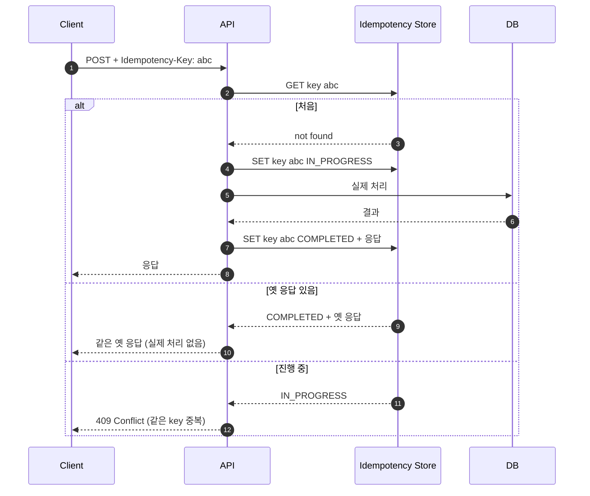
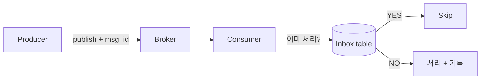

## 정의

**Idempotency** = *같은 요청을 N번 보내도 결과가 1번과 동일*. 분산 시스템 / 결제 / API 의 *안전망*.

> [!IMPORTANT]
> 네트워크는 *항상 timeout / retry*. 진짜 *exactly-once* 는 불가능 → *at-least-once + idempotent* 가 *현실적 정답*.

## HTTP 의 idempotent method

| Method | Idempotent |
|---|---|
| GET | O |
| HEAD | O |
| OPTIONS | O |
| PUT | O |
| DELETE | O |
| POST | *X (기본)* |
| PATCH | *X (대개)* |

> POST 의 *비-멱등성* 이 *결제 중복* 같은 사고의 근원.

## Idempotency-Key Header

Stripe / Square / PayPal 등이 *표준화*:

```http
POST /v1/charges HTTP/1.1
Authorization: Bearer sk_...
Idempotency-Key: 7f4d8e2a-c-3a-4e-9f-1234567890ab
Content-Type: application/json

{"amount": 5000, "currency": "usd", "customer": "cus_..."}
```

서버 응답:

```
1번째 호출: 200 OK (실제 처리)
2번째 호출 (같은 key): 200 OK (옛 응답 그대로)
```

## 서버 구현



```python
def idempotent_post(key, request, handler):
    cached = store.get(key)
    if cached and cached.status == "completed":
        return cached.response

    if cached and cached.status == "in_progress":
        raise Conflict("Same key in progress")

    store.set(key, "in_progress", ttl=24*3600)
    try:
        response = handler(request)
        store.set(key, "completed", response=response, ttl=24*3600)
        return response
    except Exception:
        store.delete(key)   # 또는 "failed" 로 표시
        raise
```

## Store 선택

| Store | 적합 |
|---|---|
| Redis | 빠름, TTL 자동 |
| PostgreSQL | 트랜잭션 친화 |
| DynamoDB | 분산 + TTL |

> [!TIP]
> *PostgreSQL 의 UNIQUE constraint* + ON CONFLICT 가 *가장 단순*. *결제 같이 강한 일관성* 필요할 때.

```sql
CREATE TABLE idempotency_keys (
  key TEXT PRIMARY KEY,
  request_hash BYTEA NOT NULL,
  response JSONB,
  status TEXT,
  expires_at TIMESTAMPTZ
);

INSERT INTO idempotency_keys (key, request_hash, status)
VALUES (?, ?, 'in_progress')
ON CONFLICT (key) DO NOTHING
RETURNING ...;
```

## Request Hashing (재시도 안전)

```python
def request_hash(req):
    return sha256(req.method + req.url + req.body).hexdigest()
```

- 같은 key + 다른 body = *수상*. 거절 (400) 또는 *옛 응답*.
- 같은 key + 같은 body = *재시도*. 옛 응답.

## TTL 정책

| 기간 | 적합 |
|---|---|
| 24시간 | Stripe 표준 |
| 7일 | 더 안전 |
| 영구 | 결제처럼 *극한 안전* |

> *짧으면* 재시도 보호 부족. *길면* store 부담.

## 분산 / 큐의 idempotency



자세한 건 [[outbox-pattern]] 의 *Inbox*.

## 멱등한 작업 만드는 패턴

| 작업 | 멱등으로 만드는 방법 |
|---|---|
| 이메일 발송 | *deduplication store* + 발송 전 체크 |
| DB INSERT | UNIQUE constraint + ON CONFLICT |
| 계좌 송금 | transaction_id 컬럼 + UNIQUE |
| Webhook 수신 | event_id + 처리 표시 |
| API 호출 | Idempotency-Key 헤더 |

## 흔한 함정

> [!WARNING]
> 1. **클라이언트가 *매번 새 key 생성*** = idempotency 의미 *없음*. retry 시 *같은 key 재사용*.
> 2. **key 충돌** = UUID v4 사용. 클라이언트 라이브러리가 자동 생성.
> 3. **TTL 너무 짧음** = 24시간 뒤 *재시도* 시 *중복 처리*.
> 4. **in-progress 처리** = 그동안 동일 key 가 또 오면 *대기 vs 거절* 정책. 보통 409.

## 관련 위키

- [[REST API Design]]
- [[outbox-pattern]]
- [[saga-pattern]]
- [[kafka]], [[Redis Pub Sub vs Streams]]
