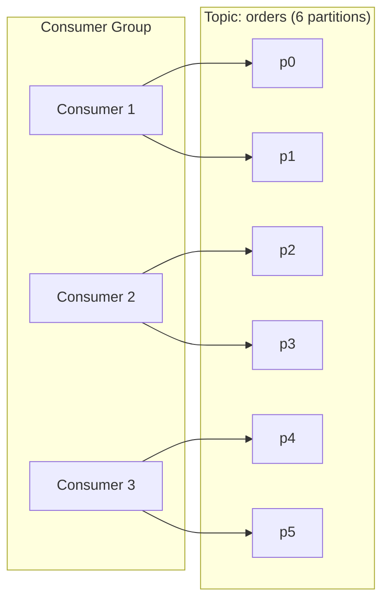
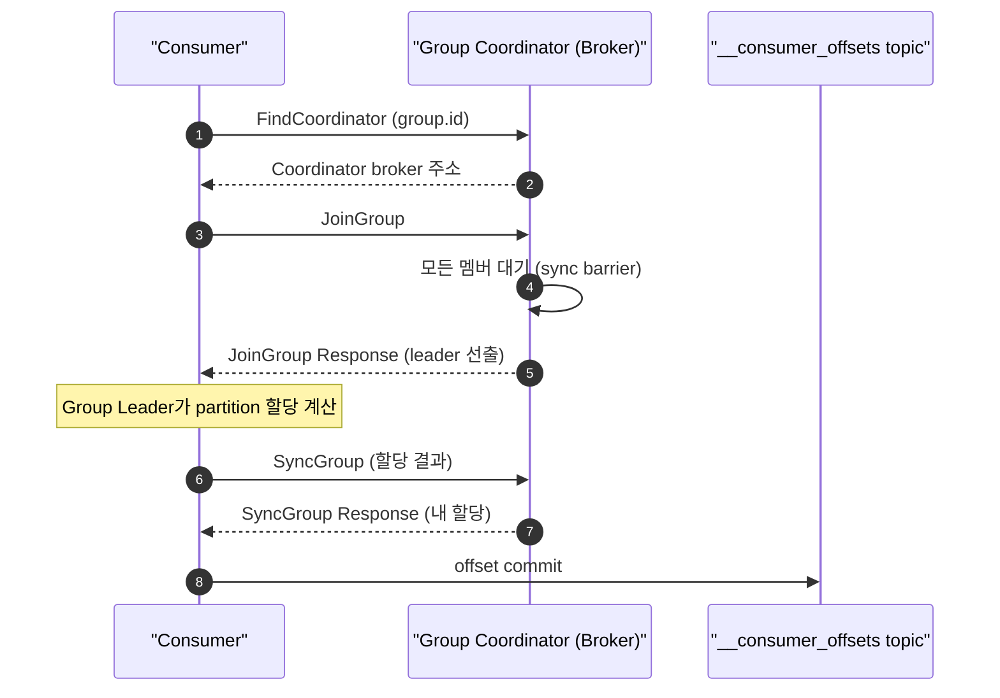
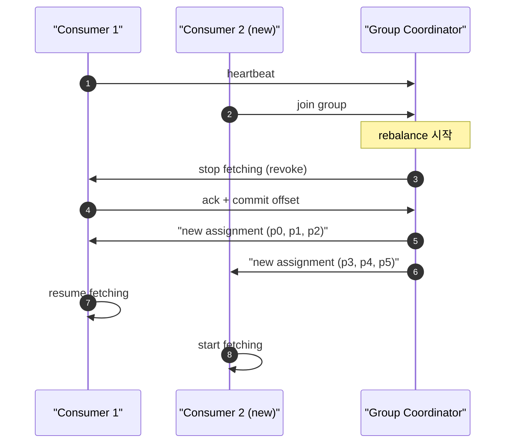
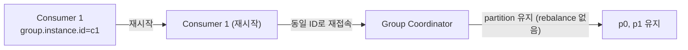
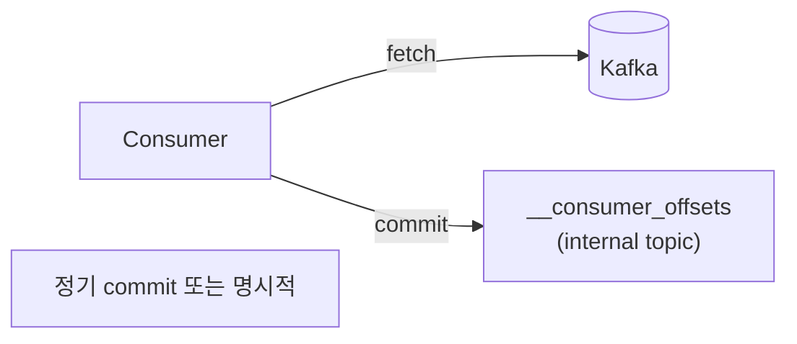
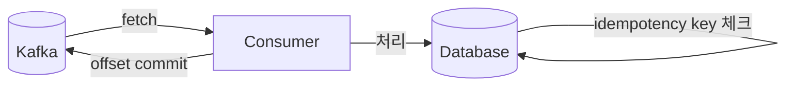
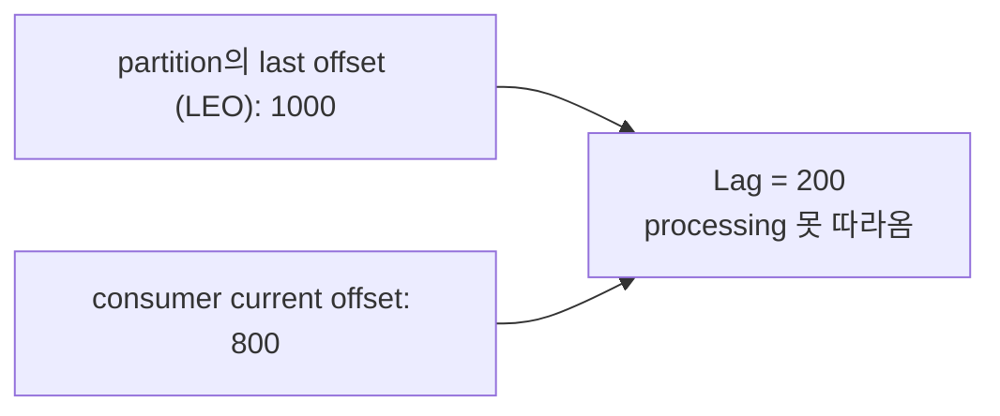
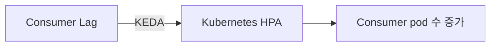

## 정의

**Consumer Group** = 같은 `group.id`를 가진 consumer들이 *함께 한 topic을 분담 소비*. *partition 단위로 분배*.

핵심 특성:
- *한 partition → 한 consumer* (group 안에서)
- *여러 Consumer Group*은 같은 topic을 *독립적으로* 소비 가능
- *Group Coordinator* (Kafka broker)가 멤버십과 partition 할당 관리

## Partition 할당



규칙:
- *partition 수 >= consumer 수*면 모두 분배
- *partition 수 < consumer 수*면 *일부 consumer idle*
- *한 partition → 한 consumer* (group 안)

## Group Coordinator

**Group Coordinator** = consumer group의 멤버십과 rebalancing을 관리하는 Kafka broker.



- `__consumer_offsets` 내부 topic에 offset 저장
- Group Leader (consumer 중 하나)가 실제 partition 할당 계산
- Coordinator는 할당 결과를 모든 멤버에게 배포

## Rebalancing

consumer 추가 / 제거 / 죽음 → *partition 재할당*:



### Eager vs Cooperative

| | Eager (옛 기본) | Cooperative (Kafka 2.4+) |
|---|---|---|
| Rebalance 시 | *모든 consumer 정지* | *영향받는 partition만* |
| 처리 중단 | 길음 (수십 초 가능) | *짧음* |
| Throughput | 하락 큼 | 적음 |
| 구현 | RangeAssignor | CooperativeStickyAssignor |

> [!IMPORTANT]
> *Cooperative rebalancing*이 *2026 권장 기본*. `partition.assignment.strategy=org.apache.kafka.clients.consumer.CooperativeStickyAssignor`.

## Cooperative Sticky Assignor 설정

```properties
# consumer.properties
group.id=my-consumer-group
partition.assignment.strategy=org.apache.kafka.clients.consumer.CooperativeStickyAssignor

# 또는 여러 전략 조합 (마이그레이션 시)
partition.assignment.strategy=\
  org.apache.kafka.clients.consumer.CooperativeStickyAssignor,\
  org.apache.kafka.clients.consumer.RangeAssignor
```

```java
// Java 코드
Properties props = new Properties();
props.put(ConsumerConfig.GROUP_ID_CONFIG, "my-group");
props.put(ConsumerConfig.PARTITION_ASSIGNMENT_STRATEGY_CONFIG,
    CooperativeStickyAssignor.class.getName());

KafkaConsumer<String, String> consumer = new KafkaConsumer<>(props);
consumer.subscribe(List.of("orders", "payments"));
```

## Static Membership (KIP-345)

```properties
group.instance.id=consumer-1
```

- consumer가 *동일 ID로 재접속*하면 *partition 유지*
- *배포 / 재시작* 시 rebalance 회피
- 보통 *수십 초 ~ 수 분 안*의 짧은 재시작 가정



## Offset 관리



| 모드 | 안전성 |
|---|---|
| `enable.auto.commit=true` (기본) | *중복 또는 손실* 가능 |
| 명시적 sync commit | 안전 |
| 명시적 async commit + 마지막 sync | balanced |

### Auto commit 함정

```
1. fetch [100, 101, 102]
2. 처리 중 ...
3. 5초 후 auto commit (103까지 commit)
4. consumer crash (102 처리 미완)
5. 재시작 → 103부터 fetch → 102 손실!
```

### 명시적 commit 패턴

```java
while (true) {
    ConsumerRecords<String, String> records = consumer.poll(Duration.ofMillis(100));
    for (ConsumerRecord<String, String> record : records) {
        process(record);
    }
    // 배치 처리 완료 후 명시적 commit
    consumer.commitSync();
}
```

> [!CAUTION]
> **Auto commit은 손실 또는 중복**의 함정. *exactly-once*가 필요하면 명시적 commit + idempotent 처리.

## Exactly-once 처리 패턴

Kafka 자체의 EOS (Exactly-Once Semantics)는 *Kafka → Kafka* 구간만 보장. 외부 DB까지 포함하려면 추가 패턴 필요.



```java
// Transactional producer (Kafka → Kafka exactly-once)
producer.initTransactions();

try {
    producer.beginTransaction();
    producer.send(new ProducerRecord<>("output-topic", key, value));
    // offset commit을 트랜잭션에 포함
    producer.sendOffsetsToTransaction(offsets, consumerGroupMetadata);
    producer.commitTransaction();
} catch (Exception e) {
    producer.abortTransaction();
}
```

```java
// DB까지 exactly-once: idempotency key 패턴
@Transactional
public void processRecord(ConsumerRecord<String, Order> record) {
    String idempotencyKey = record.topic() + "-" + record.partition() + "-" + record.offset();

    if (processedOffsets.existsByKey(idempotencyKey)) {
        return;   // 이미 처리됨
    }

    orderService.process(record.value());
    processedOffsets.save(idempotencyKey);
    // DB 트랜잭션 커밋 후 offset commit
}
```

## Consumer Lag



| 도구 | 의미 |
|---|---|
| `kafka-consumer-groups.sh --describe` | 즉시 확인 |
| Kafka Lag Exporter | Prometheus 메트릭 |
| Burrow (LinkedIn) | 더 세련된 lag 분석 |

```bash
# lag 확인
kafka-consumer-groups.sh \
  --bootstrap-server localhost:9092 \
  --group my-consumer-group \
  --describe

# 출력 예시
GROUP           TOPIC     PARTITION  CURRENT-OFFSET  LOG-END-OFFSET  LAG
my-group        orders    0          800             1000            200
my-group        orders    1          950             1000            50
```

## Lag 기반 Auto-Scaling



[KEDA](https://keda.sh/)가 Kafka lag을 *Kubernetes HPA 지표*로 사용. *spike 자동 흡수*.

```yaml
# KEDA ScaledObject
apiVersion: keda.sh/v1alpha1
kind: ScaledObject
metadata:
  name: kafka-consumer-scaler
spec:
  scaleTargetRef:
    name: order-consumer
  minReplicaCount: 1
  maxReplicaCount: 10   # partition 수 이하로
  triggers:
    - type: kafka
      metadata:
        bootstrapServers: kafka:9092
        consumerGroup: my-consumer-group
        topic: orders
        lagThreshold: "100"   # lag 100 이상이면 scale out
```

## Heartbeat / Session

| 설정 | 의미 | 기본 |
|---|---|---|
| `session.timeout.ms` | 이 시간 heartbeat 없으면 *죽었다고 판단* | 45s |
| `heartbeat.interval.ms` | heartbeat 보내는 주기 | 3s |
| `max.poll.interval.ms` | poll 사이 최대 시간 | 5min |

> [!WARNING]
> `max.poll.interval.ms` 초과 = consumer *추방*. 처리 시간이 길면 *명시적 늘림* 또는 *워커 별도 스레드*.

## Consumer Group 성능 튜닝

| 설정 | 기본 | 권장 (고처리량) |
|---|---|---|
| `fetch.min.bytes` | 1 | 1024 (배치 효율) |
| `fetch.max.wait.ms` | 500ms | 500ms |
| `max.poll.records` | 500 | 100~500 (처리 시간에 따라) |
| `max.partition.fetch.bytes` | 1MB | 1MB |
| `enable.auto.commit` | true | false (명시적 commit) |

```properties
# 고처리량 consumer 설정
fetch.min.bytes=1024
fetch.max.wait.ms=500
max.poll.records=200
enable.auto.commit=false
auto.offset.reset=earliest
```

## 흔한 함정

> [!WARNING]
> 1. **Rebalancing 폭주** = consumer 자주 추가/제거 → 처리 정지 반복. cooperative + static membership.
> 2. **`auto.offset.reset=latest` + 다운** = 다운 사이 메시지 *손실*. 보통 `earliest`.
> 3. **너무 큰 batch** = `max.poll.records` 너무 큼 → 처리 시간 길어 추방.
> 4. **상태 있는 consumer + rebalance** = partition이 다른 consumer로 가면서 *처리 진행 정보 손실*. 상태는 *외부 store*에.
> 5. **partition 수 < consumer 수** = 초과 consumer는 idle. partition 수를 consumer 최대 수 이상으로 설정.

## 관련 위키

- [[kafka]]
- [[Redis Pub Sub vs Streams]] (consumer group 유사)
- [[message-broker-comparison]]
- [[idempotency-keys]]
- [[outbox-pattern]] (exactly-once 패턴)
