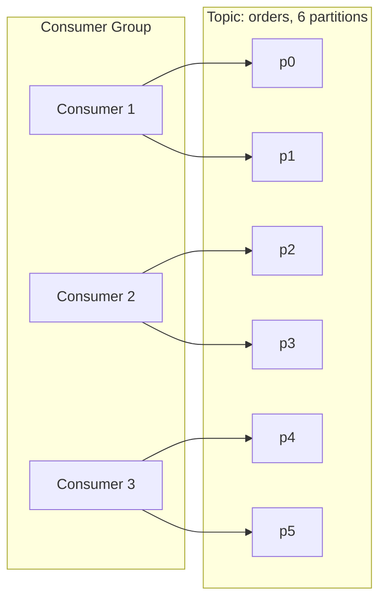
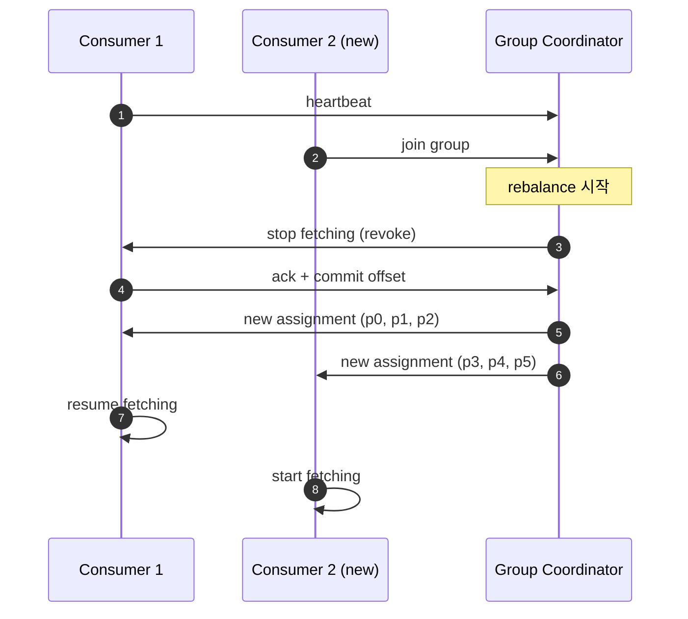
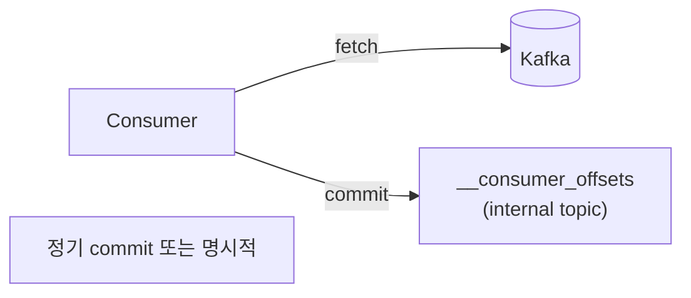
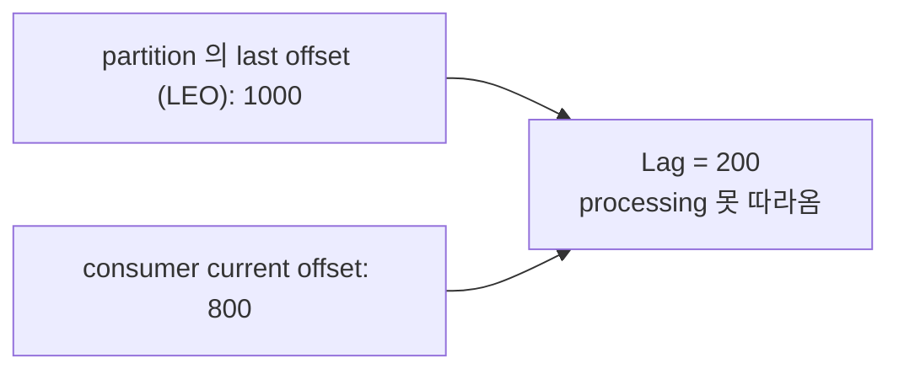
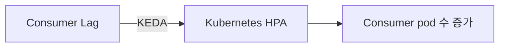

## 정의

**Consumer Group** = 같은 `group.id` 를 가진 consumer 들이 *함께 한 topic 을 분담 소비*. *partition 단위로 분배*.

## Partition 할당



규칙:

- *partition 수 ≥ consumer 수* 면 모두 분배.
- *partition 수 < consumer 수* 면 *일부 consumer idle*.
- *한 partition → 한 consumer* (group 안).

## Rebalancing

consumer 추가 / 제거 / 죽음 → *partition 재할당*:



### Eager vs Cooperative

| | Eager (옛 기본) | Cooperative (Kafka 2.4+) |
|---|---|---|
| Rebalance 시 | *모든 consumer 정지* | *영향받는 partition 만* |
| 처리 중단 | 길음 (수십 초 가능) | *짧음* |
| Throughput | 하락 큼 | 적음 |

> [!IMPORTANT]
> *Cooperative rebalancing* 이 *2026 권장 기본*. `partition.assignment.strategy=org.apache.kafka.clients.consumer.CooperativeStickyAssignor`.

## Static Membership (KIP-345)

```properties
group.instance.id=consumer-1
```

- consumer 가 *동일 ID 로 재접속* 하면 *partition 유지*.
- *배포 / 재시작* 시 rebalance 회피.
- 보통 *수십 초 ~ 수 분 안* 의 짧은 재시작 가정.

## Offset 관리



| 모드 | 안전성 |
|---|---|
| `enable.auto.commit=true` (기본) | *중복 또는 손실* 가능 |
| 명시적 sync commit | 안전 |
| 명시적 async commit + 마지막 sync | balanced |

### Auto commit 함정

```
1. fetch [100, 101, 102]
2. 처리 중 ...
3. 5초 후 auto commit (103 까지 commit)
4. consumer crash (102 처리 미완)
5. 재시작 → 103 부터 fetch → 102 손실!
```

> [!CAUTION]
> *Auto commit 은 *손실 또는 중복** 의 함정. *exactly-once* 가 필요하면 명시적 commit + idempotent 처리.

## Consumer Lag



| 도구 | 의미 |
|---|---|
| `kafka-consumer-groups.sh --describe` | 즉시 확인 |
| Kafka Lag Exporter | Prometheus 메트릭 |
| Burrow (LinkedIn) | 더 세련된 lag 분석 |

## Lag 기반 Auto-Scaling



[KEDA](https://keda.sh/) 가 Kafka lag 을 *Kubernetes HPA 지표* 로 사용. *spike 자동 흡수*.

## Heartbeat / Session

| 설정 | 의미 | 기본 |
|---|---|---|
| `session.timeout.ms` | 이 시간 heartbeat 없으면 *죽었다고 판단* | 45s |
| `heartbeat.interval.ms` | heartbeat 보내는 주기 | 3s |
| `max.poll.interval.ms` | poll 사이 최대 시간 | 5min |

> [!WARNING]
> `max.poll.interval.ms` 초과 = consumer *추방*. 처리 시간이 길면 *명시적 늘림* 또는 *워커 별도 스레드*.

## 흔한 함정

> [!WARNING]
> 1. **Rebalancing 폭주** = consumer 자주 추가/제거 → 처리 정지 반복. cooperative + static membership.
> 2. **`auto.offset.reset=latest` + 다운** = 다운 사이 메시지 *손실*. 보통 `earliest`.
> 3. **너무 큰 batch** = `max.poll.records` 너무 큼 → 처리 시간 길어 추방.
> 4. **상태 있는 consumer + rebalance** = partition 이 다른 consumer 로 가면서 *처리 진행 정보 손실*. 상태는 *외부 store* 에.

## 관련 위키

- [[kafka]]
- [[Redis Pub Sub vs Streams]] (consumer group 유사)
- [[message-broker-comparison]]
- [[idempotency-keys]]
