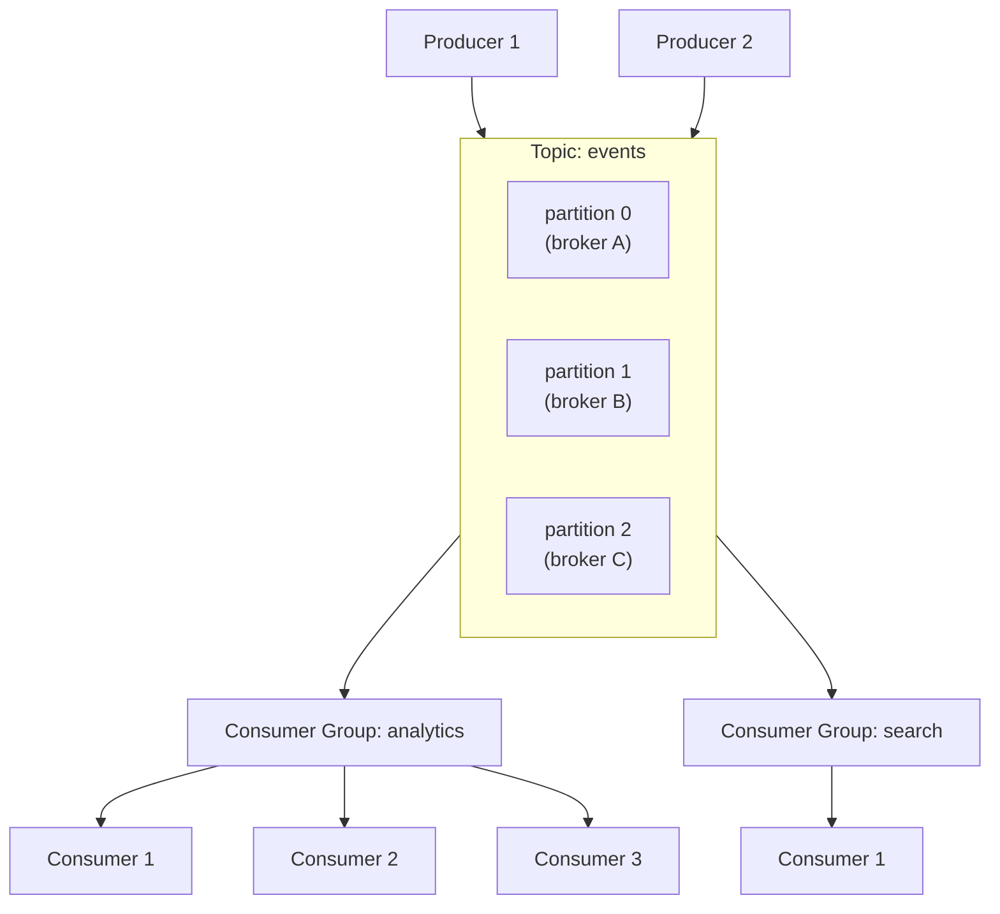
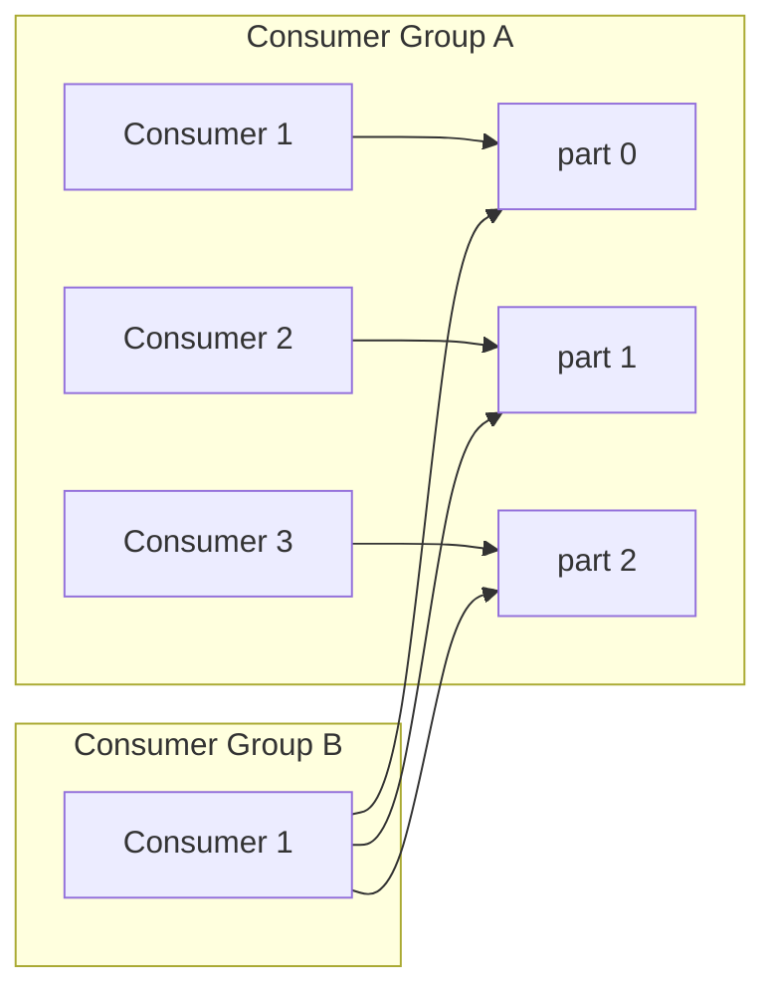
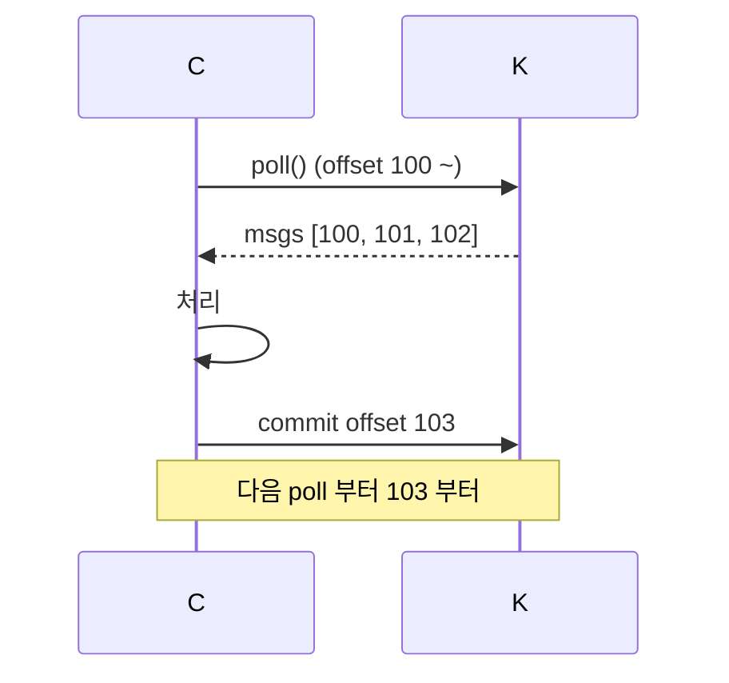
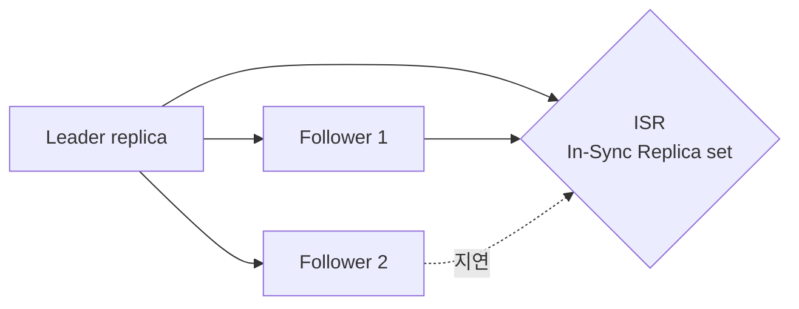
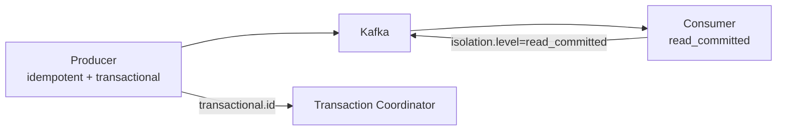
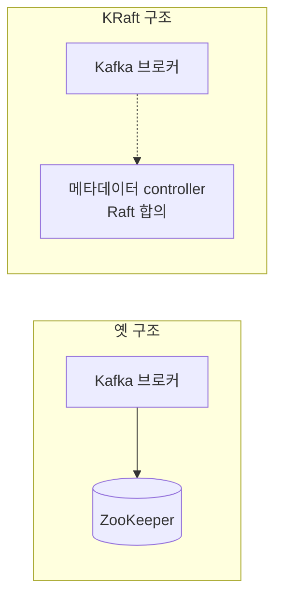

## 정의

**Apache Kafka** = *분산 commit log*. *고처리량 (수백만 msg/s), 영속, 수평 확장*. *event-driven 아키텍처* 의 *de facto*.

핵심 개념: **topic = partition 들 = 노드에 분산된 append-only log**.

## 토폴로지



## Partition: 핵심 단위

```anim:queue
{}
```

| 속성 | 의미 |
|---|---|
| Append-only | 끝에만 추가 |
| Immutable | 변경 불가 |
| Ordered | partition 안에서 순서 보장 |
| Distributed | 노드 간 분산 |
| Replicated | RF (Replication Factor) 만큼 복제 |
| Offset | 각 메시지의 *partition 내 ID* |

### Partition 수 선택

```mermaid
flowchart TD
    Q{Partition 수}
    Q -->|적음 (1-3)| Low[병렬성 낮음<br/>순서 보장 쉬움]
    Q -->|중간 (10-50)| Med[일반적]
    Q -->|많음 (100+)| High[오버헤드 증가<br/>리밸런싱 비용]
```

> [!IMPORTANT]
> *Partition 수 = 한 consumer group 의 *최대 병렬성**. 늘리는 건 가능하지만 *줄이는 건 불가*. 보수적으로 시작.

## Consumer Group



| 규칙 | 의미 |
|---|---|
| 한 partition → 한 consumer (group 안) | 순서 보장 |
| 한 consumer → N partitions | OK |
| Consumer 수 > Partition 수 | 남는 consumer는 idle |
| 다른 group → 독립 offset | fan-out |

## Offset 관리



| 모드 | 의미 |
|---|---|
| Auto commit | 주기적 자동. *최대 한 번 손실 또는 중복* |
| Manual sync commit | 처리 후 동기 commit. 정확 |
| Manual async commit | 비동기 commit. *최후 commit 실패 가능* |

## Replication + ISR



- *Leader 가 모든 write* 수신.
- *Follower 가 동기 (또는 비동기) 복제*.
- *ISR* = *충분히 따라온 replica 집합*.
- Leader 다운 → *ISR 중 새 leader*.

| 설정 | 의미 |
|---|---|
| `acks=0` | 응답 안 기다림 (손실 가능) |
| `acks=1` | leader 만 (기본) |
| `acks=all` | ISR 전체 (가장 안전) |
| `min.insync.replicas` | 최소 ISR 수. 미달 시 write 거절 |

> [!CAUTION]
> `acks=all` + `min.insync.replicas=2` 가 *프로덕션 표준*. *낮은 settings* 는 운영 사고 단골.

## Exactly-once Semantics (EOS)



- *Producer idempotence*: 재전송 시 *중복 제거*.
- *Transactional producer*: 여러 topic write 를 *원자적*.
- *Consumer isolation.level=read_committed*: aborted 트랜잭션 무시.

> [!NOTE]
> *완벽한 EOS 는 *Kafka 안에서만**. *Kafka → DB → Kafka* 등 *외부 시스템 포함* 은 *outbox + idempotency* 패턴이 추가로 필요. 자세한 건 [[outbox-pattern]].

## KRaft (Kafka Raft, ZooKeeper 제거)



- 2.8+ preview, 3.5+ production, 4.0+ ZK 완전 제거.
- *운영 단순화* + *확장성 (수백만 partition)*.

## Kafka 의 적합 / 부적합

| 적합 | 부적합 |
|---|---|
| Event sourcing | 작은 데이터 (RabbitMQ 가 단순) |
| 로그 수집 | request-reply (가능하지만 어색) |
| Stream processing | 1-N 즉시 fan-out (Pub/Sub 가 간단) |
| CDC (Change Data Capture) | 짧은 retention task queue (Sidekiq 가 적합) |

## 흔한 함정

> [!WARNING]
> 1. **Partition 수 부족** = 병렬성 제한. 늘리는 건 가능하지만 *기존 키 분포 깨짐*.
> 2. **Rebalancing 폭주** = consumer 가 자주 join/leave → *모든 consumer 정지 후 재할당*. cooperative rebalancing (Kafka 2.4+) 으로 완화.
> 3. **Hot partition** = key 선택 잘못 → 한 partition 만 트래픽. key 디자인 재검토.
> 4. **`auto.offset.reset=latest`** = consumer 가 죽었다 살아나면 *그동안 메시지 손실*. 보통 `earliest`.

## 관련 위키

- [[rabbitmq]] (대안)
- [[nats]] (대안)
- [[Redis Pub Sub vs Streams]] (Streams 가 Kafka 비슷)
- [[outbox-pattern]]
- [[event-sourcing]]
