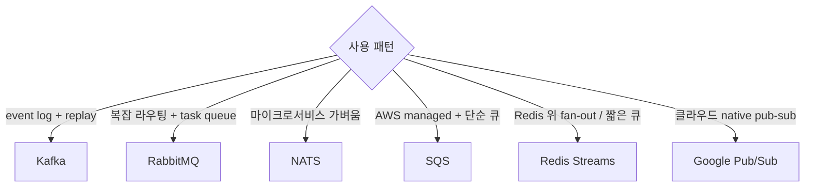
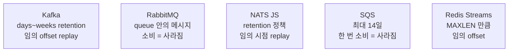

## 결정 트리



## 6가지 broker 매트릭스

| 항목 | Kafka | RabbitMQ | NATS | SQS | Redis Streams | Google Pub/Sub |
|---|---|---|---|---|---|---|
| 모델 | log | exchange-queue | subject pub-sub | queue | log | topic pub-sub |
| 영속 | *항상* | 옵션 | 옵션 (JS) | 항상 | 옵션 | 항상 |
| Throughput | *수백만/s* | 수만/s | 수백만/s | 거의 무한 (auto-scale) | 수십만/s | 수백만/s |
| Latency | 중간 (ms) | 낮음 | *마이크로초* | 수십 ms | 낮음 | 중간 |
| 운영 복잡도 | *높음* | 중간 | *낮음* | *없음* (managed) | 낮음 (Redis 운영자라면) | *없음* |
| 라우팅 | partition by key | exchange 패턴 | subject 계층 | FIFO/standard | consumer group | filtering |
| Re-play (재처리) | *자유* (offset) | 한 번만 | JS 가능 | DLQ 만 | 가능 (XREAD) | 가능 |
| 학습 곡선 | 높음 | 중간 | 낮음 | 낮음 | 낮음 | 낮음 |
| 비용 (자체호스팅) | 비쌈 | 중간 | *저렴* | - | 저렴 | - |
| 비용 (managed) | Confluent | CloudAMQP | Synadia | *AWS* | ElastiCache | *GCP* |

## 처리량 / 지연 / 운영비용 (직관)

<ChartJs
  client:visible
  type="scatter"
  title="Broker 처리량 vs 지연 (가상 직관)"
  caption="NATS = 지연 최저. Kafka = 처리량 최고. SQS = 무한 확장이지만 지연 큼."
  height="320px"
  data={{
    datasets: [
      { label: 'NATS', data: [{ x: 2000000, y: 0.5 }], backgroundColor: '#22c55e', pointRadius: 8 },
      { label: 'Kafka', data: [{ x: 5000000, y: 5 }], backgroundColor: '#3b82f6', pointRadius: 8 },
      { label: 'RabbitMQ', data: [{ x: 50000, y: 1 }], backgroundColor: '#f59e0b', pointRadius: 8 },
      { label: 'Redis Streams', data: [{ x: 500000, y: 1 }], backgroundColor: '#a78bfa', pointRadius: 8 },
      { label: 'SQS', data: [{ x: 100000, y: 30 }], backgroundColor: '#ef4444', pointRadius: 8 },
      { label: 'Google Pub/Sub', data: [{ x: 5000000, y: 50 }], backgroundColor: '#06b6d4', pointRadius: 8 },
    ],
  }}
  options={{
    scales: {
      x: { type: 'logarithmic', title: { display: true, text: '최대 처리량 (msg/s, log)' } },
      y: { type: 'logarithmic', title: { display: true, text: 'p99 지연 (ms, log)' } },
    },
  }}
/>

## 시나리오별 추천

| 시나리오 | 추천 |
|---|---|
| Event sourcing (큰 로그) | **Kafka** |
| 마이크로서비스 commands | **NATS** 또는 RabbitMQ |
| AWS Lambda + 큐 | **SQS** |
| Sidekiq 같은 Ruby job queue | **Redis** (list 기반) |
| 실시간 채팅 fan-out | **NATS** 또는 Redis Pub/Sub |
| CDC (DB → search) | **Kafka** + Debezium |
| 트래픽 spike 자동 흡수 | **SQS** (managed) |
| 빠른 mvp / startup | **Redis Streams** |

## 메시지 보장 비교

| Broker | At-most-once | At-least-once | Exactly-once |
|---|---|---|---|
| Kafka | 옵션 | 기본 | EOS 가능 |
| RabbitMQ | 옵션 | persistent + ack | 외부 idempotency 필요 |
| NATS Core | 기본 | - | - |
| NATS JS | - | 기본 | 옵션 |
| SQS | - | 기본 | FIFO + 5분 dedup |
| Redis Streams | - | XACK 로 | 외부 idempotency |

> [!IMPORTANT]
> *Exactly-once 는 broker 내부* 에서만 의미 있음. *외부 시스템 (DB, API)* 까지 *완벽한 exactly-once* 는 불가능. *idempotency + outbox* 가 현실적 정답. 자세한 건 [[outbox-pattern]], [[idempotency-keys]].

## 영속 / 재처리 비교



## 마이그레이션 비용

| 출발 | 도착 | 비용 |
|---|---|---|
| Sidekiq (Redis) | Kafka | 큼 (consumer group, exactly-once 재설계) |
| RabbitMQ | Kafka | 중간 (라우팅 → topic 재설계) |
| Kafka | NATS | 작음 (둘 다 log) |
| 자체 호스팅 | Managed | 작음 (운영 측면 큰 이득) |

## 운영자 시점 체크리스트

```
✓ 메시지 손실 허용?              (acks, persistent, ack 정책)
✓ 순서 보장 필요?                 (partition key, FIFO)
✓ 재처리 가능?                    (offset / position)
✓ DLQ + parking lot              (실패 메시지 격리)
✓ Backpressure                   (prefetch, max-in-flight)
✓ Monitoring                     (lag, dead messages, throughput)
✓ Consumer auto-scaling          (lag 기반)
```

## 관련 위키

- [[kafka]], [[rabbitmq]], [[nats]]
- [[Redis Pub Sub vs Streams]]
- [[outbox-pattern]]
- [[idempotency-keys]]
- [[aws-sqs]] (별도)
