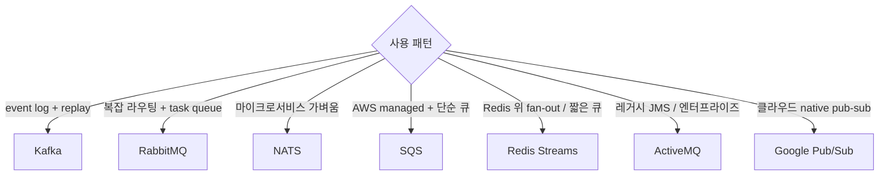
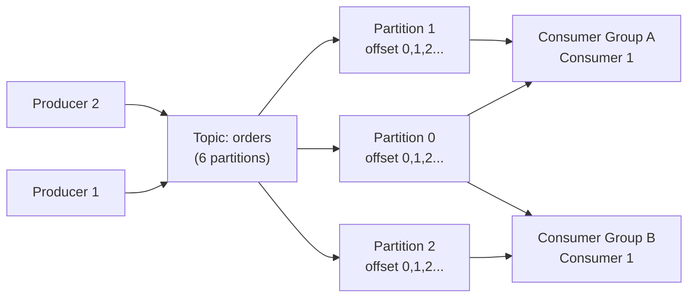
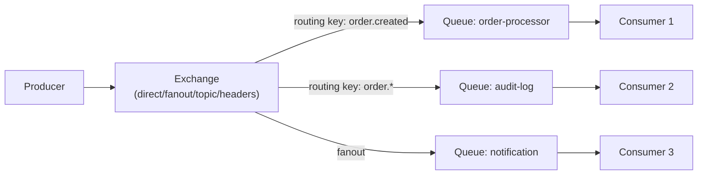
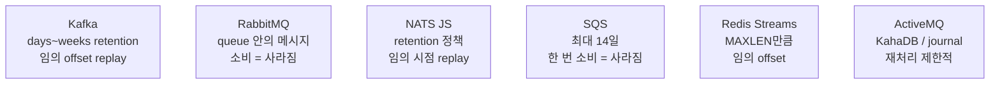
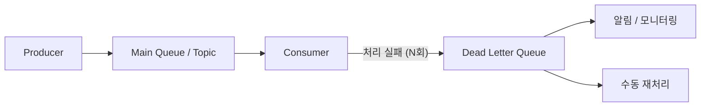
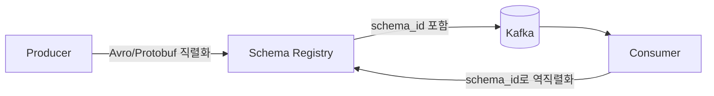

## 정의

**Message Broker** = 생산자(Producer)와 소비자(Consumer) 사이에서 메시지를 중계하는 미들웨어. 비동기 통신, 부하 분산, 시스템 디커플링의 핵심.

## 결정 트리



## 6가지 broker 매트릭스

| 항목 | Kafka | RabbitMQ | NATS | SQS | Redis Streams | ActiveMQ |
|---|---|---|---|---|---|---|
| 모델 | log | exchange-queue | subject pub-sub | queue | log | queue/topic |
| 영속 | *항상* | 옵션 | 옵션 (JS) | 항상 | 옵션 | 항상 |
| Throughput | *수백만/s* | 수만/s | 수백만/s | 거의 무한 | 수십만/s | 수만/s |
| Latency | 중간 (ms) | 낮음 | *마이크로초* | 수십 ms | 낮음 | 낮음 |
| 운영 복잡도 | *높음* | 중간 | *낮음* | *없음* | 낮음 | 중간 |
| 라우팅 | partition by key | exchange 패턴 | subject 계층 | FIFO/standard | consumer group | topic/queue |
| Re-play | *자유* (offset) | 한 번만 | JS 가능 | DLQ만 | 가능 (XREAD) | 제한적 |
| 학습 곡선 | 높음 | 중간 | 낮음 | 낮음 | 낮음 | 중간 |
| 프로토콜 | 자체 | AMQP 0-9-1 | NATS | HTTP/SQS | RESP | AMQP/OpenWire |

## 브로커별 아키텍처

### Kafka: Log 모델



- 메시지는 *삭제되지 않음* (retention 기간 동안)
- 여러 Consumer Group이 *독립적으로* 같은 topic 소비
- offset으로 *임의 시점 replay* 가능

### RabbitMQ: Exchange-Queue 모델



- Exchange 타입: `direct` (정확 매칭), `fanout` (브로드캐스트), `topic` (패턴), `headers`
- 메시지는 *소비 후 삭제* (기본)
- 복잡한 라우팅 로직을 브로커가 처리

## 처리량 / 지연 / 운영비용 (직관)

<ChartJs
  client:visible
  type="scatter"
  title="Broker 처리량 vs 지연 (가상 직관)"
  caption="NATS = 지연 최저. Kafka = 처리량 최고. SQS = 무한 확장이지만 지연 큼."
  height="320px"
  data={{
    datasets: [
      { label: 'NATS', data: [{ x: 2000000, y: 0.5 }], backgroundColor: '#22c55e', pointRadius: 8 },
      { label: 'Kafka', data: [{ x: 5000000, y: 5 }], backgroundColor: '#3b82f6', pointRadius: 8 },
      { label: 'RabbitMQ', data: [{ x: 50000, y: 1 }], backgroundColor: '#f59e0b', pointRadius: 8 },
      { label: 'Redis Streams', data: [{ x: 500000, y: 1 }], backgroundColor: '#a78bfa', pointRadius: 8 },
      { label: 'SQS', data: [{ x: 100000, y: 30 }], backgroundColor: '#ef4444', pointRadius: 8 },
      { label: 'ActiveMQ', data: [{ x: 30000, y: 2 }], backgroundColor: '#f97316', pointRadius: 8 },
    ],
  }}
  options={{
    scales: {
      x: { type: 'logarithmic', title: { display: true, text: '최대 처리량 (msg/s, log)' } },
      y: { type: 'logarithmic', title: { display: true, text: 'p99 지연 (ms, log)' } },
    },
  }}
/>

## ActiveMQ 상세

**ActiveMQ** (Apache)는 JMS(Java Message Service) 표준을 구현한 전통적인 엔터프라이즈 메시지 브로커.

| 항목 | ActiveMQ Classic | ActiveMQ Artemis |
|---|---|---|
| 프로토콜 | OpenWire, AMQP, STOMP, MQTT | AMQP, STOMP, MQTT, OpenWire |
| 성능 | 중간 | *Classic보다 높음* |
| 아키텍처 | 단일 브로커 | *고성능 비동기 코어* |
| 권장 | 레거시 유지 | *신규 프로젝트* |

```xml
<!-- Spring Boot + ActiveMQ Artemis -->
<dependency>
    <groupId>org.springframework.boot</groupId>
    <artifactId>spring-boot-starter-artemis</artifactId>
</dependency>
```

```yaml
spring:
  artemis:
    mode: native
    host: localhost
    port: 61616
    user: admin
    password: admin
```

> [!IMPORTANT]
> ActiveMQ는 JMS 기반 레거시 시스템 통합에 적합. 신규 마이크로서비스 아키텍처에서는 Kafka (이벤트 스트리밍) 또는 NATS (경량 pub-sub)를 권장.

## 시나리오별 추천

| 시나리오 | 추천 | 이유 |
|---|---|---|
| Event sourcing (큰 로그) | **Kafka** | retention + replay |
| 마이크로서비스 commands | **NATS** 또는 RabbitMQ | 낮은 지연, 라우팅 |
| AWS Lambda + 큐 | **SQS** | managed, Lambda trigger |
| Sidekiq 같은 Ruby job queue | **Redis** (list 기반) | 단순, 빠름 |
| 실시간 채팅 fan-out | **NATS** 또는 Redis Pub/Sub | 마이크로초 지연 |
| CDC (DB → search) | **Kafka** + Debezium | log 기반 변경 감지 |
| 트래픽 spike 자동 흡수 | **SQS** (managed) | 무한 확장 |
| 빠른 MVP / startup | **Redis Streams** | 이미 Redis 쓰면 추가 비용 없음 |
| 레거시 JMS 통합 | **ActiveMQ** | JMS 표준 준수 |
| 복잡한 라우팅 규칙 | **RabbitMQ** | exchange 패턴 |

## 메시지 보장 비교

| Broker | At-most-once | At-least-once | Exactly-once |
|---|---|---|---|
| Kafka | 옵션 | 기본 | EOS 가능 |
| RabbitMQ | 옵션 | persistent + ack | 외부 idempotency 필요 |
| NATS Core | 기본 | - | - |
| NATS JS | - | 기본 | 옵션 |
| SQS | - | 기본 | FIFO + 5분 dedup |
| Redis Streams | - | XACK로 | 외부 idempotency |
| ActiveMQ | 옵션 | persistent + ack | XA 트랜잭션 |

> [!IMPORTANT]
> *Exactly-once는 broker 내부*에서만 의미 있음. *외부 시스템 (DB, API)*까지 *완벽한 exactly-once*는 불가능. *idempotency + outbox*가 현실적 정답. 자세한 건 [[outbox-pattern]], [[idempotency-keys]].

## 영속 / 재처리 비교



## 마이그레이션 비용

| 출발 | 도착 | 비용 |
|---|---|---|
| Sidekiq (Redis) | Kafka | 큼 (consumer group, exactly-once 재설계) |
| RabbitMQ | Kafka | 중간 (라우팅 → topic 재설계) |
| Kafka | NATS | 작음 (둘 다 log) |
| ActiveMQ | RabbitMQ | 작음 (둘 다 AMQP) |
| ActiveMQ | Kafka | 큼 (JMS → Kafka API 전면 교체) |
| 자체 호스팅 | Managed | 작음 (운영 측면 큰 이득) |

## 운영자 시점 체크리스트

```
체크 항목                          관련 설정
----------------------------------------------
메시지 손실 허용?              acks, persistent, ack 정책
순서 보장 필요?                partition key, FIFO
재처리 가능?                   offset / position
DLQ + parking lot             실패 메시지 격리
Backpressure                  prefetch, max-in-flight
Monitoring                    lag, dead messages, throughput
Consumer auto-scaling         lag 기반 (KEDA)
Schema registry               Avro/Protobuf 스키마 진화
```

## Dead Letter Queue (DLQ) 패턴

처리 실패 메시지를 격리해 재처리하거나 분석하는 패턴.



| Broker | DLQ 지원 |
|---|---|
| Kafka | 별도 topic 수동 구현 또는 Kafka Streams |
| RabbitMQ | `x-dead-letter-exchange` 설정 |
| SQS | 자동 DLQ 연결 (maxReceiveCount 설정) |
| NATS JS | `MaxDeliver` 초과 시 별도 subject |

```yaml
# SQS DLQ 설정 예시 (AWS CDK)
const dlq = new sqs.Queue(this, 'DLQ');
const mainQueue = new sqs.Queue(this, 'MainQueue', {
  deadLetterQueue: {
    queue: dlq,
    maxReceiveCount: 3,   # 3회 실패 후 DLQ로
  },
});
```

## Schema Registry와 메시지 진화

Kafka 등에서 메시지 스키마를 중앙 관리:



- **Confluent Schema Registry**: Kafka 생태계 표준
- **AWS Glue Schema Registry**: AWS 관리형
- 스키마 진화 규칙: backward / forward / full compatibility

## 흔한 함정

> [!WARNING]
> 1. **Kafka를 단순 큐로 쓰기**: Kafka는 log 기반. 단순 task queue라면 RabbitMQ나 SQS가 더 적합.
> 2. **RabbitMQ에서 replay 기대**: 소비된 메시지는 사라짐. replay가 필요하면 Kafka.
> 3. **NATS Core에서 영속성 기대**: NATS Core는 fire-and-forget. 영속성이 필요하면 NATS JetStream.
> 4. **partition 수 부족**: Kafka에서 consumer 수 > partition 수면 일부 consumer idle. 처음부터 충분히 설정.
> 5. **메시지 크기 과대**: Kafka 기본 최대 1MB. 큰 payload는 S3에 저장 후 reference만 전송.
> 6. **DLQ 모니터링 없음**: DLQ에 메시지가 쌓여도 알림 없으면 데이터 손실 인지 불가.

## 관련 위키

- [[kafka]], [[rabbitmq]], [[nats]]
- [[Redis Pub Sub vs Streams]]
- [[outbox-pattern]]
- [[idempotency-keys]]
- [[kafka-consumer-group]]
- [[aws-sqs]] (별도)
